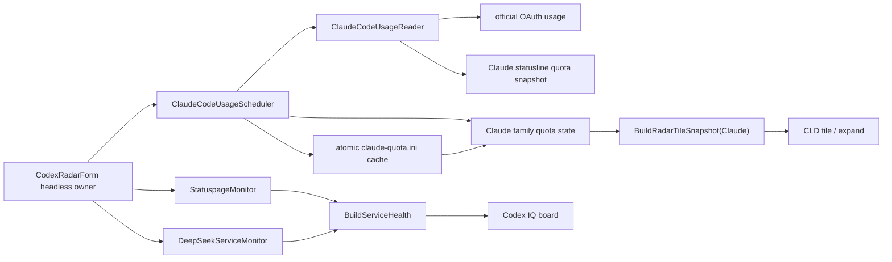

# Claude CLD 官方额度链架构

适用版本：2.0.0.12

本文说明共享 headless owner 内的 Claude 官方额度读取、缓存、调度、服务健康和 CLD tile 投影；Claude 不拥有公共 Radar 模型链或独立窗口。

## 1. 当前定位

Claude family 的数据能力由以下保留模块组成：

- `ClaudeCodeUsageReader`：读取 Claude Code 官方 usage，或消费 Claude Code statusline 生成的本地额度快照。
- `ClaudeCodeUsageScheduler`：进程级单飞、调度结果封装和官方额度缓存提交。
- `CodexRadarForm.ClaudeUsage.cs`：把 scheduler 结果提交到 Claude family 的 quota state。
- `StatuspageMonitor`：Anthropic 官方服务状态。
- `DeepSeekServiceMonitor`：与 Claude 额度无关的共享服务可达性探测。

可见 Claude 信息只有两个入口：

1. 右侧 `MetricTileForm` 的 `ClaudeQuota` 方块及其悬停详情，紧凑标题为 `CLD`。
2. Codex IQ 看板中的 Claude/DeepSeek 服务健康项。

Claude family 不读取社区 Radar、不维护模型目录，不产生 IQ、评分或效率数据，也不拥有独立可见窗口。

## 2. 数据流



官方额度请求开始时捕获 Claude family，完成时只提交到该 family。切换当前检测软件不会把 Codex 额度、错误或刷新时间写入 Claude 状态；两枚额度 tile 在同一次 `MetricTileFeed` 中各自读取缓存。

## 3. Headless 生命周期

`WidgetForm.EnsureCodexRadarWindow()` 构造共享 owner 后调用 `StartHeadlessDataOwner()`。owner 创建隐藏 HWND 并启动既有 backend scheduler，但不调用 `Show()`，不进入定位、hover、burn-in、Z-order 或 layered render 路径。

退出时 `StopHeadlessDataOwner()` 统一停止 timer、取消订阅并使当前 owner generation 失效。所有 Claude scheduler completion 捕获 generation；停止或挂起后的迟到结果不得写 quota/cache/log/通知/UI。显示器关闭、会话锁定或系统挂起时按 `Docs/Component-Refresh-Rules.md` 暂停远程轮询，恢复后只 prime 一轮。

## 4. 官方额度来源

`ClaudeCodeUsageReader` 只使用 Claude Code 官方或本地官方客户端衍生的数据路径：

- 配置 setup-token 时，优先读取官方 OAuth usage 端点。
- OAuth 结果不完整且凭据有效时，可使用官方 Messages 限额 header 作为受控 fallback。
- 没有 setup-token 时，读取 Claude Code `statusLine` 命令生成的本地额度快照；程序只在用户尚未设置自定义 statusline 时安装桥接脚本。
- 401/403 鉴权失败不会由 Messages fallback 掩盖。

外部接口、凭据位置和文件协议以 `Docs/Interfaces/INTERFACE_INDEX.jsonl` 为机器事实源。调度周期、退避、网络事件和手动刷新只在 `Docs/Component-Refresh-Rules.md` 维护。

## 5. 额度提交与缓存

`ClaudeCodeUsageScheduler` 把一次有效结果作为完整 `ClaudeCodeUsageSnapshot` 提交，包含：

- `FiveHourPercent` 与 `FiveHourResetLocal/Known`。
- `WeeklyPercent` 与 `WeeklyResetLocal/Known`。
- `SourceUpdatedUtc/Known` 与来源标识。

只有两组百分比、两组 reset 和可信来源时间都完整且新鲜的结果，才由 `ClaudeCodeUsageReader.TryWriteQuotaCache` 原子写入 `%LOCALAPPDATA%\DesktopCodexAssistant\claude-quota.ini`。写入先生成同目录临时文件，再以替换/移动提交；部分结果或失败不发布，也不破坏 last-good 文件。

启动恢复只接受同时包含 5 小时/周额度、各自 reset 和可信更新时间且满足新鲜度边界的缓存。缓存读取不会发起网络请求，也不会从公共 Radar、旧缓存或历史趋势拼接补值。

## 6. CLD Tile 契约

`BuildRadarTileSnapshot(CodexRadarSoftwareMode.Claude)` 只把 Claude family 的官方 quota state 映射到 `RadarTileSnapshot`：

- `ModelName` 固定为 `Claude`，紧凑 tile 标签固定为 `CLD`。
- 5 小时与周额度分别映射到两层额度环。
- 展开卡同时显示两个额度百分比及各自 reset 时间；5 小时和周额度各自维护独立趋势，不借用 Codex 的速率。
- 周额度优先显示当前活跃趋势的预计耗尽时间，活跃样本不足时回退到近 24 小时节奏；结论与 reset 比较后显示“提前耗尽”或“可撑到重置”。
- 5 小时额度在底条独立显示相同判断，周趋势区保留实测线、虚线预测、耗尽交点和 reset 线。
- `IqKnown` 和 `EfficiencyKnown` 恒为 `false`，快照不再包含社区评分字段。
- 当前 active family 改变不清空 CLD tile，也不借用 Codex 模型数据。

Claude 软件运行期间，`UpdateQuotaBurnObservationClock()` 推进本 family 的活跃时间轴；`ApplyQuotaSnapshot(Claude)` 只记录通过官方完整快照校验后的 5 小时/周余额。reset identity 改变或余额上升只清除对应窗口，活跃趋势与近时钟趋势均为进程内状态，重启后重新积累。tile 和 expand 只消费同一份 published snapshot，不读取凭据、磁盘或网络。

## 7. 服务健康

Claude 服务健康由 `StatuspageMonitor` 和 Claude usage 状态共同形成。DeepSeek 健康由独立的 `DeepSeekServiceMonitor` 提供；它不读取 key、不查询余额，也不记录账户数据。可选的 DeepSeek 余额由另一个 `DeepSeekBalanceMonitor` 直接服务 `DS` tile，不进入 Claude family。

`BuildServiceHealth()` 把已有服务状态复制给 Codex IQ board。新的稳定错误经过 `ServiceAlertDebouncer` 后发布，恢复立即清除；具体刷新规则见 `Docs/Component-Refresh-Rules.md`。

## 8. Cache-only 投影

以下展示边界只允许复制、格式化和 clone：

- `BuildRadarTileSnapshot(Claude)`
- `BuildServiceHealth()`
- `WidgetForm.BuildMetricTileFeed()` 中的 Claude tile 投影

这些路径不得启动 HTTP/provider 请求、读取 token 或缓存文件、修改 quota deadline，或写入 owner state。手动刷新必须走共享刷新 token 与 owner 调度入口。

## 9. 设置与安全边界

设置页为 Claude 只保留 setup-token、请求保护和必要的 provider/family 控制。Claude 没有公共 JSON、homepage fallback、社区评分、本地公共额度 fallback 或模型 key 设置；全局 DeepSeek API Key 入口属于独立余额 monitor，不改变 Claude 的数据边界。

setup-token 只从环境变量或 `dpapi-v1:` CurrentUser envelope 读取，不写入 `settings.ini`、日志或 snapshot。旧明文/无版本密文只有在严格 validator 通过后才原子迁移；DPAPI 损坏或未知 Base64 必须 fail-closed 并保留原字节。OAuth token、Authorization header、完整响应正文和 statusline 原始输入不得记录；HTTP 正文统一经过有界读取器。

## 10. 验证

建议验证：

```powershell
powershell -NoProfile -ExecutionPolicy Bypass -File .\Build-Arm64.ps1 -OutputPath .\_build\DesktopCodexAssistant-arm64-test.exe -Platform arm64
.\_build\DesktopCodexAssistant-arm64-test.exe --test
.\_build\DesktopCodexAssistant-arm64-test.exe --test-settings-bindings
.\_build\DesktopCodexAssistant-arm64-test.exe --test-layout
.\_build\DesktopCodexAssistant-arm64-test.exe --test-radar-display-lifecycle --iterations 20
.\_build\DesktopCodexAssistant-arm64-test.exe --render-tilecolumn --out .\_build\tilecolumn
```

验收重点是：共享 owner 从未可见、官方 usage/statusline 是唯一 Claude 额度来源、`claude-quota.ini` 原子且有新鲜度保护、CLD tile 显示 5 小时/周额度、两个 reset 与双窗口趋势判断、Claude IQ/评分/效率恒 unknown，以及 DeepSeek 余额不会进入 Claude family。
