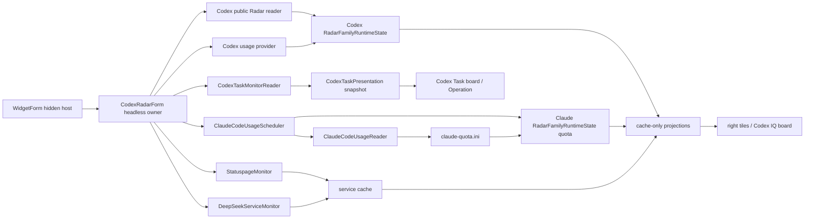

# Codex / Claude Radar 数据所有者架构

适用版本：2.0.0.0

本文说明 `CodexRadarForm` 作为永久 headless owner 时的 Codex 公共 Radar、Codex/Claude 官方额度、服务健康、任务状态和只读投影。

## 1. 当前职责

`CodexRadarForm` 的类名为兼容保留；它是数据所有者，不是可见 Radar 窗口。Codex family 维护公共 Radar 模型数据与个人额度，Claude family 只维护官方 Claude Code 额度与相关服务状态。两枚右侧额度方块始终从各自 family 的缓存构建，不依赖当前选中的 family。

相关源码：

| 文件 | 职责 |
| --- | --- |
| `Core/CodexRadarForm.cs` | headless 生命周期、统一调度、Codex 公共 Radar、额度与任务状态 |
| `Core/CodexRadarForm.RuntimeState.cs` | `RadarFamilyRuntimeState` 与 family 隔离 |
| `Core/CodexRadarForm.ProjectionState.cs` | 同代 published state 原子替换与 tile/IQ 投影 clone |
| `Core/CodexRadarForm.ClaudeUsage.cs` | 官方 Claude Code usage 调度结果接入 |
| `Core/CodexRadarForm.TileSnapshot.cs` | tile、Codex IQ board、服务健康的 cache-only 投影 |
| `Core/OwnerOperationGeneration.cs` | Start/Stop/挂起恢复 generation、取消与迟到提交边界 |
| `Core/BoundedHttpTextReader.cs` / `Core/CodexRadarUrlPolicy.cs` | 有界 HTTP 文本读取与 Radar 精确 URL/SSRF 策略 |
| `Core/ClaudeCodeUsageReader.cs` / `Core/ClaudeCodeUsageScheduler.cs` | Claude 官方额度读取、单飞调度与缓存提交 |
| `Core/DeepSeekServiceMonitor.cs` | 无凭据 DeepSeek 服务可达性探测 |
| `Core/StatuspageMonitor.cs` | OpenAI/Anthropic 官方状态单飞监控 |
| `Core/CodexTaskMonitorReader.cs` / `Core/CodexTaskPresentation.cs` | Codex 会话增量读取和共享任务快照 |
| `Core/WidgetForm.TileColumn.cs` | 把两个 family 的额度快照写入同一 `MetricTileFeed` |

可见消费者：

| 消费者 | owner API | 内容 |
| --- | --- | --- |
| 右侧 Codex tile / expand | `BuildRadarTileSnapshot(Codex)` | Codex 模型、额度、重置、IQ、效率与服务摘要 |
| 右侧 CLD tile / expand | `BuildRadarTileSnapshot(Claude)` | 固定 Claude/CLD 标签、官方 5 小时/周额度与各自重置时间 |
| 左侧 Codex IQ board | `BuildCodexIqBoardSnapshot()` / `BuildServiceHealth()` | Codex 全模型 IQ、成本、耗时、token、额度趋势、名册与四项服务健康 |
| Codex Task board / Operation | `CodexTaskPresentation.SnapshotProvider` | 本地 Codex 会话任务状态 |

Claude tile 不生成模型 IQ 或效率；其 `IqKnown`、`EfficiencyKnown` 恒为 `false`，且没有社区评分字段。

## 2. 总体数据流



网络、磁盘和 provider 工作只在 owner 的既有调度链执行。绘制表面只读取投影，不建立 reader、timer、watcher 或请求。

## 3. Headless 生命周期

`WidgetForm.EnsureCodexRadarWindow()` 构造 owner，并显式调用 `StartHeadlessDataOwner()`：

- 创建隐藏 HWND，供显示电源通知和 `BeginInvoke` 回调使用。
- 应用运行时设置后启动 backend scheduler。
- 不调用 `Show()`，也不执行定位、hover、透明度、burn-in、Z-order 或 layered bitmap 工作。
- `StartHeadlessDataOwner()` / 恢复建立新 generation；所有 Radar、额度、reset credits、Statuspage 与 DeepSeek completion 都捕获对应 lease。
- `StopHeadlessDataOwner()`、挂起和 Dispose 取消当前 generation；迟到结果不得写状态、缓存、业务日志、通知或 UI 回调。

owner 生命周期不受 tile 是否显示影响。全屏隐藏只处理可见表面；显示器关闭、会话锁定或系统挂起时，远程轮询按 `Docs/Component-Refresh-Rules.md` 暂停，恢复后错峰续跑。

## 4. Family 状态隔离

Codex family 保存公共 Radar 模型快照、模型目录、额度、服务状态和各自 deadline。Claude family 只保存官方额度快照、额度来源、reset anchor、消耗基线和服务状态，不保存公共 Radar 模型、IQ 或评分目录。

请求开始时捕获 family，完成时只写回对应状态。当前 active family 在请求期间改变时，结果仍可更新原 family 缓存，但不能覆盖另一 family。`BuildRadarTileSnapshot(Codex)` 与 `BuildRadarTileSnapshot(Claude)` 在同一个 feed 构建周期分别读取对应状态，所以两枚额度方块可同时稳定显示。

## 5. 软件 Family 选择

`CodexRadarSoftwareMode` 支持固定 Codex、固定 Claude 和 Auto。Auto 复用 `SoftwareRuntimePresence`：

1. 固定模式、两者都未运行或只有一者运行时，不查询前台窗口。
2. 两者都运行时才使用包路径、专用进程名、产品元数据和受限标题 fallback 识别前台软件。
3. 无法识别或命中本程序时，保持上一次有效 family。

family 选择只影响 provider 调度优先级和相关服务语义，不决定 Codex/CLD tile 是否存在，也不为 Claude 选择模型。

## 6. Codex 公共 Radar 与模型目录

只有 Codex family 读取公共 Radar 数据与模型目录。`current.json` schema 2 是模型 IQ 和数据时间的权威来源；内容签名未变化时保留 source timestamp，fetch timestamp 不能伪造新批次。HTML 只允许在结构化数据缺少速蹬窗口时补该窗口，不能回填模型评分、额度雷达或覆盖 JSON。完整目录才能推进模型缺失计数；部分损坏数据只能补充已见模型，不能证明其它模型消失。

Codex 的模型选择、IQ、评分、效率、通知状态与 `Codex IQ` board 均留在 Codex 侧。Claude family 不参与公共 Radar 请求、模型目录、模型自动切换或数据周期判定。刷新周期与重试规则只在 `Docs/Component-Refresh-Rules.md` 维护。

## 7. 额度数据与身份保护

### 7.1 Selected-provider gate

个人额度只为当前有效且对应本地程序正在运行的 family 排队：

- Codex：ChatGPT backend usage 与本地 session fallback。
- Claude：`ClaudeCodeUsageScheduler` 的官方 usage/statusline 链。
- 两者都未运行时保留最近快照，不同时 prime 两套 provider。

启动、恢复、网络变化、手动刷新或 family 切换只让适用 provider 到期。可见消费者始终只读已提交的 last-good 快照。

大陆出口保护在冷启动/换网未知期会 fail-closed，因此敏感端点可能先得到 `AI_BLOCK`。`WidgetForm` 确认出口为境外后调用 `CodexRadarForm.RequestSensitiveAiRefreshAfterEgressAuthorization()`，仅把适用 Codex/Claude 额度、reset credits 与 OpenAI/Anthropic Statuspage 调度置为到期；公共 Radar、DeepSeek 与其它网络探测不受该边沿影响。

### 7.2 Codex 额度

Codex provider 只读已配置的环境变量或 Codex `auth.json` 凭据，不写回。5 小时与周额度分别维护 reset anchor、余额、来源和消耗基线。只有通过窗口身份、漂移容差与异常跃迁保护的结果才提交到缓存。

`quota-decision-history.jsonl` 只记录额度判定所需摘要，不记录 token、提示词、响应正文或授权 header。

### 7.3 Claude 额度

Claude Code 用量由进程级 `ClaudeCodeUsageScheduler` 单飞读取，结果一次提交到 Claude family，并由 `ClaudeCodeUsageReader` 原子写入 `claude-quota.ini`。只有同时包含 5 小时/周额度、两组 reset、可信更新时间且满足新鲜度规则的完整快照才会发布、落盘或在启动时恢复；部分结果保留 last-good。

CLD tile 的固定模型标签为 `Claude`，紧凑标题为 `CLD`；额度与两个 reset 只来自官方 usage/statusline 链。详细边界见 `Docs/Codex-ClaudeRadar-Architecture.md`。

## 8. 服务健康

owner 复用进程级 `StatuspageMonitor` 与 `DeepSeekServiceMonitor`，向 Codex IQ board 发布四项健康状态；Network Dock 不再持有这组重复 LED：

| 标识 | 含义 |
| --- | --- |
| `R` | Codex 公共 Radar 数据源 |
| `O` | OpenAI 官方状态 |
| `C` | Anthropic 官方状态与 Claude usage |
| `D` | DeepSeek 服务可达性 |

DeepSeek 项不读取凭据、不查询或保存账户余额，也不产生余额提醒。它只输出 `known`、`available`、错误码与检查时间。HTTP 鉴权或请求格式响应可证明网关可达；无响应、拒绝或服务端故障按服务异常语义分类。

服务错误经过 `ServiceAlertDebouncer`；检测中立即发布，新错误稳定后发布，恢复立即清除。`BuildServiceHealth()` 只复制已有状态，不触发探测。具体调度与手动刷新语义见 `Docs/Component-Refresh-Rules.md`。

## 9. Codex Task 后端

owner 注册 `CodexTaskPresentation.SnapshotProvider`，并在既有 scheduler 中请求轻量任务刷新：

- `%USERPROFILE%\.codex\sessions` 只维护一套递归 watcher。
- watcher 事件用于逐文件增量尾读，低频完整对账兜底漏报。
- reader 不创建独立 timer；presentation 层把缓存映射为颜色、环、徽标和行模型。
- 展示不输出提示词、回复或完整会话路径。

owner 停止时清除 provider，避免消费者调用已销毁实例。

## 10. Codex IQ Board 投影

`BuildCodexIqBoardSnapshot()` 只复制 Codex family 的全模型数据、选中模型历史、额度趋势、名册和服务健康。`CodexIqBoardForm` 不访问网站、不读取公共 Radar 文件，也不建立 reader。

IQ board 的 tab、展开/收起和渲染属于左侧停靠运行时，不改变 owner 的业务周期。

## 11. Cache-only 展示边界

以下方法必须保持纯缓存读取：

- `BuildRadarTileSnapshot(CodexRadarSoftwareMode)`
- `BuildCodexIqBoardSnapshot()`
- `BuildServiceHealth()`
- `CodexTaskPresentation.SnapshotProvider`

它们从一次原子发布的 `RadarPublishedProjectionState` clone 后再格式化和映射，不得跨锁读取可变 owner 字段，也不得发起 HTTP/provider 请求、读取凭据或磁盘缓存、修改 deadline、触发模型切换，或修改 reader-owned state。模型目录只在 owner 启动、成功刷新或显式 cache reload 时载入内存；5 秒 IQ 投影不轮询磁盘。

## 12. 设置边界

设置页保留 Codex 公共数据、family 选择、Codex 模型/周期、个人额度、服务探测、Claude setup-token 与测试配置。Claude 不提供公共数据源、社区评分、模型选择或本地公共额度 fallback；DeepSeek 不提供 API key、余额或余额告警设置。

全局布局编辑器只登记 `MetricTile.CodexQuota`、`MetricTile.ClaudeQuota` 和左侧 `CodexIq` tab；headless owner 不在 16 个布局项中。

## 13. 故障、安全与验证

- 网络失败保留对应数据源的 last-good snapshot，并按失败策略重试。
- 迟到请求只写回捕获的 family；owner 已停止时丢弃。
- 凭据、Cookie、setup-token、Authorization header、完整响应和用户会话正文不得进入日志；身份变化诊断只记录规范化元数据，不写 provider raw body。
- 所有活动 HTTP 文本路径使用 `BoundedHttpTextReader` 的大小、总时限、取消、解压和严格 UTF-8 边界；Radar 可配置 URL 必须通过 `CodexRadarUrlPolicy` 的精确 HTTPS endpoint 与 DNS 私网拒绝。
- 随机测试状态不能写真实额度缓存、模型目录或历史。
- snapshot 构建异常降级为空/旧快照，不能阻塞 Widget UI tick。

建议验证：

```powershell
powershell -NoProfile -ExecutionPolicy Bypass -File .\Build-Arm64.ps1 -OutputPath .\_build\DesktopCodexAssistant-arm64-test.exe -Platform arm64
.\_build\DesktopCodexAssistant-arm64-test.exe --test
.\_build\DesktopCodexAssistant-arm64-test.exe --test-layout
.\_build\DesktopCodexAssistant-arm64-test.exe --test-settings-bindings
.\_build\DesktopCodexAssistant-arm64-test.exe --test-radar-display-lifecycle --iterations 20
.\_build\DesktopCodexAssistant-arm64-test.exe --render-tilecolumn --out .\_build\tilecolumn
```

验收重点是：owner 始终隐藏、Start/Stop 完整、两套额度状态隔离、四类投影无 I/O、CLD tile 仅显示官方额度与 reset、DeepSeek 只保留服务健康，以及设置/布局不暴露已不存在的入口。
