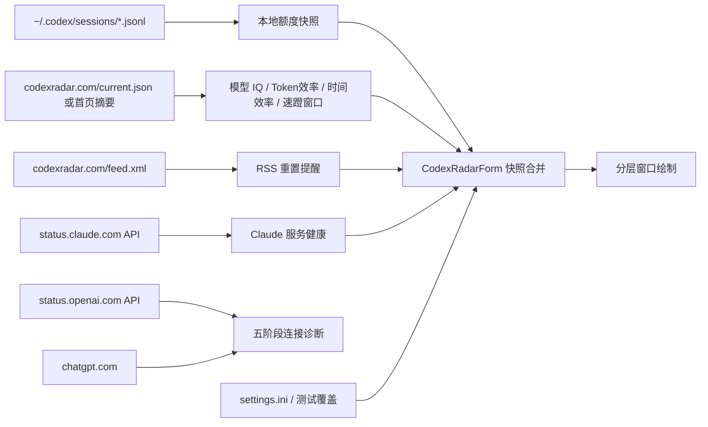

# Codex 监测窗口技术说明

## 1. 范围

本文以 `Core/CodexRadarForm.cs` 的当前实现为准，说明 Codex 监测窗口的数据来源、刷新调度、服务健康状态、额度读取、Model IQ/效率计算、测试模式和分层窗口渲染机制。

已废弃并从当前运行路径删除的功能：

- 24/48 小时重置概率预测环
- hascodexratelimitreset.today 重置状态网站检测

`Backups/CodexRadarMemorial-20260614-legacy` 保留了废弃前的纪念副本。

## 2. 当前窗口组成

左侧 Codex 监测区：

- 上环：时间效率
- 下环：Token 效率
- 中间上方：五阶段连接异常轮播，或正常时的通过状态
- 中间：网络、DNS、隧道、OpenAI、Codex 五点连接流程
- 中间下方：Model IQ 更新状态，格式为 `已更新/HH:mm` 或 `未更新/HH:mm`

右侧额度区：

- 5 小时余额环
- 周余额环
- 速蹬窗口开启时，额度重置时间在原白色时间/日期、黄色窗口结束时间/日期和金色 `速蹬！` 之间轮播；RSS 重置保护态右侧显示金色 `已重置`；网站未给结束时间时跳过黄色窗口时间阶段；Codex 未运行时文字和环内数字保持灰色
- `Rader`、`Claude`、`ChatGPT` 三行服务健康状态
- 右侧 IQ 环和 `增智`、`正常`、`降智` 状态字样



## 3. 主调度循环

`timer` 是轻量调度器，不代表每次触发都会读取全部数据。

每次 tick 的顺序：

1. 检查显示器、会话和电源挂起状态。
2. 处理网络可用性失效标记。
3. 判断本地额度是否到期。
4. 判断北京时间日界线驱动的 Radar、Claude 健康检查和五阶段连接诊断是否到期。
5. 根据设置计算窗口尺寸和防烧屏微位移。
6. 仅在尺寸、位置或本地秒变化时执行常规重绘。
7. 重新计算下一次 timer 间隔。

网站请求完成后会通过 `BeginInvoke` 立即提交一次绘制，不必等待下一秒。

| 模式 | 面板调度目标 |
| --- | ---: |
| 性能 `Smooth` | 500 ms |
| 均衡 `Balanced` | 1000 ms |
| 省电 `BatterySaver` | 3000 ms |

网站业务周期不随 UI timer 缩短。

## 4. 暂停与恢复

以下任一条件成立时停止 Codex 轮询：

- 显示器关闭
- Windows 会话锁定
- 系统挂起

恢复后：

1. 清除暂停状态。
2. 使额度刷新立即到期。
3. 重新安排 Claude 和 `current.json` 的错峰启动时间。
4. 安排一次五阶段连接诊断。
5. 使渲染缓存失效。
6. 重新定位并绘制窗口。

首次启动或恢复时远程请求错峰：

| 数据源 | 首次计划 |
| --- | ---: |
| Claude | 约 1 秒后 |
| 五阶段连接诊断 | 约 1 秒后 |
| current.json | 约 4 秒后 |

## 5. 额度读取

额度按以下顺序读取：

1. `%USERPROFILE%\.codex\sessions` 中的 `rollout-*.jsonl`
2. `%LOCALAPPDATA%\DesktopCodexAssistant\quota.ini`
3. 无有效来源时使用默认快照，并把 `ChatGPT` 服务标记为不可用

JSONL 中读取 `event_msg -> token_count -> rate_limits`。`primary` 通常对应 5 小时窗口，`secondary` 通常对应周窗口；如果存在 `window_minutes`，以是否小于等于 300 分钟重新判断。

窗口周期检查名为 `codex` 的进程。进程检查和额度扫描使用不同周期：

| 项目 | 性能 | 均衡 | 省电 |
| --- | ---: | ---: | ---: |
| Codex 进程检查 | 3 s | 5 s | 10 s |
| Codex 活跃时额度刷新 | 10 s | 15 s | 30 s |
| Codex 非活跃时额度刷新 | 10 min | 20 min | 60 min |

本地 `resets_at` 到达时会把对应余额暂时固定为 100，并保存保护状态。只有新样本的 `SourceUpdatedUtc` 晚于保护建立时间且 reset 时间已经更新，保护才释放，避免旧日志再次覆盖为低余额。

成功从 session 读取额度后会写回 `quota.ini`。内存中的最新 session 快照可以复用，但每 30 秒会重新确认是否存在更新的 `rollout-*.jsonl`；如果 watcher 漏掉新文件，也不会长期相信旧缓存。

CodexRadar RSS 中出现新的“用量限制已重置”记录时，会同时保护 5 小时和周额度：两个环立即显示 100，右侧时间位置显示金色 `已重置`；额度环弧线仍按当前剩余额度使用原本颜色，不额外变金。额度环图层从下到上为灰色底环、与左侧效率环一致的淡绿色 `#8EF2B9` 消耗环、当前余额环。消耗环不是单独的差值短段，而是上次读取或窗口基线余额对应的完整弧层；当前余额环覆盖共同部分后，露出的尾段自然表示消耗。五小时环的消耗环基准是上上次真实检测到的余额，并与上次检测到的余额比较：如果上上次为 67、上次为 57，则先绘制 67 的消耗环完整弧，再绘制 57 的当前余额弧，视觉上只露出 10 的淡绿色尾段；如果连续两次日志或刷新读到相同的五小时余额，则明确保留已有消耗环基线，不清空也不重建，直到余额再次上涨、下降或来源失效。周额度环不再显示自己的最近读取下降段，消耗环基准为上一次 5 小时自然窗口开始时的周额度；窗口用 5 小时 reset 时间推进或五小时余额上涨识别，周额度上涨时也重建基线，避免把周重置前的基线继续用于当前窗口。首次读取、无有效来源或保护态不显示可见消耗环尾段。环内数字和右侧文字使用同一颜色。RSS 发布时间只用于判断事件新旧；保护建立时间使用本机检测到该 RSS 的时间，避免启动前已经存在的 quota 样本立刻释放 100 保护。保护释放条件仍与本地到期保护相同，必须等到新的 quota 样本证明已经进入下一窗口，避免旧 session 文件把显示再次覆盖成低额度。RSS 重置事件使用 GUID、发布时间和“已保护 GUID”写入 `quota-reset-state.ini` 去重；首次升级后如果最新重置发生在 36 小时内，也会触发一次，防止刚恢复的 RSS 提醒被当作旧基线忽略。

## 6. 网站请求调度

| 数据源 | 正常周期 | 失败重试 |
| --- | ---: | ---: |
| `codexradar.com/current.json` | 北京时间每小时整点 | 10 min |
| `codexradar.com/feed.xml` | 跟随 `current.json` 成功响应 | 不独立重试 |
| `status.claude.com/api/v2/status.json` | 15 min | 2 min |
| 五阶段连接诊断 | 性能 3 min / 均衡 5 min / 省电 10 min | 1 min |

每个远程端点都有独立的 `requestRunning` 标志。同一端点任意时刻最多运行一个请求，慢请求不会在 timer tick 中堆积。

请求使用：

- 10 秒连接和读写超时
- TLS 1.2
- `Cache-Control: no-store, no-cache`
- 查询参数时间戳，降低中间缓存返回旧 JSON 的概率

`current.json` 解析当前需要的 `model_iq`、`window_open/window` 和 `links.rss` 字段，不再解析旧 `prediction` 或 hascodexratelimitreset 数据。解析器优先使用 JSON；如果接口再次返回首页，则从 `codex-radar:summary`、模型对比表和 SVG 标题读取同一批模型数据，避免把网站路由变化误报为 Rader 黄色叉。

监测模型由 `current.json.model_iq` 动态发现：

- `model_iq.latest` 是网站当前默认模型，key 由 `model` + `reasoning_effort` 规范化得到，例如 `gpt_55_xhigh`。
- `model_iq.comparisons` 下的任意对象都按同一结构解析，字典 key 或对象内 `model/reasoning_effort` 均可作为稳定模型 key。
- 模型目录保存到 `%LOCALAPPDATA%\DesktopCodexAssistant\codex-radar-models.ini`，设置页按目录生成模型按钮。
- 新模型首次发现时触发 Windows 通知；模型首次从成功响应中缺失时标记为暂不可用并保留灰色禁用按钮；连续 3 次成功响应都缺失后才判定删除、移出目录并通知一次。

模型切换会优先加载对应模型未过期的本地缓存并立即安排一次请求，各模型使用独立缓存键，避免数据混显。

### 6.1 北京时间整点监测

网站数据以 `Asia/Shanghai` 为业务时区。常规自动请求按北京时间整点执行：

1. 程序启动、显示恢复、网络恢复、强制刷新和模型切换仍会触发一次错峰请求。
2. 请求成功后，下一次常规定时安排到下一个北京时间整点。
3. 如果网站在该整点没有发布新 IQ 批次，也不再追加 10 分钟轮询，继续等待下一个整点。
4. HTTP、解析、超时、不可达或所选模型字段失败时，每 10 分钟重试。

Model IQ 新鲜度使用两个北京时间基准点：0 点和 12 点。当前北京时间 0:00-11:59 要求当天 `am` 批次；12:00 后要求当天 `pm` 批次。结构化 JSON 中的 `2026-06-16-am/pm` 会被解析成对应半日窗口；旧 date-only 数据按 0 点批次兼容。

## 7. 服务健康状态

三行服务状态：

| 行 | 数据源 |
| --- | --- |
| `Rader` | `codexradar.com/current.json` 中的 `model_iq` |
| `Claude` | `https://status.claude.com/api/v2/status.json` 官方服务状态 |
| `ChatGPT` | 本地 Codex 额度来源是否可读 |

状态含义：

| 状态 | 条件 | 显示 |
| --- | --- | --- |
| `Normal` | 请求成功且内容可用 | 白字 |
| `Degraded` | Claude 官方状态为 `minor` | 白字和黄色小叉 |
| `Incomplete` | Rader 请求成功，但 `current.json` 缺少所选模型数据 | 白字和灰色小叉 |
| `Offline` | Windows 判断没有可用网络 | 灰字和灰色小叉 |
| `Unavailable` | 已连接服务，但 HTTP/内容不受支持、无法解析，或 Claude 官方状态为 `major/critical` | 白字和黄色小叉 |
| `Unreachable` | DNS、连接、TLS、超时等请求失败 | 白字和红色小叉 |
| `Unknown` | 首次启动、网络恢复或等待结果 | 白字 |

`NetworkChange` 回调只设置失效标记，不在系统事件线程执行网络检查。下一次 UI 调度统一更新三行服务状态。

## 8. Model IQ 与效率

### 8.1 IQ 环

默认任务总数为 12。IQ 基准可单独设置为绝对通过数、近 7 日平均、近 30 日平均或全记录平均；记录数量不足指定窗口时临时退回到全记录平均，默认使用全记录平均。

- 圆心：网站 `score` 四舍五入后的整数，不显示 `%`，允许超过 100
- 通过数低于基准：红色从 12 点方向逆时针覆盖不足部分
- 通过数等于基准：绿色基线
- 通过数高于基准：金色从 12 点方向顺时针覆盖超出部分
- 右侧文字：`降智`、`正常`、`增智`

如果网站只给通过率，会根据有效任务数四舍五入推导通过数。

### 8.2 Token 与时间效率

`current.json.model_iq` 提供当前记录和历史基准时：

```text
tokenRate = passed / totalTokens
timeRate  = passed / serialSeconds

tokenEfficiency = currentTokenRate / baselineTokenRate * 100
timeEfficiency  = currentTimeRate  / baselineTimeRate  * 100
```

Token 和时间效率分别有独立基准模式：

- 绝对值：使用设置中的通过数 + Token 数或秒数。
- 近 7 日平均、近 30 日平均、全记录平均：从当前模型历史样本聚合 `passed/total_tokens` 或 `passed/serial_seconds` 得到基准速率。
- 记录数量不足指定窗口时临时退回到全记录平均。

效率限制在 `0..200`。

### 8.3 双效率环

左侧上环为时间效率，下环为 Token 效率。两个环使用同一规则：

- 基底：淡绿色全环
- 低于 100：红色从 12 点逆时针增长
- 高于 100：金色从 12 点顺时针增长
- 圆心：效率整数，不显示 `%`

右侧状态：

| 环 | 低于阈值 | 100 附近 | 高于 100 |
| --- | --- | --- | --- |
| 时间 | `耗时` 红色 | `普通` 白色 | `省时` 金色 |
| Token | `低效` 红色 | `普通` 白色 | `高效` 金色 |

Token 和时间分别有可配置低效阈值。

### 8.4 五阶段连接流程

旧七日折线图和旧模型新鲜度状态已经从绘制代码删除。原区域现在显示：

- 上方结论：正常时为绿色 `已通过`；异常时复用网络窗口云服务告警样式，按五个阶段从左到右轮播 `名称!` 和 `原因!`
- 中间五点：网络、DNS、隧道、OpenAI、Codex
- 下方：Model IQ 最近一次成功更新到环上的时间，格式为 `已更新/HH:mm` 或 `未更新/HH:mm`

上下两行复用效率环的上下行矩形，因此分别与左侧时间效率和 Token 效率状态保持同一垂直中线。左侧效率状态与余额环右侧时间使用同一字号计算。失败请求不会覆盖这个时间；它只在 IQ 环实际接收新快照时更新。

点状态颜色：

| 状态 | 颜色 |
| --- | --- |
| 已通过 | 绿色 |
| 可用但异常 | 冰黄色 |
| 已连接但不可用 | 橙色 |
| 卡住、无法继续 | 红色 |
| 离线或尚未执行 | 灰色 |

在线时，后一个阶段可到达则前后点之间使用白色细线，否则使用灰色细线；完全离线时不画连接线。检测在后台单飞任务中执行，不阻塞 layered-window 绘制。

异常轮播候选只来自离线、警告、不可用和阻塞阶段。`隧道` 阶段在轮播中显示为 `VPN`，常见原因会映射为中文短句，例如 `STATUS` 显示为 `服务状态异常`、`NO_DATA` 显示为 `无额度数据`、`TIMEOUT` 显示为 `请求超时`。

OpenAI 节点请求官方 Statuspage `summary.json` 后优先检查 `CLI`、`VS Code extension`、`Codex Web`、`App`、`Codex API` 和 `Login` 组件。只要这些组件存在，全站 `minor/major/critical` 不再直接染色，避免 FedRAMP 或其他无关产品、区域事故造成黄色误报；仅当相关组件自身降级、维护或中断时显示黄色/橙色。只有响应缺少相关组件列表时，才使用全站 indicator 兜底。

## 9. 快照合并

`current.json`、速蹬窗口状态、RSS 重置提醒与 Model IQ 使用同一个 `CodexRadarSnapshot`。

- 请求成功且包含 `model_iq`：更新 IQ、效率、数据日期、刷新时间，并标记刷新成功。
- 请求成功且包含速蹬窗口：更新窗口开启状态、事件 ID、开启/关闭时间；窗口开启事件按 ID/时间去重通知。
- RSS 中出现新的重置记录：按 GUID/pubDate 去重，触发 Windows 通知，并把 5 小时和周额度进入金色 100 保护态。
- 请求成功但缺少 `model_iq`：服务状态为 `Incomplete`，保留旧 IQ/效率，刷新时间更新并标记失败。
- 请求失败：保留旧业务数据，刷新时间更新并标记失败，按错误类型设置服务状态和重试时间。
- UI 绘制前克隆快照，再应用设置基线和测试覆盖。

该顺序避免慢请求、失败请求或测试状态污染真实缓存。

### 9.1 七日落盘缓存

`%LOCALAPPDATA%\DesktopCodexAssistant\codex-radar-cache.ini` 按动态模型 key 保存当前快照和历史样本：

- 每次成功取得所选模型数据后，将网站历史与旧缓存按北京时间半日窗口合并，同窗口以新数据覆盖。
- 每个模型最多保留 366 个半日窗口的 IQ、Token、耗时、缓存输入和有效任务数据，用于近 7 日、近 30 日和全记录基准。
- 缓存保存时间超过 7 天后不再加载，并在后续成功写入时清理过期模型条目。
- 程序启动和模型切换可先显示有效缓存，后台请求仍按原调度立即验证最新数据。
- HTTP 请求继续禁用中间缓存；缓存用于本地快照恢复、动态基准和后续数据用途。缓存新增 `DataWindowHour` 字段，缺省时按 0 点批次兼容旧文件。

## 10. 测试模式

设置页的“窗口测试”合并了原 IQ 样例测试和网站检测测试：

| 控件 | 行为 |
| --- | --- |
| 实时 / 测试 | 切换真实数据与整窗随机测试快照 |
| 刷新 | 测试模式下立即随机生成一次全部显示数据 |
| 自动刷新 | 测试模式下每秒随机生成一次全部显示数据 |

随机快照覆盖 IQ、Token/时间效率、数据日期、速蹬窗口状态、RSS 重置样例、五小时/周额度、额度保护色、Codex 进程状态、五阶段连接流程以及 Rader/Claude/ChatGPT 三项服务健康状态。测试数据只作用于内存显示，不写回网站快照、额度状态或七日缓存。

测试模式会暂停网站、Claude、额度文件和连接流程的真实轮询，避免测试期间产生无意义的后台请求。切回实时后会清空随机快照，恢复并尽快执行真实检测。

下方的 IQ 通过数、三类基准模式/绝对值和效率测试仍是精确数值调试工具，与整窗随机测试相互独立。旧版 `CodexRadarTestMode` 和 `ServiceHealthTestMode` 配置在加载归一化时强制关闭，避免升级后残留不可见测试状态。

## 11. 时区设置

时区页提供：

- 自动：使用当前 Windows 系统时区
- 手动：从 Windows 时区列表选择显示时区
- 显示所选时区相对北京时间快或慢多少
- 显示“北京时间 0 点”在所选时区对应前一天、当天或后一天的具体时间

显示时区只控制面板时间文字和设置页换算说明；网站日期、半日新鲜度判断和整点请求调度始终使用北京时间。

## 12. 绘制和交互优化

窗口使用 `WS_EX_LAYERED` 和 `UpdateLayeredWindow`。

- 尺寸不变时复用 `renderBitmap` 和 `renderGraphics`
- 内容绘制和整体 Alpha 提交分开
- 悬停透明度动画只提交已有位图，不重新解析 JSON 或扫描额度文件
- 全屏隐藏时停止不必要的 hover timer
- 普通 timer tick 最多每秒因本地时间变化重绘一次
- 连接异常轮播激活时，timer tick 会触发重绘以切换 `名称!` 和 `原因!`
- 网站完成、设置变化和强制刷新可以立即重绘

## 13. 线程和锁

| 锁 | 保护内容 |
| --- | --- |
| `codexRadarStatusLock` | `current.json.model_iq` 快照、请求标志和下次刷新时间 |
| `codexConnectionLock` | 五阶段连接快照、请求标志和下次刷新时间 |
| `claudeStatusLock` | Claude 请求标志和下次刷新时间 |
| `quotaResetStateLock` | 本地额度 reset-card 保护状态、RSS 重置和速蹬开启去重 |
| `serviceHealthLock` | 网络可用性和三项服务健康状态 |
| `codexQuotaSnapshotCacheLock` | 静态额度文件缓存 |
| `codexRadarDiskCacheLock` | 各模型各自的七日快照缓存文件 |

维护约束：

1. 后台线程不得直接调用 GDI+ 或修改窗口控件。
2. 锁内不得执行 HTTP、文件扫描或通知回调。
3. 每个远程数据源必须保留单飞标志。
4. 请求失败不得清空最后一次成功业务数据。
5. 测试覆盖必须应用于克隆，不能写入真实快照。

## 14. 构建与验证

构建：

```powershell
powershell -NoProfile -ExecutionPolicy Bypass -File .\Build-Arm64.ps1
```

建议回归：

1. 性能、均衡、省电切换后 timer 和额度周期正确。
2. Codex 进程启动后额度立即刷新，退出后切换到低频。
3. 连续 timer tick 不会启动重复网站请求。
4. 断网后三项服务变灰，恢复后按错峰时间重新检测。
5. JSON 和首页 HTML 回退均能读取所选模型，Rader 不误报黄色叉。
6. RSS 最新重置项只触发一次金色 100 保护，右侧显示 `已重置`；相同 GUID 重启后不重复触发。
7. 速蹬窗口开启时额度右侧文字在原白色时间/日期、黄色窗口结束时间/日期、金色 `速蹬！` 之间轮播；环弧颜色不因速蹬或保护态改变，灰色底环保持在最下方，和左侧效率环一致的淡绿色 `#8EF2B9` 消耗环绘制在底环上方和当前余额环下方，五小时消耗环使用上上次检测余额与上次检测余额的差异，周消耗环使用上次五小时窗口开始时的周额度，环内数字颜色与右侧文字一致，Codex 未运行时两者都变灰。
8. 五阶段连接点、线、上方告警轮播和下方 IQ `已更新/时间` 完整显示；断网时只有灰点且无线。
9. 三种模型缓存各自保留 7 个完整属性样本，程序重启和模型切换可恢复；缓存超过 7 天后拒绝加载。
10. 左侧双效率环分别按时间/Token 规则绘制。
11. 右侧 IQ 环和状态字样替代旧预测/No/Yes 区域。
12. 到达本地 `resets_at` 后余额先显示 100，新样本到达后解除保护。
13. `%LOCALAPPDATA%\DesktopCodexAssistant\error.log` 没有新增异常。
