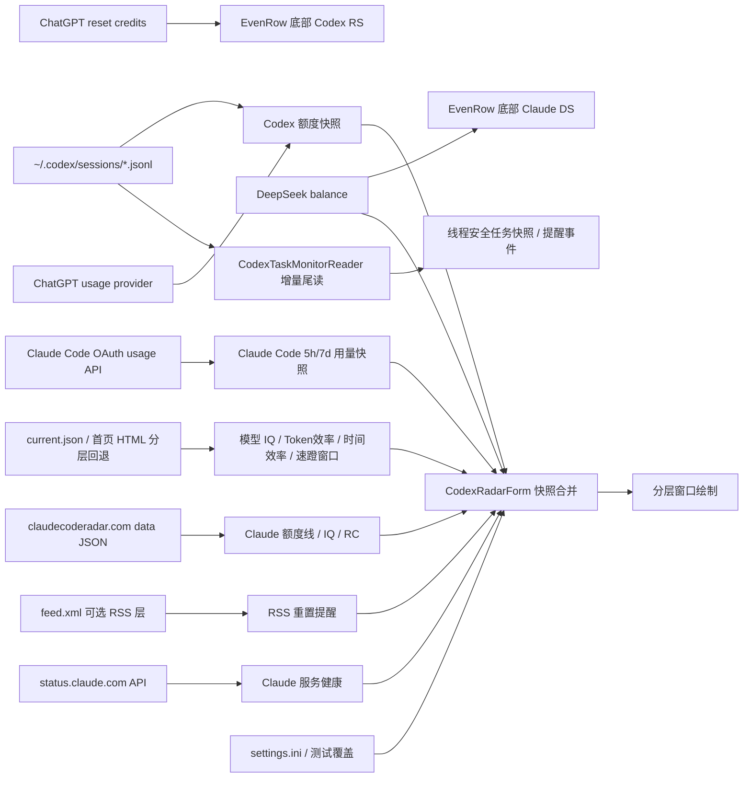

# Codex 监测窗口技术说明

适用版本：1.0.6.03

## 1. 范围

本文以 `Core/CodexRadarForm.cs`、`Core/CodexTaskMonitorReader.cs` 的当前实现为准，说明 Codex 监测窗口的数据来源、刷新调度、任务状态后端、服务健康状态、额度读取、Model IQ/效率计算、测试模式和分层窗口渲染机制。

已废弃并从当前运行路径删除的功能（历史实现见 git 历史与 CHANGELOG）：

- 24/48 小时重置概率预测环
- hascodexratelimitreset.today 重置状态网站检测

## 2. 当前窗口组成

左侧 Codex 监测区：

- 上环：时间效率
- 下环：Token 效率
- 底部元信息：当前 `EvenRow` 布局在左下方显示软件族品牌文本 `Codex` / `Claude`、`RC:xxx`、模式辅助项和 `LLM:...`；辅助项在 Codex 模式显示重置卡 `RS:n 剩余时间`，在 Claude 模式显示 DeepSeek 余额 `DS:￥n`。Codex 5.6 系列的 `LLM` 缩写按“版本 + 系列首字母 + 档位”生成，例如 Sol low 为 `5.6SL`、Luna high 为 `5.6LH`、Sol medium 为 `5.6SM`
- 右侧状态：Model IQ 时钟圆盘和服务 LED 列。时钟圆盘显示网页数据标签和可配置时间；Codex 模式下最外圈额外绘制 Codex 任务环（见 §5.2）；Codex 与 Claude 模式都显示 `R/O/C/D`，其中 `D` 始终表示 DeepSeek 官方 API 可达性，和余额 key 是否配置分离。

右侧额度区：

- 5 小时余额环
- 周余额环
- 速蹬窗口开启时不再轮播 `速蹬！`：5 小时行始终显示原额度重置时间、周行始终显示原额度重置日期，两者强制使用金色且不受 Codex 未运行降亮影响；额度环内数字仍保持原规则，有已知数值且 Codex/Claude 任一受支持本地软件运行时为白色，两者都未运行或数值未知时为灰色。RSS 重置保护态只在非速蹬状态显示金色 `已重置`
- 中间健康/额度雷达块：额度雷达线移动到 IQ 模块左侧，取代原灰色分割竖线；Codex 模式使用 CodexRadar 公开额度雷达，Claude 模式把 `ClaudeRadarSnapshot.QuotaLine` 转换为同一 `CodexQuotaRadarSnapshot` 代表线；当前 `EvenRow` 状态格显示 API 状态摘要、网页数据标签和更新时间，左下方显示 `软件族品牌/RC/辅助项/LLM` 元信息
- 右侧 IQ 环和 `增智`、`常态`、`降智` 状态字样



## 3. 主调度循环

`timer` 是轻量调度器，不代表每次触发都会读取全部数据。

每次 tick 的顺序：

1. 检查显示器、会话和电源挂起状态。
2. 请求任务后端刷新状态；watcher 漏报时最多每 30 秒在后台复用共享目录枚举补偿一次。
3. 处理网络可用性失效标记。
4. 判断本地额度是否到期。
5. 判断北京时间日界线驱动的 Radar、进程级 Statuspage 健康检查、Claude Code 用量检查和 DeepSeek 官方 API/余额检查是否到期；旧五阶段连接诊断已删除，不参与调度。
6. 根据设置计算窗口尺寸和防烧屏微位移。
7. 仅在尺寸、位置或本地秒变化时执行常规重绘。
8. 重新计算下一次 timer 间隔。

网站请求完成后会通过 `BeginInvoke` 立即提交一次绘制，不必等待下一秒。面板调度目标使用全局"普通面板调度"三档间隔（数值以 `Docs/Component-Refresh-Rules.md` §2 为唯一权威表）；网站业务周期不随 UI timer 缩短。

## 4. 暂停与恢复

以下任一条件成立时停止 Codex 轮询：

- 显示器关闭
- Windows 会话锁定
- 系统挂起

恢复后：

1. 清除暂停状态。
2. 使额度刷新立即到期。
3. 重新安排 Claude 状态、Codex/Claude 用量和 `current.json` 的错峰启动时间。
4. 安排 DeepSeek 官方 API 状态检查；有 key 且显示 Claude 余额视图时同一 monitor 读取余额。
5. 使渲染缓存失效。
6. 重新定位并绘制窗口。

首次启动或恢复时远程请求错峰：

| 数据源 | 首次计划 |
| --- | ---: |
| ChatGPT usage | 约 1 秒后 |
| Claude | 约 1 秒后 |
| current.json | 约 4 秒后 |

## 5. 额度读取

`CODEX` 模式额度按以下顺序读取：

1. `%USERPROFILE%\.codex\auth.json` 中的 access token 调用 `https://chatgpt.com/backend-api/wham/usage`，读取 `rate_limit.primary_window` / `secondary_window`。
2. provider 快照缺失、过期、未登录、请求失败或解析失败时，回退到 `%USERPROFILE%\.codex\sessions` 中的 `rollout-*.jsonl`。
3. session 回退也失败时读取 `%LOCALAPPDATA%\DesktopCodexAssistant\quota.ini`。
4. 无有效来源时使用默认快照，并把 `ChatGPT` 服务标记为不可用。

`CodexRadarSoftwareMode` 控制额度来源、窗口软件族内描边和底部软件族品牌文本；额度环数字颜色由共享运行态快照决定，不再表达软件族：

- `Auto`：先读取 `SoftwareRuntimePresence` 的 Codex/Claude 进程快照。两者都未运行时保持上一次有效软件并跳过前台检测；只有一者运行时直接选择该软件；只有两者都运行时才识别前台软件。身份判断依次使用安装包路径、专用进程名、可执行文件 `ProductName/FileDescription` 和非浏览器窗口标题；新版 Codex 即使主进程名和标题都为 `ChatGPT`，也会由 `OpenAI.Codex_*` 包路径识别，真正的 `OpenAI.ChatGPT-Desktop_*` 不会冒充 Codex。无法识别时保持上一次有效软件，初始回退到 `CODEX`。
- `Codex`：优先使用 ChatGPT usage provider API；旧本地 Codex session 日志和 `quota.ini` 作为 fallback。额度数字灰显由共享 Codex/Claude 运行态决定：只有两者都未运行或无数值时灰显，任一受支持程序运行且有数值时保持白色；保留 RSS 重置保护、速蹬窗口提示和消耗环逻辑；窗口绘制 3 px 深蓝色内描边，底部显示蓝色斜体 `Codex`。
- `Claude`：通过 `ClaudeCodeUsageScheduler` 与独立 Claude Radar 共用一次 Claude Code usage 刷新，默认读取本地 statusline quota cache，显式配置 setup-token 时才可能触达 Claude OAuth usage fallback；成功快照会写入独立的 `%LOCALAPPDATA%\DesktopCodexAssistant\claude-quota.ini`，并复用与 CODEX 相同的额度应用、消耗环判定和 `quota-decision-history.jsonl` 日志路径，但运行态、额度来源、消耗环基线和 Radar 网站健康状态均写入 Claude 专属 `RadarFamilyRuntimeState`，不会消费 Codex RSS/速蹬/额外重置保护；窗口绘制 3 px 橙色内描边，底部显示橙色粗体 `Claude`。
- Claude Radar/Claude Code 的 reset 文本通过共享 `ClaudeRadarResetTextFormatter` 解析，长中文网站文案在共享窗口和独立 Claude 窗口中统一显示为 `HH:mm` / `MM/dd`。
- Claude 模型时钟的自动选择统一调用 `ClaudeRadarClockAutoSwitchSelector`。独立 Claude Radar 启用时由独立窗口唯一写入 `ClaudeRadarModelKey`；独立窗口关闭后，共享窗口的 Claude 模式才接管该写入，具体刷新边界见 `Docs/Component-Refresh-Rules.md`。

ChatGPT usage provider 读取 `used_percent` / `used_percentage` / `utilization` 和 `reset_at` / `resets_at`，并把 provider 快照保留约 15 分钟；过期后即使上一次 provider 成功，也允许 session fallback 更新显示，避免服务端接口不可用时长期冻结旧值。`used_percent` 与 `used_percentage` 按百分数处理，`1` 表示已用 1%；只有 `utilization` 在 0–1 区间时按比例换算，`0.01` 表示已用 1%。session JSONL 回退中读取 `event_msg -> token_count -> rate_limits`。`primary` 通常对应 5 小时窗口，`secondary` 通常对应周窗口；如果存在 `window_minutes`，以是否小于等于 300 分钟重新判断。

Provider 的 5 小时和周窗口分别按 reset anchor 做确定性身份判定，两个环互不连带。与当前 anchor 相差不超过 2 分钟视为同一窗口；身份变化仅在旧窗口已到期、余额至少 99 且新 anchor 年龄为 -2 至 8 分钟、6 小时内有 Radar reset 事件、来源为 session，或距离上个接受样本超过 30 分钟时接受。其余中途跳池样本按环恢复到上个接受值，两个环都被拒绝时 `reason=interference_pool_sample_ignored`，不写 provider cache、`quota.ini` 或消耗环状态。判定日志记录原始/跟踪 anchor、anchor age 和确认原因，不再设置等待确认状态。

窗口身份真实变化时，仅把 provider 原始 JSON body 写入 `%LOCALAPPDATA%\DesktopCodexAssistant\codex-usage-identity-change-*.json`，不包含 Authorization/header/token，最多保留最近 8 份。Provider 用量与重置卡请求仍保留各自周期和单飞，但若另一端点正在请求，启动至少错开 10 秒，避免同一账户端点同时突发。

共享运行态快照的常规路径只查询明确可执行名以及已经学习到的别名；绘制路径只读最近快照，不做进程枚举或前台查询。如果已知名称漏判某个软件，最多每 60 秒执行一次仅含主窗口进程的身份发现，并把通过包路径或产品元数据确认的新进程名缓存回常规路径。自动软件族实际变化时只记录一条状态变化日志，便于后续更新诊断。运行态快照和额度扫描使用不同周期：

| 项目 | 性能 | 均衡 | 省电 |
| --- | ---: | ---: | ---: |
| Codex/Claude 运行态快照 | 3 s | 5 s | 10 s |
| Codex 活跃时额度刷新 | 10 s | 15 s | 30 s |
| Codex 非活跃时额度刷新 | 当前由共享快照门控跳过个人额度 provider 和本地 session 读取 | 当前由共享快照门控跳过个人额度 provider 和本地 session 读取 | 当前由共享快照门控跳过个人额度 provider 和本地 session 读取 |

本地 `resets_at` 到达时默认会把对应余额暂时固定为 100，并保存保护状态；该行为受复杂选项 `CodexQuotaDueResetProtectionEnabled` 控制且默认开启。只有新样本的 `SourceUpdatedUtc` 晚于保护建立时间且 reset 时间已经更新，保护才释放，避免旧日志再次覆盖为低余额。

CODEX 成功从 provider 或 session 读取额度后会写回 `quota.ini`；CLAUDE 成功从共享 Claude Code usage 调度器读取后会写回 `claude-quota.ini`，同一轮 Codex Radar 与独立 Claude Radar 重叠请求只写一次。两者格式相同但文件分离，切换检测软件时先恢复目标软件族的内存 `RadarFamilyRuntimeState`，缺失时再加载对应磁盘缓存；消耗环跟踪、上次读取余额、source-known、刷新调度时间和 Radar 网站健康状态都按软件族保留，不会因为切换而重置另一个软件族的基线。内存中的最新 session 快照可以复用，但每 30 秒会重新确认是否存在更新的 `rollout-*.jsonl`；如果 watcher 漏掉新文件，也不会长期相信旧缓存。

### 5.1 Codex 任务状态后端

`CodexTaskMonitorReader` 是纯后端组件，不创建窗口、网络请求、timer 或 `FileSystemWatcher`。`CodexRadarForm` 在自身生命周期内唯一构造和释放它，并把现有 `quotaSessionWatcher` 的 Changed/Created/Deleted/Renamed 事件转发给 reader；递归发现只调用 `EnumerateCodexRolloutFiles`，额度 fallback、最新文件确认、任务后端和 `--dump-codex-tasks` 共用这一入口。

官方会话标题来自只读 `%USERPROFILE%\.codex\session_index.jsonl`：reader 从 rollout 文件名末尾提取 `8-4-4-4-12` UUID，与 index 的 `id` 做大小写不敏感匹配，并把 `thread_name` 发布为 `CodexTaskSnapshot.Title`；空串表示无映射、未命名或格式降级。标题加入快照签名，因此命名晚于任务发现时仍会触发一次 `SnapshotChanged`。index 只在既有 `ProcessBatch` 内检查 mtime，未变化不重读；文件超过 1 MiB 时只读末尾 1 MiB 并丢弃首个残行，重复 id 以后出现者为准，坏行跳过。文件缺失会清空映射，临时 I/O/解码失败保留上次成功映射；该 Codex 内部格式的全部假设都封闭在 reader 内，不增加 watcher、timer 或线程。

reader 为每个文件保存字节偏移。首次发现只读末尾最多 8 MiB，若从文件中间开始则丢弃第一条可能截断的行；后续只读新增字节。无换行尾记录若已经是完整 JSON 会立即消费，未完整或 UTF-8 字符被拆分时保留原始字节，等待下一次 append。单文件解析或 I/O 错误只进入该任务的短期 `Error` 状态，不抛到宿主进程，也不阻断其他任务。

隐私边界固定为：只反序列化 `turn_context` 的 `model/cwd`、`event_msg` 的 `task_started/task_complete/turn_aborted`，以及 `token_count.info` 的数字用量和 `model_context_window`。`cwd` 只保留末级目录名；提示词、回复正文、完整路径和 `rate_limits` 不进入快照、事件、转储或日志。`task_complete.last_agent_message` 只判断是否为空，不保存内容；静默完成保留终态但不触发提醒。

状态优先级为 `Paused`、终态保持期内的 `Completed/Aborted`、读取错误保持期内的 `Error`、无快照时 `Idle`，再按文件最后写入时间进入 `Active`、`Listening`、`Idle`。活动窗口默认 30 分钟、最多 64 个文件；窗口内无文件时保留最新一个，终态保持期内的已跟踪文件优先保留。任务编号在可见期间稳定，释放后默认冷却 120 秒并按 FIFO 去重复用。

公开消费契约为 `GetSnapshot()`、`SnapshotChanged`、`AttentionRaised`、`SetPaused(bool)` 和 `IsPaused`。`CodexTaskSnapshot.Title` 是官方会话标题的只读后端契约，前端只能消费该字段，不得自行解析 index。快照返回不可变副本；内容没有实际变化时不发 `SnapshotChanged`；非静默完成、中止和新的读取错误各发一次注意事件。后端设置键保存在 `settings.ini`，当前不在设置窗口暴露：`CodexTaskMonitorEnabled`、`CodexTaskMonitorActiveWindowMinutes`、`CodexTaskMonitorActiveSeconds`、`CodexTaskMonitorIdleSeconds`、`CodexTaskMonitorTerminalHoldSeconds`、`CodexTaskMonitorErrorHoldSeconds`、`CodexTaskMonitorNumberCooldownSeconds`。

验收入口：`--test-codex-task-monitor` 运行隔离 fixture；`--dump-codex-tasks` 向标准输出写当前隐私安全 JSON 快照，其中 `title` 为官方会话标题或空串。

### 5.2 Codex 任务前端表现层

`Core/CodexTaskPresentation.cs` 是后端与所有可视面之间的唯一映射层：把 `CodexTaskMonitorSnapshot` 转成颜色、环几何、徽标和行模型，不做文件、timer 或 UI 访问。快照来源通过静态 `SnapshotProvider` 注入——`CodexRadarForm` 构造 reader 后注册它、释放时清空，样张和自测用 `UseFixtureSnapshotForSample` / `CreateFixtureSnapshot` 覆盖，因此绘制代码不依赖谁拥有 reader。provider 未注册或抛错时一律退化为空快照，绝不打断绘制。

七态配色固定为：`Active` 亮绿、`Listening` 琥珀、`Completed` 柔绿、`Aborted` 红（alpha 200）、`Error` 红（alpha 245）、`Idle` 灰（alpha 150）、`Paused` 灰（alpha 90）。紧急度 `Error > Aborted > Listening > Completed > Active > Idle > Paused` 决定单一颜色或单一行代表整组时取谁；`NeedsAttention` 只含 `Error/Aborted/Listening/Completed`——运行中不算待处理。

任务环（方案 F）：`RadarClockDial` 的 `RadarClockDialInput.TaskRing` 为空时保持原尺寸表盘，因此 Claude 雷达和其他调用方不受影响；有值时最外圈按任务数等分，每段颜色为该任务状态，段序按稳定任务编号排列，超过 12 个任务只保留最紧急的 12 段。环带宽度从表盘直径中扣除而非向外扩张，因为 `Draw` 会 clip 到自身矩形。ring 只在 Codex 模式且 `CodexTaskMonitorEnabled` 时组装（`GetEvenRowCodexTaskRing`）；无任务时不画环，全闲置时画暗环。

启动器任务节点与任务看板（方案 4 + 方案 1）：启动器第二个节点显示跟踪任务数，外光环取最紧急状态色，有待处理任务时数字也用状态色，无任务时整体压暗；tooltip 给出计数、最紧急状态和待处理个数。点击开 `OperationCodexTaskBoardForm`（`Core/OperationForm.CodexTasks.cs`），它加入既有浮层互斥（见 `Docs/Component-Refresh-Rules.md`）。

任务看板与 Spec 看板共用同一套 app 设计语言 `DesignTokens.Colors.*`（外壳 `AppBackground`、边框/分隔线 `Border`、标题/正文 `Text`、次要文字 `GlyphMuted`、卡片填充 `Surface`），不再使用独立的 `OledAmber`/`OledCard` 暖色主题；状态点、卡片注意态描边与上下文水位环继续走语义色。Codex Task 左缘页签固定使用队列第三位的绿色，中央箭头为同色低透明度；防烧屏配色保护开启且看板收起时梯形保持灰色，只有看板真正展开后才恢复绿色。任务看板外沿同样使用该绿色的共享 Radar 风格内描边；停靠定位调用 `BurnInProtection.ApplyRuntimeOffsetWithPinnedX`，与另外三块看板共用 `工作区左缘 + tab 宽度` 的固定 X，仅保留独立 Y 轴微位移。状态、边框与定位契约统一见 `Docs/Performance-And-Window-Runtime.md` §6.1。

看板尺寸由 `CodexTaskBoardWidth`/`CodexTaskBoardHeight`（默认 648×400，范围同 Spec 看板 240–700 / 240–800）决定，有两种视图：

- **气泡卡片视图**（默认，`CodexTaskBoardView=Table` 枚举值语义即卡片视图）：一会话一张富信息卡，按板宽自动 1 或 2 列（`BubbleColumns`，逻辑宽 ≥ `BubbleCardMinimumLogicalWidth×2+间隙` 用双列，默认 648 = 双列，窄窗回落单列，不再有独立的紧凑代码路径）。单卡（`DrawBubbleCard`）：第一行状态点 + `#编号 工作区`；第二行官方会话标题（来自 `CodexTaskSnapshot.Title`，空标题显示 `—` 占位以保持卡高一致）；第三行状态（状态色）+ 距最后事件时长 + 模型（去掉恒定 `gpt-` 前缀）；底部 token 行——`入`（含 `缓X%` 缓存占比）、`出`、`思`（推理）在左，`轮`（本轮合计）`计`（任务累计）右对齐。右侧上下文水位环（`DrawWaterRing`，环心整数百分比）。注意态（`NeedsAttention` 且提醒可见）卡片描边换该任务状态色。可见卡数由窗口高度与列数实算（`MaximumVisibleRows` = 列 × 可容行），不超过后端跟踪上限 `CodexTaskBoardMaximumRows = 10`。
- **时间线视图**（`CodexTaskBoardView=Timeline`）：每任务一条泳道，展示最近 `CodexTaskBoardTimelineMinutes`（默认 45，范围 15–180）分钟的活动段，段色即当时状态。

**上下文水位（方案 E）**：`CodexTaskPresentation.GetContextBarColor` 是独立于状态色的水位色阶——`< 60%` 绿、`≥ 60%` 黄（`Colors.Warning`）、`≥ ContextCriticalPercent = 80%` 红，卡片水位环与环心百分比同步转红（`ContextCritical`）。它**刻意不跟随状态**：接近满的上下文窗口即使在闲置会话上也是问题。

**官方会话标题**：`CodexTaskMonitorReader` 从 `%USERPROFILE%\.codex\session_index.jsonl`（`id`→`thread_name`）按 rollout 文件名尾部会话 uuid join 出官方标题，随快照 `Title` 字段发布；卡片第二行消费。文件按 `LastWriteTimeUtc` 变化才全量重读（复用既有刷新批次，不新增定时器），缺失/未命名时降级为空标题。

**时间线数据来源**：后端只发布"当前为真"，因此泳道由前端自行累积——`CodexTaskPresentation.SampleTimeline` 每次 tick 要么延长该任务当前段、要么开新段（存状态转换而非原始采样，每任务几十个结构封顶 `MaximumTimelineSegmentsPerTask = 96`），超出窗口的段自动裁剪、任务消失后其历史老化即删除。采样由看板自己的 2 秒 tick 驱动，**在折叠/可见性判断之前执行**，所以停靠收起时仍在积累历史。停靠关闭且看板关闭时不积累，此时时间线只显示上次运行期间观察到的内容。

看板是常驻窗（不用鼠标捕获）。卡片视图按内容签名去抖、变化才重绘；时间线视图每 tick 必重绘（时间轴本身在走）。高 DPI 下的任务文字使用整数物理像素字号与基线，并在 `LayerScale >= 1.25` 时使用 `SingleBitPerPixelGridFit`，避免分层 ARGB 表面的 ClearType 彩边和灰阶半像素柔边；低缩放继续使用高对比 `AntiAliasGridFit`；水位环在 `DrawWaterRing` 内临时开 `AntiAlias` 画弧后复原。footer 与 Spec Board 的操作栏同构：左起为 4px 圆角、`Control` 实底的 `时间线`/`卡片` 操作键（`Success` 描边），其后为 `关闭` 操作键（`Danger` 描边），任务统计紧随其后；宽版与窄版均使用 `ComputeCodexTaskFooterLayout` 的同一几何规则，不使用右对齐蓝色全圆胶囊或永久 active 高亮。切换为**会话级**（存实例字段，看板常驻故折叠/展开不丢），`CodexTaskBoardView` 设置键决定启动默认值——持久化点击需要一条枚举写回通道，而现有设置管线只承载布尔。左键命中 footer 两个操作键时保留原动作，点击其余非控件/空白区域收起任务看板。

停靠展开时，`LeftDockOutsideClickCollapseEnabled`（默认 true）还会让桌面、其他窗口或另一块看板上的左键点击收回任务看板；自身与自己的梯形 tab 是排除区。该路径复用 `EdgeDockTabForm` 的 120 ms tick 和共享 `OutsideClickDismissalMonitor` 的按键边沿序号，不新增鼠标钩子、捕获或定时器；收回后的 800 ms 内且光标未离开 tab 时抑制悬停重开。板内空白关闭的既有逻辑保持不变。

看板定位规则由纯函数 `OperationForm.ComputeCodexTaskBoardPlacement` 决定，禁止与 `GetLauncherObstructionScreenRect`（操作核心按钮 ∪ 启动器 8°–82° 右上弧线可达域）重叠：优先吸附在遮挡域上方且右缘对齐核心中心（保住弧线区），上方放不下退到遮挡域左侧、再放不下落到下方；最后钳制进工作区，钳制若重新引入重叠则再向左/上让位。该函数有独立自测（`RunCodexTaskBoardPlacementSelfTest`，随 `--test-operation-panel` 运行）。

验收入口：`--test`（含 `CodexTaskPresentation.RunSelfTest`）、`--test-operation-panel`（含看板定位自测）、`--render-operation` 产出 `operation-launcher-trio.png` 与 `operation-codex-tasks.png`、`--render-codexradar` 的 Codex 模式样张含任务环。

CodexRadar RSS 中出现新的“用量限制已重置”记录时，默认会同时保护 5 小时和周额度；该行为受复杂选项 `CodexQuotaRssResetProtectionEnabled` 控制且默认开启。两个环立即显示 100，右侧时间位置显示金色 `已重置`；额度环弧线仍按当前剩余额度使用原本颜色，不额外变金。额度环图层从下到上为灰色底环、与左侧效率环一致的淡绿色 `#8EF2B9` 消耗环、当前余额环。消耗环不是单独的差值短段，而是上次读取或窗口基线余额对应的完整弧层；当前余额环覆盖共同部分后，露出的尾段自然表示消耗。五小时环的消耗环基准是上上次真实检测到的余额，并与上次检测到的余额比较：如果上上次为 67、上次为 57，则先绘制 67 的消耗环完整弧，再绘制 57 的当前余额弧，视觉上只露出 10 的淡绿色尾段；如果连续两次日志或刷新读到相同的五小时余额，默认通过 `CodexQuotaDuplicateSameBalanceRingProtectionEnabled` 保留已有消耗环基线，不清空也不重建，直到余额再次上涨、下降或来源失效。周额度环不再显示自己的最近读取下降段，消耗环基准为上一次 5 小时窗口开始时的周额度；默认允许用五小时余额上涨识别手动重置卡，只有开启 `CodexQuotaStrictFiveHourResetBoundaryEnabled` 后才要求旧 5 小时 reset 到期并推进，或在没有 reset 边界时退回余额上涨识别。Provider 零值保护 `CodexQuotaProviderZeroDropProtectionEnabled` 默认开启：单次 provider 样本把高余额直接报为 0 且 reset 时间没有实质推进时拒绝整份样本。Provider 5 小时提前满额保护、周额度突增保护和周基线自动修复分别由 `CodexQuotaProviderFiveHourEarlyResetSpikeProtectionEnabled`、`CodexQuotaProviderWeeklySpikeProtectionEnabled`、`CodexQuotaWeeklyBaselineAutoRepairEnabled` 控制，默认关闭，避免把手动重置卡误判为抖动；开启后被拒绝样本不写 `quota.ini`，也不更新 5 小时或周额度消耗环基线。首次读取、无有效来源或保护态不显示可见消耗环尾段。环内数字不再按软件族着色：有已知数值且 Codex/Claude 任一受支持本地软件运行时为白色；两者都未运行或数值未知时为灰色。RSS 发布时间只用于判断事件新旧；保护建立时间使用本机检测到该 RSS 的时间，避免启动前已经存在的 quota 样本立刻释放 100 保护。保护释放条件仍与本地到期保护相同，必须等到新的 quota 样本证明已经进入下一窗口，避免旧 session 文件把显示再次覆盖成低额度。RSS 重置事件使用 GUID、发布时间和“已保护 GUID”写入 `quota-reset-state.ini` 去重；首次升级后如果最新重置发生在 36 小时内，也会触发一次，防止刚恢复的 RSS 提醒被当作旧基线忽略。

每次额度读取完成并执行消耗环判定后，会向 `%LOCALAPPDATA%\DesktopCodexAssistant\quota-decision-history.jsonl` 追加一条 JSONL 诊断记录。记录中的 `software_family` 标明本次判定属于 Codex 还是 Claude，`*_balance_percent` 是最终显示余额，`*_raw_balance_percent` 是本次读取原始余额，`source_kind` 标记 provider/session/cache/claude/default，`*_source_used_field`、`*_source_raw_used_value` 和 `*_source_normalized_used_percent` 用于定位上游字段单位问题，`*_raw_reset_local`、`*_tracked_reset_local`、`*_anchor_age_minutes` 与 `identity_decision_reason` 记录窗口身份判定，`*_consumption_ring_percent` 是实际露出的消耗尾段，`*_consumption_baseline_percent` 是绘制在当前余额环下方的完整基线环。日志不在 `DrawQuotaRow`、hover 动画或 layered-window 重绘路径写入，避免绘制帧造成写放大；记录器使用 15 秒或 32 KiB 批量落盘，启动和每 6 小时按约 48 小时窗口清理旧行。

## 6. 网站请求调度

| 数据源 | 正常周期 | 失败重试 |
| --- | ---: | ---: |
| `codexradar.com/current.json` / 首页 HTML | 北京时间每小时整点 | 10 min |
| `codexradar.com/feed.xml` | 跟随已启用的数据层成功响应 | 不独立重试 |
| `status.claude.com/api/v2/status.json` | 15 min | 2 min |
| `chatgpt.com/backend-api/wham/usage` | 5 min，仅当前软件为 `CODEX` 时 | 10 min；HTTP 429 冷却 15 min |
| Claude Code usage scheduler | 5 min，Codex Radar `CLAUDE` 模式或独立 Claude Radar 符合各自门控时共享 | 10 min；HTTP 429 冷却 15 min |
| 五阶段连接诊断 | 已删除，不安排后台请求 | 已删除 |

每个远程端点都有独立的 `requestRunning` 标志。同一端点任意时刻最多运行一个请求，慢请求不会在 timer tick 中堆积。Claude Code 用量例外地由 `ClaudeCodeUsageScheduler` 提供进程级单飞，Codex Radar Claude 模式和独立 Claude Radar 共享同一个请求、退避和成功缓存写入。

请求使用：

- 10 秒连接和读写超时
- TLS 1.2
- `Cache-Control: no-store, no-cache`
- 查询参数时间戳，降低中间缓存返回旧 JSON 的概率

`current.json` 现在可能只返回公开摘要，例如 `api_access.full_api_status=authorization_required`，也可能在 `model_iq` 中同时提供模型数据和 `quota_radar`。读取顺序由设置页控制：公开 JSON 层启用时先读取窗口、RSS/API 说明、模型 IQ，以及 `model_iq.quota_radar.rows/trend/updated_at`；JSON 缺失 `model_iq` 或额度雷达且首页 HTML 回退启用时，再请求首页并从 `codex-radar:summary`、模型对比表、`quota-radar` 表格和 SVG 标题补齐。公开 JSON 已含所需业务数据但缺少页面展示字段时，首页只补网页数据标签和 IQ 常态区，不覆盖结构化 JSON 数值。RSS 层启用时才读取 `feed.xml` 的重置提醒。这样把网站公开 API 收窄、页面结构变化和真实网络故障区分开，避免把可回退的数据源误报为 Rader 黄色叉。

速蹬窗口读取 `window.opened_at` 与 `window.closed_at`；首页回退兼容 `data-window-opened-at` / `data-window-closes-at`。显式窗口快照会同时覆盖两个时间的 known 状态，因此新响应把 `closed_at` 从时间改为 `null` 时会立即清除旧结束目标，不得沿用上次倒计时。

首页 HTML 回退的当前模型对比表会用紧凑单位显示耗时，例如 `3.4h`；历史和 SVG 标题仍使用 `204分钟`。当前对比表的耗时必须走专用 duration 解析，按 `h/小时`、`min/分钟`、`s/秒` 转换为 `serialSeconds`，不得复用 Token 数值的 `K/M/B` 通用解析，否则会把小时误当分钟或把 `min` 误判为百万。

首页 HTML 的 Model IQ 图表标题用于生成短数据标签，例如 `7.2_pm_2`；模型描述允许由系列和档位两个词组成，例如 `GPT-5.6 Sol medium`。`model-iq-band-label` 用于读取常态区，例如 `90-110常态区`。这些字段只影响界面显示和 IQ 状态分段，结构化 JSON 成功时仍以 JSON 的 `model_iq` 数值为准。

监测模型由结构化 `model_iq` 或首页 HTML 动态发现：

- `model_iq.latest` 是网站当前默认模型，key 由 `model` + `reasoning_effort` 规范化得到；网站的 `gpt-5.6-sol` + `medium` 与 comparison key `gpt_56_sol_medium` 必须归并为同一键，禁止分别写入目录或缓存。
- `model_iq.comparisons` 下的任意对象都按同一结构解析，字典 key 或对象内 `model/reasoning_effort` 均可作为稳定模型 key。
- 模型目录保存到 `%LOCALAPPDATA%\DesktopCodexAssistant\codex-radar-models.ini`，设置页按目录生成模型下拉框；不可用但未删除的模型保留并标注 `暂不可用`，避免手写模型 key。重复 key 按整条记录合并：时间较新者的 Label/Available/MissingCount/LastSeen 全部生效；时间相同时可用记录优先，再相同时保留先到记录。默认检测模型是 `gpt_56_sol_medium`；设置 Version 62 及更早配置会在 `Normalize` 后补跑默认模型迁移，空 key 也能迁移，其他显式选择保持不变。新增、暂不可用和删除通知按规范化 key/状态跨重启去重；同批事件超过 4 条时合并为摘要，当前选择模型被停用或删除时摘要和单条通知都会明确指出。
- 只有结构化 JSON 提供的归一化去重模型数与来源模型数一致时才视为完整目录，允许缺失计数推进；首页 HTML 和不完整 JSON 只新增/刷新已见模型，不把未见模型标记为缺失。连续 3 次完整成功目录都缺失后才判定删除。当前选择模型被删除且自动切换开启时，立即从非历史可用候选中选取最新项。

模型生命周期仍有三项明确限制：Codex 换代时 `DefaultModelKey`、种子列表和 `IsDefaultModelKey` 清单仍需随版本发布更新；Claude 的 `m-key` 被视为稳定身份，站点若复用旧 key 指向新模型会让历史归属串联；Claude 删除条目会以 `Enabled=false` 保留在映射表中，而 Codex 达到删除阈值后移出目录，两侧保留策略有意不同。

模型切换或检测软件切换会优先加载对应模型未过期的本地缓存并立即安排一次请求。缓存键同时包含软件族和模型：新写入使用 `Codex.*` 或 `Claude.*` 前缀；旧版无前缀缓存只作为 `CODEX` 只读兼容回退，避免 Claude/Codex 数据混显。Codex 缓存额外持久化 `ContentSignature` 和 `CheckedAtUtc`，同内容跨重启保留原 `RefreshedUtc`；空模型 key 使用 `Model.default.` 哨兵，未知 `DataWindowHour` 写为空值而不是强制上午窗口。

### 6.1 已知限制

1. 模型 key 归一化仍假设 GPT 主版本为一位数；GPT-10+ 或归一化碰撞需要同步修改 key 与短标签规则。
2. 从已删除目录重建时，旧 5.5/5.4 默认模型可能产生一次加入通知。
3. 缺失的 `Passed` 仍由现有估算规则补齐，并明确视为估算值。
4. 旧 `gpt_5_6_*` 缓存身份不能完全恢复；兼容缓存按 7 天 TTL 自然清理。
5. 模型离线超过 7 天且没有新请求成功时，该模型显示为空直到首次抓取完成。
6. 速蹬窗口开关状态不写入模型缓存，重启后等待第一次网站抓取恢复。

### 6.2 北京时间整点监测

网站数据以 `Asia/Shanghai` 为业务时区。常规自动请求按北京时间整点执行：

1. 程序启动、显示恢复、网络恢复、强制刷新和模型切换仍会触发一次错峰请求。
2. 请求成功后，下一次常规定时安排到下一个北京时间整点。
3. 如果网站在该整点没有发布新 IQ 批次，也不再追加 10 分钟轮询，继续等待下一个整点。
4. HTTP、解析、超时、不可达或所选模型字段失败时，每 10 分钟重试。

网站 Model IQ 批次仍按站点业务字段解析：结构化 JSON 中的 `2026-06-16-am/pm` 会被解析成对应半日窗口，旧 date-only 数据按 0 点批次兼容。`Core/RadarClockDial.cs` 是共享窗和独立 Claude 窗普通 IQ 时钟的单一状态机、周期几何和绘制实现；`CodexRadarForm.DrawEvenRowBatchDial` 与 `ClaudeRadarForm.DrawClaudeEvenRowBatchDial` 只负责把各自快照、刷新时间、字体和 fitted-text 委托组装成输入。Codex 以系统 0 点/12 点作为 12 小时圆环边界，共享窗 Claude 模式与独立 Claude 窗以系统 0 点作为 24 小时圆环边界；两处自动模型切换同样调用 `RadarClockDial.GetCycleBoundaryLocal`。颜色只认模型 IQ 数据窗口或 Claude 模型 `latest_at`，不把本地请求时间当作已更新。状态按发布落后窗口数分档：本窗口和落后 1 个窗口均为绿色，落后 2 个窗口为黄色并从当前边界绘制等待弧，落后至少 3 个窗口时绘制低透明度红色满环并叠加当前窗口的高亮红色等待段；自动切换继续以 `batch < previousBoundary` 为门槛，与黄色档起点一致。当前时间白点从顶部边界顺时针前进；12 点钟方向固定绘制中性白色边界刻度；小绿点表示 `ModelIqRefreshedAtLocal` 或 Claude `latest_at` 对应的新内容记录位置，Codex 保留 12 小时，Claude 保留 24 小时，下一圈到达后消失。小绿点仍有效时，时钟圆弧从小绿点顺时针连接到当前白点。`pm2` 与 `n2`（含 `_2`、`-2`）都显示同窗口第二次发布徽标；徽标变化不改变状态档位。`RadarClockTimeDisplayMode` 控制圆盘中心下方时间，默认 `Utc`；其他值可显示本机当前时间、上次尝试刷新时间或上次实际 IQ 刷新时间。时间下方绘制同色短标签 `UTC`、`LAST`、`REF` 或 `NOW`，分别对应 UTC 时间、上次尝试获取时间、上次成功刷新时间和当前时间；该标签使用独立空白矩形，不改变既有日期与时间矩形的大小或位置。`LAST REF`（上次尝试）只表示本进程发出过的本地 IQ 请求时间，冷启动后在第一次真实请求之前保持未知，不再借用网站额度雷达的 `checked_at/monitored_at`（那是站点监测时间而非本地尝试）。渲染场景缓存 key 包含当前分钟、该时间模式和上次尝试刷新时间，避免小绿点或中心时间因旧 bitmap 继续显示。

当 Codex 速蹬窗口 open、`closed_at` 明确且仍在未来、并且 `CodexRadarSpeedWindowCountdownEnabled=true` 时，右侧圆盘临时切换为结束倒计时：圆环以 12 点为起点，用 `DesignTokens.Colors.SpeedWindowCountdown` 天蓝色按剩余比例从满环消退；中心时间显示 `HHH:mm`，最高 `100:00`，下方状态固定为同色 `RST`。有合法 `opened_at` 时按完整 `opened_at → closed_at` 计算比例，超过 100 小时只显示最后 100 小时；缺少开始时间时使用固定 100 小时分母。关闭设置、`closed_at` 缺失/撤销、时间到期或窗口转为 closed 后立即恢复普通 IQ 时钟；该覆盖态复用现有分钟渲染 tick，不增加网络请求或独立定时器。

## 7. 服务健康状态与额度雷达块

当前版本已删除旧的竖向 `Rader`、`Claude`、`ChatGPT` 服务健康面板绘制路径和五阶段连接诊断路径；`ServiceHealthProbeEnabled = true` 仍保留 Rader/Claude/OpenAI/DeepSeek 服务状态刷新，因为当前 `EvenRow` 右侧 API 摘要和 LED 列会消费这些状态。Codex 模式的 Radar 健康写入 Codex `RadarFamilyRuntimeState.RadarSiteHealth`，Claude 模式的 Radar 健康写入 Claude `RadarFamilyRuntimeState.RadarSiteHealth`；API 摘要防抖签名、轮播相位和候选稳定状态同样随软件族分开保存。DeepSeek `D` 点三种 Radar 视图都显示，状态只由公开 DeepSeek API 可达性决定：无 key 时 401/402/422 视为 API 可达，DNS/TLS/超时/连接失败为不可达，5xx/429 为服务异常，余额不足或未配置 key 不作为服务故障。当前软件为 `CLAUDE` 时，Claude Code 用量接口的未登录、鉴权失败、限流、不可达或解析失败也加入同一 API 摘要候选；公开 Claude 状态页仍独立保留。API 摘要正常时显示绿色 `API无异常`，异常时按网络窗口云服务告警的模式在异常 API 名称和错误原因之间轮播，并按异常级别变色；LED 列使用同一组候选给对应服务点染色。`ApplyCodexApiServiceAlertDebounce` 通过 `ServiceAlertDebouncer` 对非检测中错误执行 10 秒防抖：同一个服务的新错误必须连续存在满 10 秒才进入 API 摘要和 LED 颜色；错误消失时立即恢复正常；`ResetCodexApiServiceAlertDebounceForDisplayContextSwitch` 在 Codex/Claude 软件族切换后只重置目标软件族的稳定错误和轮播签名，另一个软件族的 Radar/OpenAI/Claude 错误不会跨窗口第一帧直接显示。OpenAI 与 Claude 官方状态页由 `StatuspageMonitor` 统一读取 `summary.json`，同一 serviceKey 在进程内 single-flight，正常 15 分钟轮询、异常或失败 2 分钟重试，并由 monitor 写一次 request-level 网络历史。ChatGPT 首页 HTTPS 可达性探测（`chatgpt.com` 五阶段诊断的一部分）仍保持已删除状态，未随此次改动恢复。

提醒呈现另受 `AlertQuotaEnabled`、`AlertResetProtectionEnabled`、`AlertServiceHealthEnabled`、`AlertCodexTaskEnabled`、`AlertDeepSeekBalanceEnabled` 与夜间勿扰共同控制。开关只作用于 `QuotaRingDrawSpec`、API 候选、任务环/看板强调和用户可见通知；对应 reader、保护状态机、防抖与历史缓存始终继续运行。关闭后不会清空状态，重新开启即可按当前快照恢复呈现。

额度雷达线仍由 `DrawQuotaWidget` 单独绘制在 IQ 模块左侧，取代旧的灰色分割竖线。CodexRadar 网站主数据刷新不依赖隐藏面板，继续按网站刷新规则读取 `current.json`、首页 HTML 回退和 RSS 回退。

`1.0.3.24` 起，设置页提供 Codex Radar 手动布局开关。开启后，`DrawCodexRadarModules`、`DrawCodexRadarWidget`、`GetCompactQuotaRowsWidth`、`GetCodexRadarQuotaSideTextFontSize` 和相关圆环绘制函数会读取 `CodexRadarManual*` 参数，实时调整左侧区域占比、模块间距、效率文字列宽、余额列宽、IQ 状态列宽、文字比例和圆环比例。该开关只改变本地 GDI+ 绘制几何，不触发网络、缓存或磁盘读取；设置窗口通过 75 ms 预览节流调用 `WidgetForm.PreviewSettings`，所以调整时无需重新编译或重启。默认关闭时继续使用自动平衡布局。

`1.0.3.25` 起，手动布局进一步拆到元素级偏移。`CodexRadarTimeEfficiency*Offset*`、`CodexRadarTokenEfficiency*Offset*`、`CodexRadarConnection*Offset*`、`CodexRadarFiveHourQuota*Offset*`、`CodexRadarWeeklyQuota*Offset*`、`CodexRadarQuotaRadarLineOffset*` 和 `CodexRadarIq*Offset*` 只在最终绘制矩形上叠加偏移，不参与列宽、间距和窗口尺寸计算，因此允许图形和文字相互覆盖，也不会因为移动一个元素挤压其他元素。额度环与环内数字、效率环与环内数字、IQ 环与环内数字分别保持一体；额度雷达线保持整条线一体。所有偏移由 `WidgetSettings.Normalize` 限制在 -240 到 240 像素，设置窗口保存后经现有预览/重载路径实时生效。

`1.0.3.26` 起，Codex Radar 左侧连接流程区域的上行文字改为社区体感最高模型 `RC:xxx`。数据来自 `https://codexradar.com/api/model-ratings?history=14` 的滚动 24 小时 `models` 数组，按 `average` 最高、同分按 `count` 较高选中，并压缩为 `5.4H`、`5.5M` 等短标签；接口失败时保留上一轮已知值。额度雷达线在平均线两侧新增两枚 chevron 箭头：如果当前蓝点在平均线上方，箭头放在平均线下方三分之一和三分之二位置；如果蓝点在平均线下方，箭头放在平均线上方三分之一和三分之二位置。当前值高于上次时箭头为淡绿色并朝上，低于上次时为淡红色并朝下。`1.0.3.33` 起，chevron 改为短细线，不再使用点阵；尺寸按约 3 个旧点的纵向占位计算，避免点阵造成视觉噪声。`1.0.3.34` 修正了一次未提交改动中静默把 `DrawCodexRadarModules` 改成绘制另一套简化 4 格圆环布局、导致本节描述的 `DrawCodexRadarWidget`/`DrawQuotaWidget` 渲染树短暂失活的问题。当前 `EvenRow` 左下方绘制 `软件族品牌/RC/辅助项/LLM` 四项元信息；旧五阶段连接摘要、快照和调度代码已删除。

`1.0.3.35` 起，`CodexRadarForm` 拆分为 `partial class`：`Core/CodexRadarForm.cs` 保留数据层，新的视觉变体各自放在独立的 `Core/CodexRadarForm.<Name>.cs` 文件中。`1.0.4.56` 起该切换机制已删除：`DrawCodexRadarModules` 不再按设置分支，直接调用 `DrawCodexRadarModulesEvenRow`；经典布局（`DrawCodexRadarModulesClassic`/`DrawCodexRadarWidget`/`DrawQuotaWidget`）、`EvenGrid` 和四套 OLED 安全变体已全部删除，`CodexRadarRenderVariant` 枚举收窄为仅 `EvenRow` 单值（仍持久化到 settings.ini，但 settings UI 不再提供切换下拉/预览）。`1.0.3.69` 起，Codex Radar 在 layered-window upload buffer 之外额外维护最多 6 张预渲染场景 bitmap，缓存 key 包含窗口尺寸、渲染变体、软件族、透明度、防烧屏颜色保护、闪烁相位、模型、显示数据签名和 Model IQ 时钟当前分钟签名；命中时只把 bitmap 拷回 upload buffer 并提交 `UpdateLayeredWindow`，不会重新执行全部 GDI+ 绘制。`1.0.4.09` 起，防烧屏隐藏反色激活时会在绘制阶段跳过 Codex/Claude 软件族彩色内边框，避免蓝色 Codex 边框被反相成黄橙色或橙色 Claude 边框在隐藏态继续形成误导性状态提示。尺寸变化、显示资源重置和窗口关闭会释放这些 bitmap。详见 `Docs/Indexes/FEATURE_INDEX.jsonl` 的 `codex_radar.render_variant_switch` 和 `Docs/Interfaces/INTERFACE_INDEX.jsonl` 的 `internal_api.codex_radar_render_variant`。

`1.0.3.36` 起新增两个均匀分布变体，都不使用 `CodexRadarManualLayoutEnabled` 手动布局和任何 `CodexRadar*Offset*` 元素偏移设置——这些设置只对已删除的经典布局生效过，均匀变体的网格由当前窗口尺寸自动等分，不接受手动微调。`EvenGrid`（曾在 `Core/CodexRadarForm.EvenGrid.cs`：上方一行六等分单元格 + 下方一条满宽状态带三等分）已在 `1.0.4.56` 删除；当前唯一保留且硬编码使用的是：

- `EvenRow`（`Core/CodexRadarForm.EvenRow.cs`）：全部七个元素单行七等分（五个环 + 额度雷达 + 一个右侧状态格）。前五个环和标签在原列距内缩小并保持顶部对齐，底部紧贴标签绘制灰色分隔线；右侧状态格显示 API 摘要、网页数据标签和 Model IQ 更新时间三行。左下底部元信息为 `软件族品牌/RC/辅助项/LLM` 四项：软件族由 `CodexRadarSoftwareMode` 的自动/强制选项决定，Codex 显示蓝色斜体 `Codex`，Claude 显示橙色粗体 `Claude`；`RC` 为社区体感最高模型；辅助项在 Codex 模式为重置卡 `RS:n 剩余时间`，在 Claude 模式为 DeepSeek 余额 `DS:￥n`；`LLM` 为当前检测模型（默认 `5.5XH`）。`DrawEvenRowBottomInfoPanel` 先按共享字号和宽度分配得到四个独立矩形，再由 `DrawEvenRowBottomInfoText` 统一绘制：该 helper 用原 `DrawEvenRowStatusText` 路径把每项文字画到小透明位图，扫描 alpha 像素边界后做有界平移，使可见文字盒在本项矩形内居中；绘制路径只消费内存快照，不发起网络、磁盘或 token 读取。旧 EvenRow 默认宽度配置通过 Version 39 从 620 收缩到 580；当前用户默认快照进一步使用 522 px，Version 57 会把仍停留在旧 580 px 默认值的独立 Claude 窗口宽度一次性对齐到当前 `CodexRadarWidth`，非默认手动宽度仍由 `ClaudeRadarWidth` 独立保留。

`EvenRow` 的圆环视觉（底环、消耗环、余额环颜色，IQ 超额/不足弧色，效率环基础/低效/高效弧色）把环和标签统一装进等宽单元格；额度雷达线复用 `DrawCodexQuotaRadarVerticalLine`（含均线、彩色段、蓝点、趋势箭头）。`EvenRow` 右侧状态格使用 `GetCodexApiServiceAlertCandidates` 的 API 轮播文本，左侧下方使用 `DrawEvenRowBottomInfoPanel` 与 `DrawEvenRowBottomInfoText` 绘制 `软件族/RC/辅助项/LLM` 并按实际可见像素居中。共享的取数逻辑（`GatherQuotaDisplayState`）和无偏移版本的环/标签绘制方法（`DrawEvenLayoutQuotaCell`、`DrawEvenLayoutIqCell`、`DrawEvenLayoutEfficiencyCell`、`DrawEvenLayoutRadarCell`）放在 `Core/CodexRadarForm.cs` 供 `EvenRow` 使用。

当已接受的 Codex 额度快照标记 `FiveHourLimitAbsent` 时，空出的 5 小时格由 `DrawEvenLayoutWeeklyBurnRateCell` 绘制本机实测速率环。`QuotaRuntimeState.WeeklyBurnSamples` 只保存在内存，`RecordWeeklyBurnSample` 只接收干扰过滤后的周额度读数；余额回升、周重置时间变化、Codex 重新进入活动态或采样时钟断档都会重建样本，禁止跨额度窗口和盲区外推。`UpdateWeeklyBurnObservationClock` 复用现有 Codex Radar tick，只在 Codex 进程运行且当前窗口实际刷新 Codex 额度时累计活动时长，关闭软件和 Claude 模式的时间不计入速率。最近 6 个活动小时至少观察 10 分钟且出现一个可确认的整数百分点下降后，`TryComputeWeeklyBurnRate` 才返回实测结果；否则中心显示 `--`、底部显示 `采样中`。可计算时，环弧仍按周剩余额度百分比填充，中心显示预计续航小时（如 `24H`），底部显示每活动小时消耗（如 `1.7/H`）；预计续航达到重置时间为绿色、达到 75% 为黄色、更短为红色。该算法不再假设“重置时间减 7 天”是窗口起点。

### 7.1 Codex 重置卡状态

Codex 模式底部 `RS` 元信息读取 `GET https://chatgpt.com/backend-api/wham/rate-limit-reset-credits`。凭据来源复用 Codex provider 的 `GetCodexAccessToken`：优先 `CODEX_ACCESS_TOKEN`，其次 `%USERPROFILE%\.codex\auth.json` 或 `CODEX_HOME\auth.json` 内的 `access_token`；程序不输出、不缓存、不刷新 token。成功响应只解析 `credits` 数组和每张卡的过期时间字段，内存中保存过期时间列表；绘制时按当前 UTC 过滤已过期卡，显示 `RS:数量 剩余时间`，例如 `RS:3 17小时`，超过 24 小时显示天数。请求成功后 1 小时再查，失败或离线 15 分钟重试；启动/恢复类触发若 60 秒内刚成功读取过会去抖，操作面板强制刷新仍会立即排队一次；随机测试模式暂停真实请求。查询结果不写持久化文件，网络检查历史只记录状态码摘要、数量和最早过期剩余小时，不记录响应体、卡片 ID 或凭据。

### 7.2 DeepSeek API 与余额状态

DeepSeek 服务状态与余额读取共用官方 `GET https://api.deepseek.com/user/balance`。服务状态不要求 API key：无授权请求返回 401/402/422 时表示 DeepSeek API 网关可达，`D` 点保持绿色；只有 DNS/TLS/超时/连接失败、5xx/429 或返回结构异常才进入异常候选。余额读取仍只在配置 key 后解析 `CNY` 的 `total_balance`。API key 不写入 `settings.ini`、日志或文档；读取顺序为进程环境变量 `DEEPSEEK_API_KEY`、用户环境变量、机器环境变量，最后读取 `%LOCALAPPDATA%\DesktopCodexAssistant\deepseek-api-key.bin`。本地文件由 `SecretStore` 使用 DPAPI CurrentUser 加密为 Base64 密文；首次发现同目录同名旧 `.txt` 时会迁移到 `.bin` 并把旧文件改名为 `.txt.migrated`。设置页在 Claude Radar 的“DeepSeek 余额”组提供本地文件配置入口，保存后通过 `DeepSeekApiKeyRevision` 修订号触发运行中的共享 Radar 小窗和独立 Claude Radar 刷新；修订号本身不包含密钥。

状态/余额由进程级 `DeepSeekBalanceMonitor` single-flight 读取：正常 60 秒刷新一次，失败 5 分钟重试，网络变化、操作面板强制刷新、启动和 `DeepSeekApiKeyRevision` 会使下一次检查立即到期。共享 Codex Radar 的 Codex 模式、共享 Claude 模式和独立 Claude Radar 同时显示时 join 同一个请求，monitor 写一次 request-level 网络历史并记录 `joined_consumers`、服务状态和余额状态摘要。DeepSeek 官方余额接口只返回当前余额，不返回 24 小时消费明细；程序将每次成功读取的余额写入 `%LOCALAPPDATA%\DesktopCodexAssistant\deepseek-balance-history.jsonl`，只保存 `timestamp_utc` 和 `balance_cny`，滚动保留 48 小时。最近 24 小时消耗通过本地样本中余额下降量相加估算，充值或赠额上涨不计为负消费。

共享窗口处于 Claude 模式时，DeepSeek 占用底部辅助项并显示 `DS:￥n`，金额按 CNY 余额四舍五入为整数；未配置、未知或失败时显示 `DS:--`，首次余额请求中显示 `DS:...`。独立 Claude Radar 窗口也读取同一个 `DeepSeekBalanceMonitor` cloned snapshot 显示 `DS` 和 `D`，但仍不读取 Codex 额度、Codex reset-card 或 Codex Radar 公共数据。共享 Codex 模式底部继续显示 `RS`，但右侧仍显示 `D` 并消费公开 API 状态；未配置 key 或余额不足不作为 API 故障。

GLM5.2 暂不加入 `DrawCodexApiServiceSummary`：Z.AI/智谱公开文档目前提供的是 OpenAI 兼容的 `chat/completions` 调用和模型枚举，没有发现类似 DeepSeek 余额接口的轻量状态/余额端点。用聊天请求作为健康探测会产生额外消耗且不能区分服务健康、模型可用性和账户额度，因此只在未来出现轻量状态接口或明确配置需求后接入。

隐藏前的右侧三行服务状态定义如下，仅供恢复该面板时复用：

| 行 | 数据源 |
| --- | --- |
| `Rader` | 启用的数据源层，优先 `current.json`，必要时首页 HTML 回退 |
| `Claude` | `https://status.claude.com/api/v2/status.json` 官方服务状态 |
| `ChatGPT` | 本地 Codex 额度来源是否可读 |

状态摘要沿用服务健康枚举的颜色语义：

| 状态 | 条件 | 显示 |
| --- | --- | --- |
| `Normal` | 请求成功且内容可用 | 白字 |
| `Degraded` | Claude 官方状态为 `minor` | 白字和黄色小叉 |
| `Incomplete` | 启用的数据源请求成功，但所选模型仍缺失，或所需回退层被手动关闭 | 白字和灰色小叉 |
| `Offline` | Windows 判断没有可用网络 | 灰字和灰色小叉 |
| `Unavailable` | 已连接服务，但 HTTP/内容不受支持、无法解析，或 Claude 官方状态为 `major/critical` | 白字和黄色小叉 |
| `Unreachable` | DNS、连接、TLS、超时等请求失败 | 白字和红色小叉 |
| `Unknown` | 首次启动、网络恢复或等待结果 | 白字 |

竖向额度雷达优先来自 `current.json.model_iq.quota_radar`：`rows` 提供 Plus、5x Pro、20x Pro 当前值，`trend[].seven_d_20x` 提供 20x Pro 7d 历史点，`updated_at` 单独记录额度批次时间，不复用顶层 reset-radar 的 `monitored_at`。JSON 无额度对象时才使用首页 HTML 的 `quota-radar` 区域；HTML 解析同时兼容旧的 5h/7d 双额度列和 5h 暂停后只剩 7d 的单额度列，缺失的 5h 不从 7d 虚构。显示仍只使用一根代表性竖线并优先使用 20x Pro 7d：JSON 路径用趋势点范围，HTML 路径优先使用 SVG 坐标轴范围；平均横杠取全部可读趋势点平均值，彩色段连接上一点和当前点，当前点绘制蓝色小点。Plus 和 5x Pro 没有独立趋势点时按当前值与 20x Pro 的比例推导趋势范围。

`NetworkChange` 回调只设置服务健康、`StatuspageMonitor` OpenAI/Claude 状态和 DeepSeek API/余额失效标记，不在系统事件线程执行网络检查；真实请求只会在后续调度 tick 中按可见窗口门控启动。个人额度刷新只通过 `RequestSelectedQuotaUsageRefresh` 排队当前有效且正在运行的软件 provider，不再同时触碰 Codex provider 和 Claude Code usage 队列。下一次 UI 调度统一更新服务健康摘要；旧五阶段连接诊断已删除，网络变化不会再启动对应的网络/DNS/隧道/OpenAI/本地 Codex 探测。旧三行服务面板绘制路径已删除，不会恢复三行绘制。

## 8. Model IQ 与效率

### 8.1 IQ 环

IQ 环消费网站提供的 `score`、`passed`、`tasks` / `valid_tasks` 和历史样本。显示上限不写死：`current.json` 路径从 `model_iq` 全部模型的 `latest` 和 `recent_days` 分数中取最高值；首页 HTML 回退路径扫描页面中的 `IQ指数` 历史值；缓存路径读取 `DisplayMaxScore`。当前网站历史最高为 `8/10 = 120`，所以 IQ 环按 120 分满量程绘制；如果网站以后改题数或分数范围，下一次成功解析会跟随新数据。

IQ 基准由 `CodexModelIqBaselineAutoEnabled` 控制，默认开启。自动模式下，总题数 `N` 跟随网站 `valid_tasks`，程序从 `score * tasks / passed` 推导网站分制，再用网站常态区中点折算成通过数 `n`；当前 `90-110常态区` 和 10 题样本会折算为 `7/10`。关闭自动后，设置页的 `CodexModelIqBaselinePassed` 与 `CodexModelIqBaselineValidTasks` 直接作为手动 `n/N`。IQ 环不再使用旧的近 7 日、近 30 日或全记录平均基准模式；这些模式仍只用于 Token/时间效率基准。

- 圆心：网站 `score` 四舍五入后的整数，不显示 `%`，允许超过 100
- 常态区：通过网页 `model-iq-band-label` 读取，例如 `90-110常态区`；用于自动基准推导，缺失时回退到手动 `n/N`
- 绿色底环：已知数据时始终绘制一整圈绿色背景，不随当前分数或基准变化
- `score` 低于基准：红色从 12 点方向逆时针延伸，长度表示低于基准的差值
- `score` 等于基准：只显示绿色底环
- `score` 高于基准：金色从 12 点方向顺时针延伸，长度表示高于基准的差值
- 右侧文字：只按网站常态区判断，低于常态区显示 `降智`，落在常态区内（含边界）显示 `常态`，高于常态区显示 `增智`；它不跟红/金变化弧绑定

如果网站只给 `passed / valid_tasks` 比率，会使用当前快照或历史样本推导出的分制换算 `score`；完全缺少可推导样本时才使用离线保护分制。有效任务数只做安全范围校验，不再强制折算成 10 题口径。

### 8.2 Token 与时间效率

`current.json.model_iq` 提供当前记录和历史基准时：

```text
tokenRate = passed / totalTokens
timeRate  = passed / serialSeconds

tokenEfficiency = currentTokenRate / baselineTokenRate * 100
timeEfficiency  = currentTimeRate  / baselineTimeRate  * 100
```

Token 和时间效率分别有独立基准模式：

- 绝对值：使用设置中的通过数 + Token 数或秒数。
- 近 7 日平均、近 30 日平均、全记录平均：从当前模型历史样本聚合 `passed/total_tokens` 或 `passed/serial_seconds` 得到基准速率。
- 记录数量不足指定窗口时临时退回到全记录平均。

效率显示值限制在 `0..999`；设置页测试输入仍限制在 `0..200`，避免测试模式生成过大的人工值。

### 8.3 双效率环

左侧上环为时间效率，下环为 Token 效率。两个环使用同一规则：

- 基底：淡绿色全环
- 低于 100：红色从 12 点逆时针增长
- 高于 100：金色从 12 点顺时针增长
- 圆心：效率整数，不显示 `%`

右侧状态：

| 环 | 低于阈值 | 100 附近 | 高于 100 |
| --- | --- | --- | --- |
| 时间 | `耗时` 红色 | `普通` 白色 | `省时` 金色 |
| Token | `低效` 红色 | `普通` 白色 | `高效` 金色 |

Token 和时间分别有可配置低效阈值。

### 8.4 底部元信息

旧七日折线图和旧模型新鲜度状态已经从绘制代码删除。当前 `EvenRow` 左下方显示四项元信息：

- 软件族品牌：当前检测软件族，Codex 显示蓝色斜体 `Codex`，Claude 显示橙色粗体 `Claude`；当前共享窗口仍由 `Auto` 模式结合共享运行态快照和必要时的前台窗口识别决定，并在无法识别时保持上一次有效软件。
- `RC:xxx`：社区体感评分最高模型。
- `RS:n 剩余时间`：Codex 重置卡数量和最早有效卡的剩余时间；Claude 软件族或未知时显示 `RS:--`。
- `LLM:...`：当前 Codex Radar 检测模型，默认 `LLM:5.5XH`。

四项元信息共用同一套 `DrawEvenRowBottomInfoText` 可见像素居中逻辑；任何新增底部项都应使用该 helper，避免某一项因字体回退、斜体或中英混排单独偏移。第三项通过 `GetEvenRowBottomAuxiliaryDisplayText` 按软件族分流：Codex 显示 RS，Claude 显示 DS。

旧五阶段连接流程（网络、DNS、隧道、OpenAI、Codex）的调度、快照、绘制和 OpenAI/ChatGPT 探测代码已删除。Model IQ 更新时间只在 IQ 环实际接收新快照时更新，旧连接诊断失败不会再影响更新时间或 API 摘要。

## 9. 快照合并

CodexRadar 公开 JSON、首页 HTML、速蹬窗口状态、RSS 重置提醒与 Model IQ 使用同一个 `CodexRadarSnapshot`。

- 请求成功且包含 `model_iq` 或首页 HTML 成功补齐所选模型：更新 IQ、效率、数据日期、刷新时间，并标记刷新成功；若 IQ 内容签名与旧快照一致，则保留旧刷新时间，让时钟小绿点继续指向首次记录到该内容的位置。
- `model_iq.quota_radar` 可独立于顶层 reset-radar 时间更新；解析成功时直接替换额度雷达快照，解析缺失或失败时才允许首页 HTML 补齐，所有来源均失败则保留上一次成功额度数据。
- 请求成功且包含速蹬窗口：更新窗口开启状态、事件 ID、开启/关闭时间；窗口开启事件按 ID/时间去重通知；若已知关闭时间早于当前本地时间，即使旧快照或某个回退层仍保留 open，也在快照合并、绘制和通知入口按 closed 处理。
- RSS 层启用且出现新的重置记录：按 GUID/pubDate 去重，触发 Windows 通知，并把 5 小时和周额度进入金色 100 保护态。
- 启用层请求成功但缺少 `model_iq`：服务状态为 `Incomplete`，保留旧 IQ/效率，刷新成功标记失败。
- 请求失败：保留旧业务数据，刷新成功标记失败，按错误类型设置服务状态和重试时间。
- UI 绘制前克隆快照，再应用设置基线和测试覆盖。

该顺序避免慢请求、失败请求或测试状态污染真实缓存。

### 9.1 七日落盘缓存

`%LOCALAPPDATA%\DesktopCodexAssistant\codex-radar-cache.ini` 按动态模型 key 保存当前快照和历史样本：

- 每次成功取得所选模型数据后，将网站历史与旧缓存按北京时间半日窗口合并，同窗口以新数据覆盖。
- `RefreshedUtc` 记录当前 IQ 内容首次被本程序看到（first-seen）的时间，不是网站发布时间——Codex 站点没有稳定的批次发布字段。每小时请求如果读到相同批次，`PreserveCodexModelIqRefreshTimeIfContentUnchanged` 会保留旧值，只有内容签名变化才移动时钟小绿点。
- `BuildCodexModelIqContentSignature` 只纳入网站批次身份与核心结果（数据日期、半日窗口、数据标签、通过数、有效任务数、通过率、状态）。派生字段（token/时间效率、原始效率输入、常态区、显示上限）被排除在外，避免 JSON/HTML/历史合并三条路径对派生值的规范化差异把同一批次误判为新内容而移动绿点。
- 从软件族切换恢复显示时，Radar 快照与额度分别判定：`TryRestoreCodexRadarDisplayModeCache` 只在内存 Radar 快照可用时报告 `RadarRestored`，额度已知（`Quota.SourceKnown`）不再替代 Radar 快照；只要 Radar 快照不可用就必然加载磁盘 IQ 缓存，避免切换后把既有批次记成 first-seen。
- 每个模型最多保留 366 个半日窗口的 IQ、Token、耗时、缓存输入和有效任务数据，用于近 7 日、近 30 日和全记录基准。
- 缓存保存时间超过 7 天后不再加载，并在后续成功写入时清理过期模型条目。
- 程序启动和模型切换可先显示有效缓存，后台请求仍按原调度立即验证最新数据。
- HTTP 请求继续禁用中间缓存；缓存用于本地快照恢复、动态基准和后续数据用途。缓存包含 `DataWindowHour` 与 `DisplayMaxScore`，缺省 `DataWindowHour` 时按 0 点批次兼容旧文件。

## 10. 测试模式

设置页的“窗口测试”合并了原 IQ 样例测试和网站检测测试：

| 控件 | 行为 |
| --- | --- |
| 实时 / 测试 | 切换真实数据与整窗随机测试快照 |
| 刷新 | 测试模式下立即随机生成一次全部显示数据 |
| 自动刷新 | 测试模式下每秒随机生成一次全部显示数据 |

随机快照覆盖 IQ、Token/时间效率、数据日期、速蹬窗口状态、RSS 重置样例、五小时/周额度、额度保护色、Codex 进程状态以及 Rader/Claude/OpenAI 三项服务健康状态。测试数据只作用于内存显示，不写回网站快照、额度状态或七日缓存。

测试模式会暂停网站、Claude 和额度文件的真实轮询，避免测试期间产生无意义的后台请求。切回实时后会清空随机快照，恢复并尽快执行真实检测。

下方的 IQ 自动/手动 `n/N` 基准、IQ 通过数测试值、Token/时间效率三类基准模式和效率测试仍是精确数值调试工具，与整窗随机测试相互独立。旧版 `CodexRadarTestMode` 和 `ServiceHealthTestMode` 配置在加载归一化时强制关闭，避免升级后残留不可见测试状态。

设置页“网站数据源”允许分别关闭公开 JSON、首页 HTML 回退和 RSS 回退。关闭某层只影响真实请求链，不删除缓存；数据源设置变化会安排一次错峰刷新，并把 Rader 健康态临时置为未知。`检测服务可用性` 按钮会一次性探测公开摘要、授权 API、首页 HTML 和 RSS 四层，把结果写入 `%LOCALAPPDATA%\DesktopCodexAssistant\codex-radar-service-probe.txt` 并追加网络检查历史；授权 API 返回 401 时按“需要授权”记录，不视为本程序故障。

## 11. 时区设置

时区页提供：

- 自动：使用当前 Windows 系统时区
- 手动：从 Windows 时区列表选择显示时区
- 显示所选时区相对北京时间快或慢多少
- 显示“北京时间 0 点”在所选时区对应前一天、当天或后一天的具体时间

显示时区只控制面板时间文字和设置页换算说明；网站日期、半日新鲜度判断和整点请求调度始终使用北京时间。

## 12. 绘制和交互优化

窗口使用 `WS_EX_LAYERED` 和 `UpdateLayeredWindow`。

- 尺寸不变时复用 `renderBitmap` 和 `renderGraphics`
- 内容绘制和整体 Alpha 提交分开
- 悬停透明度动画只提交已有位图，不重新解析 JSON 或扫描额度文件
- 全屏隐藏时停止不必要的 hover timer
- 普通 timer tick 最多每秒因本地时间变化重绘一次
- 连接异常轮播激活时，timer tick 会触发重绘以切换 `名称!` 和 `原因!`
- 网站完成、设置变化和强制刷新可以立即重绘

## 13. 线程和锁

| 锁 | 保护内容 |
| --- | --- |
| `codexRadarStatusLock` | Codex/Claude family Radar 数据源快照、请求标志、模型 key 和下次刷新时间 |
| `claudeStatusLock` | Claude 请求标志和下次刷新时间 |
| `quotaResetStateLock` | 本地额度 reset-card 保护状态、RSS 重置和速蹬开启去重 |
| `serviceHealthLock` | 网络可用性和三项服务健康状态 |
| `codexQuotaSnapshotCacheLock` | 静态额度文件缓存 |
| `codexRadarDiskCacheLock` | 各模型各自的七日快照缓存文件 |

维护约束：

1. 后台线程不得直接调用 GDI+ 或修改窗口控件。
2. 锁内不得执行 HTTP、文件扫描或通知回调。
3. 每个远程数据源必须保留单飞标志。
4. 请求失败不得清空最后一次成功业务数据。
5. 测试覆盖必须应用于克隆，不能写入真实快照。

## 14. 构建与验证

构建：

```powershell
powershell -NoProfile -ExecutionPolicy Bypass -File .\Build-Arm64.ps1
```

建议回归：

1. 性能、均衡、省电切换后 timer、运行态快照周期和额度周期正确。
2. Auto 软件族选择在固定模式、两者都未运行或只有一者运行时不查询前台窗口；只有 Codex/Claude 都运行时才进入前台窗口识别。
3. 连续 timer tick 不会启动重复网站请求。
4. 断网后三项服务变灰，恢复后按错峰时间重新检测。
5. JSON 和首页 HTML 回退均能读取所选模型，Rader 不误报黄色叉。
6. RSS 最新重置项只触发一次金色 100 保护，右侧显示 `已重置`；相同 GUID 重启后不重复触发。
7. 速蹬窗口开启时，五小时额度行始终显示原重置时间、周额度行始终显示原重置日期，并强制保持金色，不再轮播 `速蹬！` 或额外目标时间；环弧颜色不因速蹬或保护态改变。若 `closed_at` 明确且尚未过期、并且设置允许，右侧 IQ 时钟临时显示天蓝色消退环、最高 `100:00` 的倒计时与 `RST`；结束时间改变、撤销或过期时由下一次快照或当前时间判定立即恢复普通时钟。灰色底环保持在最下方，和左侧效率环一致的淡绿色 `#8EF2B9` 消耗环绘制在底环上方和当前余额环下方，五小时消耗环使用上上次检测余额与上次检测余额的差异，周消耗环使用上次五小时窗口开始时的周额度，环内数字有已知数值且 Codex/Claude 任一受支持软件运行时为白色，两者都未运行或数值未知时为灰色。
8. 当前 EvenRow 左下方完整显示 `软件族/RC/辅助项/LLM`，四项按可见像素盒居中，不显示五阶段连接点线；底部软件族项显示 `Codex` 或 `Claude` 且使用对应蓝/橙品牌样式；辅助项在 Codex 模式为 RS，在 Claude 模式为 DS；右侧只显示 API 摘要和 IQ `已更新/时间`。
9. 三种模型缓存各自保留 7 个完整属性样本，程序重启和模型切换可恢复；缓存超过 7 天后拒绝加载。
10. 左侧双效率环分别按时间/Token 规则绘制。
11. 右侧 IQ 环和状态字样替代旧预测/No/Yes 区域。
12. 到达本地 `resets_at` 后余额先显示 100，新样本到达后解除保护。
13. `%LOCALAPPDATA%\DesktopCodexAssistant\error.log` 没有新增异常。
