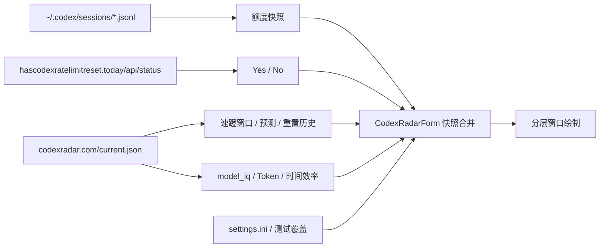

# Codex 监测窗口技术说明

## 1. 文档范围

本文以 `Core/CodexRadarForm.cs` 的当前实现为准，说明 Codex 监测窗口的数据来源、刷新调度、网站状态、额度读取、重置保护、IQ/效率计算、测试模式和分层窗口渲染机制。

相关源码：

| 文件 | 职责 |
| --- | --- |
| `Core/CodexRadarForm.cs` | Codex 窗口状态、调度、请求、数据合并和绘制 |
| `Core/WidgetForm.cs` | 创建窗口、分发设置、通知和生命周期控制 |
| `Settings/WidgetSettings.cs` | 性能模式、窗口参数、IQ/效率基线和测试状态 |
| `Settings/SettingsForm.cs` | Codex 设置页和测试入口 |
| `DesktopCodexAssistant.cs` | 程序入口、日志和进程级省电策略 |

通用性能模式与窗口机制见：

`Docs/Performance-And-Window-Runtime.md`

`WidgetForm` 当前实例化的是 `CodexRadarForm`。仓库中即使保留旧窗口类，也不能作为当前运行机制的依据。

## 2. 窗口组成

窗口分为左侧 Radar/IQ 区和右侧额度区。

左侧：

- 上环：Token 与时间综合效率
- 下环：IQ 通过率和相对基准
- 状态文字：效率状态、增智/正常/降智
- 速蹬状态：`None`、`Open`、`Closed`
- 状态时间：开启时显示持续时间，其他状态显示对应时间

右侧：

- 5 小时余额环
- 周余额环
- `Rader`、`Codex`、`Reseter` 三行服务状态
- 24/48 小时预测叠加环
- 重置状态 `Yes` / `No`



## 3. 主调度循环

`timer` 是轻量调度器，不代表每次触发都会读取全部数据或重绘。

每次 tick 的顺序：

1. 检查显示器、会话和电源挂起状态。
2. 处理网络可用性失效标记。
3. 判断额度是否到期。
4. 判断 Reset 和 current.json 请求是否到期。
5. 根据设置计算窗口尺寸。
6. 仅在尺寸变化或本地时钟秒发生变化时执行常规重绘。
7. 重新计算下一次 timer 间隔。

网站请求完成后会通过 `BeginInvoke` 立即提交一次绘制，不必等待下一秒。

主 timer 按性能模式对齐到固定时间边界：

| 模式 | 面板调度目标 |
| --- | ---: |
| 性能 `Smooth` | 500 ms |
| 均衡 `Balanced` | 1000 ms |
| 省电 `BatterySaver` | 3000 ms |

调度增加约 30 ms 偏移，避免刚好落在系统秒边界前而显示上一秒数据。网站业务周期不随面板刷新率缩短。

## 4. 暂停与恢复

以下任一条件成立时停止 Codex 轮询：

- 显示器关闭
- Windows 会话锁定
- 系统挂起

恢复后：

1. 清除暂停状态。
2. 使额度刷新立即到期。
3. 重新安排 Reset 和 current.json 的错峰启动时间。
4. 使渲染缓存失效。
5. 重新定位并绘制窗口。

首次启动或恢复时，网站请求不是同时发出：

| 数据源 | 首次计划 |
| --- | ---: |
| Reset | 约 1 秒后 |
| current.json | 约 4 秒后 |

该错峰用于减少启动瞬间的 DNS、TLS 和线程池峰值。

## 5. 额度读取

### 5.1 数据源优先级

额度按以下顺序读取：

1. `%USERPROFILE%\.codex\sessions` 中的 `rollout-*.jsonl`
2. `%LOCALAPPDATA%\DesktopCodexAssistant\quota.ini`
3. 无有效来源时使用默认快照并把 Codex 服务标记为不可用

JSONL 中读取 `event_msg -> token_count -> rate_limits`。`primary` 通常对应 5 小时窗口，`secondary` 通常对应周窗口；如果存在 `window_minutes`，以是否小于等于 300 分钟重新判断。

显示值为：

```text
remainingPercent = round(100 - usedPercent)
```

最终限制在 `0..100`。

### 5.2 活跃与非活跃调度

窗口周期检查名为 `codex` 的进程。进程检查和额度扫描使用不同周期：

| 项目 | 性能 | 均衡 | 省电 |
| --- | ---: | ---: | ---: |
| Codex 进程检查 | 3 s | 5 s | 10 s |
| Codex 活跃时额度刷新 | 10 s | 15 s | 30 s |
| Codex 非活跃时额度刷新 | 10 min | 20 min | 60 min |

由未运行切换为运行时会立即读取一次额度。到达本地 `resets_at` 也会立即触发保护和刷新。

### 5.3 文件扫描优化

额度读取包含三层限制：

1. 最多检查最近 80 个 rollout 文件。
2. 每个文件从尾部按 1 MiB 分块向前扫描，找到最新额度事件后停止。
3. 最新文件路径、写入时间和长度未变化时，直接返回内存快照克隆。

这种方式避免每 10 至 30 秒完整反序列化全部会话历史。缓存键必须同时包含路径、写入时间和长度；只比较文件名会漏掉当前文件追加内容。

## 6. 网站请求调度

| 数据源 | 正常周期 | 特殊周期 | 失败重试 |
| --- | ---: | ---: | ---: |
| Reset 状态 | 15 min | Radar 为 Open 时不请求 | 2 min |
| current.json | Closed/None 时 10 min | Open 时 5 min | 2 min |

每个远程端点都有独立的 `requestRunning` 标志。同一端点任意时刻最多运行一个请求，慢请求不会在 timer tick 中堆积。

请求使用：

- 10 秒连接和读写超时
- TLS 1.2
- `Cache-Control: no-store, no-cache`
- 查询参数时间戳，降低中间缓存返回旧 JSON 的概率

远程读取在 `Task.Run` 中执行。后台任务只更新锁保护的快照，WinForms 绘制通过 `BeginInvoke` 回到 UI 线程。

### 6.1 边界补刷

Radar JSON 给出新的 `opened_at` 或 `closed_at` 时，窗口会在事件时间后约 10 秒安排一次补刷。

用途：

- 网站在边界附近分阶段更新 JSON 时尽快取得最终状态。
- 不需要把常规 5/10 分钟周期永久缩短。
- 每个事件时间只安排一次，避免重复补刷。

## 7. 服务健康状态

三行服务状态含义：

| 状态 | 条件 | 显示 |
| --- | --- | --- |
| `Normal` | 请求成功且内容可解析 | 白字 |
| `Offline` | Windows 判断没有可用网络，或该元素当前不能正常发起请求 | 灰字和灰色小叉 |
| `Unavailable` | 已连接服务，但 HTTP/内容不受支持或无法解析 | 白字和黄色小叉 |
| `Unreachable` | DNS、连接、TLS、超时等请求失败 | 白字和红色小叉 |
| `Unknown` | 首次启动、网络恢复或等待结果 | 白字 |

`NetworkChange` 回调只设置失效标记，不在系统事件线程执行网络检查。下一次 UI 调度统一更新三个服务状态。

`Codex` 行表示本地额度来源是否可读，不是 codexradar.com 的在线状态。

## 8. Radar 状态与预测

### 8.1 状态归一化

远程状态会归一化为：

| 输出 | 接受的远程值 |
| --- | --- |
| `Open` | `open`、`opened`、`active`、`running` |
| `Closed` | `closed`、`close`、`completed` |
| `None` | `none`、`no`、`inactive`、`wait` 或未知 |

`Open` 颜色在两种金黄色之间随每次渲染切换。`Closed` 为红色，`None` 为灰色。

### 8.2 预测环

预测读取：

- `prediction.level`
- `prediction.probability_24h`
- `prediction.probability_48h`

中心只显示 `高`、`中`、`低` 或 `-`。概率环以 50 为满环：

```text
progress = clamp(probability, 0, 50) / 50
```

48 小时环先绘制为品红色，24 小时环后绘制并覆盖在上层。24 小时概率小于 50 时为浅红色，大于等于 50 时为警告黄色。

## 9. IQ 与效率

### 9.1 IQ 环

默认任务总数为 12，默认正常基准为 8，基准可以在设置中修改。

- 圆心：网站 `pass_rate` 的整数百分比，不显示 `%`
- 通过数低于基准：红色从 12 点方向逆时针覆盖不足部分
- 通过数等于基准：绿色基线
- 通过数高于基准：金色从 12 点方向顺时针覆盖超出部分
- 右侧文字：`降智`、`正常`、`增智`

如果网站只给通过率，会根据有效任务数四舍五入推导通过数。

### 9.2 Token 与时间效率

`current.json` 的 `model_iq` 字段提供当前记录和历史基准时：

```text
tokenRate = passed / totalTokens
timeRate  = passed / serialSeconds

tokenEfficiency = currentTokenRate / baselineTokenRate * 100
timeEfficiency  = currentTimeRate  / baselineTimeRate  * 100
```

设置中的四个基线值非零时，会用用户基线覆盖网站历史基线：

- Token 基线通过数
- Token 基线 Token 数
- 时间基线通过数
- 时间基线秒数

效率限制在 `0..200`。综合效率使用几何平均：

```text
composite = round(sqrt(tokenEfficiency * timeEfficiency))
```

几何平均能避免一个极高值完全掩盖另一个极低值。

### 9.3 效率半环

全环基底为淡绿色，100 表示不绘制额外偏差。

| 半环 | 低于 100 | 高于 100 |
| --- | --- | --- |
| 左侧 Token | 从 6 点顺时针绘制红色 | 从 12 点逆时针绘制金色 |
| 右侧时间 | 从 6 点逆时针绘制紫色 | 从 12 点顺时针绘制黄色 |

偏差达到 100 个百分点时占满对应半环。

### 9.4 效率状态

Token 和时间分别有可配置低效阈值，默认 80。

- 任一低于自己的阈值：`低效`
- 两项均在阈值以上且不高于 100：`普通`
- 任一高于 100，且不存在一低一高：`高效`
- 一项低于 100、另一项高于 100：按综合效率显示 `较低`、`普通` 或 `较高`

两项同时低效时，颜色取数值更低的一项；两项同时高效时，颜色取数值更高的一项。

### 9.5 数据新鲜度

只要 `model_iq` 提供了记录日期，就在效率状态和 IQ 状态之间显示新鲜度单词：

| 单词 | 条件 |
| --- | --- |
| `Updated` | 网站记录日期大于等于本地当天 |
| `Unupdated` | 今天已成功请求，但网站最新记录仍早于今天 |
| `Outdated` | 网站记录早于今天，且今天尚未成功刷新 |

`RefreshedAt` 表示本程序成功取得数据的时间，`DataDate` 表示网站记录本身的日期，两者不能混用。

## 10. 重置检测与防重复

### 10.1 额外重置

Radar 的 `last_window.closed_at` 用作重置事件时间，`last_window.id` 用作辅助标识。

首次读到历史时只建立基线，不触发通知。之后只有 `closed_at` 严格变新才判定为新增重置：

1. 5 小时和周额度立即显示 100。
2. 两个额度环显示金色保护状态。
3. 发送 Windows 通知。
4. Reset 状态在 5 分钟内推断为 `Yes`。
5. 使本地额度读取立即到期。

相同时间仅 ID 变化时只更新持久化标识，不重复触发重置。

### 10.2 本地到期保护

本地额度中的 `resets_at` 到达时也会把对应余额暂时固定为 100，但不会使用额外重置的金色标记。

保护不会因为旧 JSONL 被再次扫描而立即回退。只有同时满足以下条件才释放：

- 新额度样本的 `SourceUpdatedUtc` 晚于保护建立时间。
- 新样本的 reset 时间未知，或已经指向未来。

这保证“到点先恢复到 100”和“新样本到达后恢复真实余额”能够共存。

### 10.3 持久化

去重和保护状态保存到：

```text
%LOCALAPPDATA%\DesktopCodexAssistant\quota-reset-state.ini
```

主要字段：

- 最后重置事件 ID 和关闭时间
- 最后开启事件 ID 和开启时间
- 5 小时与周额度保护建立时间
- 两个额度环是否使用金色

程序重启后继续使用这些字段，避免对同一历史事件重复通知。

## 11. 快照合并

Radar 与 Model IQ 使用同一个 `CodexRadarSnapshot`，并来自同一个 `current.json` 响应。

- `current.json` 解析成功时同时填充速蹬、预测、重置历史和 `model_iq`。
- 如果某次 `current.json` 暂时缺少 `model_iq`，会保留旧快照中的 IQ 字段。
- 请求失败时保留上次成功数据，只更新服务健康状态和重试时间。
- UI 绘制前克隆快照，再应用设置基线和测试覆盖。

该顺序避免慢请求、失败请求或测试状态污染真实缓存。

## 12. 测试模式

设置页包含：

| 测试 | 范围 |
| --- | --- |
| Radar 状态 | 实时、None、Open、Closed |
| 网站检测 | 实时、正常、断网、服务不可用、无法连接 |
| IQ 通过数 | 0..12 |
| IQ 正常基准 | 0..12 |
| Token/时间效率 | 0..200 |
| 额外重置通知 | Windows 通知和 15 秒金色环 |
| Radar 开启通知 | Windows 通知 |

测试覆盖只作用于显示快照或服务状态，不应写回网站真实快照。退出服务测试后，current.json 和 Reset 会分别在约 4 秒和 1 秒后重新检测。

## 13. 绘制和交互优化

窗口使用 `WS_EX_LAYERED` 和 `UpdateLayeredWindow`。

- 尺寸不变时复用 `renderBitmap` 和 `renderGraphics`。
- 内容绘制和整体 Alpha 提交分开。
- 悬停透明度动画只提交已有位图，不重新解析 JSON 或扫描额度文件。
- 动画进行中使用高频 interval，静止后切回低频交互轮询。
- 全屏隐藏时停止不必要的 hover timer。
- 普通 timer tick 最多每秒因时钟变化重绘一次；网站完成和设置变化可以立即重绘。

## 14. 线程和锁

| 锁 | 保护内容 |
| --- | --- |
| `codexResetStatusLock` | Reset 请求标志、结果和下次刷新时间 |
| `codexRadarStatusLock` | Radar/IQ 快照、两个请求标志和边界补刷 |
| `quotaResetStateLock` | 重置去重、额度保护和金色状态 |
| `serviceHealthLock` | 网络可用性和三项服务健康状态 |
| `codexQuotaSnapshotCacheLock` | 静态额度文件缓存 |

维护时必须保持以下约束：

1. 后台线程不得直接调用 GDI+ 或修改窗口控件。
2. 锁内不得执行 HTTP、文件扫描或通知回调。
3. 每个远程数据源必须保留单飞标志。
4. 请求失败不得清空最后一次成功业务数据。
5. 测试覆盖必须应用于克隆，不能写入真实快照。

## 15. 已完成的性能优化

截至 2026-06-07，Codex 窗口已实现：

- UI 调度与网站业务周期分离
- 启动和恢复时网站请求错峰
- 按 Codex 进程状态调整额度读取频率
- rollout 文件尾部扫描和快照缓存
- 网站请求单飞和失败退避
- 网络断开时停止真实网站请求
- Radar Open 状态采用较短周期
- 事件边界只补刷一次
- IQ 从 `current.json.model_iq` 内联解析，不再请求下线的 `model-iq.json`
- 请求失败保留最后成功数据
- 本地到期和额外重置的持久化保护
- 分层窗口位图复用
- hover 动画与静止轮询分频
- 显示器关闭、锁屏和挂起时暂停轮询

## 16. 维护规则

1. 网站业务周期不要直接绑定 UI timer interval。
2. 新增网站数据源时同时增加单飞、超时、重试和服务健康状态。
3. 新增快照字段时明确是否来自 `current.json` 根字段或 `model_iq` 字段，避免合并时互相覆盖。
4. 修改重置判断时必须保留首次基线和持久化去重。
5. 修改额度保护时必须验证旧样本不会把 100 立即覆盖回去。
6. 文件缓存失效条件必须覆盖文件追加写入。
7. 远程日期和本地请求时间必须分别保存。
8. 高频 tick 中不得递归扫描全部文件内容或同步执行 HTTP。
9. 测试模式不得触发额外真实请求或写入真实快照。
10. 改动布局后需要验证最小宽度下额度环、服务状态和 `Yes/No` 不重叠。

## 17. 构建与验证

构建：

```powershell
powershell -NoProfile -ExecutionPolicy Bypass -File .\Build-Arm64.ps1
```

建议回归：

1. 性能、均衡、省电切换后 timer 和额度周期正确。
2. Codex 进程启动后额度立即刷新，退出后切换到低频。
3. 连续 timer tick 不会启动重复网站请求。
4. 断网后三项服务变灰，恢复后按错峰时间重新检测。
5. Radar 从 Open 结束后 Reset 暂时显示 Yes。
6. 新增重置只通知一次，重启程序后不重复通知。
7. 到达 `resets_at` 后余额先显示 100，新样本到达后解除保护。
8. `current.json` 暂时缺少 `model_iq` 时保留旧 IQ 和效率数据。
9. `Updated`、`Unupdated`、`Outdated` 三种日期条件正确。
10. 各测试模式退出后恢复实时数据。
11. 长时间运行时 GDI 对象、线程和句柄数不持续增长。
12. `%LOCALAPPDATA%\DesktopCodexAssistant\error.log` 没有新增异常。
