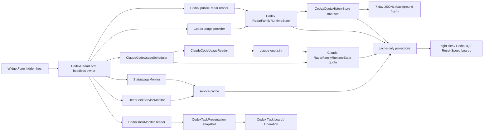

# Codex / Claude Radar 数据所有者架构

适用版本：2.0.0.32

本文说明 `CodexRadarForm` 作为永久 headless owner 时的 Codex 公共 Radar、Codex/Claude 官方额度、服务健康、任务状态和只读投影。

## 1. 当前职责

`CodexRadarForm` 的类名为兼容保留；它是数据所有者，不是可见 Radar 窗口。Codex family 维护公共 Radar 模型数据与个人额度，Claude family 只维护官方 Claude Code 额度与相关服务状态。两枚右侧额度方块始终从各自 family 的缓存构建，不依赖当前选中的 family。

相关源码：

| 文件 | 职责 |
| --- | --- |
| `Core/CodexRadarForm.cs` | headless 生命周期、统一调度、Codex 公共 Radar、额度与任务状态 |
| `Core/CodexRadarForm.RuntimeState.cs` | `RadarFamilyRuntimeState`、双额度趋势与 family 隔离 |
| `Core/CodexRadarForm.ProjectionState.cs` | 同代 published state 原子替换与 tile/IQ 投影 clone |
| `Core/CodexRadarForm.ClaudeUsage.cs` | 官方 Claude Code usage 调度结果接入 |
| `Core/CodexRadarForm.TileSnapshot.cs` | tile、Codex IQ board、重置与速蹬 board、服务健康的 cache-only 投影 |
| `Core/CodexQuotaHistoryStore.cs` | 已接受 Codex 额度的 7 天无凭据历史、重置分类与后台批量 JSONL 持久化 |
| `Core/ResetSpeedBoardSnapshot.cs` / `Core/ResetSpeedBoardForm*.cs` | 第六左侧 board 的只读 DTO、停靠生命周期与固定尺寸绘制 |
| `Core/OwnerOperationGeneration.cs` | Start/Stop/挂起恢复 generation、取消与迟到提交边界 |
| `Core/BoundedHttpTextReader.cs` / `Core/CodexRadarUrlPolicy.cs` | 有界 HTTP 文本读取与 Radar 精确 URL/SSRF 策略 |
| `Core/ClaudeCodeUsageReader.cs` / `Core/ClaudeCodeUsageScheduler.cs` | Claude 官方额度读取、单飞调度与缓存提交 |
| `Core/DeepSeekServiceMonitor.cs` | 无凭据 DeepSeek 服务可达性探测 |
| `Core/DeepSeekBalanceMonitor.cs` | 可选凭据的官方余额读取、48 小时本地趋势与只读快照 |
| `Core/StatuspageMonitor.cs` | OpenAI/Anthropic 官方状态单飞监控 |
| `Core/CodexTaskMonitorReader.cs` / `Core/CodexTaskPresentation.cs` | Codex 会话增量读取和共享任务快照 |
| `Core/WidgetForm.TileColumn.cs` | 把两个 family 的额度快照写入同一 `MetricTileFeed` |

可见消费者：

| 消费者 | owner API | 内容 |
| --- | --- | --- |
| 右侧 Codex tile / expand | `BuildRadarTileSnapshot(Codex)` | Codex 模型、额度、重置与 5 小时/周趋势预测 |
| 右侧 CLD tile / expand | `BuildRadarTileSnapshot(Claude)` | 固定 Claude/CLD 标签、官方额度、重置与同构趋势预测 |
| 左侧 Codex IQ board | `BuildCodexIqBoardSnapshot()` / `BuildServiceHealth()` | Codex 全模型 IQ、成本、耗时、token、额度趋势、名册与四项服务健康 |
| 左侧重置与速蹬 board | `BuildResetSpeedBoardSnapshot()` | 7 天周额度余量、重置事件、速蹬窗口、重置卡余量、最近到期，以及 Radar 的发重置卡/硬重置判断 |
| Codex Task board / Operation | `CodexTaskPresentation.SnapshotProvider` | 本地 Codex 会话任务状态 |

Claude tile 不生成模型 IQ 或效率；其 `IqKnown`、`EfficiencyKnown` 恒为 `false`，且没有社区评分字段。

## 2. 总体数据流



网络、磁盘和 provider 工作只在 owner 的既有调度链执行。绘制表面只读取投影，不建立 reader、timer、watcher 或请求。

## 3. Headless 生命周期

`WidgetForm.EnsureCodexRadarWindow()` 构造 owner，并显式调用 `StartHeadlessDataOwner()`：

- 创建隐藏 HWND，供显示电源通知和 `BeginInvoke` 回调使用。
- 应用运行时设置后启动 backend scheduler。
- 不调用 `Show()`，也不执行定位、hover、透明度、burn-in、Z-order 或 layered bitmap 工作。
- `StartHeadlessDataOwner()` / 恢复建立新 generation；所有 Radar、额度、reset credits、Statuspage 与 DeepSeek completion 都捕获对应 lease。
- `StopHeadlessDataOwner()`、挂起和 Dispose 取消当前 generation；迟到结果不得写状态、缓存、业务日志、通知或 UI 回调。

owner 生命周期不受 tile 是否显示影响。全屏隐藏只处理可见表面；显示器关闭、会话锁定或系统挂起时，远程轮询按 `Docs/Component-Refresh-Rules.md` 暂停，恢复后错峰续跑。

## 4. Family 状态隔离

Codex family 保存公共 Radar 模型快照、模型目录、额度、服务状态和各自 deadline。Claude family 只保存官方额度快照、额度来源、reset anchor、消耗基线、趋势样本和服务状态，不保存公共 Radar 模型、IQ 或评分目录。两侧的 5 小时与周额度分别拥有活跃时间样本、近时钟样本和 reset identity；任一 family 或额度窗口都不能复用另一侧的速率。

请求开始时捕获 family，完成时只写回对应状态。当前 active family 在请求期间改变时，结果仍可更新原 family 缓存，但不能覆盖另一 family。`BuildRadarTileSnapshot(Codex)` 与 `BuildRadarTileSnapshot(Claude)` 在同一个 feed 构建周期分别读取对应状态，所以两枚额度方块可同时稳定显示。

## 5. 软件 Family 选择

`CodexRadarSoftwareMode` 支持固定 Codex、固定 Claude 和 Auto。Auto 复用 `SoftwareRuntimePresence`：

1. 固定模式、两者都未运行或只有一者运行时，不查询前台窗口。
2. 两者都运行时才使用包路径、专用进程名、产品元数据和受限标题 fallback 识别前台软件。
3. 无法识别或命中本程序时，保持上一次有效 family。

family 选择只影响 provider 调度优先级和相关服务语义，不决定 Codex/CLD tile 是否存在，也不为 Claude 选择模型。

## 6. Codex 公共 Radar 与模型目录

只有 Codex family 读取公共 Radar 数据与模型目录。`current.json` schema 2 是模型 IQ 和数据时间的权威来源；内容签名未变化时保留 source timestamp，fetch timestamp 不能伪造新批次。首页 HTML 只允许补结构化数据缺少的速蹬窗口，以及首页“重置雷达”区成对发布的“发重置卡/硬重置”状态、短结论和更新时间；`ApplyCodexRadarHtmlResetJudgement()` 优先按 `data-reset-track` 定位两条判断、读取 `reset-judgement-state` 状态、`strong` 短结论及 `data-reset-radar-updated-at` ISO 时间，同时兼容旧版“状态 · 结论”和标题时间。这些字段有界解析、缓存并保留 last-good，不能回填模型评分、额度雷达或覆盖 JSON。首页 IQ 改为动态装载时，服务探测明确报告静态模型标记不存在，IQ 与目录仍以 `current.json` 为准；完整目录才能推进模型缺失计数，部分损坏数据只能补充已见模型，不能证明其它模型消失。

分布式 Radar 的 `comparisons` 键可能附加 `_distributed` 等来源后缀。适配器先尝试精确键，再根据节点自身的 model 与 reasoning effort 生成稳定模型键；只有唯一匹配才接受，重复歧义时 fail closed。看板的 `Current` 标记跟随用户选择的稳定模型键，而不是固定跟随 `latest` 根节点。上游 `recent_days` ISO 时间戳按秒保留并以本地 ISO 秒精度写入缓存，旧版 `yyyy-MM-dd-am/pm` 历史仍可读取；来源任务数使用 10000 的防御上限，不再受手动校验设置的 100 条上限截断。

Codex 的模型选择、IQ、评分、效率、通知状态与 `Codex IQ` board 均留在 Codex 侧。Claude family 不参与公共 Radar 请求、模型目录、模型自动切换或数据周期判定。刷新周期与重试规则只在 `Docs/Component-Refresh-Rules.md` 维护。

## 7. 额度数据与身份保护

### 7.1 Selected-provider gate

个人额度只为当前有效且对应本地程序正在运行的 family 排队：

- Codex：ChatGPT backend usage 与本地 session fallback。
- Claude：`ClaudeCodeUsageScheduler` 的官方 usage/statusline 链。
- 两者都未运行时保留最近快照，不同时 prime 两套 provider。

启动、恢复、网络变化、手动刷新或 family 切换只让适用 provider 到期。可见消费者始终只读已提交的 last-good 快照。

大陆出口保护在冷启动/换网未知期会 fail-closed，因此敏感端点可能先得到 `AI_BLOCK`。`WidgetForm` 确认出口为境外后调用 `CodexRadarForm.RequestSensitiveAiRefreshAfterEgressAuthorization()`，仅把适用 Codex/Claude 额度、reset credits 与 OpenAI/Anthropic Statuspage 调度置为到期；公共 Radar、DeepSeek 与其它网络探测不受该边沿影响。

### 7.2 Codex 额度

Codex provider 只读已配置的环境变量或 Codex `auth.json` 凭据，不写回。5 小时与周额度分别维护 reset anchor、余额、来源和消耗基线。只有通过窗口身份、漂移容差与异常跃迁保护的结果才提交到缓存。

`quota-decision-history.jsonl` 只记录额度判定所需摘要，不记录 token、提示词、响应正文或授权 header。另有 `codex-quota-seven-day-history.jsonl` 只保存通过保护链的时间、5 小时/周余量、reset anchor、重置卡计数与重置类型；同样不保存凭据、token、请求正文或身份信息。

### 7.3 Claude 额度

Claude Code 用量由进程级 `ClaudeCodeUsageScheduler` 单飞读取，结果一次提交到 Claude family，并由 `ClaudeCodeUsageReader` 原子写入 `claude-quota.ini`。只有同时包含 5 小时/周额度、两组 reset、可信更新时间且满足新鲜度规则的完整快照才会发布、落盘或在启动时恢复；部分结果保留 last-good。

CLD tile 的固定模型标签为 `Claude`，紧凑标题为 `CLD`；额度与两个 reset 只来自官方 usage/statusline 链。详细边界见 `Docs/Codex-ClaudeRadar-Architecture.md`。

### 7.4 双窗口趋势与续航

`CodexRadarForm.ApplyQuotaSnapshot()` 只把通过既有 identity、漂移和异常跃迁保护的已接受快照交给 `RecordQuotaBurnSamples()`。每个 family 的 5 小时与周额度分别维护两条进程内历史：活跃时间轴用于回答“保持当前使用强度还能用多久”，近时钟时间轴用于在活跃样本不足时给出节奏估算。软件未运行、长时间 owner tick 间断或新活跃会话会重建活跃历史，但不会把这段时间计入活跃速率；reset identity 改变或余额上升只清除对应额度窗口的两条历史。

`TryComputeQuotaBurnRate()` 对最近 1.5 个活跃小时的 5 小时额度、最近 6 个活跃小时的周额度，以及各自最近 5/24 个时钟小时进行估算。至少需要 10 个活跃分钟或 30 个时钟分钟，并且整数百分比来源必须出现至少 1% 的已接受下降；端点速率与 pairwise 中位速率组合以减轻单次整数跳变。样本跨度、下降幅度和点数共同形成低/中/高置信度。

`BuildRadarTileSnapshot()` 只从同代 published projection 计算展示 DTO：优先发布活跃时间续航，活跃样本不足时才以近 24 小时节奏作为周额度主结论。`MetricTileExpandForm.DrawRadarQuota()` 将续航与 reset 距离比较，明确显示“预计多久用完并早于重置多久”或“可撑到重置并多余多久”；5 小时窗口在底部独立给出相同判断。周趋势实线只占图表前 68%，剩余区域用于虚线预测、耗尽交点和 reset 线。计算和绘制都不启动 provider、网络或磁盘读取，进程重启后重新积累样本。

### 7.5 Codex 7 天重置与速蹬历史

`CodexQuotaHistoryStore` 仅接收 `ApplyQuotaSnapshot()` 已接受且允许记录 decision 的 Codex family 快照。内存立即更新，磁盘由 15 秒 ThreadPool timer 批量写入；普通样本至少间隔 15 分钟，或周余量变化达到 3%，周余量回升达到 5% 时立即登记。旧 reset anchor 前 15 分钟至后 6 小时内的回升标记为自然重置；重置卡计数同时减少时标记为重置卡；其余标记为硬重置。每 6 小时和 owner 退出时原子裁剪到最近 7 天、最多 2048 行。

`BuildResetSpeedBoardSnapshot()` 从同代 Codex published projection、reset-credit 缓存和 store 内存生成 7 个日点、最近事件及缓存的 Radar 重置判断。`ResetSpeedBoardForm` 每 5 秒 clone 一次；绘制路径和 snapshot 构建都不读取磁盘、凭据或网络。该持久历史与 Radar 判断只服务 Codex board，不改变 Claude family 的官方额度趋势和右侧续航计算。

## 8. 服务健康

owner 复用进程级 `StatuspageMonitor` 与 `DeepSeekServiceMonitor`，向 Codex IQ board 发布四项健康状态；Network Dock 不再持有这组重复 LED：

| 标识 | 含义 |
| --- | --- |
| `R` | Codex 公共 Radar 数据源 |
| `O` | OpenAI 官方状态 |
| `C` | Anthropic 官方状态与 Claude usage |
| `D` | DeepSeek 服务可达性 |

这里的 DeepSeek 健康项不读取凭据，只输出 `known`、`available`、错误码与检查时间。HTTP 鉴权或请求格式响应可证明网关可达；无响应、拒绝或服务端故障按服务异常语义分类。

账户余额是独立的 `DeepSeekBalanceMonitor`：只有用户配置 API Key 后才访问官方 `/user/balance`，并把当前余额、24 小时本地消耗、预计可用时间和最多 96 个绘图点作为 clone 快照交给右侧 `DS` tile/expand。Key 使用 CurrentUser DPAPI envelope，余额历史不包含 key、Authorization header 或响应正文；服务健康失败与账户鉴权失败不得互相改色或覆盖。

服务错误经过 `ServiceAlertDebouncer`；检测中立即发布，新错误稳定后发布，恢复立即清除。`BuildServiceHealth()` 只复制已有状态，不触发探测。具体调度与手动刷新语义见 `Docs/Component-Refresh-Rules.md`。

## 9. Codex Task 后端

owner 注册 `CodexTaskPresentation.SnapshotProvider`，并在既有 scheduler 中请求轻量任务刷新：

- `%USERPROFILE%\.codex\sessions` 只维护一套递归 watcher。
- watcher 事件用于逐文件增量尾读，低频完整对账兜底漏报。
- reader 不创建独立 timer；presentation 层把缓存映射为颜色、环、徽标和行模型。
- 展示不输出提示词、回复或完整会话路径。

owner 停止时清除 provider，避免消费者调用已销毁实例。

## 10. 左侧 Radar Boards 投影

`BuildCodexIqBoardSnapshot()` 只复制 Codex family 的全模型数据、选中模型历史、额度趋势、名册和服务健康。`CodexIqBoardForm` 不访问网站、不读取公共 Radar 文件，也不建立 reader。

IQ board 的 tab、展开/收起和渲染属于左侧停靠运行时，不改变 owner 的业务周期。

`BuildResetSpeedBoardSnapshot()` 同样只复制 Codex published quota/Radar、reset-credit 缓存和已载入的 7 天历史。`ResetSpeedBoardForm` 与 Spec Board 保持相同逻辑尺寸；底部“近期重置”缩为左半区并最多列两条事件，右半区“重置概率”显示 Radar 日期及“发重置卡/硬重置”的状态和短结论。状态宽度由实际等宽字体测量，短结论独占下一行完整宽度，使“本轮是硬重置”“官方重置窗口”等结论不被固定 70 像素状态槽截断。黄色角色边框、绿色额度轨迹、青色速蹬圆环、重置类型与判断色只承担展示语义。

Codex IQ 与重置/速蹬 board 的底部操作轨都提供绿色“刷新”和红色“关闭”。刷新只重新克隆已发布快照并重绘，不触发 owner 调度周期、网络访问或持久化读取；顶部不再绘制第二个关闭入口。

三块 Codex 派生 board 使用各自空间约束下的可读性字号层级。Codex Task 卡片标题/行/副行/底栏为 `S(11.5)/S(9.6)/S(8.2)/S(8.4)`，token 与时间轴标签为 `S(7.4)`；Codex IQ 标题 `S(13)`、正文 `S(9)`、强调正文 `S(9.6)`、辅助文字 `S(8)`、等宽数值 `S(9)`、leader 数值 `S(20)`，迷你趋势的 `100` 标签下限为 7 像素；重置与速蹬标题 `S(13)`、段头 `S(9.2)`、正文 `S(8.5)`、辅助文字 `S(7.8)`、等宽数值 `S(8.8)`、表盘主数值 `S(20)`。布局仍以实测文字尺寸、卡片可用宽度和省略规则为边界，不因放大字号改变快照或调度语义。

## 11. Cache-only 展示边界

以下方法必须保持纯缓存读取：

- `BuildRadarTileSnapshot(CodexRadarSoftwareMode)`
- `BuildCodexIqBoardSnapshot()`
- `BuildResetSpeedBoardSnapshot()`
- `BuildServiceHealth()`
- `CodexTaskPresentation.SnapshotProvider`

它们从一次原子发布的 `RadarPublishedProjectionState` clone 后再格式化和映射，不得跨锁读取可变 owner 字段，也不得发起 HTTP/provider 请求、读取凭据或磁盘缓存、修改 deadline、触发模型切换，或修改 reader-owned state。模型目录只在 owner 启动、成功刷新或显式 cache reload 时载入内存；5 秒 IQ 投影不轮询磁盘。

## 12. 设置边界

设置页保留 Codex 公共数据、family 选择、Codex 模型/周期、个人额度、服务探测、Claude setup-token、DeepSeek API Key 与测试配置。Claude 不提供公共数据源、社区评分、模型选择或本地公共额度 fallback；DeepSeek Key 只进入独立 DPAPI 文件，不进入 `settings.ini`、日志或快照。

全局布局编辑器登记 `MetricTile.CodexQuota`、`MetricTile.ClaudeQuota`、`MetricTile.DeepSeekQuota` 以及左侧 `CodexIq`、`ResetSpeed`、`SystemDay` tabs；headless owner 不在 19 个布局项中。

## 13. 故障、安全与验证

- 网络失败保留对应数据源的 last-good snapshot，并按失败策略重试。
- 迟到请求只写回捕获的 family；owner 已停止时丢弃。
- 凭据、Cookie、setup-token、Authorization header、完整响应和用户会话正文不得进入日志；身份变化诊断只记录规范化元数据，不写 provider raw body。
- 所有活动 HTTP 文本路径使用 `BoundedHttpTextReader` 的大小、总时限、取消、解压和严格 UTF-8 边界；Radar 可配置 URL 必须通过 `CodexRadarUrlPolicy` 的精确 HTTPS endpoint 与 DNS 私网拒绝。
- 随机测试状态不能写真实额度缓存、模型目录或历史。
- snapshot 构建异常降级为空/旧快照，不能阻塞 Widget UI tick。

建议验证：

```powershell
powershell -NoProfile -ExecutionPolicy Bypass -File .\Build-Arm64.ps1 -OutputPath .\_build\DesktopCodexAssistant-arm64-test.exe -Platform arm64
.\_build\DesktopCodexAssistant-arm64-test.exe --test
.\_build\DesktopCodexAssistant-arm64-test.exe --test-layout
.\_build\DesktopCodexAssistant-arm64-test.exe --test-settings-bindings
.\_build\DesktopCodexAssistant-arm64-test.exe --test-radar-display-lifecycle --iterations 20
.\_build\DesktopCodexAssistant-arm64-test.exe --render-tilecolumn --out .\_build\tilecolumn
.\_build\DesktopCodexAssistant-arm64-test.exe --render-resetspeedboard --out .\_build\reset-speed
```

验收重点是：owner 始终隐藏、Start/Stop 完整、两套额度与四条趋势历史按 family/window 隔离、重置与速蹬投影无同步 I/O、Codex/CLD 展开窗给出 5 小时和周额度的耗尽/重置判断、Codex 第六 board 提供 7 天历史/重置/速蹬/重置卡及两条 Radar 重置判断、CLD 仍只使用官方额度源、DeepSeek 服务健康与账户余额严格分离、Key 只以 DPAPI 密文落盘，以及 11 tile / 7 dock 布局完整。
