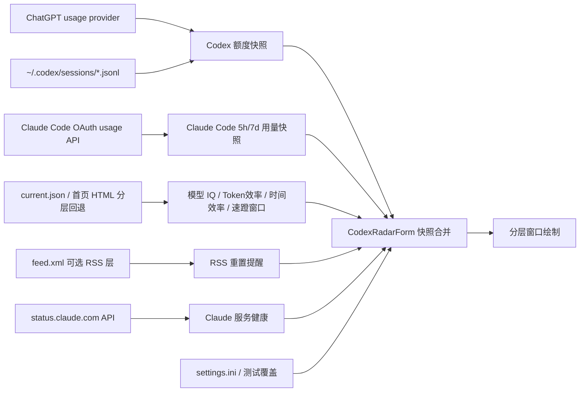

# Codex 监测窗口技术说明

适用版本：1.0.4.29

## 1. 范围

本文以 `Core/CodexRadarForm.cs` 的当前实现为准，说明 Codex 监测窗口的数据来源、刷新调度、服务健康状态、额度读取、Model IQ/效率计算、测试模式和分层窗口渲染机制。

已废弃并从当前运行路径删除的功能（历史实现见 git 历史与 CHANGELOG）：

- 24/48 小时重置概率预测环
- hascodexratelimitreset.today 重置状态网站检测

## 2. 当前窗口组成

左侧 Codex 监测区：

- 上环：时间效率
- 下环：Token 效率
- 底部元信息：当前 `EvenRow` 布局在左下方显示 `RC:xxx`、`DS:...`、`LLM:...` 和软件族品牌文本 `Codex` / `Claude`
- 右侧状态：Model IQ 时钟圆盘和 `R/O/C/D` 服务 LED 列。时钟圆盘显示网页数据标签和可配置时间；LED 分别表示 Radar、OpenAI/额度、Claude、DeepSeek（配置 API key 后显示）的服务状态。

右侧额度区：

- 5 小时余额环
- 周余额环
- 速蹬窗口开启且结束时间未过期时，额度重置文字在金色 `速蹬！`、原白色正常额度重置时间/日期、黄色额外重置目标时间/日期之间轮播；额外目标来自网站 `closed_at` 或首页 `data-window-closes-at`，5 小时行显示时间、周行显示日期；`closed_at` 早于当前本地时间时本地快照强制视为已关闭；RSS 重置保护态右侧显示金色 `已重置`；额度环内数字有已知数值且 Codex/Claude 任一受支持本地软件运行时为白色，两者都未运行或数值未知时为灰色
- 中间健康/额度雷达块：额度雷达线移动到 IQ 模块左侧，取代原灰色分割竖线；当前 `EvenRow` 状态格显示 API 状态摘要、网页数据标签和更新时间，左下方显示 `RC/DS/LLM/软件族品牌` 元信息
- 右侧 IQ 环和 `增智`、`常态`、`降智` 状态字样



## 3. 主调度循环

`timer` 是轻量调度器，不代表每次触发都会读取全部数据。

每次 tick 的顺序：

1. 检查显示器、会话和电源挂起状态。
2. 处理网络可用性失效标记。
3. 判断本地额度是否到期。
4. 判断北京时间日界线驱动的 Radar、Claude 健康检查、Claude Code 用量检查和 DeepSeek 余额检查是否到期；旧五阶段连接诊断已删除，不参与调度。
5. 根据设置计算窗口尺寸和防烧屏微位移。
6. 仅在尺寸、位置或本地秒变化时执行常规重绘。
7. 重新计算下一次 timer 间隔。

网站请求完成后会通过 `BeginInvoke` 立即提交一次绘制，不必等待下一秒。面板调度目标使用全局"普通面板调度"三档间隔（数值以 `Docs/Component-Refresh-Rules.md` §2 为唯一权威表）；网站业务周期不随 UI timer 缩短。

## 4. 暂停与恢复

以下任一条件成立时停止 Codex 轮询：

- 显示器关闭
- Windows 会话锁定
- 系统挂起

恢复后：

1. 清除暂停状态。
2. 使额度刷新立即到期。
3. 重新安排 Claude 状态、Codex/Claude 用量和 `current.json` 的错峰启动时间。
4. 按需安排 DeepSeek 余额检查。
5. 使渲染缓存失效。
6. 重新定位并绘制窗口。

首次启动或恢复时远程请求错峰：

| 数据源 | 首次计划 |
| --- | ---: |
| ChatGPT usage | 约 1 秒后 |
| Claude | 约 1 秒后 |
| current.json | 约 4 秒后 |

## 5. 额度读取

`CODEX` 模式额度按以下顺序读取：

1. `%USERPROFILE%\.codex\auth.json` 中的 access token 调用 `https://chatgpt.com/backend-api/wham/usage`，读取 `rate_limit.primary_window` / `secondary_window`。
2. provider 快照缺失、过期、未登录、请求失败或解析失败时，回退到 `%USERPROFILE%\.codex\sessions` 中的 `rollout-*.jsonl`。
3. session 回退也失败时读取 `%LOCALAPPDATA%\DesktopCodexAssistant\quota.ini`。
4. 无有效来源时使用默认快照，并把 `ChatGPT` 服务标记为不可用。

`CodexRadarSoftwareMode` 控制额度来源、窗口软件族内描边和底部软件族品牌文本；额度环数字颜色由共享运行态快照决定，不再表达软件族：

- `Auto`：先读取 `SoftwareRuntimePresence` 的 Codex/Claude 进程快照。两者都未运行时保持上一次有效软件并跳过前台检测；只有一者运行时直接选择该软件；只有两者都运行时才按前台窗口标题/进程名识别 `codex` 或 `claude`，忽略本程序自身窗口；无法识别时保持上一次有效软件，初始回退到 `CODEX`。
- `Codex`：优先使用 ChatGPT usage provider API；旧本地 Codex session 日志和 `quota.ini` 作为 fallback。额度数字灰显由共享 Codex/Claude 运行态决定：只有两者都未运行或无数值时灰显，任一受支持程序运行且有数值时保持白色；保留 RSS 重置保护、速蹬窗口提示和消耗环逻辑；窗口绘制 3 px 深蓝色内描边，底部显示蓝色斜体 `Codex`。
- `Claude`：通过 `ClaudeCodeUsageScheduler` 与独立 Claude Radar 共用一次 Claude Code usage 刷新，默认读取本地 statusline quota cache，显式配置 setup-token 时才可能触达 Claude OAuth usage fallback；成功快照会写入独立的 `%LOCALAPPDATA%\DesktopCodexAssistant\claude-quota.ini`，并复用与 CODEX 相同的额度应用、消耗环判定、重置保护和 `quota-decision-history.jsonl` 日志路径，避免两个软件共用同一个 `quota.ini` 串扰；窗口绘制 3 px 橙色内描边，底部显示橙色粗体 `Claude`。

ChatGPT usage provider 读取 `used_percent` / `used_percentage` / `utilization` 和 `reset_at` / `resets_at`，并把 provider 快照保留约 15 分钟；过期后即使上一次 provider 成功，也允许 session fallback 更新显示，避免服务端接口不可用时长期冻结旧值。`used_percent` 与 `used_percentage` 按百分数处理，`1` 表示已用 1%；只有 `utilization` 在 0–1 区间时按比例换算，`0.01` 表示已用 1%。provider 单次样本如果把 5 小时或周余额从高位直接打到 `0` 且 reset 时间没有实质推进，会被视为可疑零值快照并丢弃，继续保留上一帧和 `quota.ini`，直到下一次有效样本确认。session JSONL 回退中读取 `event_msg -> token_count -> rate_limits`。`primary` 通常对应 5 小时窗口，`secondary` 通常对应周窗口；如果存在 `window_minutes`，以是否小于等于 300 分钟重新判断。

共享运行态快照只按明确可执行名查询 Codex/Claude 进程，绘制路径只读最近快照，不做进程枚举或前台查询。运行态快照和额度扫描使用不同周期：

| 项目 | 性能 | 均衡 | 省电 |
| --- | ---: | ---: | ---: |
| Codex/Claude 运行态快照 | 3 s | 5 s | 10 s |
| Codex 活跃时额度刷新 | 10 s | 15 s | 30 s |
| Codex 非活跃时额度刷新 | 当前由共享快照门控跳过个人额度 provider 和本地 session 读取 | 当前由共享快照门控跳过个人额度 provider 和本地 session 读取 | 当前由共享快照门控跳过个人额度 provider 和本地 session 读取 |

本地 `resets_at` 到达时会把对应余额暂时固定为 100，并保存保护状态。只有新样本的 `SourceUpdatedUtc` 晚于保护建立时间且 reset 时间已经更新，保护才释放，避免旧日志再次覆盖为低余额。

CODEX 成功从 provider 或 session 读取额度后会写回 `quota.ini`；CLAUDE 成功从共享 Claude Code usage 调度器读取后会写回 `claude-quota.ini`，同一轮 Codex Radar 与独立 Claude Radar 重叠请求只写一次。两者格式相同但文件分离，切换检测软件时会立即加载对应缓存并重置本轮消耗环跟踪。内存中的最新 session 快照可以复用，但每 30 秒会重新确认是否存在更新的 `rollout-*.jsonl`；如果 watcher 漏掉新文件，也不会长期相信旧缓存。

CodexRadar RSS 中出现新的“用量限制已重置”记录时，会同时保护 5 小时和周额度：两个环立即显示 100，右侧时间位置显示金色 `已重置`；额度环弧线仍按当前剩余额度使用原本颜色，不额外变金。额度环图层从下到上为灰色底环、与左侧效率环一致的淡绿色 `#8EF2B9` 消耗环、当前余额环。消耗环不是单独的差值短段，而是上次读取或窗口基线余额对应的完整弧层；当前余额环覆盖共同部分后，露出的尾段自然表示消耗。五小时环的消耗环基准是上上次真实检测到的余额，并与上次检测到的余额比较：如果上上次为 67、上次为 57，则先绘制 67 的消耗环完整弧，再绘制 57 的当前余额弧，视觉上只露出 10 的淡绿色尾段；如果连续两次日志或刷新读到相同的五小时余额，则明确保留已有消耗环基线，不清空也不重建，直到余额再次上涨、下降或来源失效。周额度环不再显示自己的最近读取下降段，消耗环基准为上一次 5 小时自然窗口开始时的周额度；窗口用 5 小时 reset 时间推进或五小时余额上涨识别，周额度上涨时也重建基线，避免把周重置前的基线继续用于当前窗口。首次读取、无有效来源或保护态不显示可见消耗环尾段。环内数字不再按软件族着色：有已知数值且 Codex/Claude 任一受支持本地软件运行时为白色；两者都未运行或数值未知时为灰色。RSS 发布时间只用于判断事件新旧；保护建立时间使用本机检测到该 RSS 的时间，避免启动前已经存在的 quota 样本立刻释放 100 保护。保护释放条件仍与本地到期保护相同，必须等到新的 quota 样本证明已经进入下一窗口，避免旧 session 文件把显示再次覆盖成低额度。RSS 重置事件使用 GUID、发布时间和“已保护 GUID”写入 `quota-reset-state.ini` 去重；首次升级后如果最新重置发生在 36 小时内，也会触发一次，防止刚恢复的 RSS 提醒被当作旧基线忽略。

每次额度读取完成并执行消耗环判定后，会向 `%LOCALAPPDATA%\DesktopCodexAssistant\quota-decision-history.jsonl` 追加一条 JSONL 诊断记录。记录中的 `*_balance_percent` 是最终显示余额，`*_raw_balance_percent` 是本次读取原始余额，`source_kind` 标记 provider/session/cache/claude/default，`*_source_used_field`、`*_source_raw_used_value` 和 `*_source_normalized_used_percent` 用于定位上游字段单位问题，`*_consumption_ring_percent` 是实际露出的消耗尾段，`*_consumption_baseline_percent` 是绘制在当前余额环下方的完整基线环，`reason` 说明为什么保留、重置、丢弃可疑 provider 零值或更新基线。日志不在 `DrawQuotaRow`、hover 动画或 layered-window 重绘路径写入，避免绘制帧造成写放大；记录器使用 15 秒或 32 KiB 批量落盘，启动和每 6 小时按约 48 小时窗口清理旧行。

## 6. 网站请求调度

| 数据源 | 正常周期 | 失败重试 |
| --- | ---: | ---: |
| `codexradar.com/current.json` / 首页 HTML | 北京时间每小时整点 | 10 min |
| `codexradar.com/feed.xml` | 跟随已启用的数据层成功响应 | 不独立重试 |
| `status.claude.com/api/v2/status.json` | 15 min | 2 min |
| `chatgpt.com/backend-api/wham/usage` | 5 min，仅当前软件为 `CODEX` 时 | 10 min；HTTP 429 冷却 15 min |
| Claude Code usage scheduler | 5 min，Codex Radar `CLAUDE` 模式或独立 Claude Radar 符合各自门控时共享 | 10 min；HTTP 429 冷却 15 min |
| 五阶段连接诊断 | 已删除，不安排后台请求 | 已删除 |

每个远程端点都有独立的 `requestRunning` 标志。同一端点任意时刻最多运行一个请求，慢请求不会在 timer tick 中堆积。Claude Code 用量例外地由 `ClaudeCodeUsageScheduler` 提供进程级单飞，Codex Radar Claude 模式和独立 Claude Radar 共享同一个请求、退避和成功缓存写入。

请求使用：

- 10 秒连接和读写超时
- TLS 1.2
- `Cache-Control: no-store, no-cache`
- 查询参数时间戳，降低中间缓存返回旧 JSON 的概率

`current.json` 现在可能只返回公开摘要，例如 `api_access.full_api_status=authorization_required`，而不包含 `model_iq`。读取顺序由设置页控制：公开 JSON 层启用时先读取 `current.json` 的窗口、RSS 和 API 可用性说明；JSON 缺失 `model_iq` 且首页 HTML 回退启用时，再请求首页并从 `codex-radar:summary`、模型对比表和 SVG 标题读取同一批模型数据；RSS 层启用时才读取 `feed.xml` 的重置提醒。公开 JSON 已含 `model_iq` 但缺少页面展示字段时，也会在 HTML 回退启用时读取首页，只合并网页数据标签和 IQ 常态区，不把这次展示字段补齐失败当作 JSON 层故障。这样把网站公开 API 收窄、路由变化和真实网络故障区分开，避免把可回退的数据源误报为 Rader 黄色叉。

首页 HTML 回退的当前模型对比表会用紧凑单位显示耗时，例如 `3.4h`；历史和 SVG 标题仍使用 `204分钟`。当前对比表的耗时必须走专用 duration 解析，按 `h/小时`、`min/分钟`、`s/秒` 转换为 `serialSeconds`，不得复用 Token 数值的 `K/M/B` 通用解析，否则会把小时误当分钟或把 `min` 误判为百万。

首页 HTML 的 Model IQ 图表标题用于生成短数据标签，例如 `7.2_pm_2`；`model-iq-band-label` 用于读取常态区，例如 `90-110常态区`。这些字段只影响界面显示和 IQ 状态分段，结构化 JSON 成功时仍以 JSON 的 `model_iq` 数值为准。

监测模型由结构化 `model_iq` 或首页 HTML 动态发现：

- `model_iq.latest` 是网站当前默认模型，key 由 `model` + `reasoning_effort` 规范化得到，例如 `gpt_55_xhigh`。
- `model_iq.comparisons` 下的任意对象都按同一结构解析，字典 key 或对象内 `model/reasoning_effort` 均可作为稳定模型 key。
- 模型目录保存到 `%LOCALAPPDATA%\DesktopCodexAssistant\codex-radar-models.ini`，设置页按目录生成模型下拉框；不可用但未删除的模型保留并标注 `暂不可用`，避免手写模型 key。
- 新模型首次发现时触发 Windows 通知；模型首次从成功响应中缺失时标记为暂不可用并保留灰色禁用按钮；连续 3 次成功响应都缺失后才判定删除、移出目录并通知一次。

模型切换或检测软件切换会优先加载对应模型未过期的本地缓存并立即安排一次请求。缓存键同时包含软件族和模型：新写入使用 `Codex.*` 或 `Claude.*` 前缀；旧版无前缀缓存只作为 `CODEX` 只读兼容回退，避免 Claude/Codex 数据混显。

### 6.1 北京时间整点监测

网站数据以 `Asia/Shanghai` 为业务时区。常规自动请求按北京时间整点执行：

1. 程序启动、显示恢复、网络恢复、强制刷新和模型切换仍会触发一次错峰请求。
2. 请求成功后，下一次常规定时安排到下一个北京时间整点。
3. 如果网站在该整点没有发布新 IQ 批次，也不再追加 10 分钟轮询，继续等待下一个整点。
4. HTTP、解析、超时、不可达或所选模型字段失败时，每 10 分钟重试。

网站 Model IQ 批次仍按站点业务字段解析：结构化 JSON 中的 `2026-06-16-am/pm` 会被解析成对应半日窗口，旧 date-only 数据按 0 点批次兼容。EvenRow 时钟的变黄边界单独按本机系统时间计算：Codex 以系统 0 点/12 点作为 12 小时圆环边界，Claude 以系统 0 点作为 24 小时圆环边界；颜色只认模型 IQ 数据窗口或 Claude 模型 `latest_at`，不把本地请求时间当作已更新。当前时间白点从顶部边界顺时针前进；12 点钟方向固定绘制一小道绿色竖线作为周期起点；小绿点表示 `ModelIqRefreshedAtLocal` 或 Claude `latest_at` 对应的新内容记录位置，Codex 保留 12 小时，Claude 保留 24 小时，下一圈到达后消失。小绿点仍有效时，时钟圆弧从小绿点顺时针连接到当前白点；小绿点过期后不再用旧刷新点绘制连接弧。`RadarClockTimeDisplayMode` 控制圆盘中心下方时间，默认 `Utc`；其他值可显示本机当前时间、上次尝试刷新时间或上次实际 IQ 刷新时间。`1.0.4.27` 起，时间下方额外绘制同色短标签 `UTC`、`LAST`、`REF` 或 `NOW`，分别对应 UTC 时间、上次尝试获取时间、上次成功刷新时间和当前时间；该标签使用独立空白矩形，不改变既有日期与时间矩形的大小或位置。渲染场景缓存 key 包含当前分钟、该时间模式和上次尝试刷新时间，避免小绿点或中心时间因旧 bitmap 继续显示。

## 7. 服务健康状态与额度雷达块

当前版本已删除旧的竖向 `Rader`、`Claude`、`ChatGPT` 服务健康面板绘制路径和五阶段连接诊断路径；`ServiceHealthProbeEnabled = true` 仍保留 Rader/Claude/OpenAI 兜底服务状态刷新，因为当前 `EvenRow` 右侧 API 摘要和 `R/O/C/D` LED 列会消费这些状态。配置了 DeepSeek API key 时，DeepSeek 余额接口失败、不可用或余额不足也进入同一个 API 摘要候选；当前软件为 `CLAUDE` 时，Claude Code 用量接口的未登录、鉴权失败、限流、不可达或解析失败也加入同一 API 摘要候选；公开 Claude 状态页仍独立保留。API 摘要正常时显示绿色 `API无异常`，异常时按网络窗口云服务告警的模式在异常 API 名称和错误原因之间轮播，并按异常级别变色；LED 列使用同一组候选给对应服务点染色。`ApplyCodexApiServiceAlertDebounce` 对非检测中错误执行 10 秒防抖：同一个服务的新错误必须连续存在满 10 秒才进入 API 摘要和 LED 颜色；错误消失时立即恢复正常。OpenAI 项只消费服务健康兜底状态，不再读取旧连接快照，也不请求 `status.openai.com` 或 `chatgpt.com` 作为五阶段诊断。

额度雷达线仍由 `DrawQuotaWidget` 单独绘制在 IQ 模块左侧，取代旧的灰色分割竖线。CodexRadar 网站主数据刷新不依赖隐藏面板，继续按网站刷新规则读取 `current.json`、首页 HTML 回退和 RSS 回退。

`1.0.3.24` 起，设置页提供 Codex Radar 手动布局开关。开启后，`DrawCodexRadarModules`、`DrawCodexRadarWidget`、`GetCompactQuotaRowsWidth`、`GetCodexRadarQuotaSideTextFontSize` 和相关圆环绘制函数会读取 `CodexRadarManual*` 参数，实时调整左侧区域占比、模块间距、效率文字列宽、余额列宽、IQ 状态列宽、文字比例和圆环比例。该开关只改变本地 GDI+ 绘制几何，不触发网络、缓存或磁盘读取；设置窗口通过 75 ms 预览节流调用 `WidgetForm.PreviewSettings`，所以调整时无需重新编译或重启。默认关闭时继续使用自动平衡布局。

`1.0.3.25` 起，手动布局进一步拆到元素级偏移。`CodexRadarTimeEfficiency*Offset*`、`CodexRadarTokenEfficiency*Offset*`、`CodexRadarConnection*Offset*`、`CodexRadarFiveHourQuota*Offset*`、`CodexRadarWeeklyQuota*Offset*`、`CodexRadarQuotaRadarLineOffset*` 和 `CodexRadarIq*Offset*` 只在最终绘制矩形上叠加偏移，不参与列宽、间距和窗口尺寸计算，因此允许图形和文字相互覆盖，也不会因为移动一个元素挤压其他元素。额度环与环内数字、效率环与环内数字、IQ 环与环内数字分别保持一体；额度雷达线保持整条线一体。所有偏移由 `WidgetSettings.Normalize` 限制在 -240 到 240 像素，设置窗口保存后经现有预览/重载路径实时生效。

`1.0.3.26` 起，Codex Radar 左侧连接流程区域的上行文字改为社区体感最高模型 `RC:xxx`。数据来自 `https://codexradar.com/api/model-ratings?history=14` 的滚动 24 小时 `models` 数组，按 `average` 最高、同分按 `count` 较高选中，并压缩为 `5.4H`、`5.5M` 等短标签；接口失败时保留上一轮已知值。额度雷达线在平均线两侧新增两枚 chevron 箭头：如果当前蓝点在平均线上方，箭头放在平均线下方三分之一和三分之二位置；如果蓝点在平均线下方，箭头放在平均线上方三分之一和三分之二位置。当前值高于上次时箭头为淡绿色并朝上，低于上次时为淡红色并朝下。`1.0.3.33` 起，chevron 改为短细线，不再使用点阵；尺寸按约 3 个旧点的纵向占位计算，避免点阵造成视觉噪声。`1.0.3.34` 修正了一次未提交改动中静默把 `DrawCodexRadarModules` 改成绘制另一套简化 4 格圆环布局、导致本节描述的 `DrawCodexRadarWidget`/`DrawQuotaWidget` 渲染树短暂失活的问题。当前 `EvenRow` 左下方绘制 `RC/DS/LLM/软件族` 四项元信息；旧五阶段连接摘要、快照和调度代码已删除。

`1.0.3.35` 起，`CodexRadarForm` 拆分为 `partial class`：`Core/CodexRadarForm.cs` 保留数据层和经典绘制（`DrawCodexRadarModulesClassic`），新的视觉变体各自放在独立的 `Core/CodexRadarForm.<Name>.cs` 文件中。设置页“Codex Radar - 渲染变体”提供 `CodexRadarRenderVariant` 下拉，`DrawCodexRadarModules` 按该设置分支调用对应实现；切换经现有 75 ms 预览节流实时生效，不需要重新编译或重启。这个机制只切换绘制路径，不改变数据获取、缓存或线程模型；新增变体只应往对应文件里加 `Draw*` 方法，不要往共享数据层加变体私有字段。不再需要的变体删掉对应文件并去掉 `DrawCodexRadarModules` 里的分支即可完整回滚。`1.0.3.69` 起，Codex Radar 在 layered-window upload buffer 之外额外维护最多 6 张预渲染场景 bitmap，缓存 key 包含窗口尺寸、渲染变体、软件族、透明度、防烧屏颜色保护、闪烁相位、模型、显示数据签名和 Model IQ 时钟当前分钟签名；命中时只把 bitmap 拷回 upload buffer 并提交 `UpdateLayeredWindow`，不会重新执行全部 GDI+ 绘制。`1.0.4.09` 起，防烧屏隐藏反色激活时会在绘制阶段跳过 Codex/Claude 软件族彩色内边框，避免蓝色 Codex 边框被反相成黄橙色或橙色 Claude 边框在隐藏态继续形成误导性状态提示。尺寸变化、显示资源重置和窗口关闭会释放这些 bitmap。详见 `Docs/Indexes/FEATURE_INDEX.jsonl` 的 `codex_radar.render_variant_switch` 和 `Docs/Interfaces/INTERFACE_INDEX.jsonl` 的 `internal_api.codex_radar_render_variant`。

`1.0.3.36` 起新增两个均匀分布变体，都不使用 `CodexRadarManualLayoutEnabled` 手动布局和任何 `CodexRadar*Offset*` 元素偏移设置——这些设置只对经典布局生效，均匀变体的网格由当前窗口尺寸自动等分，不接受手动微调：

- `EvenGrid`（`Core/CodexRadarForm.EvenGrid.cs`）：上方一行六等分单元格（时间效率、Token 效率、5 小时额度、周额度、IQ、额度雷达），下方一条满宽状态带三等分；当前只绘制社区体感评分和 Model IQ 更新时间，中间五阶段连接摘要已删除，中间用一条细横线分隔。
- `EvenRow`（`Core/CodexRadarForm.EvenRow.cs`）：全部七个元素单行七等分（五个环 + 额度雷达 + 一个右侧状态格）。`1.0.3.47` 起前五个环和标签在原列距内缩小约三分之一并保持顶部对齐，底部紧贴标签绘制灰色分隔线；状态格中间行改为单行 API 摘要。`1.0.3.50` 起右侧状态文字先按最长实际文本共同计算字号，再用固定字号直接绘制。`1.0.3.52` 起灰色长分隔线整体上移约 3 个渲染像素。`1.0.3.54` 起原左下五点连接摘要改为四项元信息：`RC` 为社区体感最高模型，`DS` 为 DeepSeek 余额，`LLM` 为当前检测模型（默认 `5.5XH`），末项为当前软件族。`1.0.3.55` 起底部四项元信息字体统一放大 20%，并统一使用 RC 灰色与白色之间的中性灰白；`DS` 文案追加北京时间高峰/低谷状态。`1.0.3.57` 起右侧状态格改为 API 摘要、网页数据标签、Model IQ 更新时间三行。`1.0.3.58` 起右侧状态列加宽并提高最小字号，避免三行文字比旧版更小；底部 `RC/DS/LLM/软件族` 不再依赖灰线下方剩余高度，改为贴近窗口底部绘制，按文本测量得到四个独立矩形并分别适配字号，避免 `DS:... 高峰/低谷` 被横线、相邻项或实际窗口高度裁掉。`1.0.3.59` 起底部元信息使用灰线到窗口底边之间的整段高度上下居中绘制，字体基准再放大 30%。`1.0.3.61` 起软件族由 `CodexRadarSoftwareMode` 的自动/强制选项决定；`1.0.3.69` 起不再显示 `SF:` 前缀，Codex 显示蓝色斜体 `Codex`，Claude 显示橙色粗体 `Claude`。默认 Codex Radar 宽度压缩到 580，旧 EvenRow 默认宽度配置通过 Version 39 迁移从 620 收缩到 580。

两个变体的圆环视觉（底环、消耗环、余额环颜色，IQ 超额/不足弧色，效率环基础/低效/高效弧色）与经典布局逐像素复用同一批颜色常量和绘制顺序，只是把环和标签统一装进等宽单元格；额度雷达线复用 `DrawCodexQuotaRadarVerticalLine`（含均线、彩色段、蓝点、趋势箭头）。`EvenRow` 右侧状态格使用 `DrawCodexApiServiceSummary` 的 API 轮播文本，左侧下方使用 `DrawEvenRowBottomInfoPanel` 绘制 `RC/DS/LLM/软件族`。共享的取数逻辑（`GatherQuotaDisplayState`）和无偏移版本的环/标签绘制方法（`DrawEvenLayoutQuotaCell`、`DrawEvenLayoutIqCell`、`DrawEvenLayoutEfficiencyCell`、`DrawEvenLayoutRadarCell`）放在 `Core/CodexRadarForm.cs` 供变体复用，避免同一套颜色/状态逻辑复制两份。

### 7.1 DeepSeek 余额状态

DeepSeek 余额读取使用官方 `GET https://api.deepseek.com/user/balance`，只读取 `CNY` 的 `total_balance`。API key 不写入 `settings.ini`、日志或文档；读取顺序为进程环境变量 `DEEPSEEK_API_KEY`、用户环境变量、机器环境变量，最后读取 `%LOCALAPPDATA%\DesktopCodexAssistant\deepseek-api-key.txt`。设置页在 Codex Radar 的“模型与时区”组提供本地文件配置入口，保存后通过 `DeepSeekApiKeyRevision` 修订号触发运行中的 Codex Radar 立即刷新；修订号本身不包含密钥。

余额正常 60 秒刷新一次，失败 5 分钟重试，网络变化和操作面板强制刷新会立即请求。DeepSeek 官方余额接口只返回当前余额，不返回 24 小时消费明细；程序将每次成功读取的余额写入 `%LOCALAPPDATA%\DesktopCodexAssistant\deepseek-balance-history.jsonl`，只保存 `timestamp_utc` 和 `balance_cny`，滚动保留 48 小时。最近 24 小时消耗通过本地样本中余额下降量相加估算，充值或赠额上涨不计为负消费。

底部 DeepSeek 元信息显示 `DS:¥余额 高峰/低谷`，未配置、检测中或异常文案也追加同一个高峰/低谷状态。DS 文本不再按余额、24 小时本地估算消耗或高低峰改变颜色，而与底部 `RC/LLM/SF` 共用中性灰白；请求中仅做统一透明闪烁。高峰/低谷没有公开状态端点，当前 UI 集中按北京时间 `09:00-12:00` 和 `14:00-18:00` 判定为高峰，其余时间为低谷；后续若 DeepSeek 提供公开时段接口或调整规则，只修改 `IsDeepSeekPeakPeriodTime`。有 API key 且余额接口请求失败时，DeepSeek 也会进入 `DrawCodexApiServiceSummary` 的异常轮播；未配置 key 不作为 API 故障。

GLM5.2 暂不加入 `DrawCodexApiServiceSummary`：Z.AI/智谱公开文档目前提供的是 OpenAI 兼容的 `chat/completions` 调用和模型枚举，没有发现类似 DeepSeek 余额接口的轻量状态/余额端点。用聊天请求作为健康探测会产生额外消耗且不能区分服务健康、模型可用性和账户额度，因此只在未来出现轻量状态接口或明确配置需求后接入。

隐藏前的右侧三行服务状态定义如下，仅供恢复该面板时复用：

| 行 | 数据源 |
| --- | --- |
| `Rader` | 启用的数据源层，优先 `current.json`，必要时首页 HTML 回退 |
| `Claude` | `https://status.claude.com/api/v2/status.json` 官方服务状态 |
| `ChatGPT` | 本地 Codex 额度来源是否可读 |

状态摘要沿用服务健康枚举的颜色语义：

| 状态 | 条件 | 显示 |
| --- | --- | --- |
| `Normal` | 请求成功且内容可用 | 白字 |
| `Degraded` | Claude 官方状态为 `minor` | 白字和黄色小叉 |
| `Incomplete` | 启用的数据源请求成功，但所选模型仍缺失，或所需回退层被手动关闭 | 白字和灰色小叉 |
| `Offline` | Windows 判断没有可用网络 | 灰字和灰色小叉 |
| `Unavailable` | 已连接服务，但 HTTP/内容不受支持、无法解析，或 Claude 官方状态为 `major/critical` | 白字和黄色小叉 |
| `Unreachable` | DNS、连接、TLS、超时等请求失败 | 白字和红色小叉 |
| `Unknown` | 首次启动、网络恢复或等待结果 | 白字 |

竖向额度雷达来自首页 HTML 的 `quota-radar` 区域。程序读取 Plus、5x Pro、20x Pro 的 5h/7d 表格值，并读取 `20x Pro 7d` 趋势 SVG 的坐标轴文字和标题点。显示时只使用一根代表性竖线，优先使用 20x Pro 7d：纵向顶部和底部分别对应网页 SVG 坐标轴最高值和最低值，例如当前网页为 `$1,967` 和 `$1,506`，而不是可读数据点的最高/最低；灰色为完整坐标轴范围基线；平均横杠取网页中可读到的全部 `20x Pro 7d` 日期点平均值。彩色段精确连接上一点和当前点，颜色规则只看当前蓝点位置：高于平均且靠近顶部半区为绿色，高于平均但靠近均线半区为淡绿色，低于平均但靠近均线半区为黄色，低于平均且靠近底部半区为橙色。当前点绘制一个直径等于线宽的蓝色小点。Plus 和 5x Pro 没有独立趋势点时按页面当前表格与 20x Pro 的比例推导上一点、平均点、坐标轴范围和此前历史范围。

`NetworkChange` 回调只设置服务健康和 DeepSeek 余额失效标记，不在系统事件线程执行网络检查。个人额度刷新只通过 `RequestSelectedQuotaUsageRefresh` 排队当前有效且正在运行的软件 provider，不再同时触碰 Codex provider 和 Claude Code usage 队列。下一次 UI 调度统一更新服务健康摘要；旧五阶段连接诊断已删除，网络变化不会再启动对应的网络/DNS/隧道/OpenAI/本地 Codex 探测。旧三行服务面板绘制路径已删除，不会恢复三行绘制。

## 8. Model IQ 与效率

### 8.1 IQ 环

IQ 环消费网站提供的 `score`、`passed`、`tasks` / `valid_tasks` 和历史样本。显示上限不写死：`current.json` 路径从 `model_iq` 全部模型的 `latest` 和 `recent_days` 分数中取最高值；首页 HTML 回退路径扫描页面中的 `IQ指数` 历史值；缓存路径读取 `DisplayMaxScore`。当前网站历史最高为 `8/10 = 120`，所以 IQ 环按 120 分满量程绘制；如果网站以后改题数或分数范围，下一次成功解析会跟随新数据。

IQ 基准由 `CodexModelIqBaselineAutoEnabled` 控制，默认开启。自动模式下，总题数 `N` 跟随网站 `valid_tasks`，程序从 `score * tasks / passed` 推导网站分制，再用网站常态区中点折算成通过数 `n`；当前 `90-110常态区` 和 10 题样本会折算为 `7/10`。关闭自动后，设置页的 `CodexModelIqBaselinePassed` 与 `CodexModelIqBaselineValidTasks` 直接作为手动 `n/N`。IQ 环不再使用旧的近 7 日、近 30 日或全记录平均基准模式；这些模式仍只用于 Token/时间效率基准。

- 圆心：网站 `score` 四舍五入后的整数，不显示 `%`，允许超过 100
- 常态区：通过网页 `model-iq-band-label` 读取，例如 `90-110常态区`；用于自动基准推导，缺失时回退到手动 `n/N`
- 绿色底环：已知数据时始终绘制一整圈绿色背景，不随当前分数或基准变化
- `score` 低于基准：红色从 12 点方向逆时针延伸，长度表示低于基准的差值
- `score` 等于基准：只显示绿色底环
- `score` 高于基准：金色从 12 点方向顺时针延伸，长度表示高于基准的差值
- 右侧文字：只按网站常态区判断，低于常态区显示 `降智`，落在常态区内（含边界）显示 `常态`，高于常态区显示 `增智`；它不跟红/金变化弧绑定

如果网站只给 `passed / valid_tasks` 比率，会使用当前快照或历史样本推导出的分制换算 `score`；完全缺少可推导样本时才使用离线保护分制。有效任务数只做安全范围校验，不再强制折算成 10 题口径。

### 8.2 Token 与时间效率

`current.json.model_iq` 提供当前记录和历史基准时：

```text
tokenRate = passed / totalTokens
timeRate  = passed / serialSeconds

tokenEfficiency = currentTokenRate / baselineTokenRate * 100
timeEfficiency  = currentTimeRate  / baselineTimeRate  * 100
```

Token 和时间效率分别有独立基准模式：

- 绝对值：使用设置中的通过数 + Token 数或秒数。
- 近 7 日平均、近 30 日平均、全记录平均：从当前模型历史样本聚合 `passed/total_tokens` 或 `passed/serial_seconds` 得到基准速率。
- 记录数量不足指定窗口时临时退回到全记录平均。

效率显示值限制在 `0..999`；设置页测试输入仍限制在 `0..200`，避免测试模式生成过大的人工值。

### 8.3 双效率环

左侧上环为时间效率，下环为 Token 效率。两个环使用同一规则：

- 基底：淡绿色全环
- 低于 100：红色从 12 点逆时针增长
- 高于 100：金色从 12 点顺时针增长
- 圆心：效率整数，不显示 `%`

右侧状态：

| 环 | 低于阈值 | 100 附近 | 高于 100 |
| --- | --- | --- | --- |
| 时间 | `耗时` 红色 | `普通` 白色 | `省时` 金色 |
| Token | `低效` 红色 | `普通` 白色 | `高效` 金色 |

Token 和时间分别有可配置低效阈值。

### 8.4 底部元信息

旧七日折线图和旧模型新鲜度状态已经从绘制代码删除。`1.0.3.54` 起，当前 `EvenRow` 左下方显示四项元信息：

- `RC:xxx`：社区体感评分最高模型。
- `DS:... 高峰/低谷`：DeepSeek 余额或配置状态，状态按北京时间 `09:00-12:00`、`14:00-18:00` 判定高峰，其余为低谷。
- `LLM:...`：当前 Codex Radar 检测模型，默认 `LLM:5.5XH`。
- 软件族品牌：当前检测软件族，Codex 显示蓝色斜体 `Codex`，Claude 显示橙色粗体 `Claude`；当前共享窗口仍由 `Auto` 模式结合共享运行态快照和必要时的前台窗口识别决定，并在无法识别时保持上一次有效软件，未来独立 Claude Radar 窗口应固定为 Claude。

旧五阶段连接流程（网络、DNS、隧道、OpenAI、Codex）的调度、快照、绘制和 OpenAI/ChatGPT 探测代码已删除。Model IQ 更新时间只在 IQ 环实际接收新快照时更新，旧连接诊断失败不会再影响更新时间或 API 摘要。

## 9. 快照合并

CodexRadar 公开 JSON、首页 HTML、速蹬窗口状态、RSS 重置提醒与 Model IQ 使用同一个 `CodexRadarSnapshot`。

- 请求成功且包含 `model_iq` 或首页 HTML 成功补齐所选模型：更新 IQ、效率、数据日期、刷新时间，并标记刷新成功；若 IQ 内容签名与旧快照一致，则保留旧刷新时间，让时钟小绿点继续指向首次记录到该内容的位置。
- 请求成功且包含速蹬窗口：更新窗口开启状态、事件 ID、开启/关闭时间；窗口开启事件按 ID/时间去重通知；若已知关闭时间早于当前本地时间，即使旧快照或某个回退层仍保留 open，也在快照合并、绘制和通知入口按 closed 处理。
- RSS 层启用且出现新的重置记录：按 GUID/pubDate 去重，触发 Windows 通知，并把 5 小时和周额度进入金色 100 保护态。
- 启用层请求成功但缺少 `model_iq`：服务状态为 `Incomplete`，保留旧 IQ/效率，刷新成功标记失败。
- 请求失败：保留旧业务数据，刷新成功标记失败，按错误类型设置服务状态和重试时间。
- UI 绘制前克隆快照，再应用设置基线和测试覆盖。

该顺序避免慢请求、失败请求或测试状态污染真实缓存。

### 9.1 七日落盘缓存

`%LOCALAPPDATA%\DesktopCodexAssistant\codex-radar-cache.ini` 按动态模型 key 保存当前快照和历史样本：

- 每次成功取得所选模型数据后，将网站历史与旧缓存按北京时间半日窗口合并，同窗口以新数据覆盖。
- `RefreshedUtc` 记录当前 IQ 内容首次被本程序记录到的时间；每小时请求如果读到相同 IQ 内容，`PreserveCodexModelIqRefreshTimeIfContentUnchanged` 会保留旧值，只有内容签名变化才移动时钟小绿点。
- 每个模型最多保留 366 个半日窗口的 IQ、Token、耗时、缓存输入和有效任务数据，用于近 7 日、近 30 日和全记录基准。
- 缓存保存时间超过 7 天后不再加载，并在后续成功写入时清理过期模型条目。
- 程序启动和模型切换可先显示有效缓存，后台请求仍按原调度立即验证最新数据。
- HTTP 请求继续禁用中间缓存；缓存用于本地快照恢复、动态基准和后续数据用途。缓存包含 `DataWindowHour` 与 `DisplayMaxScore`，缺省 `DataWindowHour` 时按 0 点批次兼容旧文件。

## 10. 测试模式

设置页的“窗口测试”合并了原 IQ 样例测试和网站检测测试：

| 控件 | 行为 |
| --- | --- |
| 实时 / 测试 | 切换真实数据与整窗随机测试快照 |
| 刷新 | 测试模式下立即随机生成一次全部显示数据 |
| 自动刷新 | 测试模式下每秒随机生成一次全部显示数据 |

随机快照覆盖 IQ、Token/时间效率、数据日期、速蹬窗口状态、RSS 重置样例、五小时/周额度、额度保护色、Codex 进程状态以及 Rader/Claude/OpenAI 三项服务健康状态。测试数据只作用于内存显示，不写回网站快照、额度状态或七日缓存。

测试模式会暂停网站、Claude 和额度文件的真实轮询，避免测试期间产生无意义的后台请求。切回实时后会清空随机快照，恢复并尽快执行真实检测。

下方的 IQ 自动/手动 `n/N` 基准、IQ 通过数测试值、Token/时间效率三类基准模式和效率测试仍是精确数值调试工具，与整窗随机测试相互独立。旧版 `CodexRadarTestMode` 和 `ServiceHealthTestMode` 配置在加载归一化时强制关闭，避免升级后残留不可见测试状态。

设置页“网站数据源”允许分别关闭公开 JSON、首页 HTML 回退和 RSS 回退。关闭某层只影响真实请求链，不删除缓存；数据源设置变化会安排一次错峰刷新，并把 Rader 健康态临时置为未知。`检测服务可用性` 按钮会一次性探测公开摘要、授权 API、首页 HTML 和 RSS 四层，把结果写入 `%LOCALAPPDATA%\DesktopCodexAssistant\codex-radar-service-probe.txt` 并追加网络检查历史；授权 API 返回 401 时按“需要授权”记录，不视为本程序故障。

## 11. 时区设置

时区页提供：

- 自动：使用当前 Windows 系统时区
- 手动：从 Windows 时区列表选择显示时区
- 显示所选时区相对北京时间快或慢多少
- 显示“北京时间 0 点”在所选时区对应前一天、当天或后一天的具体时间

显示时区只控制面板时间文字和设置页换算说明；网站日期、半日新鲜度判断和整点请求调度始终使用北京时间。

## 12. 绘制和交互优化

窗口使用 `WS_EX_LAYERED` 和 `UpdateLayeredWindow`。

- 尺寸不变时复用 `renderBitmap` 和 `renderGraphics`
- 内容绘制和整体 Alpha 提交分开
- 悬停透明度动画只提交已有位图，不重新解析 JSON 或扫描额度文件
- 全屏隐藏时停止不必要的 hover timer
- 普通 timer tick 最多每秒因本地时间变化重绘一次
- 连接异常轮播激活时，timer tick 会触发重绘以切换 `名称!` 和 `原因!`
- 网站完成、设置变化和强制刷新可以立即重绘

## 13. 线程和锁

| 锁 | 保护内容 |
| --- | --- |
| `codexRadarStatusLock` | CodexRadar 分层数据源快照、请求标志和下次刷新时间 |
| `claudeStatusLock` | Claude 请求标志和下次刷新时间 |
| `quotaResetStateLock` | 本地额度 reset-card 保护状态、RSS 重置和速蹬开启去重 |
| `serviceHealthLock` | 网络可用性和三项服务健康状态 |
| `codexQuotaSnapshotCacheLock` | 静态额度文件缓存 |
| `codexRadarDiskCacheLock` | 各模型各自的七日快照缓存文件 |

维护约束：

1. 后台线程不得直接调用 GDI+ 或修改窗口控件。
2. 锁内不得执行 HTTP、文件扫描或通知回调。
3. 每个远程数据源必须保留单飞标志。
4. 请求失败不得清空最后一次成功业务数据。
5. 测试覆盖必须应用于克隆，不能写入真实快照。

## 14. 构建与验证

构建：

```powershell
powershell -NoProfile -ExecutionPolicy Bypass -File .\Build-Arm64.ps1
```

建议回归：

1. 性能、均衡、省电切换后 timer、运行态快照周期和额度周期正确。
2. Auto 软件族选择在固定模式、两者都未运行或只有一者运行时不查询前台窗口；只有 Codex/Claude 都运行时才进入前台窗口识别。
3. 连续 timer tick 不会启动重复网站请求。
4. 断网后三项服务变灰，恢复后按错峰时间重新检测。
5. JSON 和首页 HTML 回退均能读取所选模型，Rader 不误报黄色叉。
6. RSS 最新重置项只触发一次金色 100 保护，右侧显示 `已重置`；相同 GUID 重启后不重复触发。
7. 速蹬窗口开启且 `closed_at` 尚未过期时额度右侧文字在金色 `速蹬！`、原白色正常额度重置时间/日期、黄色额外重置目标时间/日期之间轮播；黄色目标时间可从 `current.json.window.closed_at` 或首页 `data-window-closes-at` 回退读取，五小时行显示目标时间，周行显示目标日期；过期关闭时间必须压过旧 open 快照，避免结束后继续提示速蹬；环弧颜色不因速蹬或保护态改变，灰色底环保持在最下方，和左侧效率环一致的淡绿色 `#8EF2B9` 消耗环绘制在底环上方和当前余额环下方，五小时消耗环使用上上次检测余额与上次检测余额的差异，周消耗环使用上次五小时窗口开始时的周额度，环内数字有已知数值且 Codex/Claude 任一受支持软件运行时为白色，两者都未运行或数值未知时为灰色。
8. 当前 EvenRow 左下方完整显示 `RC/DS/LLM/软件族`，不显示五阶段连接点线；底部软件族项显示 `Codex` 或 `Claude` 且使用对应蓝/橙品牌样式；右侧只显示 API 摘要和 IQ `已更新/时间`。
9. 三种模型缓存各自保留 7 个完整属性样本，程序重启和模型切换可恢复；缓存超过 7 天后拒绝加载。
10. 左侧双效率环分别按时间/Token 规则绘制。
11. 右侧 IQ 环和状态字样替代旧预测/No/Yes 区域。
12. 到达本地 `resets_at` 后余额先显示 100，新样本到达后解除保护。
13. `%LOCALAPPDATA%\DesktopCodexAssistant\error.log` 没有新增异常。
