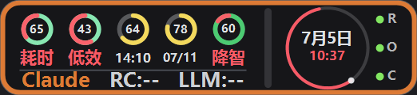
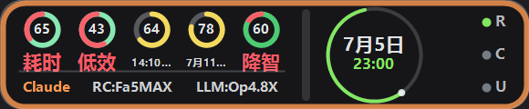
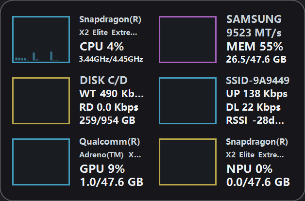
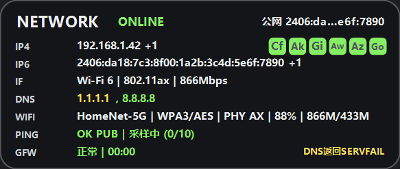
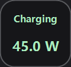
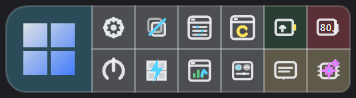
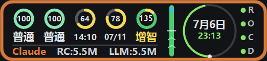
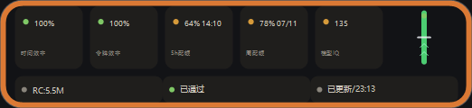

# Fable5-Frontend-Rendering-Technical — 前端渲染管线、变体系统与查验规程

适用版本：`1.0.4.18`。本文是**前端（分层窗口自绘 UI）的唯一 owner 文档**中面向执行 AI 的操作层：渲染管线如何工作、哪些语义绝对不能改、改完如何用可机器判定的方式自证没画错。窗口结构细节见各 `*-Architecture.md`；刷新调度见 `Component-Refresh-Rules.md`。

**执行 AI 必读**：本文 §5 的禁改清单与 §6 的查验流程是硬性要求。任何触碰 `Core/*Form*.cs` 绘制代码的任务，交付物必须包含 §6 规定的 before/after PNG 与对比结论，否则视为未验收。

---

## 1. 渲染管线（7 个悬浮窗共同的架构）

所有悬浮窗（WidgetForm / CodexRadarForm / ClaudeRadarForm / NetworkMonitorForm / PowerThermalForm / ConnectionCheckForm / OperationForm）都是 **WS_EX_LAYERED | WS_EX_TOOLWINDOW | WS_EX_NOACTIVATE** 分层窗口，GDI+ 全自绘、无子控件、不出现在任务栏和截屏工具里（这就是为什么必须用渲染采样而不是屏幕截图来验收）。

每帧流程（以 ClaudeRadarForm.RenderLayeredWindow 为代表，各窗同构）：

```
UI tick → RenderLayeredWindow(redrawContent)
  → EnsureRenderBuffer()                    // 按窗口尺寸持有 32bppPArgb 位图+Graphics
  → scene cache 命中? 直接贴图 : {
        renderGraphics.Clear(Transparent)
        DrawWindow(g)                       // = DrawBackground + DrawContentLayer
        BurnInProtection.ApplyHiddenModeColorProtection(可选)
        StoreRenderSceneCache(key)
    }
  → NativeMethods.LayeredBitmapSurface.Update(handle, pos, bitmap, appAlpha, ...)
```

### 1.1 三层透明度模型（改错任何一层都会"看起来不一样"）

| 层 | 来源 | 应用位置 |
|---|---|---|
| 背景透明度 | 各窗 `<X>TransparencyPercent` 设置 → `GetBackgroundOpacityAlpha()` | `DrawBackground`：圆角外壳以该 alpha 填充 `DesignTokens.Colors.AppBackground` |
| 内容透明度 | `GetContentOpacityAlpha()` | `DrawContentLayer`：<255 时内容先画到离屏位图再 `DrawingUtil.DrawImageWithAlpha` 合成 |
| 整窗透明度 | `GetApplicationOpacityAlpha()`＝静止恒 255，仅悬停隐藏动画期间 <255 | `UpdateLayeredWindow` 的 SourceConstantAlpha |

### 1.2 坐标与缩放（最容易被执行 AI 改错的地方）

- **设置里的宽高就是物理像素**。运行时 `this.Size = new Size(settings.XWidth, settings.XHeight)`，**没有任何 DPI 二次乘法**。
- `scale = Math.Max(1.0f, g.DpiX / 96.0f)`（本机 200% → 2.0），只用于 `S(int)` 把设计常量换算成像素。渲染采样通道统一 `form.scale = 2.0f`。
- 历史教训（已三次修复同款 bug）：采样画布用 `settings 宽高 × 2` 会得到一张比真实窗口大一倍的画布，把真实宽度下的截断/溢出全部藏起来。CodexRadar（`CodexRadarForm.RenderSample.cs` 注释）、ClaudeRadar、以及 1.0.4.18 修复的 NetworkMonitor/PowerThermal/ConnectionCheck 都踩过。**采样画布必须 = 设置宽高 1:1。**
- 缩字排版陷阱（历史 bug 模式）：任何 shrink-to-fit 文本，**测量宽度必须等于绘制时的可用宽度**——量 A 宽画到 B 宽必然溢出或过缩。

### 1.3 共享资源（禁止绕开）

| 资源 | 用途 |
|---|---|
| `NativeMethods.LayeredBitmapSurface` | 分层窗口位图提交；显示挂起/恢复时 `Reset()` 重建 |
| `UiFontCache` | 字体复用（悬浮窗 Pixel 路径与设置窗 Point 路径分离，禁止混接） |
| `DesignTokens` | 颜色/圆角/间距 token；`DesignTokens.WithAlpha` 做 alpha 变体 |
| `OledVariantPainting` | 四个 OLED 方案共享的调色/绘制助手（25 处引用） |
| `BurnInProtection` | `ConfigureGraphics`（文本渲染模式）＋周期整窗位移＋隐藏模式低亮度化 |
| `DrawingUtil` | 带 alpha 的位图合成等 |

## 2. 渲染变体系统

- 每窗一个 `<X>RenderVariant` 枚举（Classic + Typographic/AmberHud/WarmCard/Phosphor；CodexRadar 另有 EvenGrid/EvenRow，当前默认 EvenRow）。
- 变体绘制住在 `<Form>.<Variant>.cs` 兄弟 partial，仅由 `Draw*Content` 的 switch 分发；**变体只是 paint 切换，禁止触碰数据层、线程、持久化**。
- OLED 四方案硬约束：无蓝色主导色、无峰值白/高饱和大面积填充、背景保持半透明 `AppBackground`；烧屏防护统一靠 `BurnInProtection` 整窗位移，不做每方案私活。
- 设置页缩略图选择器（VariantPicker）的懒加载缓存在 `%LOCALAPPDATA%\DesktopCodexAssistant\variant-samples\v<版本>\`。

## 3. 渲染采样：sample 模式 vs current 模式（1.0.4.18 起）

`--render-{codexradar,clauderadar,connectioncheck,networkmonitor,powerthermal,widget,operation} --out <dir>` 每窗输出两类 PNG：

| | sample 模式（`<窗>-<variant>.png`） | current 模式（`<窗>-current.png`） |
|---|---|---|
| 设置 | `CreateDefaults()`，逐变体切换 | **真实 `settings.ini`**（尺寸/变体/透明度/手动偏移全部生效） |
| 数据 | 确定性合成快照 | 有磁盘缓存的窗口用真实缓存（CodexRadar/ClaudeRadar）；主窗口现场采一次真实 PDH；其余窗口沿用合成快照 |
| 背景 | 不透明 `AppBackground` 底 | 完整 `Draw<X>Window` 管线（真实背景/内容 alpha）→ 按整窗 alpha 合成到 `RenderSampleSupport.DesktopBackdrop`（#1E1E22 深色壁纸替身） |
| 用途 | 变体布局回归基准（跨版本可对比） | 回答"我配置的窗口现在实际长什么样"（给 AI 看的"截图"） |

**AI 应当用 current 图判断真实观感，用 sample 图做布局回归对比。** 两者语义不同，禁止混用。

### 3.1 current 模式与真实屏幕的已知残余差异（评审时心里要有数）

1. 底色是纯色深灰，真实桌面是壁纸；透明度越高差异越可见。
2. 无磁盘缓存的窗口（NetworkMonitor/PowerThermal/ConnectionCheck/Operation）内容仍是合成/占位数据，只有几何、变体、透明度是真的。
3. 悬停隐藏动画的整窗 alpha 不参与（恒 255）；烧屏位移不参与。
4. 文本渲染是离屏灰度 AA，屏幕上是 ClearType 子像素——像素级不同、观感一致。
5. CodexRadar current 反映的是磁盘缓存快照，不含正在进行的网络刷新结果。

### 3.2 参考图（1.0.4.18 实机生成，Docs/Assets/Frontend/）

| 图 | 说明 |
|---|---|
|  | CodexRadar current：真实设置 522x120 + 真实缓存（Claude 模式批次数据） |
|  | ClaudeRadar current：真实设置 580x120 |
|  | 主窗口 current：628x414，六格全开，实时 PDH 真数据 |
|  | 网络监控 current：583x247（内容为合成快照） |
|  /  /  | 功耗 120x114 / 操作面板 356x98 / 连接检查 292x98 |
|  | sample 模式基准（EvenRow 默认变体，合成数据，不透明底） |
|  | sample 模式 OLED WarmCard 变体示例 |

## 4. 每窗口验收入口速查

| 窗口 | 命令 | 全帧绘制入口 | current 数据来源 |
|---|---|---|---|
| 主窗口 | `--render-widget` | `DrawWidget` | 实时 PDH 采样（1.1s） |
| CodexRadar | `--render-codexradar` | `DrawCodexRadar` | `codex-radar-cache.ini` 等构造期缓存；空则合成 |
| ClaudeRadar | `--render-clauderadar` | `DrawWindow` | `claude-radar-cache.ini`/`claude-quota.ini`；空则合成 |
| 网络监控 | `--render-networkmonitor` | `DrawNetworkMonitorWindow` | 合成快照 |
| 功耗温度 | `--render-powerthermal` | `DrawPowerThermalWindow` | 合成读数 |
| 连接检查 | `--render-connectioncheck` | `DrawConnectionCheckWindow` | reader 冷启动快照 |
| 操作面板 | `--render-operation` | `DrawOperationWindow` | 无数据依赖 |

共享合成助手：`Core/RenderSampleSupport.cs`（透明层 → 整窗 alpha → 深色底合成）。

## 5. 禁改清单（执行 AI 违反任何一条 = 直接返工）

1. `CreateParams` 的 ExStyle 位组合、`ShowWithoutActivation`。
2. 三层透明度语义（§1.1）：不得把背景 alpha 挪到整窗 alpha，不得让内容层绕过 `DrawContentLayer`。
3. 设置宽高的物理像素 1:1 语义；采样画布禁止任何 `*2` 之类的再缩放。
4. `S()`/`scale` 的换算方式；禁止在绘制常量里硬编码已缩放像素。
5. paint 路径禁止读磁盘/网络/枚举进程（scene cache 键控绘制只消费已解析快照——`Component-Refresh-Rules.md` §4 有明文）。
6. OLED 四方案的无蓝/无峰值白约束；隐藏模式低亮度保护逻辑。
7. 渲染资源生命周期：显示挂起必须释放（`PrepareForDisplaySuspend`），恢复必须重建；新增位图/Graphics/字体必须走既有 Dispose 路径（`--test-radar-display-lifecycle` 会抓泄漏）。
8. 悬浮窗字体一律 `UiFontCache` Pixel 路径；禁止 new Font 散落在 paint 里。

## 6. 查验流程（改绘制代码的标准作业）

1. **改动前**：`<exe> --render-<窗口> --out _build\fr-before\<窗>` 生成 baseline（sample + current 都会出）。
2. 改代码 → 构建 ARM64 → `--test-layout` 必须 PASS（各窗渲染自测都挂在这）；涉及挂起/恢复或新增渲染资源时加跑 `--test-radar-display-lifecycle --iterations 100` 与 `--test-display-recovery`。
3. **改动后**：渲染到 `_build\fr-after\<窗>`。
4. **对比判定**：
   - 预期无视觉变化的重构：sample 图逐像素对比（`_validation/Compare-RenderSamples.py`，阈值 0.1%，见 `Docs/Technical/Fable5-Code-Review-And-Optimization-SPEC-v1.0.4.16-20260706.md` T0-C 规格），必须 `RESULT: PASS`。
   - 有意的视觉变更：把 before/after 的相关 PNG 并排贴进交付说明，逐条对应需求点；**同时确认未列入需求的其他窗口/变体 sample 图 0 diff**（防误伤）。
   - 尺寸断言：current 图尺寸必须等于 `settings.ini` 中该窗口宽高（`python -c "from PIL import Image; print(Image.open(p).size)"` 或看渲染命令行输出的 `(WxH)`）。
5. **真机确认**：按部署规则覆盖正式 exe 并重启后，确认窗口出现、透明度生效、显示器睡眠唤醒恢复正常。
6. 文字截断专项：凡改了字号/宽度/fit 逻辑，必须在**真实宽度**的 current 图上确认无 `...` 意外截断（sample 图 1:1 画布同样有效——这正是 §1.2 修 ×2 bug 的原因）。

## 7. 相关文件清单

绘制主体：`Core/<X>Form.cs` + `Core/<X>Form.<Variant>.cs`；共享：`Core/DesignTokens.cs`、`Core/OledVariantPainting.cs`、`Core/UiFontCache.cs`、`Core/BurnInProtection.cs`、`Core/DrawingUtil.cs`、`Core/RenderSampleSupport.cs`、`Interop/NativeMethods.cs`（LayeredBitmapSurface）；采样通道：`Core/<X>Form.RenderSample.cs`（ClaudeRadar 的在主文件内）＋ `DesktopCodexAssistant.cs` 的 `--render-*` 命令处理。
