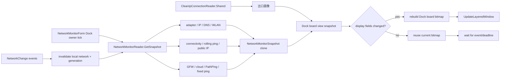

# 网络监控停靠架构

适用版本：2.0.0.26

本文说明 Network 左缘停靠 tab/board 的数据读取、状态机、单飞一致性、PathPing、Clean IP 投影和 Dock-only 渲染边界。

## 1. 当前定位

Network 是左侧 7 个停靠角色之一，只以 tab + 展开 board 运行。`NetworkMonitorForm` 仍是 reader、调度和 board 的 owner，但不提供浮动展示模式。

相关源码：

| 文件 | 职责 |
| --- | --- |
| `Core/NetworkMonitorForm.cs` | owner 生命周期、调度、快照比较和 board 状态 |
| `Core/NetworkMonitorForm.Dock.cs` | tab、展开/收起、停靠定位和交互 |
| `Core/NetworkMonitorForm.DockedLayout.cs` | Dock board 四区布局和窄宽度降级 |
| `Performance/NetworkMonitorReader.cs` | 本地网卡、公网 IP、连通性、延迟、抖动和门户认证 |
| `Performance/GfwProbeReader.cs` | GFW 多阶段探测、缓存和独立日志 |
| `Performance/CloudEndpointProbeReader.cs` | 云服务单飞、冷却、缓存和网络门控 |
| `Performance/PathPingProbe.cs` | 路径发现、逐跳滚动采样和链路归因 |
| `Performance/FixedPingProbe.cs` | 固定目标 ICMP 单飞采样 |
| `Performance/CleanIpConnectionReader.cs` | 共享出口 IP 画像 reader |
| `Core/AiRequestProtection.cs` | 出口国别/GFW fail-closed 门控与敏感 AI host 统一判定 |
| `Core/ChinaEgressWarningForm.cs` | 明确大陆出口时的全屏警告与 60 秒暂时隐藏 |
| `Settings/WidgetSettings.cs` | 网络目标、间隔、tab/board 与测试设置 |

`ConnectionCheckForm` 已移除；`CleanIpConnectionReader.Shared` 保留，并由 Network board 作为唯一正常运行时展示入口。

## 2. 总体数据流



`NetworkMonitorReader` 拥有可变数据、后台任务、generation 与取消状态。board 只能取得克隆快照，不能修改 reader-owned state。所有具体间隔、冷却和事件刷新表只在 `Docs/Component-Refresh-Rules.md` §6/§7 维护。

## 3. 网络状态机

| 状态 | 条件 | board 语义 |
| --- | --- | --- |
| `Unknown` | 首次检测、手动刷新或网络身份刚变化 | 灰色检查中 |
| `Online` | NCSI 成功或至少一次公网证明成功 | 绿色 |
| `NeedsValidation` | 门户重定向、401/403/511 或 NCSI 内容替换 | 橙色 |
| `Offline` | 网卡存在，但 Ping/HTTP 都不能证明公网可用 | 红色与背景红叉 |
| `AdapterMissing` | 没有可用活动网卡 | 红色与背景红叉 |

优先级为：未连接 → 网络身份未知 → reader 明确状态 → 兼容字段回退。门户认证高于 Ping 成功，避免强制门户误报在线。

网络为 `Online` 但 GFW 已明确疑似 DNS/TCP/TLS/SNI/HTTP 阻断时，board 标为“全球互联网不可用”。`Inconclusive`、本地链路劣化或少量候选异常只显示黄色不可判定，不改真实 `AccessState`。

## 4. 本地接口、地址与 DNS

自动选择候选必须 `OperationalStatus.Up`，排除 Loopback/Tunnel，再按默认网关、IPv4、IPv6、接口类型和速率评分。用户指定网卡时优先匹配 `NetworkInterface.Id`，兼容按名称匹配；指定网卡暂时 down 时仍保留身份展示，但连通性进入未连接路径。

快照保存完整 IPv4/IPv6/DNS 列表，board 可按宽度折叠为首项与 `+n`。公网短显优先使用可公开路由 IPv6，排除 `fc00::/7` ULA；没有时回退已验证的公网 IPv4。

DNS 健康由独立后台任务低频检测：

1. UDP 53 查询 `www.msftconnecttest.com`。
2. UDP 无响应时用 TCP 53 复查。
3. 正常解析后查询随机 `.invalid` 域名验证 NXDOMAIN。
4. 连续两个随机不存在域名都返回地址才判定劫持。

单轮最多并发检查两个 DNS，提交时保持网卡返回顺序。连续两轮 UDP/TCP 都无响应才确认 unavailable；本地链路已劣化时保持黄色问题，避免把链路丢包误报成 DNS 服务器故障。网络历史不记录 DNS 真实地址。

## 5. 连通性与滚动 PING

每轮连通性把 ICMP 与 Microsoft NCSI 门户请求并行：HTTP/NCSI 能证明在线时，即使 ICMP 被屏蔽也保持 `Online`。门户正文和 DNS TCP 读写共用有界 deadline，慢速逐字节响应不能无限续命。

端到端滚动 PING 对默认网关和当前活动目标组采样，样本窗口最多 60 个且有时间上限。公网组在多个 anycast IP 间轮转；GFW 已明确异常时，展示目标可切到百度，但显示 profile 绝不能覆盖实际 `ConnectivityTarget`。

延迟取成功样本平均，抖动取相邻成功样本 RTT 差绝对值平均，丢包取失败数/总数。HTTP 已确认在线、网关可达、但公网目标长期无成功 ICMP 时显示“ICMP 不可用”，不能改成离线。

本地链路劣化阈值用于降低 DNS/云服务误报，不改变 `AccessState`。GFW 只消费当前活动目标滚动 PING 的确认丢包门控，不直接消费 4 包连通性采样的 25% 离散丢包。

## 6. Generation 与单飞

reader 监听 `NetworkAddressChanged` 与 `NetworkAvailabilityChanged`。事件处理器只做轻量失效：

- 标记本地信息过期。
- 使连通性、公网 IP 和 DNS deadline 到期。
- 增加 `networkGeneration`。
- 把状态切到 `Unknown`。

本地快照确认接口 ID、默认网关或主 IP 真正变化后，才重置 GFW、云服务、PathPing 和滚动窗口；短时间重复事件或 DNS 顺序变化不能把远程探测误当首次运行。

公网 IP、DNS、连通性、滚动 PING、GFW、云服务、PathPing 和固定 Ping 都必须单飞。任务捕获 generation、`InterfaceId` 和所需的 target/config signature；提交前任一身份不匹配即丢弃，且不能写完成历史或覆盖新网络快照。

## 7. GFW 与云服务

GFW 只在真实网络 `Online` 且活动目标滚动丢包未触发门控时启动。候选站点必须在同一异常层至少命中两个，才发布明确疑似阻断；单点或分散异常保持不可判定。

云服务与 GFW 共享网络身份和手动刷新入口，但请求、结果和着色彼此独立：

- GFW 结论不能抑制云服务请求或强制改变云服务状态。
- 内置与自定义目标在任务创建前按启用设置过滤；全部关闭时不发请求。
- 首轮正常目标不追加确认；只有异常/慢/不可连接目标追加确认。
- 官方状态源支持缓存和条件请求；地区设置只过滤有地区语义的事件。
- 本地链路劣化时，链路敏感且未全数失败的红色不可连接可降为黄色；官方故障不降级。
- 断网、需验证或 Unknown 时取消新探测并返回无告警状态，旧任务不得回写。

详细默认目标、URL、TTL 与认证边界以接口索引和数据源文档为准。

## 8. Clean IP 出口画像

Network board 直接消费 `CleanIpConnectionReader.Shared`：

- 进程级共享单例，禁止 new 第二个 reader。
- 按自己的间隔、整点计划、错误重试与单飞规则运行。
- board 收起不释放 reader；网络/操作面板强制刷新经 `NetworkMonitorForm.ForceRefresh()` 调用 `RequestRefresh()`。
- 测试状态只影响返回的克隆，不污染真实缓存。
- 展示纯净度、原生判定、IP 类型、出口 IP、归属地、组织、ASN 与理由。
- 成功快照同时保留 `CountryRaw` 和 `EgressIdentityCurrent`。Windows 网络身份事件立即把后者置为 false，并调用 `AiRequestProtection.InvalidateEgressSignal()`；旧日本出口不能授权新网络。
- `WidgetForm.UpdateChinaEgressProtection()` 只在 `AiChinaEgressGuardEnabled=true` 时，从既有主 tick 消费同一个共享 clone，不创建 reader 或 timer。它使用 `CheckedAtLocal` 的真实观测时间，不能用重复读取延长 10 分钟出口信号 TTL。
- 阻断方向 fail-closed：出口大陆、未知、过期或 GFW 墙内都阻断本程序敏感 AI 请求。警告方向精确：只有明确大陆或 GFW 墙内才显示 `ChinaEgressWarningForm`；未知/过期不弹窗。

任何新增出口画像消费者都必须复用该单例，不能因为展示表面隐藏而中断检测或增加 cleanip.io 请求次数。

## 9. PathPing 与固定 Ping

PathPing 只在 Network board 展开期间采样；收起后完全暂停逐跳发包。它分两阶段：

1. TTL 递增发现路径，实时更新发现进度；网络身份、具体目标、连续失败、发现周期或手动刷新可触发重发现。
2. 对已发现跳点做独立滚动采样，任务提交继续验证 generation、接口和 target/gateway signature。

归因规则：

- 中间跳丢包但目标干净：`RateLimited`，不报链路故障。
- 丢包从某跳持续传导到目标：`LinkLoss`，记录首个责任跳。
- 目标不响应：`Unreachable`；已知 ICMP 屏蔽：`IcmpUnavailable`。
- 连续沉默跳合并显示，但保留合并计数。

固定 Ping 复用 Network owner tick 和 PathPing 可见门控，不创建 timer。目标列表最多 8 项，任务按 generation、接口和配置签名拒绝迟到结果。`ForceRefresh()` 同时使 PathPing 与固定 Ping 到期。

## 10. Dock board 布局与交互

Network tab 是左侧 6 槽队列的第一角色。tab X 固定在目标 work-area 左缘，只允许整列共享 Y 偏移；展开 board X 固定为 `workArea.Left + tab.Width`，与 Spec、Codex Task、GUARD、Codex IQ、ResetSpeed board 水平对齐。

board 复用 `SpecBoardWidth × SpecBoardHeight` footprint，并按 648×400 参考空间分四区：

| 区域 | 内容 |
| --- | --- |
| 头部 | NETWORK、接入状态、链路摘要、更新时间 |
| 出口画像 | Clean IP 三枚徽章、出口/组织/ASN 与判定理由 |
| 主体 | 左栏接口/IP/DNS/GFW/云服务，右栏 PathPing 与固定 Ping |
| 底部 | 绿色刷新、红色关闭、最近错误、轮次与路径发现时间 |

窄宽度时双栏降级为单列，必须先为底部和固定 Ping 预留空间，再按实际字体行高布局；不能靠固定 Y 猜测。

Dock board 的可读性字号层级由 `NetworkMonitorForm.DockedLayout.cs` 统一维护：标题 `S(13)`，正文 `S(9.5)`，强调正文 `S(10)`，辅助文字 `S(8.4)`，等宽数值 `S(9.4)`，逐跳正文 `S(9)`。完整和 240 逻辑像素窄版都按实测行高与可用宽度布局，长地址继续在自身矩形内省略。

交互规则：

- `EdgeDockTabForm` 的既有 hover tick 控制展开、收起和外部点击。
- board 接收正常鼠标输入，不启用 click-through 或浮窗 hover 透明。
- 刷新按钮调用 `ForceRefresh()`，复用现有单飞、冷却和 token。
- 关闭按钮只收起 board 并暂停 PathPing，保留 tab 与全部 reader。
- 与其它左侧 board 互斥，后展开者收起当前 board。

## 11. 绘制、缓存与生命周期

`NetworkMonitorForm.DockedLayout.cs` 是唯一运行时绘制路径。旧浮窗的 InfoRow、DNS 分段、接口/Wi-Fi/连通性/GFW 长文本 helper 和 Radar service LED 推送链已不存在；四项 AI 服务健康由 Codex IQ board 独占。`HasSameDisplayData` 只比较会影响 board 的接口、地址、DNS、状态、质量、GFW、云服务、PathPing、固定 Ping 与出口画像字段；内部时间戳或不展示数据不触发重绘。

board 复用 layered bitmap/Graphics 与字体缓存。内容变化时重建，只有整体 Alpha 变化时复用位图提交。尺寸变化、显示挂起和关闭必须释放所有 GDI 资源。

全屏或显示挂起时隐藏 tab/board、停止展示绘制并释放必要资源；reader 依各自规则保留最低限度状态。恢复后重新解析工作区、定位 tab/board、重建缓存并请求一次受单飞保护的刷新。

## 12. 设置与测试边界

设置页保留网卡、DNS/GFW/云服务/PathPing/固定 Ping、透明度/缩放、目标显示器、停靠列顺序/间距和测试状态。展示模式固定为 Dock；旧设置值不能创建第二种 Network 表面。

测试状态只修改 `GetSnapshot()` 返回的 clone：不写真实 reader，不改变真实调度，也不启动额外公网 IP、GFW、云服务或 Clean IP 请求。

`--render-networkmonitor` 只输出 Dock board 样张，用固定 fixture 验证四区布局、窄宽度降级、按钮命中和状态颜色。

## 13. 维护与验证

维护约束：

1. 新刷新参数放 `WidgetSettings`，具体时间只登记到 `Docs/Component-Refresh-Rules.md`。
2. 网络身份变化必须推进 generation；所有后台提交必须验证身份。
3. 新任务必须单飞、有取消/迟到拒绝和测试 clone 边界。
4. GFW 与云服务必须保持独立调度和结果语义。
5. 高频绘制不能创建未缓存字体/位图，也不能做网络或磁盘 I/O。
6. `AdapterMissing`、`Offline`、`NeedsValidation` 和 `Unknown` 不能合并。

建议验证：

```powershell
powershell -NoProfile -ExecutionPolicy Bypass -File .\Build-Arm64.ps1 -OutputPath .\_build\DesktopCodexAssistant-arm64-test.exe -Platform arm64
.\_build\DesktopCodexAssistant-arm64-test.exe --test
.\_build\DesktopCodexAssistant-arm64-test.exe --test-layout
.\_build\DesktopCodexAssistant-arm64-test.exe --test-settings-bindings
.\_build\DesktopCodexAssistant-arm64-test.exe --render-networkmonitor --out .\_build\network
```

验收重点是：Network 只通过第一枚左侧 tab 展开、Clean IP 只在该 board 展示、换网后旧任务不回写、收起后 PathPing 停止、七块 board 水平对齐、GFW 不改云服务结果，以及显示恢复后没有第二个 Network 表面。
