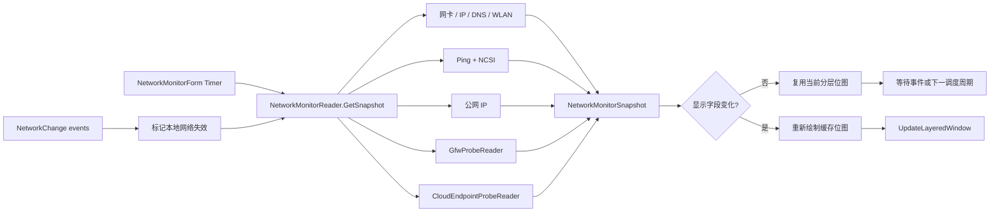

# 网络监控窗口技术说明

适用版本：1.0.4.52

## 1. 文档范围

本文描述网络监控窗口的职责、数据来源、状态机、三档性能策略、后台任务一致性、GFW 检测协作方式和分层窗口渲染。历史优化过程见 `Docs/Reports/Performance/` 与 CHANGELOG。

相关源码：

| 文件 | 职责 |
| --- | --- |
| `Core/NetworkMonitorForm.cs` | 网络窗口生命周期、布局、状态文字、红叉和分层窗口绘制 |
| `Performance/NetworkMonitorReader.cs` | 本地网卡、公网 IP、连通性、延迟、抖动和门户认证检测 |
| `Performance/GfwProbeReader.cs` | GFW 多阶段探测、结果驻留和独立日志 |
| `Performance/CloudEndpointProbe.cs` | 云服务公网可用性轻量采样、异常确认和缓存 |
| `Performance/CloudEndpointProbeReader.cs` | 云服务独立单飞调度、手动冷却和网络状态门控 |
| `Performance/PdhModels.cs` | 网络、Wi-Fi、GFW 和云服务快照模型 |
| `Settings/WidgetSettings.cs` | 三档性能策略和网络窗口设置 |
| `Settings/Win11SettingsForm.cs` | 网络窗口参数、GFW 参数和网络状态测试入口 |
| `Interop/NativeMethods.cs` | WLAN、分层窗口和原生窗口接口 |

性能模式的通用说明见：

`Docs/Performance-And-Window-Runtime.md`

优化前的网络模块源码备份见：

`Backups/NetworkMonitor-20260607-performance-optimization`

## 2. 设计目标

网络窗口遵循以下约束：

1. 网卡存在不等于互联网可用。
2. 网络请求和 Ping 不得阻塞 WinForms UI 线程。
3. 网络切换后，旧网络的结果不得覆盖新网络。
4. 同一类远程请求任意时刻最多运行一个。
5. 快照没有显示变化时不重绘窗口。
6. 省电模式依赖 Windows 网络事件，减少周期网卡枚举。
7. 测试状态只修改返回给 UI 的快照，不污染真实检测状态。

## 3. 总体架构



`NetworkMonitorReader` 拥有可变数据和后台任务状态。`NetworkMonitorForm` 只能取得快照副本，不能直接修改 reader 内部状态。

## 4. 快照与线程所有权

`NetworkMonitorSnapshot` 分为四类数据：

| 类别 | 主要字段 |
| --- | --- |
| 本地接口 | `InterfaceId`、名称、类型、速率、IPv4/IPv6、DNS |
| Wi-Fi | SSID、认证、加密、PHY、信号、收发协商速率 |
| 公网连通性 | `AccessState`、延迟、抖动、丢包、公网 IP、本地链路劣化标记 |
| GFW 与云服务 | `GfwProbeSnapshot`、`CloudEndpointSnapshot[]` |

线程规则：

- 本地接口枚举由 UI 调度路径同步执行，但频率受性能模式和网络事件限制。
- Ping、公网 IP 和门户检测在后台任务中运行。
- 后台任务只在 `sync` 锁内提交结果。
- UI 获取的是深复制快照，Wi-Fi 和 GFW 子对象也会复制。
- 窗口关闭时 reader 取消 `NetworkChange` 静态事件订阅。

## 5. 网络状态机

### 5.1 状态定义

| 状态 | 条件 | 标题颜色 | 背景红叉 |
| --- | --- | --- | --- |
| `Unknown` | 首次检测、手动刷新或网络刚变化 | 灰色 | 无 |
| `Online` | NCSI 成功或至少一次 Ping 成功 | 绿色 | 无 |
| `NeedsValidation` | 门户重定向、401/403/511 或 NCSI 内容被替换 | 橙色 | 无 |
| `Offline` | 网卡存在，但 Ping 和 HTTP 均无法证明公网可用 | 红色 | 有 |
| `AdapterMissing` | 没有识别到可用活动网卡 | 红色 | 有 |

如果公网连通性本身为 `Online`，但 GFW 检测已完成且结果为明确的疑似 DNS、TCP、TLS/SNI 或 HTTP 阻断，标题栏会用橙色 `全球互联网不可用` 覆盖 `ONLINE`。`Inconclusive` 不再触发该覆盖；本地丢包、少量候选异常或网络质量不足时只在 GFW 行显示黄色 `不可判定`，不改变 PING 行、GFW 行或真实 `AccessState`。

### 5.2 状态优先级

显示层按以下优先级计算状态：

1. `Connected == false`：`AdapterMissing`
2. 网络身份刚变化或检测未知：`Unknown`
3. reader 已给出明确 `AccessState`：使用该状态
4. 兼容旧快照：根据 `ConnectivityOnline` 回退为 `Online` 或 `Offline`

该顺序避免旧的 `AdapterMissing` 状态在网卡刚恢复时继续显示。

### 5.3 红叉规则

`Offline` 和 `AdapterMissing` 会在黑色背景层上绘制红叉：

- 线宽：20 个 DPI 缩放像素
- 覆盖范围：窗口宽高约 60%
- 颜色：`DangerGlyph`
- Alpha：与网络窗口背景透明度一致
- 绘制顺序：背景之后、文字内容之前

因此红叉不会改变文字透明度，也不会在 `NeedsValidation` 状态下出现。

## 6. 本地网卡识别

候选接口必须满足：

- `OperationalStatus.Up`
- 不是 Loopback
- 不是 Tunnel

评分顺序：

1. 有默认网关
2. 有有效 IPv4
3. 有有效 IPv6
4. Wi-Fi、Ethernet 或 GigabitEthernet
5. 接口速率

最高分接口作为主接口。`InterfaceId` 用于判断后台任务是否仍属于当前网络。

设置页“网卡选择”保存为 `NetworkMonitorAdapterId`。空值表示继续自动选择；非空时优先按 `NetworkInterface.Id` 匹配，兼容按接口名称匹配。手动选择的接口即使当前不是 `Up` 也会成为本地快照来源，此时 `InterfaceKnown` 保持为真、`Connected` 为假，界面可继续显示当前选择的网卡名称，同时连通性状态进入离线/未连接路径。

本地快照包括：

- IPv4/IPv6 行各优先显示第一个完整地址；后续地址只用 `+n` 表示，宽度不足时仅压缩第一个地址
- 当前网卡的 DNS 地址和每个 DNS 的健康状态
- WLAN 当前连接属性
- 链路速率和接口类型

省电模式不进行固定周期接口枚举，只在首次读取、手动刷新或 Windows 网络事件后更新。

### 6.1 DNS 状态检测

DNS 地址列表随本地网卡刷新一起更新；DNS 健康状态由独立后台任务低频检测，不阻塞 UI 线程。

检测流程：

1. 对每个 DNS 服务器用 UDP 53 查询 `www.msftconnecttest.com`。
2. UDP 无响应时用 TCP 53 查询同一域名；TCP 成功但 UDP 失败显示为黄色问题。
3. 正常域名解析成功后，查询随机 `.invalid` 域名验证 NXDOMAIN。
4. 随机不存在域名返回地址时，再查询第二个随机 `.invalid` 域名；连续两次返回地址才判定为劫持，否则降为黄色问题。

单轮 DNS 检测最多 2 个 DNS 服务器并发，结果仍按原 DNS 列表顺序提交。这样能避免多 DNS 全部串行导致刷新拖太久，也不会一次性对所有 DNS 服务器打满查询。

DNS 状态颜色：

| 状态 | 条件 | 颜色 |
| --- | --- | --- |
| `Normal` | 正常域名解析成功，随机不存在域名返回 NXDOMAIN | 浅绿色 |
| `Problem` | DNS 返回错误码、无地址答案、NXDOMAIN 验证异常或仅 TCP 可用 | 黄色 |
| `Hijacked` | 随机不存在域名被解析为地址 | 红色 |
| `Unavailable` | DNS 地址无效，或 UDP/TCP 连续两轮均无响应 | 灰色 |
| `Unknown` | 尚未完成检测 | 灰色 |

DNS 行按异常优先排序显示：劫持、问题、不可用、未知、正常。最多显示 3 个 DNS；如果隐藏更多 DNS，`+n` 的颜色取隐藏项中的最差状态。

UDP/TCP 均无响应的第一轮不会直接置灰，而是显示黄色问题并保存失败计数；同一个 DNS 地址连续第二轮失败才确认 `Unavailable`。如果当前本地链路已被判定为高丢包、高抖动或高延迟，无响应结果继续保持黄色，避免把本地链路质量问题误报为 DNS 服务器不可用。地址格式无效属于确定错误，仍直接置灰。

## 7. 连通性检测

### 7.1 检测组成

每轮连通性检测同时覆盖：

- 对 `1.1.1.1` 执行 4 次 Ping
- 单次 Ping 超时 1000 ms
- 请求 `http://www.msftconnecttest.com/connecttest.txt`
- HTTP 总超时 4000 ms
- 期望内容为 `Microsoft Connect Test`

门户请求在独立后台任务中运行，当前连通性工作线程同时执行顺序 Ping。这样总耗时接近二者的较大值，而不是两段耗时相加。

PING 行另有独立的滚动 ICMP 采样窗口：默认网关、公网目标组和百度回退组各保留最多 60 个样本，并丢弃 15 分钟前样本。公网目标在 `1.1.1.1`、`1.0.0.1`、`8.8.8.8`、`8.8.4.4`、`9.9.9.9`、`149.112.112.112` 间轮转；当 GFW 快照已明确疑似 DNS/TCP/TLS/SNI/HTTP 阻断且网络仍为 `Online` 时，PING 行显示切换到 `BAIDU`，只使用 `www.baidu.com` 的滚动统计。该回退只影响 PING 行质量显示，不抑制 GFW 或云服务结果。

### 7.2 判定规则

判定优先级：

1. 门户检测确认需要认证：`NeedsValidation`
2. 门户检测成功或至少一次 Ping 成功：`Online`
3. 两者均失败：`Offline`

`Online` 表示互联网可用，不保证 ICMP 一定可用。某些网络会屏蔽 Ping，但允许 HTTP。

### 7.3 延迟、抖动和丢包

- 连通性后台检测仍保留 4 次 Ping，用于 `Online`/`Offline` 和 DNS/云服务本地链路劣化门控。
- PING 行优先显示滚动窗口统计：延迟为成功样本算术平均，抖动为相邻成功样本往返差绝对值平均，丢包为失败样本数除以总样本数。
- 滚动窗口少于 10 个样本时显示采样中；达到 10 个样本后丢包显示 1 位小数并附带 `(lost/total)`。
- 如果 HTTP/NCSI 已确认 `Online`、网关有成功样本，但当前公网或百度组 10 个以上样本均无成功 ICMP，则显示 `ICMP不可用`，不把真实网络状态改为离线。

统计函数通过 `ref ConnectivityResult` 写回结果。不要改回按值传递，否则结构体计算结果会丢失，界面会长期显示 0 ms。

在线状态下还会计算一个内部 `LocalNetworkDegraded` 标记，阈值为丢包率 `>= 15%`、抖动 `>= 250 ms` 或平均延迟 `>= 800 ms`。该标记不改变 `Online` / `Offline` 判定，主要供 DNS 和云服务检测降低本地链路不稳定时的误报风险；门户验证和离线状态不会进入该分支。GFW 不直接消费这个 4 包 Ping 的丢包门控，因为单包丢失会被量化为 25%；GFW 也不消费滚动 PING 的网关侧 ICMP 丢包、延迟或抖动诊断，只接收当前活动目标滚动丢包率 `>= 2%` 且已确认的门控。

PING 诊断不再占用右侧固定栏，而是接在 PING 主文本末尾显示，例如 `loss 1.7% (1/60) | WAN LOSS`。诊断优先级仍为网卡缺失、需要验证、离线、本地网关丢包/高延迟、墙内、公网或百度丢包/高延迟、ICMP 禁用。滚动丢包达到确认条件时写入 `network-check-history.jsonl` 的 `rolling_ping_loss_confirmed`，恢复同样只写状态转换，不按每个样本写日志。

## 8. 三档性能策略

设置界面名称与内部值：

| 界面名称 | 内部枚举 |
| --- | --- |
| 性能 | `Smooth` |
| 均衡 | `Balanced` |
| 省电 | `BatterySaver` |

当前网络窗口的各项间隔数值以 `Docs/Component-Refresh-Rules.md` §2/§6 为唯一权威表，本文不重复维护。面板调度时间是"检查上限"，不是强制重绘频率：快照显示字段没有变化时，窗口不会重新绘制。

`AdapterMissing` 不执行周期连通性请求，等待网络事件触发。

## 9. 网络事件与 generation

reader 监听：

- `NetworkChange.NetworkAddressChanged`
- `NetworkChange.NetworkAvailabilityChanged`

事件处理器不执行网卡枚举和远程请求，并以 30 秒窗口防抖。被接受的事件只完成以下操作：

1. 标记本地信息需要刷新
2. 使公网 IP 和连通性调度立即到期
3. 增加 `networkGeneration`
4. 把当前状态切换到 `Unknown`

GFW 和云服务不直接跟随 `NetworkChange` 事件刷新。事件后的本地快照会先确认网络身份；只有连接从断开恢复、网卡 `InterfaceId`、默认网关或主 IPv4/IPv6 变化时，才用 `网络身份变化` / `云服务网络身份变化` 作为触发原因重置远端探测。DNS 地址顺序变化或短时间重复事件只会影响 DNS/连通性检查，不会把 GFW/云服务周期重置成“首次自动检测”。PING 滚动窗口会在 `networkGeneration`、网卡、主 IP 或默认网关变化时清空，避免旧链路样本进入新链路统计。

公网 IP、连通性和 PING 滚动任务启动时记录：

- 当前 generation
- 当前 `InterfaceId`
- PING 滚动任务额外记录主 IPv4 和默认网关签名

任务完成时必须满足：

- reader 未释放
- generation 没有变化
- `InterfaceId` 仍相同

任一条件不满足时丢弃结果，并把对应调度时间设为立即可重试。这是切换 Wi-Fi、VPN、热点或网卡时防止旧结果覆盖的核心约束。

## 10. 单飞任务

以下标志防止同类请求并发：

- `publicIpRequestRunning`
- `connectivityRequestRunning`
- `GfwProbeReader.requestRunning`
- `CloudEndpointProbeReader.requestRunning`

调度时间记录的是任务开始时间。任务仍在运行时，即使新的 UI tick 判断已经到期，也不会创建第二个同类任务。

公网 IPv4 后台请求仍只使用 `api.ipify.org`，并在提交快照前校验返回值必须是 IPv4 地址；IPv6 或非 IP 文本不会写入 `PublicIp`。显示层与采集层分离：`IP4` 行右侧公网字段优先从当前网卡的可公开路由 IPv6 中取一个压缩短显，排除 `fc00::/7` ULA；没有可用 IPv6 时再回退到 `PublicIp` 的 IPv4。`IP4` / `IP6` 行只显示第一个地址，剩余地址折叠为 `+n`；如果第一个地址按当前行宽能完整显示，就不显示第二个地址，宽度不足时才压缩第一个地址。信息行标签列按标签文本测量，减少 `IP4`、`IP6` 等短标签和内容之间的固定空白；完整地址列表仍保留在快照中供判断网络身份。

公网 IP、GFW 和云服务检测只在真实网络状态为 `Online` 时启动。测试模式不会触发额外真实网络请求。云服务检测的执行与 GFW 结论解耦，GFW 被判为疑似异常时不会跳过云服务请求，也不会把海外云服务方块强制置灰。当前活动目标滚动 PING 丢包率 `>= 2%` 且已确认时，GFW 不启动新探测并显示 `不可判定`；云服务仍可按自己的周期执行，但采样结果会带入本地链路质量门控。

## 11. GFW 检测协作

网络窗口把真实 `NetworkAccessState` 传给 `GfwProbeReader`：

- `Online`：允许按用户设置的周期运行
- `NeedsValidation`：不启动新探测，首次结果显示需要验证
- `Offline`：不启动新探测
- `AdapterMissing`：不启动新探测
- `Unknown`：等待网络结论
- `Online` 但当前活动目标滚动 PING 丢包率 `>= 2%` 且已确认：不启动新探测，显示 `不可判定 | 滚动PING确认丢包...`

已经完成的 GFW 结果会驻留，直到下一次检测覆盖。`Unknown`、离线或 GFW 专用本地链路门控时只返回临时显示，不清空内部上次探测时间；网络恢复后仍按原到期时间或明确的网络身份变化触发运行。

候选站点异常需要同一异常层至少命中两个候选站点才会输出明确疑似阻断。单个候选站点异常或分散在不同层的少量异常只显示黄色 `不可判定`，理由为 `候选站点少量异常 x/y`。这避免夜间高丢包或个别站点短时故障把标题误报为 `全球互联网不可用`。

云服务检测由 `CloudEndpointProbeReader` 独立调度，结果仍挂在 `GfwProbeSnapshot.CloudEndpoints` 供现有 UI 绘制。开始刷新时 6 个方块进入 `Checking`，并随 UI 刷新在绿色和黄色之间切换，完成后结果驻留到下一轮覆盖。手动刷新接受后有 45 秒冷却，冷却期内重复点击只复用现有结果。真实网络不是 `Online` 时云服务不启动新探测，会取消当前请求并返回无告警的 `Unknown` 方块；标题右侧云服务告警区域也完全隐藏，避免离线、需验证或 Unknown 状态下显示旧的红/橙/黄告警。

云服务目标：

| 显示 | 服务 | 检测方式 |
| --- | --- | --- |
| `Cf` | Cloudflare | Statuspage JSON `summary.json` |
| `Ak` | Akamai | Statuspage v2 JSON `https://www.akamaistatus.com/api/v2/summary.json` |
| `Gi` | GitHub | Statuspage JSON `summary.json` |
| `Aw` | AWS | `https://aws.amazon.com/` HTTP 状态码 |
| `Az` | Azure | Azure Status RSS `https://azure.status.microsoft/en-us/status/feed/` |
| `Go` | Google | Google Cloud Service Health `incidents.json` 降级源 |

每轮云服务刷新先对需要刷新的目标各采样 1 次，并发上限为 3。只有首轮结果异常、无法连接或延迟达到 1000 ms 的目标才追加 2 次确认，相邻确认间隔 10 秒；首轮正常的目标不再跟随全量三次采样。公开状态 API 可用的服务优先使用 API；AWS 仍按 HTTPS 状态码分类：`2xx/3xx` 正常，`401/403` 拒绝访问，`429` 访问限流，`451` 地区受限，`404/410` 入口异常，`5xx` 服务异常，DNS/TCP/TLS/超时类失败显示为无法连接。HTTP `HEAD` 返回 `403/405/501` 时会用轻量 `GET` 复查，避免单纯拒绝 `HEAD` 的站点误报。

云服务缓存按结果分层：官方 API 正常结果缓存 30 分钟，普通 HTTPS 正常结果缓存 15 分钟，延迟过高或状态异常缓存 2 分钟，无法连接缓存 45 秒，未知结果缓存 30 秒。Cloudflare、Akamai、GitHub、Azure 和 Google 的官方状态源支持 `ETag` / `If-Modified-Since` 条件请求；服务端返回 `304` 时直接复用缓存正文。地区设置变化时强制刷新有地区过滤的官方状态源，AWS 在 TTL 内继续复用缓存。

Cloudflare、Akamai、Azure 和 Google 的官方状态源会按设置页“官方地区”过滤，当前支持日本、亚太、北美、欧洲，默认只勾选日本。Cloudflare 依据事件、维护和组件名称匹配地区；Google 依据 `currently_affected_locations` 的区域 ID 和标题匹配地区；Azure RSS 与 Akamai Statuspage 没有稳定地区字段时，会从标题、描述、组件或事件文本匹配地区。无法识别地区或明确 global/worldwide 的官方事件按全局事件处理，避免漏报。

至少两次正常时，取延迟最接近的两次平均值作为代表延迟；代表延迟达到 1000 ms 则显示黄色延迟过高，否则显示绿色正常。至少两次无法连接显示红色，至少两次状态异常显示橙色，其余混合结果显示橙色。

如果本地链路已被标记为劣化，且云服务无法连接的代表原因属于 DNS、TCP、TLS、超时、连接中断、请求失败或状态 API 失败，并且不是 3 次采样全部失败，则红色无法连接会降为黄色 `本地丢包影响`。官方状态 API 明确返回的官方故障或官方降级不受此降级规则影响。

标题栏最右侧显示 6 个云服务方块，方块组右对齐；标题栏状态文字和告警槽只使用方块左侧剩余空间，避免与方块互相挤占。`IP4` 行右侧显示公网短显，`IP4` 地址文本会预留公网字段宽度避免重叠。颜色规则：

- 网络不是 `Online`：全部灰色。
- 正在刷新：黄色。
- 正常：六个云服务全部使用同一个绿色。
- 延迟过高：黄色；无法连接：红色；状态异常：橙色。

云服务方块在 `Classic` 扁平信息条中固定在底部 `PING/GFW` 行最右侧右对齐。正常状态使用深绿背景和浅绿文字，检测中在深绿/黄色之间随刷新闪烁；异常状态仍按各自状态着色。服务名映射为 Cloudflare、Akamai、Github、AWS、Azure、Google。

`Classic` 扁平信息条不绘制 DNS 覆盖层：DNS 服务器按网卡优先级在 `DNS` 行左侧分色显示，首个异常 DNS 的具体原因在同一行右侧显示，例如 `DNS返回SERVFAIL`。DNS 显示只消费已有 DNS 快照，错误只改变颜色、不把报错项提前，也不发起额外 DNS 探测。GFW 原始长原因和丢包/抖动细节不会直接塞进固定宽度的小字段，避免与其它内容相交。

独立日志：

```text
%LOCALAPPDATA%\DesktopCodexAssistant\gfw-probe.log
```

每轮日志前保留空行，第一行记录时间和触发来源。GFW 触发使用 `GFW检测` 标题并记录控制站点、候选站点和总结；云服务触发使用 `云服务检测` 标题并记录缓存命中、轻量采样、异常确认和最终 TTL。

网络检查历史使用：

```text
%LOCALAPPDATA%\DesktopCodexAssistant\network-check-history.jsonl
```

该文件仍是一行一个 JSON 对象，但 `NetworkCheckHistoryLogger` 会先把完成记录写入内存缓冲，达到 15 秒、32 KiB 或进程退出时批量追加到文件。过期记录只在启动和约 6 小时一次的粗粒度修剪中处理，避免高频检查路径每条日志都打开文件或频繁重写 48 小时窗口。

DNS 检测写入 `network-check-history.jsonl` 时，`result` 不再只有计数；发现异常时会附带 `异常:<状态>:<原因>` 的紧凑摘要。`detail.status_detail` 和 `detail.abnormal_detail` 按网卡 DNS 顺序记录每个 DNS 的状态、具体原因、延迟和失败次数，但不写 DNS 服务器真实地址，继续满足历史日志不保存 DNS/IP 地址的约束。

## 12. 绘制与缓存

### 12.0 Classic 扁平信息条布局（像素级还原自用户参考截图）

Classic 布局（`DrawContentClassic`）为单层扁平信息条：基础运行尺寸为 520×250，布局没有内部分组卡片。宽度以 520 为紧凑档，并按内容长度在 520 / 560 / 600 / 628 四个预设档之间自动扩展；最大有效宽度为 628，高度保持 250，不缩小字号、行高或垂直间距。

**几何来源**：`ClassicStripLayout` 常量类记录标题、状态、链路摘要、两条水平分隔线、`IP4/IP6/DNS` 三行、`PING/GFW` 底行、云服务方块区域和四个宽度档。横向常量按 520px 参考宽度归一化，纵向常量仍按原 294px 参考高度归一化；因此宽度扩展只拉开横向列和空白，不改变垂直方向元素大小。`ValueLeft` 到 `Right` 在 520px 下仍保留约 458px 宽度，能显示完整 `2406:...:7890 +1` 形态的 IPv6 首地址。

**自动宽度**：`GetDesiredSize` 在 Classic 变体下调用 `GetEffectiveNetworkMonitorWidth`，把设置中的 `NetworkMonitorWidth` 作为基础宽度，再由 `GetClassicStripContentWidthPreset` 根据当前快照中的链路摘要、状态、IP4/IP6、公网、DNS、PING 和 GFW 文本做字符宽度评分，提升到 560、600 或 628。该逻辑只消费现有快照字符串，不做网络/磁盘 I/O，也不在绘制循环里做逐像素实时测量。`PositionNetworkMonitorWindow` 使用基础宽度计算右边界，自动扩展时窗口向左增长，右侧停靠点保持稳定。

结构自上而下：

- **头部**（`DrawClassicStripHeader`）：左侧 `NETWORK`，其右为 `ONLINE/需要验证/OFFLINE/网卡未识别/CHECKING`，右侧为 Wi-Fi/有线链路摘要。Wi-Fi 摘要格式为 `SSID · 认证 · 信号 · RX/TX`，例如 `HomeNet-5G · WPA3 · 88% · 866M/433M`。
- **地址与 DNS 行**（`DrawClassicStripAddressRows`）：三行左侧标签统一为 `IP4`、`IP6`、`DNS`，标签与值的间距按参考图收紧；`IP4/IP6` 只显示第一个地址，后续地址折叠为 `+n`。`公网` 模块在 `IP4` 行右侧右对齐；DNS 服务器在 `DNS` 行左侧按原顺序分色显示，右侧显示首个异常 DNS 的具体原因。
- **底行**（`DrawClassicStripFooter`）：`PING` 显示 `OK PUB 18ms` 这类紧凑公网连通性摘要，`GFW` 显示状态和最近检查时间，6 个云服务方块固定在最右侧且与 `IF/IP` 行不互相占位。

Classic 第一布局的中性文字（标题、链路摘要、`IP4/IP6/DNS` 标签、地址值、`公网`、`PING/GFW` 标签和 DNS 分隔符）通过 `GetClassicStripNeutralTextColor()` 统一为 `DesignTokens.White(206)`，与 CodexRadar 底部 `RC/LLM` 文字一致。`ONLINE`、`PING/GFW` 状态、DNS 健康和云服务方块继续使用原语义色。

**外壳描边**：Classic 第一布局在内容绘制完成后调用 `DrawClassicShellOutline()` 叠加与主窗口一致的白色外壳描边：`DesignTokens.White(DesignTokens.Alpha.ShellOutline)`，线宽 `Math.Max(1, S(1))`，圆角使用 `DesignTokens.Radius.Panel`。描边不改变窗口背景透明度和内部文字/状态色。

`RunNetworkMonitorDisplaySelfTest` → `RunClassicStripLayoutSelfTest` 使用 520×250 固定画布检查唯一保留的布局：普通样例保持 520 紧凑宽度，极长链路/DNS/GFW 样例升到 628 上限，样例链路摘要、公网、PING、GFW、DNS 告警文本保持完整，`IP4` 右侧公网模块和云服务方块不与其它字段相交，并断言长 IPv6 首地址在 520px 宽度下不会被压缩成省略号。`--render-networkmonitor` 生成 `networkmonitor-classic.png` 和 `networkmonitor-current.png` 用于人工视觉复核。

### 12.1 已删除的渲染变体

`1.0.4.56` 起 `NetworkMonitorRenderVariant` 收窄为仅 `Classic` 单值，`DrawContent` 不再按设置分支。以下变体连同其绘制代码已全部删除（历史实现见 git 历史与 `Docs/Maintenance/CHANGELOG.jsonl`）：

- **GroupedCards 分组卡片布局（第二布局）**：`DrawContentGroupedCards`、`DrawGroupedHeader`、`DrawAddressCard`、`DrawLinkCard`、`DrawHealthCard`、`GroupedCardLayout` 常量类、`GetClassicGroupedCardAlpha`/`ClassicGroupedCardOpacityRatio`（70% 卡片透明度）、`RunGroupedCardLayoutSelfTest` 和 `RenderClassicCardFixtures`（normal/noipv6/errors/realistic/stress 五个 fixture）均已删除。`DrawClassicShellOutline` 和 `BuildCompactGfwText` 是 Classic 也在用的共享方法，未被删除。
- **四个 OLED 安全变体**（Typographic/AmberHud/WarmCard/Phosphor）：各自的 `Core/NetworkMonitorForm.<Name>.cs` 和 `Core/NetworkMonitorForm.OledShared.cs` 已删除。

### 12.2 变化检测

`HasSameDisplayData` 只比较实际影响画面的字段，包括：

- 接口、地址、DNS 地址与 DNS 状态、Wi-Fi
- 状态、公网 IP、延迟、抖动、丢包
- GFW 状态、理由和时间
- 云服务方块标签、国内外标记和显示状态

内部更新时间或不显示的数据不会触发重绘。延迟和抖动差异小于 0.5 ms 时视为相同。

### 12.3 分层窗口缓冲区

窗口复用：

- `renderBitmap` / `renderGraphics`
- `contentBitmap` / `contentGraphics`
- 按字号和样式索引的字体缓存

窗口尺寸变化时释放位图、Graphics 和字体缓存。窗口关闭时再次统一释放。

### 12.3 内容重绘与 Alpha 提交

- `RenderLayeredWindow(true)`：重新绘制背景和内容
- `RenderLayeredWindow(false)`：复用已有位图，只提交新的整体 Alpha

悬停透明度动画使用第二种路径，不重复构建文字、路径和笔刷。

当内容透明度为 100% 可见时直接绘制到主缓冲区；只有半透明内容才使用独立内容位图合成。

## 13. 隐藏、恢复和生命周期

全屏隐藏时：

- 隐藏窗口
- 停止悬停轮询
- 跳过分层窗口重绘
- reader 仍可按低频策略维护必要状态

重新显示时：

- 恢复窗口
- 重新定位
- 提交当前缓存或重新绘制
- 恢复悬停轮询

显示器恢复时 `RecoverAfterDisplayResume` 会使渲染缓存失效、重新定位窗口、请求网络刷新并重新安排下一次 tick。

## 14. 测试模式

设置中的网络状态测试依次提供：

- 实时
- 在线
- 断网
- 网卡未识别
- 需要验证

测试模式只应用到 `GetSnapshot` 返回的克隆：

- 不修改 reader 的真实快照
- 不改变真实网络调度
- 不启动额外公网 IP 或 GFW 请求
- 可以验证状态文字、颜色和红叉

退出测试模式后，下一次 UI tick 直接恢复真实状态。

## 15. 维护规则

修改网络窗口时应遵守：

1. 新时间参数放在 `WidgetSettings`，不要在窗口和 reader 中重复常量。
2. 本地接口变化必须使 generation 失效。
3. 新增后台任务必须有单飞保护和过期结果检查。
4. 测试模式必须作用于克隆，不得修改真实状态。
5. 快照比较只加入实际显示字段。
6. 高频绘制路径不得持续创建未缓存的 Bitmap、Graphics 或 Font。
7. 尺寸变化和窗口关闭必须释放所有 GDI 资源。
8. `AdapterMissing`、`Offline` 和 `NeedsValidation` 不得合并为同一状态。
9. GFW 探测周期由用户设置控制，性能模式不修改其业务周期。
10. 门户认证判定优先于 Ping 成功，避免认证网络误报 Online。

## 16. 构建与验证

构建：

```powershell
powershell -NoProfile -ExecutionPolicy Bypass -File .\Build-Arm64.ps1
```

建议回归项：

1. 在线状态下延迟、抖动和丢包能够更新。
2. 禁止 ICMP 但允许 HTTP 时仍能判定互联网在线。
3. 门户重定向、401/403/511 和内容替换显示需要验证。
4. 拔出网卡显示 `AdapterMissing` 和背景红叉。
5. 网卡存在但互联网断开显示 `Offline` 和背景红叉。
6. 切换 Wi-Fi 或 VPN 后旧公网 IP 和旧延迟不会回写。
7. 四种测试状态和实时模式能够正常切换。
8. 三档性能模式热切换后调度周期正确。
9. GDI、USER 和进程句柄数不持续增长。
10. 退出后不存在残留进程，`error.log` 没有新增异常。
