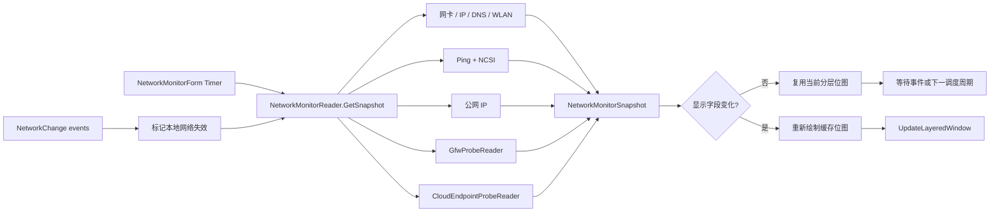

# 网络监控窗口技术说明

## 1. 文档范围

本文描述网络监控窗口的职责、数据来源、状态机、三档性能策略、后台任务一致性、GFW 检测协作方式、分层窗口渲染以及 2026-06-07 完成的性能优化。

相关源码：

| 文件 | 职责 |
| --- | --- |
| `Core/NetworkMonitorForm.cs` | 网络窗口生命周期、布局、状态文字、红叉和分层窗口绘制 |
| `Performance/NetworkMonitorReader.cs` | 本地网卡、公网 IP、连通性、延迟、抖动和门户认证检测 |
| `Performance/GfwProbeReader.cs` | GFW 多阶段探测、结果驻留和独立日志 |
| `Performance/CloudEndpointProbe.cs` | 云服务公网可用性轻量采样、异常确认和缓存 |
| `Performance/CloudEndpointProbeReader.cs` | 云服务独立单飞调度、手动冷却和网络状态门控 |
| `Performance/PdhModels.cs` | 网络、Wi-Fi、GFW 和云服务快照模型 |
| `Settings/WidgetSettings.cs` | 三档性能策略和网络窗口设置 |
| `Settings/SettingsForm.cs` | 网络窗口参数、GFW 参数和网络状态测试入口 |
| `Interop/NativeMethods.cs` | WLAN、分层窗口和原生窗口接口 |

性能模式的通用说明见：

`Docs/Performance-And-Window-Runtime.md`

优化前的网络模块源码备份见：

`Backups/NetworkMonitor-20260607-performance-optimization`

## 2. 设计目标

网络窗口遵循以下约束：

1. 网卡存在不等于互联网可用。
2. 网络请求和 Ping 不得阻塞 WinForms UI 线程。
3. 网络切换后，旧网络的结果不得覆盖新网络。
4. 同一类远程请求任意时刻最多运行一个。
5. 快照没有显示变化时不重绘窗口。
6. 省电模式依赖 Windows 网络事件，减少周期网卡枚举。
7. 测试状态只修改返回给 UI 的快照，不污染真实检测状态。

## 3. 总体架构



`NetworkMonitorReader` 拥有可变数据和后台任务状态。`NetworkMonitorForm` 只能取得快照副本，不能直接修改 reader 内部状态。

## 4. 快照与线程所有权

`NetworkMonitorSnapshot` 分为四类数据：

| 类别 | 主要字段 |
| --- | --- |
| 本地接口 | `InterfaceId`、名称、类型、速率、IPv4/IPv6、DNS |
| Wi-Fi | SSID、认证、加密、PHY、信号、收发协商速率 |
| 公网连通性 | `AccessState`、延迟、抖动、丢包、公网 IP |
| GFW 与云服务 | `GfwProbeSnapshot`、`CloudEndpointSnapshot[]` |

线程规则：

- 本地接口枚举由 UI 调度路径同步执行，但频率受性能模式和网络事件限制。
- Ping、公网 IP 和门户检测在后台任务中运行。
- 后台任务只在 `sync` 锁内提交结果。
- UI 获取的是深复制快照，Wi-Fi 和 GFW 子对象也会复制。
- 窗口关闭时 reader 取消 `NetworkChange` 静态事件订阅。

## 5. 网络状态机

### 5.1 状态定义

| 状态 | 条件 | 标题颜色 | 背景红叉 |
| --- | --- | --- | --- |
| `Unknown` | 首次检测、手动刷新或网络刚变化 | 灰色 | 无 |
| `Online` | NCSI 成功或至少一次 Ping 成功 | 绿色 | 无 |
| `NeedsValidation` | 门户重定向、401/403/511 或 NCSI 内容被替换 | 橙色 | 无 |
| `Offline` | 网卡存在，但 Ping 和 HTTP 均无法证明公网可用 | 红色 | 有 |
| `AdapterMissing` | 没有识别到可用活动网卡 | 红色 | 有 |

如果公网连通性本身为 `Online`，但 GFW 检测已完成且结果不是通过，标题栏会用橙色 `全球互联网不可用` 覆盖 `ONLINE`。该覆盖只影响标题状态文本，不改变 PING 行、GFW 行或真实 `AccessState`。

### 5.2 状态优先级

显示层按以下优先级计算状态：

1. `Connected == false`：`AdapterMissing`
2. 网络身份刚变化或检测未知：`Unknown`
3. reader 已给出明确 `AccessState`：使用该状态
4. 兼容旧快照：根据 `ConnectivityOnline` 回退为 `Online` 或 `Offline`

该顺序避免旧的 `AdapterMissing` 状态在网卡刚恢复时继续显示。

### 5.3 红叉规则

`Offline` 和 `AdapterMissing` 会在黑色背景层上绘制红叉：

- 线宽：20 个 DPI 缩放像素
- 覆盖范围：窗口宽高约 60%
- 颜色：`DangerGlyph`
- Alpha：与网络窗口背景透明度一致
- 绘制顺序：背景之后、文字内容之前

因此红叉不会改变文字透明度，也不会在 `NeedsValidation` 状态下出现。

## 6. 本地网卡识别

候选接口必须满足：

- `OperationalStatus.Up`
- 不是 Loopback
- 不是 Tunnel

评分顺序：

1. 有默认网关
2. 有有效 IPv4
3. 有有效 IPv6
4. Wi-Fi、Ethernet 或 GigabitEthernet
5. 接口速率

最高分接口作为主接口。`InterfaceId` 用于判断后台任务是否仍属于当前网络。

设置页“网卡选择”保存为 `NetworkMonitorAdapterId`。空值表示继续自动选择；非空时优先按 `NetworkInterface.Id` 匹配，兼容按接口名称匹配。手动选择的接口即使当前不是 `Up` 也会成为本地快照来源，此时 `InterfaceKnown` 保持为真、`Connected` 为假，界面可继续显示当前选择的网卡名称，同时连通性状态进入离线/未连接路径。

本地快照包括：

- 最多两个 IPv4/IPv6 地址
- 当前网卡的 DNS 地址和每个 DNS 的健康状态
- WLAN 当前连接属性
- 链路速率和接口类型

省电模式不进行固定周期接口枚举，只在首次读取、手动刷新或 Windows 网络事件后更新。

### 6.1 DNS 状态检测

DNS 地址列表随本地网卡刷新一起更新；DNS 健康状态由独立后台任务低频检测，不阻塞 UI 线程。

检测流程：

1. 对每个 DNS 服务器用 UDP 53 查询 `www.msftconnecttest.com`。
2. UDP 无响应时用 TCP 53 查询同一域名；TCP 成功但 UDP 失败显示为黄色问题。
3. 正常域名解析成功后，查询随机 `.invalid` 域名验证 NXDOMAIN。
4. 随机不存在域名返回地址时，再查询第二个随机 `.invalid` 域名；连续两次返回地址才判定为劫持，否则降为黄色问题。

单轮 DNS 检测最多 2 个 DNS 服务器并发，结果仍按原 DNS 列表顺序提交。这样能避免多 DNS 全部串行导致刷新拖太久，也不会一次性对所有 DNS 服务器打满查询。

DNS 状态颜色：

| 状态 | 条件 | 颜色 |
| --- | --- | --- |
| `Normal` | 正常域名解析成功，随机不存在域名返回 NXDOMAIN | 浅绿色 |
| `Problem` | DNS 返回错误码、无地址答案、NXDOMAIN 验证异常或仅 TCP 可用 | 黄色 |
| `Hijacked` | 随机不存在域名被解析为地址 | 红色 |
| `Unavailable` | DNS 地址无效或 UDP/TCP 均无响应 | 灰色 |
| `Unknown` | 尚未完成检测 | 灰色 |

DNS 行按异常优先排序显示：劫持、问题、不可用、未知、正常。最多显示 3 个 DNS；如果隐藏更多 DNS，`+n` 的颜色取隐藏项中的最差状态。

## 7. 连通性检测

### 7.1 检测组成

每轮连通性检测同时覆盖：

- 对 `1.1.1.1` 执行 4 次 Ping
- 单次 Ping 超时 1000 ms
- 请求 `http://www.msftconnecttest.com/connecttest.txt`
- HTTP 总超时 4000 ms
- 期望内容为 `Microsoft Connect Test`

门户请求在独立后台任务中运行，当前连通性工作线程同时执行顺序 Ping。这样总耗时接近二者的较大值，而不是两段耗时相加。

### 7.2 判定规则

判定优先级：

1. 门户检测确认需要认证：`NeedsValidation`
2. 门户检测成功或至少一次 Ping 成功：`Online`
3. 两者均失败：`Offline`

`Online` 表示互联网可用，不保证 ICMP 一定可用。某些网络会屏蔽 Ping，但允许 HTTP。

### 7.3 延迟、抖动和丢包

- 延迟：成功 Ping 的往返时间算术平均值
- 抖动：相邻成功 Ping 往返时间差的绝对值平均
- 丢包：失败次数除以 4，四舍五入为整数百分比

统计函数通过 `ref ConnectivityResult` 写回结果。不要改回按值传递，否则结构体计算结果会丢失，界面会长期显示 0 ms。

## 8. 三档性能策略

设置界面名称与内部值：

| 界面名称 | 内部枚举 |
| --- | --- |
| 性能 | `Smooth` |
| 均衡 | `Balanced` |
| 省电 | `BatterySaver` |

当前网络窗口策略：

| 项目 | 性能 | 均衡 | 省电 |
| --- | ---: | ---: | ---: |
| 面板调度上限 | 500 ms | 1000 ms | 3000 ms |
| 本地网卡刷新 | 2 s | 5 s | 网络事件驱动 |
| 在线连通性检测 | 10 s | 30 s | 60 s |
| 离线重试 | 3 s | 5 s | 10 s |
| 需要验证重试 | 5 s | 10 s | 30 s |
| 公网 IP 刷新 | 5 min | 10 min | 15 min |
| DNS 未知复查 | 15 s | 30 s | 60 s |
| DNS 异常复查 | 30 s | 60 s | 120 s |
| DNS 全正常复查 | 5 min | 10 min | 15 min |
| 悬停动画 | 16 ms | 33 ms | 100 ms |
| 静止交互轮询 | 30 ms | 100 ms | 250 ms |

表中的面板调度时间是“检查上限”，不是强制重绘频率。快照显示字段没有变化时，窗口不会重新绘制。

`AdapterMissing` 不执行周期连通性请求，等待网络事件触发。

## 9. 网络事件与 generation

reader 监听：

- `NetworkChange.NetworkAddressChanged`
- `NetworkChange.NetworkAvailabilityChanged`

事件处理器不执行网卡枚举和远程请求，只完成以下操作：

1. 标记本地信息需要刷新
2. 使公网 IP 和连通性调度立即到期
3. 增加 `networkGeneration`
4. 把当前状态切换到 `Unknown`

公网 IP 和连通性任务启动时记录：

- 当前 generation
- 当前 `InterfaceId`

任务完成时必须满足：

- reader 未释放
- generation 没有变化
- `InterfaceId` 仍相同

任一条件不满足时丢弃结果，并把对应调度时间设为立即可重试。这是切换 Wi-Fi、VPN、热点或网卡时防止旧结果覆盖的核心约束。

## 10. 单飞任务

以下标志防止同类请求并发：

- `publicIpRequestRunning`
- `connectivityRequestRunning`
- `GfwProbeReader.requestRunning`
- `CloudEndpointProbeReader.requestRunning`

调度时间记录的是任务开始时间。任务仍在运行时，即使新的 UI tick 判断已经到期，也不会创建第二个同类任务。

公网 IP 先请求 IPv6/IPv4 通用接口 `api64.ipify.org`，失败后回退 `api.ipify.org`。

公网 IP、GFW 和云服务检测只在真实网络状态为 `Online` 时启动。测试模式不会触发额外真实网络请求。云服务检测的执行与 GFW 结论解耦，GFW 被判为疑似异常时不会跳过云服务请求，也不会把海外云服务方块强制置灰。

## 11. GFW 检测协作

网络窗口把真实 `NetworkAccessState` 传给 `GfwProbeReader`：

- `Online`：允许按用户设置的周期运行
- `NeedsValidation`：不启动新探测，首次结果显示需要验证
- `Offline`：不启动新探测
- `AdapterMissing`：不启动新探测
- `Unknown`：等待网络结论

已经完成的 GFW 结果会驻留，直到下一次检测覆盖。网络暂时不可用时不会抹掉已有结论。

云服务检测由 `CloudEndpointProbeReader` 独立调度，结果仍挂在 `GfwProbeSnapshot.CloudEndpoints` 供现有 UI 绘制。开始刷新时 6 个方块进入 `Checking`，并随 UI 刷新在绿色/淡绿色和黄色之间切换，完成后结果驻留到下一轮覆盖。手动刷新接受后有 45 秒冷却，冷却期内重复点击只复用现有结果。

云服务目标：

| 显示 | 服务 | 检测方式 |
| --- | --- | --- |
| `Cf` | Cloudflare | Statuspage JSON `summary.json` |
| `Aw` | AWS | `https://aws.amazon.com/` HTTP 状态码 |
| `Go` | Google Cloud | Google Cloud Service Health `incidents.json` 降级源 |
| `Gi` | GitHub | Statuspage JSON `summary.json` |
| `Al` | 阿里云 | `https://www.aliyun.com/` HTTP 状态码 |
| `Tx` | 腾讯云 | `https://cloud.tencent.com/` HTTP 状态码 |

每轮云服务刷新先对需要刷新的目标各采样 1 次，并发上限为 3。只有首轮结果异常、无法连接或延迟达到 1000 ms 的目标才追加 2 次确认，相邻确认间隔 10 秒；首轮正常的目标不再跟随全量三次采样。公开状态 API 可用的服务优先使用 API，没有无凭证公开 API 的服务按 HTTPS 状态码分类：`2xx/3xx` 正常，`401/403` 拒绝访问，`429` 访问限流，`451` 地区受限，`404/410` 入口异常，`5xx` 服务异常，DNS/TCP/TLS/超时类失败显示为无法连接。HTTP `HEAD` 返回 `403/405/501` 时会用轻量 `GET` 复查，避免单纯拒绝 `HEAD` 的站点误报。

云服务缓存按结果分层：官方 API 正常结果缓存 30 分钟，普通 HTTPS 正常结果缓存 15 分钟，延迟过高或状态异常缓存 2 分钟，无法连接缓存 45 秒，未知结果缓存 30 秒。Cloudflare、Google Cloud 和 GitHub 的官方状态 API 支持 `ETag` / `If-Modified-Since` 条件请求；服务端返回 `304` 时直接复用缓存正文。地区设置变化时只强制刷新 Cloudflare 和 Google Cloud，AWS、GitHub、阿里云、腾讯云在 TTL 内继续复用缓存。

Cloudflare 和 Google Cloud 的官方状态源会按设置页“官方地区”过滤，当前支持日本、亚太、北美、欧洲，默认只勾选日本。Cloudflare 依据事件、维护和组件名称匹配地区；Google Cloud 依据 `currently_affected_locations` 的区域 ID 和标题匹配地区。无法识别地区的官方事件按全局事件处理，避免漏报。

至少两次正常时，取延迟最接近的两次平均值作为代表延迟；代表延迟达到 1000 ms 则显示黄色延迟过高，否则显示绿色正常。至少两次无法连接显示红色，至少两次状态异常显示橙色，其余混合结果显示橙色。

`IP4` 行右侧显示云服务方块，方块组右对齐，`IP4` 地址文本会预留方块宽度避免重叠。颜色规则：

- 网络不是 `Online`：全部灰色。
- 正在刷新：黄色。
- 正常：海外服务绿色，阿里云和腾讯云淡绿色。
- 延迟过高：黄色；无法连接：红色；状态异常：橙色。

如果云服务处于检测中，网络状态文字右侧显示黄色 `云服务测试中`。如果存在一个红色或橙色云服务，网络状态文字右侧先显示服务名加 `!`，下一次刷新显示失败层级或原因加 `!`，例如 `AWS!` / `拒绝访问!`。服务名映射为 Cloudflare、AWS、Google Cloud、Github、Aliyun、Tencent。公网文字仍使用固定右侧区域绘制，不参与云服务提示布局。

如果同时存在多个红色或橙色云服务，网络状态文字右侧按方块从左到右轮换，每个服务都按“服务名!”、“原因!”顺序随 UI 刷新切换。红色表示无法连接，橙色表示状态异常。

独立日志：

```text
%LOCALAPPDATA%\DesktopCodexAssistant\gfw-probe.log
```

每轮日志前保留空行，第一行记录时间和触发来源。GFW 触发会记录控制站点、候选站点和总结；云服务触发会记录缓存命中、轻量采样、异常确认和最终 TTL。

## 12. 绘制与缓存

### 12.1 变化检测

`HasSameDisplayData` 只比较实际影响画面的字段，包括：

- 接口、地址、DNS 地址与 DNS 状态、Wi-Fi
- 状态、公网 IP、延迟、抖动、丢包
- GFW 状态、理由和时间
- 云服务方块标签、国内外标记和显示状态

内部更新时间或不显示的数据不会触发重绘。延迟和抖动差异小于 0.5 ms 时视为相同。

### 12.2 分层窗口缓冲区

窗口复用：

- `renderBitmap` / `renderGraphics`
- `contentBitmap` / `contentGraphics`
- 按字号和样式索引的字体缓存

窗口尺寸变化时释放位图、Graphics 和字体缓存。窗口关闭时再次统一释放。

### 12.3 内容重绘与 Alpha 提交

- `RenderLayeredWindow(true)`：重新绘制背景和内容
- `RenderLayeredWindow(false)`：复用已有位图，只提交新的整体 Alpha

悬停透明度动画使用第二种路径，不重复构建文字、路径和笔刷。

当内容透明度为 100% 可见时直接绘制到主缓冲区；只有半透明内容才使用独立内容位图合成。

## 13. 隐藏、恢复和生命周期

全屏隐藏时：

- 隐藏窗口
- 停止悬停轮询
- 跳过分层窗口重绘
- reader 仍可按低频策略维护必要状态

重新显示时：

- 恢复窗口
- 重新定位
- 提交当前缓存或重新绘制
- 恢复悬停轮询

显示器恢复时 `RecoverAfterDisplayResume` 会使渲染缓存失效、重新定位窗口、请求网络刷新并重新安排下一次 tick。

## 14. 测试模式

设置中的网络状态测试依次提供：

- 实时
- 在线
- 断网
- 网卡未识别
- 需要验证

测试模式只应用到 `GetSnapshot` 返回的克隆：

- 不修改 reader 的真实快照
- 不改变真实网络调度
- 不启动额外公网 IP 或 GFW 请求
- 可以验证状态文字、颜色和红叉

退出测试模式后，下一次 UI tick 直接恢复真实状态。

## 15. 2026-06-07 优化记录

本轮主要优化：

- 三档模式统一网络调度策略
- 省电模式本地接口刷新改为事件驱动
- 快照显示不变时跳过重绘
- 复用分层窗口和内容位图
- 缓存字体并在尺寸变化时释放
- 悬停动画只更新整体 Alpha
- 公网 IP 和连通性任务增加 generation 与网卡 ID 校验
- GFW 和公网 IP 只在互联网在线时启动
- 修复延迟/抖动结构体按值传递导致结果丢失
- 修复网络切换后旧异步结果可能覆盖新网络
- 修复网卡存在但断网时仍显示 Online
- 增加 `NeedsValidation` 和 `AdapterMissing`

短时 ARM64 回归测试显示，整套程序在相同省电配置下的单核等效 CPU 采样从约 6.62% 降至约 5.44%。该数字用于同机回归比较，不是跨设备性能保证。

## 16. 维护规则

修改网络窗口时应遵守：

1. 新时间参数放在 `WidgetSettings`，不要在窗口和 reader 中重复常量。
2. 本地接口变化必须使 generation 失效。
3. 新增后台任务必须有单飞保护和过期结果检查。
4. 测试模式必须作用于克隆，不得修改真实状态。
5. 快照比较只加入实际显示字段。
6. 高频绘制路径不得持续创建未缓存的 Bitmap、Graphics 或 Font。
7. 尺寸变化和窗口关闭必须释放所有 GDI 资源。
8. `AdapterMissing`、`Offline` 和 `NeedsValidation` 不得合并为同一状态。
9. GFW 探测周期由用户设置控制，性能模式不修改其业务周期。
10. 门户认证判定优先于 Ping 成功，避免认证网络误报 Online。

## 17. 构建与验证

构建：

```powershell
powershell -NoProfile -ExecutionPolicy Bypass -File .\Build-Arm64.ps1
```

建议回归项：

1. 在线状态下延迟、抖动和丢包能够更新。
2. 禁止 ICMP 但允许 HTTP 时仍能判定互联网在线。
3. 门户重定向、401/403/511 和内容替换显示需要验证。
4. 拔出网卡显示 `AdapterMissing` 和背景红叉。
5. 网卡存在但互联网断开显示 `Offline` 和背景红叉。
6. 切换 Wi-Fi 或 VPN 后旧公网 IP 和旧延迟不会回写。
7. 四种测试状态和实时模式能够正常切换。
8. 三档性能模式热切换后调度周期正确。
9. GDI、USER 和进程句柄数不持续增长。
10. 退出后不存在残留进程，`error.log` 没有新增异常。
