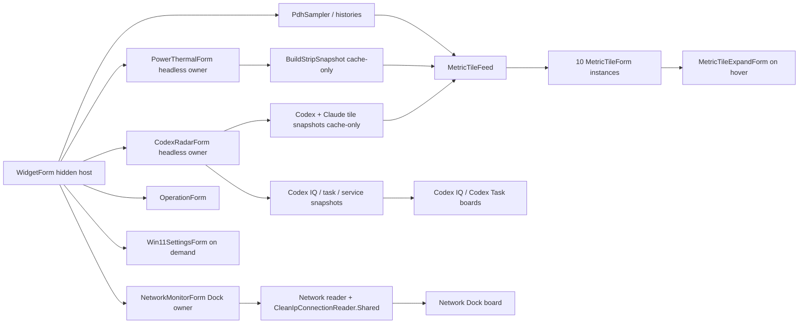

# 性能采样、可见表面与运行时架构

适用版本：2.0.0.29

本文说明性能采样、隐藏宿主、headless 数据所有者、左右边缘可见表面、分层渲染、可见性、显示恢复与布局编辑的现行边界。

## 1. 当前可见拓扑

常驻运行时只有下列用户表面：

| 区域 | 数量 | 表面 |
| --- | ---: | --- |
| 右侧方块列 | 11 | CPU、MEM、DISK、NET、GPU、NPU、PWR、GUARD、Codex 额度、Claude 额度、DeepSeek 余额；每项是独立 `MetricTileForm` |
| 左侧停靠列 | 7 | Network、Spec Board、Codex Task、GUARD、Codex IQ、重置与速蹬、系统日记的 tab；每个 tab 控制对应 board |
| 操作 | 1 | `OperationForm` |
| 设置 | 按需 | `Win11SettingsForm`，是任务栏和 Alt+Tab 中的普通设置窗口 |

隐藏运行时对象不属于可见拓扑：

| 对象 | 角色 |
| --- | --- |
| `WidgetForm` | 隐藏消息循环、性能采样与生命周期协调宿主 |
| `CodexRadarForm` | 永久 headless 的 Codex/Claude 双 family 数据所有者 |
| `PowerThermalForm` | 永久 headless 的功耗/电池/温度数据所有者 |

`NetworkMonitorForm` 只提供 Dock board 与其 tab，不提供浮动网络表面。Clean IP 画像作为 Network board 的一部分展示。设置窗口按需显示，不参与常驻边缘排列。

## 2. 所有权与数据流



关键边界：

- 数据 owner 决定采样、请求、缓存和单飞；可见表面只消费快照。
- snapshot builder 可以 clone、格式化和映射，但不能发起 I/O。
- `WidgetForm` 统一分发设置、全屏状态、显示挂起/恢复、前台层级和退出清理。
- board 与 tab 是一个模块的两个表面；全局布局只编辑 tab 的结构位置，不把展开 board 重复计数。

## 3. 隐藏宿主 `WidgetForm`

`WidgetForm.OnShown` 完成一次启动编排后保持自身隐藏。它保留 HWND 和 WinForms message loop，用于：

- 主 PDH tick、设置热加载与性能快照历史。
- 全屏/遮挡/手动隐藏协调。
- 显示器、会话、电源恢复与全局热键。
- 创建和释放 visible surfaces 与 headless owners。
- `ForceRefreshAllModules()`、设置预览和正式保存分发。
- 统一 Z-order、Win+D/SeelenUI 恢复和退出。

`ApplicationWindowStateTracker` 始终只保留低频前台窗口 Hook；全屏/最大化/遮挡可见性策略启用时才动态注册对象 Hook，并执行主采样周期的完整窗口枚举。回调只进入有界合并器，`WidgetForm` 每 125 ms 在 UI 线程批量消费并至多执行一次可见性更新；同产品辅助进程会在入队前过滤。命名停止事件由 ThreadPool 注册等待直接向宿主 HWND 投递 `WM_CLOSE`，退出不依赖可能被消息风暴饿死的 `WM_TIMER`。

隐藏宿主不创建 layered bitmap，不参与屏幕定位、hover、burn-in 或全局布局编辑，也不能被桌面宿主模式重新设为 `WS_VISIBLE`。

## 4. Headless 数据所有者

### 4.1 Radar owner

`WidgetForm.EnsureCodexRadarWindow()` 构造 `CodexRadarForm` 后调用 `StartHeadlessDataOwner()`。owner 显式创建隐藏 HWND、启动 backend scheduler，并同时维护 Codex 与 Claude 两个隔离 family。关闭时必须先 `StopHeadlessDataOwner()` 再 `Dispose()`。

可见消费者只调用：

- `BuildRadarTileSnapshot(Codex)`
- `BuildRadarTileSnapshot(Claude)`
- `BuildCodexIqBoardSnapshot()`
- `BuildServiceHealth()`
- `CodexTaskPresentation.SnapshotProvider`

以上 API 只读缓存。详细规则见 `Docs/CodexRadar-Architecture.md` 与 `Docs/Codex-ClaudeRadar-Architecture.md`。

### 4.2 Power/Thermal owner

`WidgetForm.OnShown` 构造 `PowerThermalForm` 后调用 `StartHeadlessDataOwner()`。owner 通过隐藏 HWND 接收电源广播，在单飞 worker 中采样，再由 `BuildStripSnapshot()` 把缓存投影给 `PWR` tile。关闭时调用 `StopHeadlessDataOwner()`。

owner 不显示、不定位、不渲染，也不参加 hover、burn-in 或 Z-order。详细规则见 `Docs/PowerThermal-Architecture.md`。

### 4.3 生命周期门控

headless owners 永不调用 `Show()`。全屏状态只隐藏可见表面，不停止这两个 backend；显示器关闭、会话锁定和系统挂起仍会暂停有外部成本的采样/轮询，恢复后使相关缓存到期并错峰续跑。具体刷新规则只在 `Docs/Component-Refresh-Rules.md` 维护。

## 5. 右侧 11 个指标方块

`Core/MetricTileModel.cs` 定义稳定顺序：

```text
Cpu, Memory, Disk, Network, Gpu, Npu, Power, Guard, CodexQuota, ClaudeQuota, DeepSeekQuota
```

每个 ID 对应一个独立 `MetricTileForm`。`WidgetForm.BuildMetricTileFeed()` 在控制 tick 中组装一次输入：

- 当前 `PerfSnapshot`。
- CPU/内存/磁盘/网络/GPU/NPU 历史缓冲。
- `PowerThermalForm.BuildStripSnapshot()` 的缓存副本。
- GUARD 状态。
- Codex 与 Claude 的 `RadarTileSnapshot`，以及 DeepSeek balance/service 的缓存快照。

`PushMetricTileFeed()` 把同一个 feed 推给全部 tile；方块不自行采样。鼠标悬停时 `MetricTileExpandForm` 使用同一 feed 和相同 tile ID 展开详情，也不建立 reader 或 timer。

CPU、MEM、DISK 与 NET 展开详情使用现有 tile 角色色绘制标题和窗口边框。CPU 的总占用曲线与每核柱共用 `MetricTileExpandForm.ResolvePlotY()` 的 0–100 投影，100% 柱顶与 100 参考线落在同一像素行；频率、基准频率、核心数与峰值核心显示在标题下方，不再保留曲线/柱说明图例。MEM 外环和中心数字继续显示物理内存占用率；内环改为 `MemoryPressureTracker` 投影的绿/黄/红三态服务效率压力。压力以可用物理内存和 10 秒平滑后的 `Memory\\Pages Output/sec` 换出速率为主，Commit 低于 90% 不加分，90% 以上只作为接近分配上限的安全下限。展开窗仍以紫色显示已用历史、黄色显示 GPU/NPU 共享内存历史，底部改为按真实时间保留最近 60 秒状态的压力色带；当前状态、Commit 风险和换出速率分栏显示，不能把物理占用、文件映射页读入、页文件占用或 GPU/NPU 共享量直接等同于压力。NET 小 tile 不进入通用圆环分支：上方蓝色下行、下方红色上行组成两条横向通道，每行从左到右依次绘制方向箭头、放大的 K/M/G 位速率和五段微脉冲；微脉冲只按该方向最近五个样本的局部峰值表达节奏，不表示链路容量占比，也不用于比较上下行绝对大小。断网时双通道失色、读数显示 `--` 并启用红色告警边框。NET 展开窗继续以蓝色下行、红色上行绘制镜像曲线，当前值使用 Kbps/Mbps/Gbps 位速率；DISK 以黄色写入、绿色读取绘制共享刻度曲线，当前值使用 KB/s/MB/s/GB/s 字节速率。两组当前值都在左侧连续显示。上述 tile/展开窗只读同一 `MetricTileFeed`，不得在绘制路径另行采样。

PWR 小方块只保留电量单环，不再把温度混入第二个环或告警点；当前电池充放电功率数字锚定环的几何中心，小号 `W` 独立放在数字下方的环内留白区，单位不能把主数值整体上推。功率精度沿用 v1：100 W 以下一位小数、100 W 及以上整数；unknown 显示 `--`，可读的电池空闲状态显示 `0.0 W`。展开详情采用与额度面板一致的“左侧当前状态 / 背景趋势 / 右侧预测 / 底部余量”层级：左侧显示电量与当前瓦数，背景绘制近 24 小时黄色功耗曲线和红升/青降电量曲线，右侧优先显示 Windows 当前续航、再回退到 System Day 近三小时电量斜率，底部显示当前电量与近 24 小时功耗峰值。温度继续由 headless owner 采样并进入 System Day 历史，但不在 PWR tile 或展开详情呈现。PWR 绘制只读同一 `MetricTileFeed` 中的当前 `PowerStripSnapshot` 和 5 秒缓存的 `SystemDayBoardSnapshot`，不得同步采样或读历史文件。

Codex/CLD 展开详情保留各自绿色/黄色角色色与边框。周额度历史占图表前 68%，右侧预测区显示预计耗尽或撑到 reset 的结论，5 小时额度在底条独立显示同类判断；两者仍只读同一 `MetricTileFeed`。DeepSeek 展开详情使用蓝色余额曲线、黄色 24 小时消耗和底条，并根据本地余额下降历史给出预计可用时长；UI 不在绘制路径发起 API 请求。二级防烧屏继续隐藏白色/中性色文字，并反转额度曲线、预测结论和底条的角色色。

`QuotaEasterEggTracker` 只在 Codex/Claude 已知额度从空恢复到非空时登记一次复活；启动时的 unknown→known、仅绑定凭据或未绑定状态不会误触发。常驻 tile 不绘制彩蛋文字，继续只显示本身的额度环和中心值；只有展开详情会先降低原内容亮度，再以占满可用高度的左对齐大字显示黄色单方“陨落”或红色双方“已经陨落”。恢复后只在第一次展开该 family 时显示同样布局的蓝色斜体复活提示。`GeniusProgrammerEasterEggEnabled` 默认开启并可整体关闭。

两级防烧屏由 `WidgetForm.UpdateBurnInProtectionTriggers()` 统一发布。一级通过 `LayeredWidgetFormBase.PresentationLuminancePercent` 把 11 个 tile 与当前展开窗按同一亮度策略处理；`WidgetForm.UpdateMetricTileBurnInPresentation()` 命中任意一个右侧 tile 或展开窗时，整组临时恢复亮度和原始强调色。进入二级的边沿会立即调用 `HideMetricTileExpand()` 收起当前展开窗并清除其 tile owner；非悬停时仍由 `MetricTileForm.ResolveBurnInRingColor()` 反转圆环或 NET 双通道的角色色，悬停时同一 helper 跳过反色，但真实二级状态保持锁定，因此 `MetricTileForm.ShouldDrawCenterText()` 仍抑制 tile 中心/NET 速率白字、`MetricTileExpandForm.ShouldDrawNeutralText()` 仍抑制展开窗的白色/中性色文字，避免把整个位图做全局反色。

右列排列由 `RightTileButtonOrder`、启用状态、0–100 分布间距、整组 Y 偏移和目标工作区解析。分布值 0 时相邻 tile 紧贴；100 时首个 tile 贴工作区顶部、末个贴底部，其余可用空白在 10 个间隔间均匀分摊；中间值线性使用对应比例的可用空白。自动排列保持整列贴住工作区右缘；防烧屏只对整组应用共享 Y 偏移，不能让 11 个方块各自漂移而破坏列结构。`RightTileMouseClickThroughEnabled` 默认开启，通过 layered window 的 `WS_EX_TRANSPARENT` 同时覆盖 11 个小窗与展开窗；悬停仍由共享光标轮询判定。

“主显示器/主工作区”设置仍是右侧 tile 的布局基线。目标显示器断开时按设置决定回退到主显示器或保留上次工作区；这些设置不依赖隐藏宿主是否可见。

## 6. 左侧 7 个停靠位

固定角色顺序为：

```text
Network, SpecBoard, CodexTask, Guard, CodexIq, ResetSpeed, SystemDay
```

`LeftDockLayout` 根据启用项、稳定顺序、真实 DPI 尺寸、0–100 分布间距和整组 Y 偏移计算 7 个 tab。分布值 0 时梯形按钮紧挨；100 时整列覆盖工作区完整高度；整数余数在 6 个间隔间均匀分摊，任意两个间隔最多相差 1 像素。`EdgeDockTabForm` 负责：

- 左缘绝对可达的梯形 tab。
- 悬停展开与离开/外部点击收起。
- 固定角色色、隐藏态透明度、两级防烧屏 tab 配色和 board 内描边。
- 共享 120 ms 交互 tick，不建立全局 mouse hook。
- `ApplyRuntimeOffsetWithPinnedX`：X 固定在工作区左缘，只允许整组 Y 微位移。

展开 board 的 X 统一固定为 `workArea.Left + tab.Width`，因此七块 board 水平对齐。board 之间按产品规则互斥；后打开者收起其它 board。每个 board 仍拥有自己的数据和显示 tick，tab 不复制业务 reader。重置与速蹬看板只读取 `CodexRadarForm.BuildResetSpeedBoardSnapshot()` 的缓存投影；系统日记复用现有性能与 Power/Thermal 快照，细节见 `Docs/SystemDayBoard-Architecture.md`。

七块 board 的底部操作轨统一从左缘开始，且都只保留一枚主操作和一枚关闭：主操作使用 `Success` 语义绿色，关闭使用 `Danger` 红色，按钮按实测字体宽度加左右各 14 逻辑像素留白且不窄于 42，按钮间距为 4，状态区再留 5。Network、Spec Board、Codex Task 保留刷新、管理和视图切换；GUARD 使用设置；Codex IQ 与重置/速蹬使用 cache-only 刷新；System Day 的单枚范围按钮按“今天 → 24 小时 → 近一周”循环切换。各 board 不再保留顶部重复关闭符号。

七块 board 共同采用提高后的可读性下限：标题、正文、辅助信息、图表标签和底栏分别按所在 board 的真实宽度分级放大；固定 648×400、Network 240×400、Spec 480×640、GUARD 640×800 与 Codex Task 300×400 样张必须保持无串栏。字号仍从窗口级 `UiFontCache` 取得，行高和按钮宽度按字体实测，长文本只在自己的矩形内省略；放大字号不改变 board footprint、命中区语义、数据 owner 或刷新周期。

Network 是 Dock-only；其采样、PathPing、固定 Ping、Clean IP 和 board 缓存规则见 `Docs/NetworkMonitor-Architecture.md`。

## 7. Operation 与 Settings

`OperationForm` 是常驻可见表面，拥有 RadialDial、快速开关、刷新、设置入口和 GUARD 联动。动画 timer 只在按压或悬停状态尚未收敛时运行；静止交互复用 `WidgetForm` 的共享 tick。

RadialDial 核心圆圈和经典 Start 按钮的双击统一进入 `WidgetForm.ToggleSideSurfacesFromOperationPanel()`：第一次真实隐藏七个左侧 tab/board、十一项右侧 tile 与 hover expand，第二次恢复；`OperationForm` 自身保留为恢复入口。RadialDial 圆心在隐藏态降低表面亮度作为状态反馈，但该状态不参与菜单布局、命中或点击路由，隐藏后单击圆心仍可弹出全部扩展按钮。隐藏通过各窗体的可见性 API 完成，因此隐藏表面不再参与命中、悬停展开或鼠标遮挡。右侧 tile 的可见性转换是对称的：进入隐藏态调用 `MetricTileForm.HideTile()`，退出隐藏态由 `MetricTileForm.SetHiddenForFullscreen(false)` 调用 `ShowTile()`，同步恢复 WinForms 可见性、hover timer、定位和 layered render。旧 `OperationLauncherTrioForm` 及其双击分支已移除。

`Win11SettingsForm` 按需创建，`ShowInTaskbar=true`。设置预览经 75 ms debounce 应用；保存写 `settings.ini`，取消或异常关闭恢复打开时 baseline。设置窗口不是 layered edge surface，不参加 burn-in，也不进入 19 项全局布局清单。布局与位置页在左右列间距/偏移调节项下方提供“侦测并对齐”：`Win11SettingsForm.TryResolveSideColumnBalance()` 每次按当前两列的实际成员数量、尺寸、显示器工作区和 0–100 分布包络重新求解，在上下边缘最多 1 像素视觉误差的解中优先选择对现有间距改动最小者，并同步两列整组偏移；执行该命令会开启左右自动排列，但不新增持久化设置键。

## 8. 性能模式

用户可选性能、均衡和省电；内部 `Smooth` 是“性能”的兼容枚举名。模式影响：

- 主 PDH 和普通调度检查频率。
- GPU/NPU 等昂贵计数器的独立采样频率。
- hover 动画与静止交互轮询频率。
- 网络本地枚举、连通性、PING、DNS 与公网 IP 节流。
- 功耗和温度 deadline。
- 进程优先级与 Windows Power Throttling。

所有具体间隔、单飞、冷却、网络事件和暂停恢复表只在 `Docs/Component-Refresh-Rules.md` 维护。架构文档只保留所有权和边界，避免出现第二份会漂移的数字表。

## 9. 可见性与全屏

`WidgetForm` 统一计算全屏、最大化、遮挡和手动物理隐藏。规则按表面类型分开：

| 类型 | 全屏/隐藏行为 |
| --- | --- |
| 右侧 tile / expand | 隐藏可见表面；feed owner 可继续维护必要缓存 |
| 左侧 tab / board | 隐藏或收起可见表面；board 自身按模块规则停止不必要绘制 |
| Operation | 停止动画/FPS 等展示工作并隐藏 |
| Settings | 用户任务窗口，不被 edge-widget 物理可见性规则当作布局表面 |
| headless Radar/Power owners | 不因全屏标志停止 backend；仍服从显示关闭、会话锁定和系统挂起 |
| hidden Widget host | 始终保持消息循环与协调职责 |

普通 hover 命中、click-through 和防烧屏局部显现只作用于有命中表面的可见 layered forms。不得把 headless owner 加入展示交互轮询清单；hidden host 只协调共享状态。

## 10. 显示挂起与恢复

显示关闭或系统显示栈恢复时，协调顺序为：

1. 标记 display suspend，停止可见表面的动画/绘制并释放 layered render resources。
2. 通知需要暂停外部采样的 owner/reader。
3. 恢复后延迟执行多轮显示器/work-area 重新枚举。
4. 重建可见表面的 bitmap、Graphics、字体缓存和命中区。
5. 按右列/左列结构重新定位，再恢复 tab、board 与 Operation。
6. 使数据缓存到期，由各 owner 的单飞规则错峰刷新。
7. 重申 TopMost 组顺序，并按设置处理 SeelenUI 与进程重启流程。

迟到的后台结果必须验证 owner 状态、generation、接口或请求 key，不能在恢复后覆盖新显示/网络状态。Radar owner 的 Stop/挂起会先失效并取消 generation，恢复只建立一个新 generation 并 prime 一轮，避免 refresh storm 或双 timer。

## 11. 分层渲染资源

可见 layered forms 统一复用：

- `NativeMethods.LayeredBitmapSurface`
- `UiFontCache`
- `DesignTokens`
- `BurnInProtection` 的像素微迁移、两级视觉状态、强调色反转和右列降亮处理

内容变化时才重建像素；仅整体透明度变化时复用现有位图提交 Alpha。尺寸变化、显示挂起和关闭必须释放 Bitmap、Graphics、字体、Region 与原生句柄。绘制失败可记录诊断并降级，但不能在 paint 路径同步访问网络、WMI、文件或外部进程。

headless owners 不拥有展示缓冲。Codex/Power 的旧 renderer 已删除，只保留抽象基类要求的空 `DrawWindowContent` 和恒 false 的 `CanRenderLayeredWindow()`；hidden `WidgetForm` 同样不提交 layered bitmap。

## 12. Burn-in、交互与 Z-order

- 右侧 11 个 tile 在自动模式使用同一个列 salt 和 Y 偏移。
- 左侧 7 个 tab 在自动模式使用同一个列 salt；X 始终钉住 work-area 左缘。
- 展开 board 可以使用自己的 named salt，但固定相同展开 X。
- Operation 使用自己的 named salt。
- `WidgetForm` hidden host 只拥有两级空闲状态，不绘制防烧屏像素；headless owners 完全不参与。
- 一级下，左侧 `EdgeDockTabForm` 静止态绘制深灰色梯形与角色色箭头，悬停只恢复当前梯形的角色色；右侧 tile/expand 使用 `BurnInProtection.LevelOneLuminancePercent = 45`，命中任意右侧窗口时整组恢复亮度和原始强调色。
- 进入二级时先强制收起当前右侧展开窗并清除其 tile owner；二级视觉保持一级结构，非悬停时只反转左箭头与右 tile 环形强调色。鼠标命中任意右侧小窗或展开窗时，整个右侧组临时取消反色并恢复亮度，但不退出二级，因此右 tile 中心白字及重新悬停打开的展开窗白色/中性色文字仍不绘制；离开后立即重新反色。角色色标签、灰色轨道、board 内容和 Operation 不做全位图反相。
- 鼠标移动在保护激活后是局部显现手势，不退出状态；点击、滚轮或键盘输入会退出并重启两级计时。显示挂起、布局编辑和关闭也归零状态。
- 夜间计划与防烧屏亮度在 `LayeredWidgetFormBase` 内相乘，任一策略都不能把另一策略已压低的像素重新提亮。
- 旧 `BurnInHiddenModeColorProtectionEnabled` 永久保留为 schema 88 退休输入；schema 89 的 `BurnInProtectionEnabled`、`BurnInLevelOneIdleSeconds` 与 `BurnInLevelTwoDelaySeconds` 是独立新设置，迁移不读取旧布尔值。

TopMost 恢复只遍历当前可见 forms，保持组内顺序，并把本程序表面放在受保护的 Codex 宠物/SeelenUI 层级策略所要求的位置。不得维护包含已删除表面的固定列表。

## 13. 全局布局编辑

`GlobalLayoutEditorForm.BuildEditableSurfaceIds()` 的规范集合恰好 19 项：

```text
Operation
LeftDockTab.Network
LeftDockTab.SpecBoard
LeftDockTab.CodexTask
LeftDockTab.Guard
LeftDockTab.CodexIq
LeftDockTab.ResetSpeed
LeftDockTab.SystemDay
MetricTile.Cpu
MetricTile.Memory
MetricTile.Disk
MetricTile.Network
MetricTile.Gpu
MetricTile.Npu
MetricTile.Power
MetricTile.Guard
MetricTile.CodexQuota
MetricTile.ClaudeQuota
MetricTile.DeepSeekQuota
```

进入编辑时，50% 黑色遮罩临时禁用环境隐藏，把这 19 个结构表面保持在遮罩上方。拖拽只修改位置、整列偏移或目标显示器；Enter 保存，Esc 恢复 baseline。

不得加入：

- 7 个展开 board（由各自 tab 代表）。
- `Win11SettingsForm`。
- `WidgetForm` hidden host。
- Radar/Power headless owners。
- hover expand 临时表面。

`--test-layout` 必须断言规范 ID 集合、稳定顺序、启用过滤、列偏移边界和编辑前后可见性恢复。

## 14. 设置兼容边界

- `PowerThermalIntegratedEnabled` 仅兼容读取，在设置 UI 隐藏；它不能控制采样、owner 生命周期或显示。
- 旧独立展示的尺寸、位置、透明度、缩放和变体值不能创建额外表面。
- Network 始终按 Dock 结构运行；旧浮动展示选项不能改变 topology。
- Radar 设置控制 Codex 公共数据、Codex/Claude 官方额度、DeepSeek DPAPI 凭据入口、服务健康和测试；不包含 Claude 社区模型/fallback，也不控制 owner 可见性。
- 主显示/work-area 设置继续作为右 tile 列基线；不能因为 hidden host 没有画面而删除。
- 两级防烧屏只作用于七个左 tab 与右侧 tile/expand；Operation、board、Settings、hidden host 和 headless owners 不进入配色投影。
- schema 91 保留 `LeftDockButtonGapPixels` / `RightTileButtonGapPixels` 旧键名以兼容既有 `settings.ini`，但语义为 0–100 分布值；设置页左右两项都提供滑块与数字输入，既有 0–80 数值迁移时原样保留。schema 91 同时补齐 ResetSpeed 的 tab、透明度、缩放和自动收回设置。
- schema 92 补齐 SystemDay 的 tab、透明度、缩放和自动收回设置；schema 93 把 DeepSeek 余额 tile 追加到既有右列顺序。
- schema 94 退休 `OperationDoubleClickSpecialMenuEnabled`；旧键只作为迁移输入识别并在规范化保存时移除，双击行为不再可切回已删除的启动器。

新设置若影响可见表面，必须覆盖 defaults、clone、load/save、normalize、UI、migration 和 `--test-settings-bindings`；兼容键不得重新进入设置 UI。

## 15. 命令行与验证

当前离屏渲染入口：

```text
--render-networkmonitor
--render-tilecolumn
--render-operation
--render-resetspeedboard
--render-systemdayboard
--render-specboard <sample|current>
--render-specboardmanager <sample|current>
--render-guard <sample|current>
```

这些入口只渲染仍存在的可见表面或 board。所有样张数据都应由固定 fixture 或当前只读快照提供，不启动正式后台 owner。

建议验证：

```powershell
powershell -NoProfile -ExecutionPolicy Bypass -File .\Build-Arm64.ps1 -OutputPath .\_build\DesktopCodexAssistant-arm64-test.exe -Platform arm64
.\_build\DesktopCodexAssistant-arm64-test.exe --test
.\_build\DesktopCodexAssistant-arm64-test.exe --test-layout
.\_build\DesktopCodexAssistant-arm64-test.exe --test-settings-bindings
.\_build\DesktopCodexAssistant-arm64-test.exe --test-display-recovery
.\_build\DesktopCodexAssistant-arm64-test.exe --test-radar-display-lifecycle
.\_build\DesktopCodexAssistant-arm64-test.exe --test-operation-panel
```

人工核对重点：右侧恰好 11 个独立 tile、左侧恰好 7 个 tab/board、Operation 正常、Settings 可从任务栏/Alt+Tab 返回、全局编辑恰好 19 项、Network 只有 Dock 展示，以及三个隐藏对象从未出现在桌面、任务栏、布局编辑器或渲染样张中。
