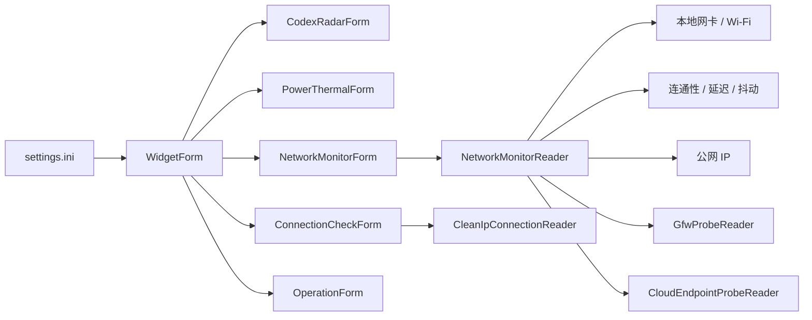
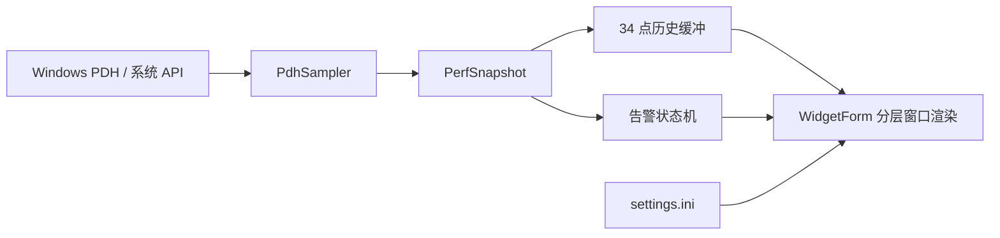

# 性能模式、主窗口与指标运行机制

## 1. 文档范围

本文以 Desktop Codex Assistant 当前源码为准，说明性能数据从 Windows 采样到界面显示的完整链路、三档性能模式、近期优化，以及以下窗口的共同运行机制：

- 主性能窗口 `WidgetForm`
- Codex 监测窗口 `CodexRadarForm`
- 功耗与温度窗口 `PowerThermalForm`
- 网络监控窗口 `NetworkMonitorForm`
- 连接检测窗口 `ConnectionCheckForm`
- 操作窗口 `OperationForm`

网络监控窗口的源文件备份位于：

`Backups/NetworkWindow_20260607_0900`

网络窗口的完整状态机、检测算法和渲染说明见：

`Docs/NetworkMonitor-Architecture.md`

本文中的“主窗口”指六栏 CPU、内存、磁盘、网络、GPU、NPU 性能面板，不包含设置窗口。

## 2. 总体架构

`WidgetForm` 是主窗口和运行协调器。它负责加载设置、检测全屏状态、创建其他窗口，并把运行时设置同步到各窗口。`PdhSampler` 负责读取 Windows PDH 性能计数器及系统硬件信息，渲染层不直接查询系统数据。

每个监控窗口保持自己的定时器和快照，不共享 UI 绘制线程之外的可变图形对象。耗时采样和网络请求在后台任务中执行，结果通过锁保护的快照传回 UI 线程。



主性能窗口的数据链如下：



数据职责按层分离：

- `PdhSampler`：读取原始字节率、占用率、容量、硬件名称和连接状态。
- `PerfSnapshot`：保存一次采样的不可视化数据，不包含文本排版。
- `WidgetForm`：换算单位、维护历史、计算告警、构造栏目文本并绘制。
- `NetworkRateFormatter`：统一网络和磁盘速率的显示单位及小数规则。

## 3. 三档性能模式

设置界面名称与内部枚举的对应关系：

| 设置界面 | 内部值 | 目标 |
| --- | --- | --- |
| 性能 | `Smooth` | 更高刷新率和交互流畅度 |
| 均衡 | `Balanced` | 默认刷新率，控制后台开销 |
| 省电 | `BatterySaver` | 降低采样、绘制、网络探测和交互轮询频率 |

模式切换可以热生效，不需要重启。`WidgetForm.ApplyRuntimeSettings` 将新设置分发到所有子窗口。

### 3.1 通用时间策略

下表参数由 `WidgetSettings` 统一提供：

| 策略 | 性能 | 均衡 | 省电 |
| --- | ---: | ---: | ---: |
| 主性能采样 | 500 ms | 1000 ms | 2500 ms |
| 普通面板调度 | 500 ms | 1000 ms | 3000 ms |
| 悬停动画帧间隔 | 16 ms | 33 ms | 100 ms |
| 无动画交互轮询 | 30 ms | 100 ms | 250 ms |
| 本地网络信息刷新 | 2 s | 5 s | 网络事件驱动 |
| 在线连通性检测 | 10 s | 30 s | 60 s |
| 需要认证时重试 | 5 s | 10 s | 30 s |
| 离线时重试 | 3 s | 5 s | 10 s |
| 公网 IP 刷新 | 5 min | 10 min | 15 min |

`AdapterMissing` 状态不进行周期连通性检测，等待网络地址或可用性事件重新触发。

### 3.2 Windows 进程级策略

- 性能、均衡：正常进程优先级，清除执行速度节流请求。
- 省电：请求 Windows 执行速度节流，并把进程优先级设为 `BelowNormal`。
- 设置失败不会中断程序，结果写入主日志。

该策略只改变调度优先级，不改变检测结果或告警阈值。

## 4. 本轮优化

### 4.1 只在内容变化时绘制

`NetworkMonitorForm` 和 `ConnectionCheckForm` 先比较旧、新快照。只有显示字段变化、窗口尺寸变化或需要动画时才重绘。

定时器仍会读取轻量快照，以便及时接收后台任务完成后的结果，但不会为相同内容重复执行完整 GDI+ 绘制。

### 4.2 复用分层窗口缓冲区

主窗口、Codex、功耗、网络和连接检测窗口均复用 `Bitmap` 与 `Graphics`：

- 尺寸不变时复用缓冲区。
- 尺寸变化或窗口关闭时释放。
- 仅透明度变化时复用已绘制内容，只调用 `UpdateLayeredWindow`。
- 网络窗口额外缓存内容层和字体，避免每帧创建 GDI 对象。

这减少了托管对象分配、GDI 句柄波动和垃圾回收压力。

### 4.3 交互定时器按需运行

悬停透明度动画分为两种频率：

- 动画进行中：使用对应模式的动画间隔。
- 动画静止：切换到较低频率的空闲轮询。

窗口因全屏模式隐藏时停止悬停定时器，重新显示后恢复。

`OperationForm` 的动画定时器只在按压、悬停或过渡动画未完成时运行。

### 4.4 网络事件驱动

`NetworkMonitorReader`、`CleanIpConnectionReader` 和 Codex 服务状态监听：

- `NetworkChange.NetworkAddressChanged`
- `NetworkChange.NetworkAvailabilityChanged`

网络变化时只设置失效标记。真正的网卡枚举和网络请求仍由各自调度路径执行，避免在系统事件线程中阻塞。

省电模式下，本地 IP、DNS、Wi-Fi 等信息主要由网络事件触发刷新，而不是固定轮询。

### 4.5 异步任务与过期结果保护

网络监控将公网 IP 和连通性检测放入后台任务。每次网络身份变化都会增加 `networkGeneration`。

后台任务完成时必须同时满足：

- generation 与任务启动时一致；
- 网卡 ID 与任务启动时一致；
- reader 尚未释放。

否则结果被丢弃，避免旧网络的公网 IP 或延迟覆盖新网络状态。

功耗与温度读取采用单任务运行规则。采样正在执行时，新请求只合并为一个待处理请求，避免慢传感器导致任务堆积。

### 4.6 全屏、休眠与显示恢复

- 全屏隐藏时，各窗口停止不必要的悬停和绘制。
- 主窗口在省电模式下跳过隐藏期间的昂贵 PDH 采样，但控制定时器仍运行，因此可以处理停止信号、设置变更和退出全屏。
- 显示器关闭、会话锁定或系统休眠时，Codex 与功耗采样暂停。
- 显示器关闭或系统挂起时，主窗口会释放主窗口和子窗口的托管渲染缓存，并重置复用的 native layered-window DC/HBITMAP，避免唤醒后继续使用息屏前的 GDI 资源。
- 显示恢复后执行三轮延迟恢复，重新定位、重建 layered-window 资源、强制重绘，并安排一次刷新；这覆盖 DWM、显示驱动或 WorkerW 桌面宿主稍晚恢复的情况。
- `--desktop-parent` 模式下，恢复时先把主窗口从旧 WorkerW 脱离成普通顶层窗口，再尝试挂接到新的桌面宿主；如果第一次没有找到宿主，后续恢复轮继续重试。

### 4.7 主网络接口筛选

Windows 中可能同时存在 Wi-Fi、以太网、WSL2、Hyper-V、VPN 和 WAN Miniport。主性能窗口不会直接采用枚举到的第一个接口。

`PdhSampler` 使用以下规则：

1. 排除未启用、回环、隧道和已知虚拟接口。
2. 优先选择带默认网关的接口。
3. 其次优先带有效 IPv4 地址的接口。
4. 再根据 Wi-Fi/以太网类型和链路速度评分。
5. Wi-Fi 接口优先显示实时 SSID；无法读取 SSID 时退回接口名称或描述。

PDH 网络速率计数器也排除 WSL、`vEthernet`、Hyper-V、虚拟交换机和 WAN Miniport，避免虚拟交换流量被误计入主网络图表。

### 4.8 统一速率格式

网络和磁盘速率都由 `NetworkRateFormatter` 格式化：

- 原始输入为 `Bytes/sec`。
- 显示值使用十进制比特率：`Kbps`、`Mbps`、`Gbps`。
- 达到 `1000 Kbps` 切换为 `Mbps`，达到 `1000 Mbps` 切换为 `Gbps`。
- 显示值小于 `10` 时保留一位小数；四舍五入后大于等于 `10` 时不显示小数。

因此 `100 KB/s` 的原始字节率会显示为约 `800 Kbps`，而不是 `100 Kbps`。这是有意采用与网络模块一致的比特率口径。

### 4.9 磁盘四行显示

磁盘栏目读取整块物理磁盘计数器，当前文本为：

1. `DISK`
2. `WT`：物理磁盘写入速率
3. `RD`：物理磁盘读取速率
4. 已用容量/总容量，单位 `GB`，四舍五入到整数

图表包含写入和读取两条自动缩放曲线。容量只保留在第四行文本中，不参与曲线缩放。

`Disk Read Bytes/sec` 和 `Disk Write Bytes/sec` 反映实际到达物理磁盘设备的 I/O。Windows 文件缓存命中不会形成同等数量的物理读取，因此日常使用中读取曲线长时间接近零、写入仍有波动是正常现象。若要观察应用请求的逻辑 I/O，应改用进程 I/O 或逻辑磁盘口径，不能直接与当前物理磁盘数值比较。

### 4.10 磁盘联合告警

磁盘红色背景和黄色告警图标使用 `% Disk Write Time` 与 `% Disk Read Time`，不使用 WT/RD 速率数值。联合告警值为两者的较小值：

```text
diskAlertPercent = min(writeBusyPercent, readBusyPercent)
```

这意味着只有读写忙碌度同时达到条件时才触发：

- 低于 `80%`：无红色背景。
- `80%` 到 `100%`：红色背景透明度线性增加。
- `100%`：红色背景不透明度约 `70%`。
- 大于等于 `98%` 且连续至少 `3` 秒：显示并闪烁黄色三角告警。
- 设置中的告警测试：强制按 `100%` 处理，不需要制造真实高负载。

## 5. 各窗口运行机制

### 5.1 主性能窗口

主定时器执行以下顺序：

1. 检查全局停止事件。
2. 检查 `settings.ini` 修改时间并热加载设置。
3. 更新全屏可见性。
4. 按模式决定是否采样 PDH 数据。
5. 更新历史曲线、告警状态并绘制。

隐藏时仍保留控制循环。省电模式隐藏后不读取 PDH；性能模式维持正常采样；均衡模式降低控制循环频率。

各栏目的当前数据口径：

| 栏目 | 主要数据源 | 显示和图表 | 告警值 |
| --- | --- | --- | --- |
| CPU | Processor/Processor Information PDH | 总占用曲线、每逻辑核心柱状图、实时/基准频率 | CPU 柱状图自身颜色规则，不使用通用面板红底 |
| MEMORY | Windows 内存状态及 `Win32_PhysicalMemory` | 厂商、频率、占用率、已用/总量 | 内存占用率 |
| DISK | PhysicalDisk PDH 及卷容量 | WT/RD 双曲线、整数容量行 | 读写忙碌度较小值 |
| NETWORK | Network Interface PDH、NetworkInterface API、Wi-Fi API | SSID/接口名、UP/DL 双曲线；Wi-Fi 时增加 RSSI 行 | 断线状态，不使用通用高负载告警 |
| GPU | GPU Engine/Adapter Memory PDH | GPU 与显存双曲线 | GPU/显存占用率较大值 |
| NPU | NPU 计数器，必要时从 GPU Engine LUID 分类 | NPU 与共享/专用内存双曲线 | NPU/内存占用率较大值 |

历史曲线最多保留 34 个点。CPU、内存、GPU、NPU 使用百分比；网络和磁盘历史统一保存为 `Kbps`，绘图时按当前历史最大值自动缩放。

主窗口文本支持三行和四行布局。磁盘容量和 Wi-Fi RSSI 使用四等分行高；其他栏目继续使用原有三行布局，避免四行支持改变非 Wi-Fi 网络和内存的字号及间距。

Wi-Fi RSSI 读取方式：

- 先通过 `WlanQueryInterface` 读取当前连接详情、SSID、BSSID 和链路速率。
- 再通过 `WlanGetNetworkBssList` 读取当前可见 BSS 列表。
- 使用当前 BSSID 匹配对应 `WLAN_BSS_ENTRY.lRssi`，显示为 `RSSI -45dBm` 这类格式。
- 主性能窗口缓存主网络状态，Wi-Fi RSSI 约每 5 秒刷新一次；网络切换事件会立即触发重新检测。

### 5.2 主窗口告警层

除 CPU 和网络外，通用告警层按以下顺序绘制：

1. 图表基础背景与边框。
2. 随占用率变化的红色背景层。
3. 黄色透明三角边框和感叹号。
4. CPU 核心柱或历史曲线。

告警图标达到触发条件后，在每次刷新间于约 `30%` 和 `70%` 黄色不透明度之间切换。测试开关复用同一绘制路径，只替换输入值，因此可验证布局和动画而不增加硬件负载。

### 5.3 网络监控窗口

网络监控分为 UI 层和数据层。

`NetworkMonitorForm`：

- 定时读取 `NetworkMonitorReader` 的快照；
- 对比显示字段；
- 只在变化时绘制；
- 处理位置、透明度、穿透和全屏隐藏。

`NetworkMonitorReader`：

- 同步读取本地网卡、IPv4/IPv6、DNS、Wi-Fi 认证和 PHY；
- 支持设置页指定当前网卡；未指定时继续按默认网关、地址、接口类型和链路速率自动选择；
- 异步读取公网 IP；
- 异步执行 Ping、NCSI 门户检测、延迟、抖动和丢包率测量；
- 调用 `GfwProbeReader` 获取防火墙检测结果；
- 调用 `CloudEndpointProbeReader` 独立获取云服务检测结果，GFW 失败结论不会使云服务检测跳过或置灰；
- 返回快照副本，禁止 UI 直接修改内部状态。

连通性状态判定：

| 状态 | 含义 |
| --- | --- |
| `Online` | Ping 或 NCSI 证明公网可用 |
| `NeedsValidation` | 门户重定向、HTTP 认证状态或内容被替换 |
| `Offline` | 网卡存在，但连通性检测失败 |
| `AdapterMissing` | 没有可用的物理网络接口 |
| `Unknown` | 正在刷新或尚未得到结论 |

### 5.4 Codex 监测窗口

面板定时器负责检查各数据源是否到期，但网站检测周期与 UI 性能模式分离：

完整的数据合并、重置保护、IQ/效率算法和额度文件缓存说明见：

`Docs/CodexRadar-Architecture.md`

| 数据源 | 周期 |
| --- | ---: |
| reset 状态 | 15 min |
| current.json，包含 radar 与 model_iq | radar 开启时 5 min |
| current.json，包含 radar 与 model_iq | radar 未开启时 10 min |
| 网站失败重试 | 2 min |

性能模式只影响额度读取和进程检测：

| 项目 | 性能 | 均衡 | 省电 |
| --- | ---: | ---: | ---: |
| Codex 活跃时额度刷新 | 10 s | 15 s | 30 s |
| Codex 进程检查 | 3 s | 5 s | 10 s |
| Codex 不活跃时额度刷新 | 10 min | 20 min | 60 min |

时间显示最多每秒重绘一次。网站请求完成、测试状态变化或额度变化可以立即触发绘制。

### 5.5 功耗与温度窗口

功耗与温度采用自适应采样：

| 策略 | 性能 | 均衡 | 省电 |
| --- | ---: | ---: | ---: |
| 功耗 | 1 s | 2 s | 5 s |
| 温度低于 65°C | 2 s | 5 s | 10 s |
| 65°C 至 69.9°C | 1.5 s | 3 s | 5 s |
| 70°C 至 89.9°C | 1 s | 2 s | 3 s |
| 90°C 及以上 | 1 s | 1 s | 1 s |

温度升高时会自动提高采样频率。严重温度告警的 1 秒采样不受省电模式限制。

### 5.6 连接检测窗口

CleanIP 检测触发条件：

- 首次启动；
- 网络重新连接；
- 每小时计划，随机偏移范围为正负 5 分钟并包含秒；
- 错误状态下到达 10 分钟时间槽；
- 设置中的手动刷新；
- 操作面板强制刷新。

检测结果会一直保留到下一次检测覆盖。网络事件只使网络状态缓存失效，不会伪装成手动或操作面板触发。

测试模式快照会缓存，只有测试状态或手动刷新 token 变化时重新生成，避免每个 UI tick 都改变时间并触发重绘。

### 5.7 操作窗口

操作窗口没有持续数据采样。它只处理：

- Windows/SeelenUI 开始菜单操作；
- 打开设置；
- 退出 SeelenUI；
- 按压与悬停动画。

动画结束后停止动画定时器，因此静止状态几乎没有绘制负担。

## 6. 窗口合成与交互模式

### 6.1 分层窗口

各监测窗口使用 Windows layered window。界面先绘制到内存 `Bitmap`，再通过 `UpdateLayeredWindow` 一次提交带 Alpha 的画面。这样可以实现无边框、每像素透明度和桌面层显示。

透明度分成两部分：

- 黑色背景透明度：控制面板和图表底色。
- 内容透明度：控制文字、曲线、边框、图标等背景之外的内容。

两项设置同时应用于主性能窗口和功耗/时间窗口。只改变整体 Alpha 时不会重新绘制全部内容，而是复用渲染缓冲并重新提交窗口。

### 6.2 可见性与桌面层

| 模式 | 行为 |
| --- | --- |
| 一直可见 | 普通顶层窗口，应用在前台时仍显示 |
| 仅桌面可见 | 挂接桌面宿主层，只在桌面场景显示 |
| 仅全屏不可见 | 普通顶层窗口，检测到全屏应用后隐藏 |

全屏检测和位置维护由主窗口控制循环处理。位置 X/Y 以目标屏幕坐标为准，保存设置后所有子窗口重新应用位置。

### 6.3 分辨率与工作区比例适配

`settings.ini` 从 Version 9 起写入 `LayoutWorkAreaLeft`、`LayoutWorkAreaTop`、`LayoutWorkAreaWidth` 和 `LayoutWorkAreaHeight`。这些值记录上次保存或适配时的主屏工作区，不包含任务栏占用区域。

加载设置、收到 `WM_DISPLAYCHANGE`、收到系统设置变化、息屏恢复和会话解锁恢复时，`WidgetSettings.AdaptToCurrentWorkArea` 会比较旧工作区与当前工作区：

- 宽度、左侧坐标按 X 比例换算；
- 高度、底边坐标按 Y 比例换算；
- 操作面板的按钮尺寸使用较小轴比例，保持正方形；
- 所有窗口最终再裁剪到当前工作区，避免低分辨率或任务栏变化后跑出屏幕。

因此用户在当前分辨率下调整好的屏占比，会在切换分辨率、外接显示器模式变化或息屏唤醒后尽量保持一致。

### 6.4 鼠标穿透与防遮挡

`ClickThroughMode` 有启用、禁用和自动三种内部状态。自动模式下：

- 仅桌面可见：不强制穿透。
- 一直可见或仅全屏不可见：启用鼠标穿透，点击落到后面的应用。

防遮挡功能与鼠标穿透属于互斥交互方案。防遮挡启用时，程序通过全局鼠标位置判断指针是否进入窗口，不依赖窗口收到鼠标消息，因此可兼容透明分层窗口。进入窗口后，整个窗口的可见 Alpha 在 `0.15` 秒内过渡到约 `5%`，移开后恢复设置值。动画只改变提交 Alpha，通常比重新绘制所有曲线和文字开销更低。

### 6.5 设置预览、保存与取消

设置窗口编辑时把临时设置实时应用到各窗口：

- 调整尺寸、位置、透明度和栏目顺序会立即预览。
- 点击保存后写入 `settings.ini`，并以新值作为后续基准。
- 点击取消或直接关闭设置窗口时恢复打开设置前的快照。
- 主窗口也会检查配置文件修改时间，使外部修改能够热加载。

## 7. 线程与资源所有权

- WinForms 控件、窗口位置和 GDI+ 绘制只在 UI 线程操作。
- 网络、功耗和温度等阻塞操作在 `Task.Run` 中执行。
- 后台任务只写入锁保护的数据对象，不直接操作控件。
- reader 在窗口关闭时取消系统网络事件订阅。
- `Bitmap`、`Graphics`、`Font` 和 `Region` 由创建它们的窗口负责释放。
- 异步任务不做强制中止；关闭后通过 `disposed`、generation 或句柄状态丢弃迟到结果。

## 8. 维护规则

调整性能模式时应遵守以下规则：

1. 通用时间参数优先放入 `WidgetSettings`，不要在多个窗口复制常量。
2. 告警正确性优先于省电，严重温度和错误重试不能被无限延迟。
3. UI 调度周期和远程网站检测周期分开，降低 UI 帧率不应改变业务检测语义。
4. 网络请求必须有单任务保护，不能让相同请求并发堆积。
5. 网络相关异步结果必须验证 generation 或网络身份。
6. 新增 GDI 对象时必须明确释放位置；高频绘制路径应优先缓存。
7. 快照比较只包含实际显示字段，否则内部时间变化会造成无意义重绘。
8. 采样层保持原始单位，单位换算和显示舍入放在 UI/格式化层。
9. 虚拟网卡过滤应同时更新接口名称选择与 PDH 计数器筛选，避免名称和速率来自不同接口集合。
10. 告警值与显示速率必须分开。磁盘告警基于忙碌度百分比，不得改为吞吐量阈值。

## 9. 构建与验证

构建：

```powershell
powershell -NoProfile -ExecutionPolicy Bypass -File .\Build-Arm64.ps1
powershell -NoProfile -ExecutionPolicy Bypass -File .\Build-X64.ps1
```

停止正在运行的实例：

```powershell
.\DesktopCodexAssistant.exe --stop
```

日志目录：

`%LOCALAPPDATA%\DesktopCodexAssistant`

主要验证项：

- 三个模式均能热切换且窗口保持响应；
- 模式切换后定时器间隔和进程级策略正确更新；
- 网络切换后旧异步结果不会覆盖新状态；
- 隐藏、显示器恢复和会话解锁后窗口能够重新定位并刷新；
- 长时间运行时句柄数没有持续增长；
- `error.log` 没有新增异常；
- 退出后不存在残留进程。
- ARM64 产物 PE Machine 为 ARM64，x64 产物 PE Machine 为 x64；
- WSL2/Hyper-V 存在时，网络主名称仍选择实际联网接口或 Wi-Fi SSID；
- 网络与磁盘速率在 Kbps/Mbps/Gbps 边界正确切换；
- 磁盘第四行容量只显示整数；
- 磁盘仅写入或仅读取繁忙时不触发联合告警；
- 告警测试能够验证红色背景和黄色图标，且不制造真实高负载。

可运行采样自检：

```powershell
.\DesktopCodexAssistant.exe --test-layout
.\DesktopCodexAssistant.exe --test-settings-bindings
.\DesktopCodexAssistant.exe --test-display-recovery
.\DesktopCodexAssistant.exe --test
```

布局自检会模拟工作区尺寸变化并验证比例换算。设置绑定自检会在程序内部创建设置面板对象，验证可见控件能读回到 WidgetSettings，并覆盖位置范围与连接检测刷新间隔。显示恢复自检会用真实 layered-window API 验证 native surface reset 后仍可更新窗口。采样自检会输出 CPU、内存、磁盘 WT/RD、网络 UP/DL、GPU 和 NPU 的一次采样结果。它验证计数器可读取，不代表短时间内每个计数器都必须非零。

2026-06-07 的 ARM64 调试中，单核等效 CPU 占用观察值如下：

| 模式 | 优化前 | 优化后观察范围 |
| --- | ---: | ---: |
| 性能 | 约 14.14% | 约 7.89% 至 8.46% |
| 均衡 | 约 8.51% | 约 3.67% 至 4.56% |
| 省电 | 约 5.23% | 约 2.19% 至 2.73% |

这些数值用于回归比较，不是固定性能保证。硬件、网络请求、窗口可见性和传感器驱动都会影响结果。
