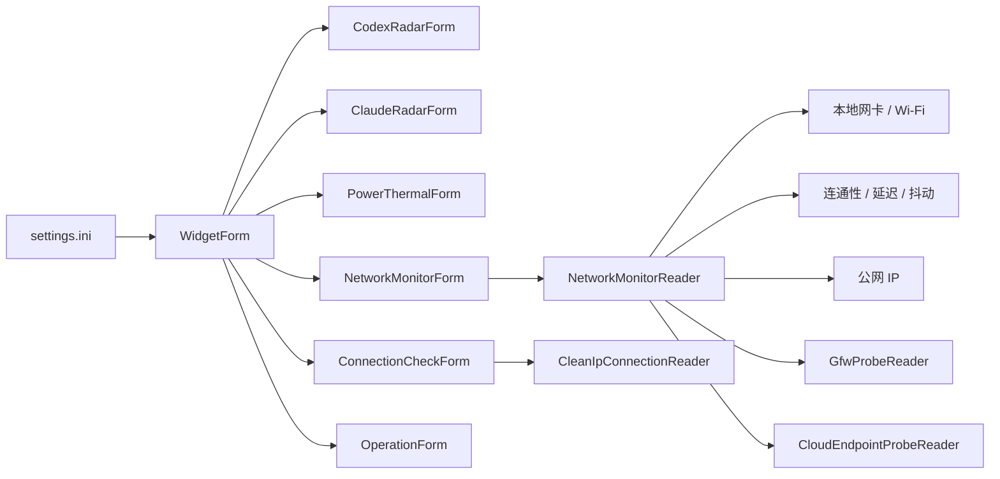
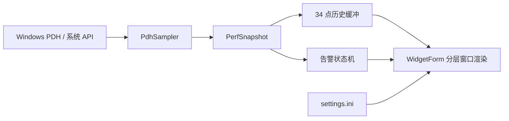

# 性能模式、主窗口与指标运行机制

适用版本：1.0.4.54

## 1. 文档范围

本文以 Desktop Codex Assistant 当前源码为准，说明性能数据从 Windows 采样到界面显示的完整链路、三档性能模式，以及以下窗口的共同运行机制：

- 主性能窗口 `WidgetForm`
- Codex 监测窗口 `CodexRadarForm`
- Claude 监测窗口 `ClaudeRadarForm`
- 功耗与温度窗口 `PowerThermalForm`
- 网络监控窗口 `NetworkMonitorForm`
- 连接检测窗口 `ConnectionCheckForm`
- 操作窗口 `OperationForm`

网络监控窗口的源文件备份位于：

`Backups/NetworkWindow_20260607_0900`

网络窗口的完整状态机、检测算法和渲染说明见：

`Docs/NetworkMonitor-Architecture.md`

本文中的“主窗口”指六栏 CPU、内存、磁盘、网络、GPU、NPU 性能面板，不包含设置窗口。

## 2. 总体架构

`WidgetForm` 是主窗口和运行协调器。它负责加载设置、检测全屏状态、创建其他窗口，并把运行时设置同步到各窗口。`PdhSampler` 负责读取 Windows PDH 性能计数器及系统硬件信息，渲染层不直接查询系统数据。

每个监控窗口保持自己的定时器和快照，不共享 UI 绘制线程之外的可变图形对象。耗时采样和网络请求在后台任务中执行，结果通过锁保护的快照传回 UI 线程。



主性能窗口的数据链如下：



数据职责按层分离：

- `PdhSampler`：读取原始字节率、占用率、容量、硬件名称和连接状态。
- `PerfSnapshot`：保存一次采样的不可视化数据，不包含文本排版。
- `WidgetForm`：换算单位、维护历史、计算告警、构造栏目文本并绘制。
- `NetworkRateFormatter`：统一网络和磁盘速率的显示单位及小数规则。

## 3. 三档性能模式

设置界面名称与内部枚举的对应关系：

| 设置界面 | 内部值 | 目标 |
| --- | --- | --- |
| 性能 | `Smooth` | 更高刷新率和交互流畅度 |
| 均衡 | `Balanced` | 默认刷新率，控制后台开销 |
| 省电 | `BatterySaver` | 降低采样、绘制、网络探测和交互轮询频率 |

模式切换可以热生效，不需要重启。`WidgetForm.ApplyRuntimeSettings` 将新设置分发到所有子窗口。

### 3.1 通用时间策略

时间参数由 `WidgetSettings` 统一提供；各策略在三档模式下的具体数值以 `Docs/Component-Refresh-Rules.md` §2 为唯一权威表，本文不重复维护。

`AdapterMissing` 状态不进行周期连通性检测，等待网络地址或可用性事件重新触发。

### 3.2 Windows 进程级策略

- 性能、均衡：正常进程优先级，清除执行速度节流请求。
- 省电：请求 Windows 执行速度节流，并把进程优先级设为 `BelowNormal`。
- 设置失败不会中断程序，结果写入主日志。

该策略只改变调度优先级，不改变检测结果或告警阈值。

## 4. 绘制与调度机制

### 4.1 只在内容变化时绘制

`NetworkMonitorForm` 和 `ConnectionCheckForm` 先比较旧、新快照。只有显示字段变化、窗口尺寸变化或需要动画时才重绘。

定时器仍会读取轻量快照，以便及时接收后台任务完成后的结果，但不会为相同内容重复执行完整 GDI+ 绘制。

### 4.2 复用分层窗口缓冲区

`WidgetForm`、`CodexRadarForm`、`ClaudeRadarForm`、`PowerThermalForm`、`NetworkMonitorForm`、`ConnectionCheckForm` 和 `OperationForm` 均继承 `LayeredWidgetFormBase`，共用 `NativeMethods.LayeredBitmapSurface`、`Bitmap` 与 `Graphics` 生命周期：

- 尺寸不变时复用缓冲区。
- 尺寸变化或窗口关闭时释放。
- 仅透明度变化时复用已绘制内容，只调用 `UpdateLayeredWindow`。
- 网络窗口额外缓存内容层和字体，避免每帧创建 GDI 对象。

这减少了托管对象分配、GDI 句柄波动和垃圾回收压力。

### 4.3 交互定时器按需运行

悬停透明度动画分为两种频率：

- 动画进行中：使用对应模式的动画间隔。
- 动画静止：切换到较低频率的空闲轮询。

窗口因全屏模式隐藏时停止悬停定时器，重新显示后恢复。

`OperationForm` 的动画定时器只在按压或悬停进度尚未达到目标值时运行。鼠标静止停留在按钮上且动画已经完成后，定时器停止；全屏隐藏和显示器挂起时同时停止动画与 FPS 定时器。

### 4.4 网络事件驱动

`NetworkMonitorReader`、`CleanIpConnectionReader` 和 Codex 服务状态监听：

- `NetworkChange.NetworkAddressChanged`
- `NetworkChange.NetworkAvailabilityChanged`

网络变化时只设置失效标记，并由 `NetworkMonitorReader` 对事件做 30 秒防抖。真正的网卡枚举和网络请求仍由各自调度路径执行，避免在系统事件线程中阻塞。GFW 和云服务不会因每个 `NetworkChange` 事件直接重置周期；只有本地快照确认连接恢复、网卡 ID、默认网关或主 IP 地址变化时，才作为网络身份变化刷新远端探测。PING 滚动窗口也随这些身份变化清空。

省电模式下，本地 IP、DNS、Wi-Fi 等信息主要由网络事件触发刷新，而不是固定轮询。

### 4.5 异步任务与过期结果保护

网络监控将公网 IP、连通性检测和 PING 滚动采样放入后台任务。每次网络身份变化都会增加 `networkGeneration`。

后台任务完成时必须同时满足：

- generation 与任务启动时一致；
- 网卡 ID 与任务启动时一致；
- PING 滚动采样还要求主 IP 和默认网关签名一致；
- reader 尚未释放。

否则结果被丢弃，避免旧网络的公网 IP 或延迟覆盖新网络状态。

功耗与温度读取采用单任务运行规则。采样正在执行时，新请求只合并为一个待处理请求，避免慢传感器导致任务堆积。

### 4.6 全屏、休眠与显示恢复

- 全屏隐藏时，各窗口停止不必要的悬停和绘制。
- 主窗口在省电模式下跳过隐藏期间的昂贵 PDH 采样，但控制定时器仍运行，因此可以处理停止信号、设置变更和退出全屏。
- 显示器关闭、会话锁定或系统休眠时，Codex 与功耗采样暂停。
- 显示器关闭或系统挂起时，主窗口会释放主窗口和子窗口的托管渲染缓存，并重置复用的 native layered-window DC/HBITMAP，避免唤醒后继续使用息屏前的 GDI 资源。
- 显示恢复后执行三轮延迟恢复，重新定位、重建 layered-window 资源、强制重绘，并安排一次刷新；这覆盖 DWM、显示驱动或 WorkerW 桌面宿主稍晚恢复的情况。
- 休眠/系统挂起唤醒收到 `PBT_APMRESUMEAUTOMATIC`、`PBT_APMRESUMESUSPEND` 或 `PBT_APMRESUMECRITICAL` 后，若设置开启，会在三轮显示恢复完成后重启 SeelenUI 和本程序。SeelenUI 只在休眠前或唤醒时存在运行实例时重启，避免用户主动关闭 SeelenUI 后被强行启动。
- `--desktop-parent` 模式下，恢复时先把主窗口从旧 WorkerW 脱离成普通顶层窗口，再尝试挂接到新的桌面宿主；如果第一次没有找到宿主，后续恢复轮继续重试。

### 4.7 主网络接口筛选

Windows 中可能同时存在 Wi-Fi、以太网、WSL2、Hyper-V、VPN 和 WAN Miniport。主性能窗口不会直接采用枚举到的第一个接口。

`PdhSampler` 使用以下规则：

1. 排除未启用、回环、隧道和已知虚拟接口。
2. 优先选择带默认网关的接口。
3. 其次优先带有效 IPv4 地址的接口。
4. 再根据 Wi-Fi/以太网类型和链路速度评分。
5. Wi-Fi 接口优先显示实时 SSID；无法读取 SSID 时退回接口名称或描述。

PDH 网络速率计数器也排除 WSL、`vEthernet`、Hyper-V、虚拟交换机和 WAN Miniport，避免虚拟交换流量被误计入主网络图表。

### 4.8 统一速率格式

网络和磁盘速率都由 `NetworkRateFormatter` 格式化：

- 原始输入为 `Bytes/sec`。
- 显示值使用十进制比特率：`Kbps`、`Mbps`、`Gbps`。
- 达到 `1000 Kbps` 切换为 `Mbps`，达到 `1000 Mbps` 切换为 `Gbps`。
- 显示值小于 `10` 时保留一位小数；四舍五入后大于等于 `10` 时不显示小数。

因此 `100 KB/s` 的原始字节率会显示为约 `800 Kbps`，而不是 `100 Kbps`。这是有意采用与网络模块一致的比特率口径。

### 4.9 磁盘四行显示

磁盘栏目读取整块物理磁盘计数器，当前文本为：

1. `DISK`
2. `WT`：物理磁盘写入速率
3. `RD`：物理磁盘读取速率
4. 已用容量/总容量，单位 `GB`，四舍五入到整数

图表包含写入和读取两条自动缩放曲线。容量只保留在第四行文本中，不参与曲线缩放。

`Disk Read Bytes/sec` 和 `Disk Write Bytes/sec` 反映实际到达物理磁盘设备的 I/O。Windows 文件缓存命中不会形成同等数量的物理读取，因此日常使用中读取曲线长时间接近零、写入仍有波动是正常现象。若要观察应用请求的逻辑 I/O，应改用进程 I/O 或逻辑磁盘口径，不能直接与当前物理磁盘数值比较。

### 4.10 磁盘联合告警

磁盘红色背景和黄色告警图标使用 `% Disk Write Time` 与 `% Disk Read Time`，不使用 WT/RD 速率数值。联合告警值为两者的较小值：

```text
diskAlertPercent = min(writeBusyPercent, readBusyPercent)
```

这意味着只有读写忙碌度同时达到条件时才触发：

- 低于 `80%`：无红色背景。
- `80%` 到 `100%`：红色背景透明度线性增加。
- `100%`：红色背景不透明度约 `70%`。
- 大于等于 `98%` 且连续至少 `3` 秒：显示并闪烁黄色三角告警。
- 设置中的告警测试：强制按 `100%` 处理，不需要制造真实高负载。

### 4.11 12 小时滚动耗时统计

`TimingStats` 在进程内保存最近 12 小时的耗时样本，新样本进入后会按时间窗口和数量上限淘汰旧样本。当前接入点包括：

- 主窗口控制 tick：`widget.main_tick`
- 主性能 PDH 采样：`widget.pdh_sample`
- 主窗口分层渲染：`widget.render`
- Codex 本地额度读取：`codex.quota_read`

统计器只保存内存样本，不新增持久化文件。每 15 分钟最多写入一条 `TimingStats12h` 摘要到主日志，包含样本数、平均耗时、p95 和最大耗时，用于后续判断是否需要把 PDH 采样或 Codex 本地读取迁移到后台 worker。

### 4.12 UI 无响应看门狗

`UiHangWatchdog` 随主程序启动，在后台线程每 2 秒检查一次 UI 线程心跳。`WidgetForm` 在主控制 tick、悬停交互 tick、自动透明度合并、运行时设置分发和关键子窗口设置应用前后更新心跳检查点。

当 UI 心跳超过 10 秒未更新时，看门狗直接向 `%LOCALAPPDATA%\DesktopCodexAssistant\ui-hang-watchdog.jsonl` 追加 `ui_thread_unresponsive` JSONL 记录；若无响应持续存在，每 30 秒追加一次重复记录，UI 恢复后追加 `ui_thread_responsive_again`。记录包含当前操作、操作开始时间、最后一次已完成操作、延迟毫秒、进程 ID 和程序版本。

该文件独立于普通 `Logger`，目的是覆盖 Windows `AppHangB1` 这类“UI 线程卡死但后台线程仍可运行”的故障。它不会捕获完整调用栈，也无法在所有线程都被挂起或进程被系统立即终止时写入；这类场景仍需要 WER dump 或外部调试器。休眠/息屏导致的 5 分钟以上心跳间隔会被视为系统挂起空洞，不写误报。

## 5. 各窗口运行机制

### 5.1 主性能窗口

主定时器执行以下顺序：

1. 检查全局停止事件。
2. 检查 `settings.ini` 修改时间并热加载设置。
3. 更新全屏可见性。
4. 按模式决定是否采样 PDH 数据。
5. 更新历史曲线、告警状态并绘制。

隐藏时仍保留控制循环。省电模式隐藏后不读取 PDH；性能模式维持正常采样；均衡模式降低控制循环频率。

各栏目的当前数据口径：

| 栏目 | 主要数据源 | 显示和图表 | 告警值 |
| --- | --- | --- | --- |
| CPU | Processor/Processor Information PDH | 总占用曲线、每逻辑核心柱状图、实时/基准频率 | CPU 柱状图自身颜色规则，不使用通用面板红底 |
| MEMORY | Windows 内存状态、`Win32_PhysicalMemory`、GPU/NPU 内存计数器 | 厂商、频率、占用率、已用/总量；黄线为 GPU+NPU 已用内存占总内存比例 | 内存占用率 |
| DISK | PhysicalDisk PDH、物理盘到逻辑盘 WMI 关联及卷容量 | `DISK C/D/E`、WT/RD 双曲线、整数容量行；超过 3 个正常分区时只显示容量最大的 3 个 | 读写忙碌度较小值 |
| NETWORK | Network Interface PDH、NetworkInterface API、Wi-Fi API | SSID/接口名、UP/DL 双曲线；Wi-Fi 时增加 RSSI 行 | 断线状态，不使用通用高负载告警 |
| GPU | GPU Engine/Adapter Memory PDH | GPU 与显存双曲线 | GPU/显存占用率较大值 |
| NPU | NPU 计数器，必要时从 GPU Engine LUID 分类 | NPU 与共享/专用内存双曲线 | NPU/内存占用率较大值 |

历史曲线最多保留 34 个点。CPU、内存、GPU、NPU 使用百分比；网络和磁盘历史统一保存为 `Kbps`，绘图时按当前历史最大值自动缩放。

主窗口文本支持三行和四行布局。磁盘容量和 Wi-Fi RSSI 使用四等分行高；其他栏目继续使用原有三行布局，避免四行支持改变非 Wi-Fi 网络和内存的字号及间距。

Wi-Fi RSSI 读取方式：

- 先通过 `WlanQueryInterface` 读取当前连接详情、SSID、BSSID 和链路速率。
- 再通过 `WlanGetNetworkBssList` 读取当前可见 BSS 列表。
- 使用当前 BSSID 匹配对应 `WLAN_BSS_ENTRY.lRssi`，显示为 `RSSI -45dBm` 这类格式。
- 主性能窗口缓存主网络状态，Wi-Fi RSSI 约每 5 秒刷新一次；网络切换事件会立即触发重新检测。

### 5.2 主窗口告警层

除 CPU 和网络外，通用告警层按以下顺序绘制：

1. 图表基础背景与边框。
2. 随占用率变化的红色背景层。
3. 黄色透明三角边框和感叹号。
4. CPU 核心柱或历史曲线。

告警图标达到触发条件后，在每次刷新间于约 `30%` 和 `70%` 黄色不透明度之间切换。测试开关复用同一绘制路径，只替换输入值，因此可验证布局和动画而不增加硬件负载。

### 5.3 网络监控窗口

网络监控分为 UI 层和数据层。

`NetworkMonitorForm`：

- 定时读取 `NetworkMonitorReader` 的快照；
- 对比显示字段；
- 只在变化时绘制；
- 处理位置、透明度、穿透和全屏隐藏。

`NetworkMonitorReader`：

- 同步读取本地网卡、IPv4/IPv6、DNS、Wi-Fi 认证和 PHY；IP 行只显示第一个地址，后续地址折叠为 `+n`，第一个地址放得下时不显示第二个地址；
- 支持设置页指定当前网卡；未指定时继续按默认网关、地址、接口类型和链路速率自动选择；
- 异步读取公网 IPv4；`IP4` 行右侧公网显示优先使用本地可公开路由 IPv6 的短显，没有 IPv6 时回退到公网 IPv4；
- 异步检测 DNS 可用性、错误返回和随机不存在域名劫持，并按正常/异常状态自适应复查周期；
- 异步执行 Ping、NCSI 门户检测、延迟、抖动和丢包率测量；
- 单飞执行 PING 滚动采样，保留网关、公网和百度回退窗口，用于 PING 行 1 位小数丢包、ICMP 禁用和 loss 后缀链路诊断；
- 在 `Online` 时根据丢包、抖动和延迟生成内部本地链路劣化标记，供 DNS 和云服务检测降低高丢包误判；
- 调用 `GfwProbeReader` 获取防火墙检测结果；GFW 的本地链路门控只来自当前活动目标滚动 PING 丢包率 `>= 2%` 且已确认，不直接使用 4 包连通性丢包，也不使用网关侧 ICMP 丢包、延迟或抖动诊断，`Unknown`、离线和该门控只影响本轮显示，不清空 GFW 周期；
- 调用 `CloudEndpointProbeReader` 独立获取云服务检测结果，GFW 失败结论不会使云服务检测跳过或置灰；真实状态非 `Online` 时停止/取消云服务探测并隐藏标题右侧云服务告警；
- Classic 是唯一保留的布局（`1.0.4.56` 起 GroupedCards 第二布局连同其绘制代码已删除），使用扁平信息条：头部为 `NETWORK`、状态文字和链路摘要；中部三行显示 `IP4 / IP6 / DNS`，`公网` 模块在 `IP4` 行右侧，DNS 异常原因在 `DNS` 行右侧；底部显示 `PING / GFW` 和右对齐 6 个云服务方块。DNS 异常只消费已有 DNS 快照，不增加额外网络请求；DNS 状态保留网卡返回的 DNS 优先级顺序，错误状态只改变颜色、不把报错项提前；连通性/GFW 长错误文本在固定布局中使用紧凑摘要或整行兜底，避免与其它字段相撞；IP 行仍使用压缩短显，完整地址只留在快照中；DNS 历史 JSONL 记录按顺序写入脱敏的 `status_detail`/`abnormal_detail`，保留具体原因但不写 DNS 地址；
- 返回快照副本，禁止 UI 直接修改内部状态。

连通性状态判定：

| 状态 | 含义 |
| --- | --- |
| `Online` | Ping 或 NCSI 证明公网可用 |
| `NeedsValidation` | 门户重定向、HTTP 认证状态或内容被替换 |
| `Offline` | 网卡存在，但连通性检测失败 |
| `AdapterMissing` | 没有可用的物理网络接口 |
| `Unknown` | 正在刷新或尚未得到结论 |

### 5.4 Codex 监测窗口

面板定时器负责检查各数据源是否到期，但网站检测周期与 UI 性能模式分离：

完整的数据合并、重置保护、IQ/效率算法和额度文件缓存说明见：

`Docs/CodexRadar-Architecture.md`

| 数据源 | 周期 |
| --- | ---: |
| CodexRadar 模型数据 | 启动/恢复/模型切换触发一次；常规定时为北京时间每小时整点，RSS 重置提醒只跟随成功响应附属读取 |
| CodexRadar 失败重试 | 10 min |
| Claude 失败重试 | 2 min |
| Claude 官方状态 | 15 min |
| Claude Code 用量 | Codex Radar `SF:CLAUDE` 和独立 Claude Radar 共享进程级调度；正常 5 min；失败 10 min；429 冷却 15 min |
| 检测软件 Auto | 前台窗口识别，性能/均衡/省电为 2/5/10 s；不发网络请求 |
| 五阶段连接诊断 | 当前停用，不调度 |
| 五阶段异常重试 | 当前停用 |
| DeepSeek 余额 | 正常 60 s；失败 5 min |

当前 `EvenRow` 布局隐藏五点连接摘要和旧三行服务健康面板；Rader、Claude、DeepSeek 以及 OpenAI 兜底状态用于单行 API 摘要。正常显示 `API无异常`，异常按服务名和原因轮播。当前检测软件为 `CLAUDE` 时，Claude Code 用量接口的未登录、鉴权失败、限流、不可达或解析失败也进入该摘要；`CODEX` 模式不会被 Claude 用量探测状态影响。五阶段连接诊断的网络/DNS/隧道/OpenAI/本地 Codex 请求链保留为回滚代码，但当前不调度。右侧状态格同时显示网页短数据标签和 IQ 更新时间，二者跟随同一次 CodexRadar 网站刷新；若公开 JSON 已成功但缺少这些展示字段，首页 HTML 只作为轻量补齐来源，不触发额外高频轮询。`1.0.3.58` 起右侧状态列加宽并提高最小字号，避免三行共同拟合后比旧版更小。

DeepSeek 余额行使用官方余额接口实时读取 `CNY total_balance`。由于官方余额接口不提供 24 小时消费明细，程序通过本地 48 小时余额样本估算最近 24 小时消耗；该历史只含时间和余额，不含 API key。当前 Codex Radar 底部 DS 元信息不再按余额、24 小时估算消耗或高低峰改变颜色，而与 `RC/LLM/SF` 共用中性灰白；文案右侧追加按北京时间 `09:00-12:00`、`14:00-18:00` 判定的 `高峰` 或 `低谷`。底部四项按实际文本拆成独立绘制矩形，并使用灰线到窗口底边之间的整段高度上下居中绘制，不再共用一条硬等分文字层，也不依赖灰线下方剩余高度，避免 `DS:... 高峰/低谷` 被相邻项、分隔线或实际窗口高度裁掉。`1.0.3.59` 起底部元信息字体基准在 `1.0.3.58` 基础上再放大 30%。设置页的 DeepSeek 配置入口只写本地 key 文件，并通过 `DeepSeekApiKeyRevision` 让运行中的 Codex Radar 立即刷新，不把密钥写入 `settings.ini`。

性能模式影响额度读取和进程检测的正常周期；五阶段连接诊断当前停用：

| 项目 | 性能 | 均衡 | 省电 |
| --- | ---: | ---: | ---: |
| Codex 活跃时额度刷新 | 10 s | 15 s | 30 s |
| Codex 进程检查 | 3 s | 5 s | 10 s |
| Codex 不活跃时额度刷新 | 10 min | 20 min | 60 min |
| Auto 软件识别 | 2 s | 5 s | 10 s |
| Claude Code 用量 | 5 min 共享调度 | 5 min 共享调度 | 5 min 共享调度 |

时间显示最多每秒重绘一次。网站请求完成、测试状态变化或额度变化可以立即触发绘制。

### 5.5 功耗与温度窗口

功耗与温度采用自适应采样：

| 策略 | 性能 | 均衡 | 省电 |
| --- | ---: | ---: | ---: |
| 功耗 | 1 s | 2 s | 5 s |
| 温度低于 65°C | 2 s | 5 s | 10 s |
| 65°C 至 69.9°C | 1.5 s | 3 s | 5 s |
| 70°C 至 89.9°C | 1 s | 2 s | 3 s |
| 90°C 及以上 | 1 s | 1 s | 1 s |

温度升高时会自动提高采样频率。严重温度告警的 1 秒采样不受省电模式限制。

### 5.6 连接检测窗口

CleanIP 检测触发条件：

- 首次启动；
- 网络重新连接；
- 每小时计划，随机偏移范围为正负 5 分钟并包含秒；
- 错误状态下到达 10 分钟时间槽；
- 设置中的手动刷新；
- 操作面板强制刷新。

检测结果会一直保留到下一次检测覆盖。网络事件只使网络状态缓存失效，不会伪装成手动或操作面板触发。

连接检测窗口的 UI 被限制为三枚状态框：分数、原生状态和 IP 类型。等待、检测中和失败状态也只在这三框中显示，不再绘制顶部状态、延迟、IP/地区详情、时间、触发来源或独立错误面板。

Codex Radar 整窗随机测试启用后会暂停真实网站、额度、Claude 和连接流程轮询。随机快照会缓存；手动刷新通过 refresh token 立即重建，自动刷新开启时最多每秒重建一次，不会在普通 UI tick 上重复随机。测试关闭后恢复真实调度并立即请求关键状态。

### 5.7 操作窗口

操作窗口主要处理：

- Windows/SeelenUI 开始菜单操作；
- 打开设置；
- 系统快捷操作、刷新和重启；
- 按压与悬停动画；
- 左侧主区域的 Windows 按钮、内存饼图、自动切换和隐藏收缩布局。

Windows 开始菜单左键不发送 Win 键，因为 SeelenUI 会捕获 Win 键并打开自己的应用菜单；也不能直接启动 `StartMenuExperienceHost` 的 AppsFolder 项，因为它会生成独立的 `ApplicationFrameWindow/StartDocked` 白窗。左键优先尝试原生任务栏 UI Automation；当 SeelenUI 隐藏 `Shell_TrayWnd` 导致 UIA 根树不可见时，回退到隐藏 `Shell_TrayWnd` 下的原生 `Start` 子窗口并发送 `BM_CLICK`。右键优先尝试原生任务栏 UIA，失败时回退 `Win+X` 打开 Windows Power User 菜单。

SeelenUI 电源菜单通过后台单飞任务启动 `slu.exe` 并等待最多 1.5 秒，UI 线程只更新按钮状态和执行 Windows 安全菜单回退。快速重复点击不会并发启动多个命令。

动画结束后停止动画定时器。左侧主区域由 `OperationPrimaryPanelMode` 控制：自动模式按 SeelenUI 运行态在 Windows 按钮和内存饼图之间切换；Windows 按钮、内存饼图和隐藏模式分别强制显示对应状态。隐藏模式不保留左侧大按钮宽度，右侧小按钮从最左侧 margin 开始布局。SeelenUI 运行态和左侧内存饼图只在操作面板可见时复用主窗口协调 tick 低频刷新：SeelenUI 进程状态最多每 2 秒检查一次；当左侧主区域解析为内存饼图时，最多每 2 秒读取一次 `GlobalMemoryStatusEx` 和前台进程 Working Set。隐藏模式命中遮罩只覆盖实际可见按钮和内存饼图区域。7 分钟防烧屏位移检查同样复用主窗口协调 tick。

设置窗口关闭、异常销毁或被宿主清理时，主窗口会主动调用 `OperationForm.ClearTransientInteractionState()` 清除 hover、pressed、tooltip 和鼠标捕获状态。这是一次性生命周期清理，不新增常驻定时器或后台轮询。

操作窗口自身使用 `WS_EX_NOACTIVATE`，点击它不会让本程序成为前台进程。因此操作面板的程序设置按钮不能只调用 `Form.Activate()`；单击会打开操作面板上方的特殊设置窗，双击才打开普通设置窗，宿主会先清理操作面板瞬态交互状态，再对已有窗口执行 `ShowWindow`/`SetForegroundWindow` 激活。这样用户从设置页 Alt+Tab 到浏览器复制内容后，既可以通过 Alt+Tab 回到设置页，也可以再次点操作面板按钮把相关窗口拉回。

FPS 回退面板只在电池保养按钮不可见时运行，并在后台单飞读取性能计数器。性能、均衡、省电模式的刷新间隔分别为 1、2、5 秒；值未变化时不重绘。

## 6. 窗口合成与交互模式

### 6.1 分层窗口

各监测窗口使用 Windows layered window。界面先绘制到内存 `Bitmap`，再通过 `UpdateLayeredWindow` 一次提交带 Alpha 的画面。这样可以实现无边框、每像素透明度和桌面层显示。

非桌面模式下的监测浮窗使用 SeelenUI 感知的 Z-order 策略：`LayeredWidgetFormBase.GetLayeredWidgetInsertAfter()` 先通过 `NativeMethods.GetSeelenAwareTopMostInsertAfter()` 查找 SeelenUI 进程下可见、TopMost、非零尺寸的 `Tauri Window` 顶层窗口，并选择 Seelen 顶层窗口栈里最靠下的一个作为 insert-after；找到时把本程序窗口插入到该 HWND 之后，确保低于 SeelenUI Dock、顶部栏和弹出层。找不到符合条件的 SeelenUI 窗口时回退 `HWND_TOPMOST`。桌面模式仍使用桌面宿主层或 `HWND_TOP`，不参与该策略。

透明度分成两部分：

- 黑色背景透明度：控制面板和图表底色。
- 内容透明度：控制文字、曲线、边框、图标等背景之外的内容。

两项设置同时应用于主性能窗口和功耗/时间窗口。只改变整体 Alpha 时不会重新绘制全部内容，而是复用渲染缓冲并重新提交窗口。

### 6.2 可见性与桌面层

| 模式 | 行为 |
| --- | --- |
| 一直可见 | 普通顶层窗口，应用在前台时仍显示 |
| 仅桌面可见 | 挂接桌面宿主层，只在桌面场景显示 |
| 仅全屏不可见 | 普通顶层窗口，检测到全屏应用后隐藏 |

全屏检测和位置维护由主窗口控制循环处理。位置 X/Y 以目标屏幕坐标为准，保存设置后所有子窗口重新应用位置。

### 6.3 分辨率与工作区比例适配

`settings.ini` 从 Version 9 起写入 `LayoutWorkAreaLeft`、`LayoutWorkAreaTop`、`LayoutWorkAreaWidth` 和 `LayoutWorkAreaHeight`。Version 28 起继续为 Codex Radar、功耗温度、网络监控、连接检测和操作面板分别写入独立 `*LayoutWorkArea*` 基准，并写入 `*DisplayDeviceName` 目标显示器。

加载设置、收到 `WM_DISPLAYCHANGE`、收到系统设置变化、息屏恢复和会话解锁恢复时，`WidgetSettings.AdaptToCurrentWorkArea` 会按模块比较旧工作区与目标显示器当前工作区：

- 宽度、左侧坐标按 X 比例换算；
- 高度、底边坐标按 Y 比例换算；
- 操作面板的按钮尺寸使用较小轴比例，保持正方形；
- 所有窗口最终再裁剪到各自目标显示器的工作区，避免低分辨率或任务栏变化后跑出屏幕。

目标显示器留空时使用当前主显示器。指定显示器断开时，`FallbackDisconnectedDisplaysEnabled` 默认让对应模块回退到当前主显示器；关闭后保留该模块上次记录的显示器工作区，不强制挤回已有显示器。因此用户在当前分辨率和显示器组合下调整好的屏占比，会在切换分辨率、外接显示器模式变化或息屏唤醒后尽量保持一致。

设置页“全局编辑”使用 `GlobalLayoutEditorForm` 打开全屏编辑层。底层遮罩为 50% 黑色，顶层透明交互层显示模块边框、顶部提示和拖拽辅助线。进入编辑模式后，`WidgetForm` 使用临时运行态设置禁用所有隐藏/悬停透明规则，并通过窗口层级刷新回调把所有模块保持在遮罩之上；拖拽过程中每次鼠标移动都会实时调用预览并刷新窗口层级。拖拽时，活动窗口四边中点会连接到当前屏幕四边并标注像素距离；与其他模块在水平或垂直方向可直线连接且间距小于 `500 px` 时，每个其他模块最多绘制一根连接线。Enter 保存并退出，Esc 放弃并还原进入编辑前的预览设置。

### 6.4 鼠标穿透与防遮挡

`ClickThroughMode` 有启用、禁用和自动三种内部状态。自动模式下：

- 仅桌面可见：不强制穿透。
- 一直可见或仅全屏不可见：启用鼠标穿透，点击落到后面的应用。

防遮挡功能与鼠标穿透属于互斥交互方案。防遮挡启用时，程序通过全局鼠标位置判断指针是否进入窗口，不依赖窗口收到鼠标消息，因此可兼容透明分层窗口。进入窗口后，整个窗口的可见 Alpha 在 `0.15` 秒内过渡到约 `5%`，移开后恢复设置值。动画只改变提交 Alpha，通常比重新绘制所有曲线和文字开销更低。

敏感鼠标模式默认开启。命中判定使用以鼠标为中心的正方形与窗口矩形相交，默认边长 `100 px`，可设置 `10-300 px`。正方形判定只做整数矩形相交，比圆形命中少一次距离平方计算和边界分支；关闭该模式后退回鼠标点是否在窗口内。

延迟显现作用于普通“鼠标移上去隐藏”，可在设置中关闭。开启时，鼠标离开窗口判定区后，窗口继续保持隐藏 `1-10 s`，默认 `1 s`；离开倒计时内如果鼠标重新进入该窗口判定区，需要持续停留 `0.1-5 s`，默认 `0.5 s`，才重置本轮显示倒计时。若显示倒计时到期时鼠标仍在判定区，窗口保持隐藏，直到离开后重新满足显示延迟。关闭时，鼠标离开判定区后立即恢复正常透明度。

覆盖开启默认开启。自动隐藏已经激活时，鼠标在窗口外的普通移动不会重置空闲计时，只有进入任意程序窗口的敏感命中范围后才解除自动隐藏。手动点击仍作为真实交互处理。

反向隐藏默认开启，仅作用于操作面板手动激活的隐藏模式。鼠标进入某个程序窗口的敏感命中范围时，该窗口临时恢复正常透明度，并且不会再被“鼠标移上去隐藏”规则立即压回隐藏；鼠标移开后按设置延迟 `1-30 s` 重新隐藏。

操作面板自身有一个额外边界：刚从左下角按钮开启手动隐藏后，鼠标通常仍在操作面板上。为避免操作面板立刻被反向隐藏恢复而看起来“按钮无效”，它会先保持隐藏，直到鼠标离开操作面板判定范围；之后再移回操作面板时，反向隐藏恢复照常生效。

操作面板是主动交互窗口。隐藏反色会把灰白图标像素透明化，因此操作面板在像素后处理之后，为可见按钮的圆角区域补充隐藏命中遮罩。遮罩像素使用 `Alpha=64`，再叠加操作面板隐藏态整体透明度后约为 `12/255`，比 `Alpha=1` 的边界值更可靠；按钮间隙、圆角外部和 FPS 信息区域仍保持全透明穿透。

### 6.5 设置预览、保存与取消

设置窗口编辑时把临时设置实时应用到各窗口：

- 调整尺寸、位置、透明度、Codex Radar 模型下拉和基准模式会立即预览。
- 点击保存后写入 `settings.ini`，并以新值作为后续基准。
- 点击取消或直接关闭设置窗口时恢复打开设置前的快照。
- 主窗口也会检查配置文件修改时间，使外部修改能够热加载。

未保存预览的回滚由 `Win11SettingsForm.OnFormClosing` 和宿主 `FormClosed/Disposed` 清理共同兜底。异常销毁路径通过 `ISettingsWindow.TryConsumeUnsavedPreview()` 只消费一次 baseline，避免重复回滚，也避免关闭链路中断后把预览设置留在运行窗口上。

设置窗口作为真实可编辑窗口显示在任务栏和 Alt+Tab 中。离屏自测会临时关闭 `ShowInTaskbar` 避免测试闪烁，但生产窗口必须保持可任务切换，否则浏览器复制 API key 后没有可靠方式回到设置页。程序图标由 `ApplicationIcon` 统一生成并设置到各个 `Form.Icon`；构建脚本把同款 `Assets\AppIcon.ico` 作为 Win32 图标嵌入 exe，保证任务栏、Alt+Tab、任务管理器和托盘使用同一视觉标识。

### 6.6 空闲 CPU 诊断

设置页提供“空闲CPU诊断”即时检查。该检查复用线程 `019ee4e9-9d1a-7fe2-b154-c20b59153a33` 中的排查逻辑，但压缩为程序内一次性诊断：采样当前总 CPU、用户态、内核态、中断、DPC、处理器队列和进程 CPU 差值，并扫描最近 30 分钟的 WMI Activity、Windows Update、Defender、Hyper-V vSwitch、Kernel-Power/Thermal 事件。

诊断会公式化归因：优先判断单个普通进程高占用；其次判断 Windows Update/Defender、Hyper-V 虚拟交换机、WMI 客户端；最后根据 privileged、interrupt+DPC 和未归属 CPU 判断内核/驱动/中断链路。报告写入 `%LOCALAPPDATA%\DesktopCodexAssistant\idle-cpu-diagnosis-*.txt/.json`，同时更新 `idle-cpu-diagnosis-latest.txt`。该功能不常驻，不改变电源、任务计划或 Defender 设置。

## 7. 线程与资源所有权

- WinForms 控件、窗口位置和 GDI+ 绘制只在 UI 线程操作。
- 网络、功耗和温度等阻塞操作在 `Task.Run` 中执行。
- 后台任务只写入锁保护的数据对象，不直接操作控件。
- reader 在窗口关闭时取消系统网络事件订阅。
- `Bitmap`、`Graphics`、`Font` 和 `Region` 由创建它们的窗口负责释放。
- 异步任务不做强制中止；关闭后通过 `disposed`、generation 或句柄状态丢弃迟到结果。

## 8. 维护规则

调整性能模式时应遵守以下规则：

1. 通用时间参数优先放入 `WidgetSettings`，不要在多个窗口复制常量。
2. 告警正确性优先于省电，严重温度和错误重试不能被无限延迟。
3. UI 调度周期和远程网站检测周期分开，降低 UI 帧率不应改变业务检测语义。
4. 网络请求必须有单任务保护，不能让相同请求并发堆积。
5. 网络相关异步结果必须验证 generation 或网络身份。
6. 新增 GDI 对象时必须明确释放位置；高频绘制路径应优先缓存。
7. 快照比较只包含实际显示字段，否则内部时间变化会造成无意义重绘。
8. 采样层保持原始单位，单位换算和显示舍入放在 UI/格式化层。
9. 虚拟网卡过滤应同时更新接口名称选择与 PDH 计数器筛选，避免名称和速率来自不同接口集合。
10. 告警值与显示速率必须分开。磁盘告警基于忙碌度百分比，不得改为吞吐量阈值。

## 9. 构建与验证

构建：

```powershell
powershell -NoProfile -ExecutionPolicy Bypass -File .\Build-Arm64.ps1
powershell -NoProfile -ExecutionPolicy Bypass -File .\Build-X64.ps1
```

停止正在运行的实例：

```powershell
.\DesktopCodexAssistant.exe --stop
```

日志目录：

`%LOCALAPPDATA%\DesktopCodexAssistant`

网络检查历史 `network-check-history.jsonl` 采用 15 秒 / 32 KiB / 退出时批量追加，运行中每 6 小时粗粒度修剪旧记录。新增高频网络检查应复用该记录器，避免在采样路径逐条打开文件或自行维护并发写入。

主要验证项：

- 三个模式均能热切换且窗口保持响应；
- 模式切换后定时器间隔和进程级策略正确更新；
- 网络切换后旧异步结果不会覆盖新状态；
- 隐藏、显示器恢复和会话解锁后窗口能够重新定位并刷新；
- 长时间运行时句柄数没有持续增长；
- `error.log` 没有新增异常；
- 退出后不存在残留进程。
- ARM64 产物 PE Machine 为 ARM64，x64 产物 PE Machine 为 x64；
- WSL2/Hyper-V 存在时，网络主名称仍选择实际联网接口或 Wi-Fi SSID；
- 网络与磁盘速率在 Kbps/Mbps/Gbps 边界正确切换；
- 磁盘第四行容量只显示整数；
- 磁盘仅写入或仅读取繁忙时不触发联合告警；
- 告警测试能够验证红色背景和黄色图标，且不制造真实高负载。

可运行采样自检：

```powershell
.\DesktopCodexAssistant.exe --test-layout
.\DesktopCodexAssistant.exe --test-settings-bindings
.\DesktopCodexAssistant.exe --test-display-recovery
.\DesktopCodexAssistant.exe --test-operation-panel
.\DesktopCodexAssistant.exe --test
```

布局自检会模拟工作区尺寸变化并验证比例换算。设置绑定自检会在程序内部创建设置面板对象，验证可见控件能读回到 WidgetSettings，并覆盖位置范围与连接检测刷新间隔。显示恢复自检会用真实 layered-window API 验证 native surface reset 后仍可更新窗口。操作面板自检覆盖隐藏模式命中像素、动画停止条件、单飞状态、FPS 三档间隔和 SeelenUI 结果映射。采样自检会输出 CPU、内存、磁盘 WT/RD、网络 UP/DL、GPU 和 NPU 的一次采样结果。

历史 CPU 占用基准观察值见 `Docs/Reports/Performance/Performance-Optimization-Evaluation-20260607.md` 附录，用于同机回归比较。
