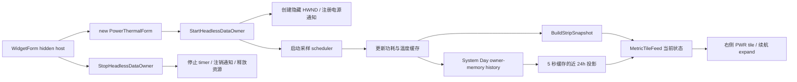

# 功耗与温度数据所有者架构

适用版本：2.0.0.28

本文说明 `PowerThermalForm` 作为永久 headless 数据所有者时的数据来源、采样、通知、缓存和快照边界。

## 1. 当前定位

`PowerThermalForm` 不再是可见功耗温度窗口。`WidgetForm.OnShown` 构造它后调用 `StartHeadlessDataOwner()`，右侧 `PWR` 方块通过 `BuildStripSnapshot()` 读取当前电池与充放电功率缓存；悬停详情只把 System Day 保存在 owner memory 中的近 24 小时投影用于曲线、峰值和趋势续航，不用历史样本替换当前值。

相关源码：

| 文件 | 职责 |
| --- | --- |
| `Core/PowerThermalForm.cs` | headless 生命周期、电源通知、单飞采样、缓存和温度状态 |
| `Core/PowerThermalForm.Snapshot.cs` | `PowerStripSnapshot` 只读投影与 `ThermalSummary` 数据汇总 |
| `Core/WidgetForm.TileColumn.cs` | 把当前功耗快照与近 24 小时 System Day 投影装入共享 `MetricTileFeed` |
| `Core/WidgetForm.SystemDay.cs` | 把同一缓存快照交给系统日记历史，并提供 5 秒缓存的 PWR 近 24 小时投影 |
| `Core/MetricTileModel.cs` / `Core/MetricTileForm.cs` | 把电池映射为单环；功率数字绘制在几何圆心，小号 `W` 独立放在数字下方的环内留白区 |
| `Core/MetricTileExpandForm.cs` | 绘制电量、功耗趋势与续航预测；不显示温度 |
| `Settings/WidgetSettings.cs` | 性能模式、测试模式和功耗数据设置 |
| `Interop/NativeMethods.cs` | Windows 电源通知与 Effective Power Mode 接口 |

## 2. Headless 生命周期



生命周期约束：

- `StartHeadlessDataOwner()` 在 UI 线程显式创建隐藏 HWND，使电源广播、显示状态和 `BeginInvoke` 仍可工作。
- 运行时不调用 `Show()`；`SetVisibleCore` 还会防止旧调用把 owner 重新显示。
- headless 模式不分配 layered bitmap，不定位、不执行 hover、burn-in、透明度或 Z-order 工作。
- 旧 `ThreePane`、paint、hover、定位和 renderer cache 已物理删除；类只保留抽象基类要求的空绘制覆盖，不能恢复可见能力。
- `StopHeadlessDataOwner()` 是幂等的最终清理入口；`Dispose` 与关闭路径复用同一资源释放逻辑。
- 全屏标志不控制采样。显示器关闭、会话锁定和系统挂起会暂停采样，恢复后立即使缓存过期并重新采样。

## 3. 数据语义

### 3.1 功耗与电池

瓦数来自 `root\WMI:BatteryStatus`：

- `ChargeRate` 表示充电功率。
- `DischargeRate` 表示放电功率。
- 毫瓦转换为瓦。
- 当两个速率字段可读且当前既未充电也未放电时，`0 W` 是已知的电池空闲状态，不是 unknown。

该值是电池端净充放电功率，不是插座功率，也不是 CPU、GPU 或接通外接电源时的整机总功耗。固件未公开 `BatteryStatus` 或返回 unknown sentinel 时，快照把瓦数标记为 unknown。

基础电池信息优先从 `SystemInformation.PowerStatus` 读取，包括电池百分比、AC 状态和是否存在系统电池。没有系统电池时跳过 BatteryStatus WMI 查询。

电池保养暂停没有厂商无关的 Windows 标准字段；只有当前设备专用链路已经明确提供状态时，`BatteryCarePauseActive` 才为真，不能根据充电百分比猜测。

### 3.2 系统电源模式与节能

基础电源模式按以下顺序读取：

1. 注册表 AC/DC Overlay GUID。
2. `root\cimv2\power:Win32_PowerPlan`。
3. `powercfg.exe /getactivescheme`。

结果归一化为性能、平衡或省电。全局节能状态优先读取 `Windows.System.Power.PowerManager.EnergySaverStatus`，并用 `GetSystemPowerStatus().SystemStatusFlag` 兼容兜底。

`PowerThermalManualEnergySaverThresholdPercent` 只根据最近一次电池快照决定 `EnergySaverActive` 的展示兜底，不修改 Windows 电源模式，也不让全局性能档位强制进入省电。

PWR 展开详情采用图形化仪表层次：左侧电池轮廓显示电量，下面只保留实时电池功率；中部三段轨用叶片、仪表和闪电分别表示省电、平衡与性能档位，轨道下方的独立叶片开关表示系统省电模式；右侧状态图标、紧凑时长和目标词显示耗尽、充到 80%/100%、外接供电或估算状态；近 24 小时峰值使用三角标记叠在历史曲线上，底部 9 px 电量条带十等分刻度。若快照只有节能状态而不知道基础电源模式，三段轨不选择任何档位，不能把节能兜底冒充为已知基础档位。

### 3.3 温度

温度来自：

```text
root\cimv2
Win32_PerfFormattedData_Counters_ThermalZoneInformation
```

优先使用 `HighPrecisionTemperature`，否则使用 `Temperature`，再从开尔文转换为摄氏度。这是 ACPI Thermal Zone，不保证等于 CPU 核心温度。传感器名会缩短为最后一段，例如 `\_SB.TZ37` 投影为 `TZ37`。

## 4. 调度、事件与单飞

功耗和温度各有 deadline，但共用一个后台采样 worker：

- timer 只判断哪些数据到期，不在 UI 线程做 WMI、注册表或 `powercfg` 读取。
- `samplingWorkerRunning` 保证任意时刻最多一个 worker。
- worker 运行时到达的强制请求合并到 `pendingPowerSample` / `pendingThermalSample`，当前任务提交后最多补一轮。
- 后台只构造 `SamplingResult`；缓存替换和状态机更新通过 `BeginInvoke` 回到 UI 线程。
- owner 已停止、generation 失效或句柄销毁后，迟到结果直接丢弃。

注册通知：

| 通知 | 行为 |
| --- | --- |
| `GUID_CONSOLE_DISPLAY_STATE` | 显示器关闭时暂停，恢复时请求完整采样 |
| `GUID_ACDC_POWER_SOURCE` | 电源来源变化后立即刷新功耗 |
| `GUID_BATTERY_PERCENTAGE_REMAINING` | 电量变化后立即刷新功耗 |
| `GUID_POWERSCHEME_PERSONALITY` | 电源计划变化后立即刷新功耗 |
| `GUID_POWER_SAVING_STATUS` | 节能状态变化后立即刷新功耗 |
| Effective Power Mode callback | 电源模式滑块变化后立即刷新功耗 |
| `SystemEvents.SessionSwitch` | 锁屏暂停、解锁恢复 |
| `PBT_APMRESUME*` | 清除挂起状态并请求完整采样 |

性能/均衡/省电的具体间隔和热状态加速表只在 `Docs/Component-Refresh-Rules.md` §5 维护。

## 5. 温度状态

普通告警使用迟滞：达到 70°C 进入告警，低于 67°C 退出。严重告警要求达到 95°C 并持续 3 秒，低于 92°C 清除；100°C 测试模式跳过等待，便于自动验证。

这些状态投影到 `PowerStripSnapshot.AlertCount`、`MaxCelsius`、`AvgCelsius`、`HotZones` 与完整 `ThermalZones`，继续供 System Day 历史、热区关联和诊断使用。`PWR` 方块与展开详情不再显示温度或温度告警；状态变化不会创建额外显示表面。

## 6. Cache-only 快照

`PowerThermalForm.BuildStripSnapshot()` 只读取 owner 缓存并返回新的 `PowerStripSnapshot`：

- 功耗：known/charging/plugged-in/watts/battery/runtime。
- 状态：energy saver、电池保养暂停、电源模式文本。
- 温度：zone 数、告警数、最高/平均温度、告警热点列表，以及带固件原始名称的完整 `ThermalZones` 克隆。

该方法不得触发采样、WMI、进程启动、磁盘或网络 I/O。`WidgetForm.BuildMetricTileFeed()` 每个控制 tick 至多取一次当前快照；`WidgetForm.BuildMetricTilePowerProjection()` 最多每 5 秒从 `SystemDayHistoryStore` 的 owner memory 重建一次近 24 小时投影。两者进入同一个 feed 后供 `PWR` 方块与展开详情消费；当前电量、状态、电池功率和电源模式只取实时 `PowerStripSnapshot`，历史投影只供曲线、峰值与趋势 ETA。消费者不能修改 sampler-owned state，也不能在 paint 中读取历史文件。系统日记为何保留完整热区及其持久化边界见 `Docs/SystemDayBoard-Architecture.md`。

## 7. 设置边界

`PowerThermalIntegratedEnabled` 只为旧 `settings.ini` 兼容保留，在设置 UI 中隐藏；无论其值为何，都不控制 owner 生命周期、采样或可见性。

数据仍会消费性能模式、温度测试模式、手动节能阈值和设备专用阈值。旧独立展示的尺寸、位置、透明度、延展方向和自动大小设置不得重新创建功耗温度表面；`PWR` 的位置和大小由右侧 tile 布局统一管理。

## 8. 故障与降级

- WMI、注册表和 `powercfg` 错误彼此隔离，不终止 UI 线程。
- 电池功率字段缺失或为 unknown sentinel 时 `WattsKnown=false`；可读的空闲 `0 W` 保持 known；温度不可读时返回空温度集合。
- Effective Power Mode 通知不可用时继续使用电源广播和 deadline 采样。
- `powercfg` 有有界超时，并始终运行在后台任务中。
- 停止 owner 后不得继续写缓存或递归记录错误。

## 9. 验证

```powershell
powershell -NoProfile -ExecutionPolicy Bypass -File .\Build-Arm64.ps1 -OutputPath .\_build\DesktopCodexAssistant-arm64-test.exe -Platform arm64
.\_build\DesktopCodexAssistant-arm64-test.exe --test
.\_build\DesktopCodexAssistant-arm64-test.exe --test-layout
.\_build\DesktopCodexAssistant-arm64-test.exe --test-radar-display-lifecycle
.\_build\DesktopCodexAssistant-arm64-test.exe --render-tilecolumn --out .\_build\tilecolumn
```

验收重点是：owner 始终隐藏、Start/Stop 生命周期完整、全屏不停止采样、显示/会话/挂起门控正确、快照构建无 I/O、`PWR` 方块保持单电量环，实时电池功率数字位于环的几何中心，小号 `W` 位于数字下方的环内留白且不碰环；展开详情在 522×120 内能辨认电池、三档轨、独立省电开关、峰值、续航和带刻度底条，且不显示温度；兼容设置不能恢复独立表面。
