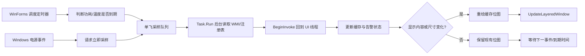

# 功耗与电池窗口技术说明

适用版本：1.0.4.18

## 1. 文档范围

本文描述 `PowerThermalForm` 的数据来源、运行状态、三档性能策略、事件通知、后台采样、温度告警、自动布局和分层窗口渲染机制。

相关源码：

| 文件 | 职责 |
| --- | --- |
| `Core/PowerThermalForm.cs` | 功耗、电池、系统电源模式和温度告警窗口 |
| `Interop/NativeMethods.cs` | Windows 电源通知、有效电源模式通知和分层窗口接口 |
| `Settings/WidgetSettings.cs` | 三档性能模式及公共刷新间隔 |
| `Settings/Win11SettingsForm.cs` | 性能模式、窗口尺寸、透明度、延展方向和测试状态 |
| `DesktopCodexAssistant.cs` | 进程优先级与 Windows Power Throttling |
| `Core/WidgetForm.cs` | 子窗口生命周期、显示器恢复和设置分发 |

本文中的“性能模式”对应内部枚举 `WidgetPerformanceMode.Smooth`。保留旧枚举名是为了兼容已有设置文件。

## 2. 数据语义

### 2.1 功耗值

窗口中的瓦数来自 `root\WMI:BatteryStatus`：

- `ChargeRate` 表示电池充电功率。
- `DischargeRate` 表示电池放电功率。
- 单位由毫瓦转换为瓦。

该值不是插座功率，也不是 CPU、GPU 或整机总功耗。设备固件未公开 `BatteryStatus` 时显示 `-- W`。

### 2.2 电池状态

基础电池信息优先从 `SystemInformation.PowerStatus` 读取：

- 电池百分比
- AC 是否接入
- 是否不存在系统电池

如果设备没有系统电池，将跳过 `root\WMI:BatteryStatus` 查询，减少无意义的 WMI 开销。

“电池养护暂停”没有厂商无关的 Windows 标准字段，因此当前不进行推断，也不会显示可能误导的养护标志。

### 2.3 系统电源模式

电源模式按以下顺序读取：

1. 注册表中的 AC/DC Overlay GUID
2. `root\cimv2\power:Win32_PowerPlan`
3. `powercfg.exe /getactivescheme`

结果归一化为：

- `性能`
- `平衡`
- `省电`

其中注册表 Overlay 会根据当前 AC/DC 状态选择不同字段，因此能反映用户为插电和电池分别配置的模式。

### 2.4 温度

温度来自：

```text
root\cimv2
Win32_PerfFormattedData_Counters_ThermalZoneInformation
```

优先使用 `HighPrecisionTemperature`，否则使用 `Temperature`，最终从开尔文转换为摄氏度。

这里得到的是 Windows ACPI Thermal Zone，不保证等同于 CPU 核心温度。传感器名会缩短为最后一段，例如 `\_SB.TZ37` 显示为 `TZ37`。

## 3. 总体运行模型



核心原则：

1. WMI 和 `powercfg` 不在 UI 线程执行。
2. 任意时刻最多运行一个采样任务。
3. 电源事件负责触发立即采样，但不直接读取数据。
4. 后台结果必须回到 UI 线程后才能修改窗口缓存和布局。
5. 数据未变化时不重绘窗口内容。

## 4. 三档性能策略

### 4.1 全局策略

采样/调度/动画/轮询在三档模式下的具体数值以 `Docs/Component-Refresh-Rules.md` §2 为唯一权威表，本文不重复维护。窗口进程级差异：

| 项目 | 性能 | 平衡 | 省电 |
| --- | ---: | ---: | ---: |
| 进程优先级 | Normal | Normal | BelowNormal |
| Windows Power Throttling | 关闭 | 关闭 | 开启 |

性能档提高数据和动画响应速度；平衡档保持原有一秒级体验；省电档降低定时器唤醒、绘制和性能计数器采样频率。

### 4.2 功耗与温度窗口策略

功耗/温度按热状态分档的采样间隔以 `Docs/Component-Refresh-Rules.md` §5 为唯一权威表。温度越高，采样自动加速；严重高温时不允许省电模式把采样降到低频。

调度器不是固定频率轮询器。它根据最近一次功耗和温度采样时间，计算二者中更早的到期时间，再调整 WinForms Timer 的下一次触发时间。

## 5. 事件驱动刷新

窗口注册以下通知：

| 通知 | 用途 |
| --- | --- |
| `GUID_CONSOLE_DISPLAY_STATE` | 屏幕关闭时暂停采样，恢复时立即刷新 |
| `GUID_ACDC_POWER_SOURCE` | 插拔电源后立即刷新 |
| `GUID_BATTERY_PERCENTAGE_REMAINING` | 电量变化后立即刷新 |
| `GUID_POWERSCHEME_PERSONALITY` | 电源计划变化后立即刷新 |
| Effective Power Mode callback | Windows 电源模式滑块变化后立即刷新 |
| `SystemEvents.SessionSwitch` | 锁屏暂停，解锁恢复 |

Effective Power Mode 优先注册接口版本 2，失败时回退版本 1。无法注册不会阻止窗口运行，定时采样仍作为兜底。

`PBT_APMRESUMEAUTOMATIC`、`PBT_APMRESUMESUSPEND` 和 `PBT_APMRESUMECRITICAL` 都会清除挂起状态并请求完整采样。

## 6. 采样队列和线程约束

### 6.1 单飞模型

`samplingWorkerRunning` 保证同时只有一个后台任务。这样可以避免：

- WMI 查询重叠
- 电源事件密集到达时创建大量线程池任务
- 较旧结果与较新结果交叉提交

### 6.2 待处理请求

后台任务运行期间：

- 普通定时器发现数据到期时不会重复排队。
- 强制刷新或系统电源事件会设置 `pendingPowerSample` / `pendingThermalSample`。
- 当前任务提交后，再合并执行一次待处理请求。

`queueAfterCurrent` 参数表示“如果当前正在采样，是否必须在它结束后再补一次”。定时到期通常传 `false`，状态事件和手动刷新传 `true`。

### 6.3 UI 线程提交

后台线程只构造 `SamplingResult`。以下操作只在 UI 线程进行：

- 替换缓存快照
- 更新温度告警状态
- 计算窗口尺寸
- 调用 `SetWindowPos`
- 绘制和更新分层窗口

窗口关闭或句柄销毁后，后台结果会被丢弃。

## 7. 温度告警状态机

### 7.1 普通告警迟滞

- 温度达到 70°C：进入告警。
- 温度低于 67°C：退出告警。
- 67°C 到 70°C：保持之前状态。

迟滞区间防止温度在 70°C 附近波动时，告警框和自动延展窗口频繁出现、消失。

### 7.2 严重告警迟滞

- 温度达到 95°C 并持续 3 秒：激活黄色三角告警。
- 温度低于 92°C：清除严重告警。
- 92°C 到 95°C：保持已建立的严重告警状态。

设置中的 100°C 测试模式会跳过等待时间，以便立即验证告警 UI。

### 7.3 自动延展

自动大小开启后：

- 向左延展：温度告警在功耗模块左侧横向增加。
- 向下延展：电池模块位于功耗模块下方，温度告警继续向下增加。
- `+n` 表示未展开的额外告警，不计入“显示告警数”限制。

窗口尺寸只在告警集合或设置发生变化时调整。

## 8. 绘制与资源管理

窗口使用 `WS_EX_LAYERED` 和 `UpdateLayeredWindow`。

### 8.1 可复用渲染缓冲区

`renderBitmap` 和 `renderGraphics` 会在窗口尺寸不变时复用，避免每次刷新创建新的 GDI Bitmap/Graphics。

缓冲区在以下情况释放：

- 窗口尺寸变化
- 窗口关闭

显示器恢复时会把 `renderBufferValid` 设为 `false`，强制重新绘制内容。

### 8.2 内容重绘与透明度更新

`RenderLayeredWindow(true)` 会重新绘制背景和内容。

`RenderLayeredWindow(false)` 只重新提交已有位图并修改整体 Alpha，用于悬停透明度动画。这样动画过程不必重复创建字体、路径和笔刷。

### 8.3 变化检测

功耗比较按实际显示值进行，例如瓦数格式化后都为 `12.3 W` 时视为未变化。

温度比较关注：

- 告警数量和顺序
- 传感器名称
- 严重告警状态
- 最终红色透明度

如果数据变化不会影响当前画面，则跳过内容重绘。

## 9. 暂停与恢复

满足任意条件时停止普通采样：

- 窗口正在关闭
- 因全屏应用隐藏
- Windows 会话锁定
- 控制台显示器关闭
- 系统处于挂起状态
- 窗口不可见

恢复后会：

1. 清除挂起/显示关闭状态
2. 将缓存时间标记为过期
3. 重新定位窗口
4. 使渲染缓冲区失效
5. 请求功耗和温度完整采样

## 10. 故障与降级

- WMI、注册表和 `powercfg` 读取异常被隔离，不会终止 UI 线程。
- 电源模式读取失败时显示 `--`。
- 功耗读取失败时显示 `-- W`。
- 温度读取失败时保留空告警集合。
- Effective Power Mode 通知不可用时继续使用原生电源广播和定时采样。
- `UpdateLayeredWindow` 失败时记录一次日志并回退到普通 `Invalidate`。
- `powercfg` 最长等待 1200 ms，超时后终止子进程；该过程位于后台任务中。

日志目录：

```text
%LOCALAPPDATA%\DesktopCodexAssistant
```

## 11. 测试入口

设置页提供：

- 75°C 温度模拟
- 100°C 温度模拟
- 性能 / 平衡 / 省电切换
- 自动大小、延展方向和告警数量

建议修改后至少执行：

```powershell
powershell -ExecutionPolicy Bypass -File .\Build-Arm64.ps1 -OutputPath .\DesktopCodexAssistant-test.exe
.\DesktopCodexAssistant-test.exe --test
```

运行检查：

1. 三档模式切换后进程优先级正确。
2. 100°C 模拟能扩展窗口并显示严重告警。
3. 恢复关闭测试后窗口尺寸收回。
4. 插拔电源后电池边框和电源模式及时变化。
5. 挂起/恢复、锁屏/解锁后数据继续更新。
6. 长时间运行时 GDI 对象和句柄数不持续增长。
