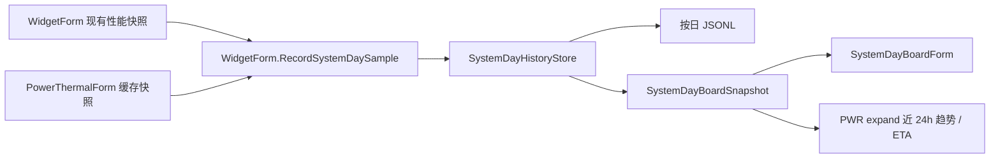

# 系统日记看板架构

适用版本：2.0.0.15

本文说明第七个左缘 `System Day` 看板的数据所有权、持久化格式、时间范围投影和绘制语义。

## 1. 定位

`SystemDayBoardForm` 是与现有左缘看板同尺寸、同交互模型的统一日记面板。它不建立新的硬件采样器，而是把隐藏 `WidgetForm` 已取得的性能快照与 `PowerThermalForm.BuildStripSnapshot()` 的缓存投影记录到同一条时间线上。

看板提供“今天 / 最近 24 小时 / 最近一周”三个范围，同时显示：

- 工作、空闲、睡眠时段和累计时长；
- CPU、GPU、NPU、内存、网络、功耗与温度曲线及各自峰值时间；
- 电量曲线、当前电量、当前功耗，以及充到 80% / 100% 或耗尽的估算时间；
- 当前最高温热区，以及温度峰值对应的热区名称。

所有图表共用一条横向时间轴和七条竖向刻度线。“今天”和“最近 24 小时”使用时分标签，“最近一周”使用月日标签。

## 2. 数据流



关键边界：

- `WidgetForm.SystemDay.cs` 只复用现有 `PerfSnapshot` 与 cache-only 功耗温度快照，不启动 PDH、ACPI、WMI 或网络读取。
- `SystemDayHistoryStore.GetBoardSnapshot()` 在内存中完成范围裁剪、睡眠区间拼接、峰值聚合、ETA 估算和最多 180 点的绘图降采样。
- `SystemDayBoardForm` 每次只克隆不可变展示快照；绘制路径不读文件、不访问硬件。
- `WidgetForm.BuildMetricTilePowerProjection()` 最多每 5 秒取得一次 `Last24Hours` 投影并随 `MetricTileFeed` 推给 `PWR` 展开详情；它不新增 timer，也不改变按分钟历史记录节奏。
- 挂起与恢复事件由 `WidgetForm.WndProc` 转交给历史所有者。跨范围左边界的睡眠区间会被裁剪后保留。

## 3. 持久化与关联字段

历史按本地日期写入：

`%LOCALAPPDATA%\DesktopCodexAssistant\system-day\system-day-YYYY-MM-DD.jsonl`

每行是一个带 `schema_version: 1` 的 JSON 对象。样本行保存 UTC / 本地时间和时区、工作状态、空闲秒数、CPU / GPU / NPU / 内存、网络上下行、电池百分比与方向、充放电 / 插电状态、瓦数、系统续航、性能模式、最高 / 平均温度、最高温热区，以及完整 `thermal_zones` 数组。挂起、恢复和启动是独立事件行。

`thermal_zones` 的每项同时保留固件原始名称、友好显示名和摄氏温度。这样后续分析可按同一个 `timestamp_utc` 将 CPU、GPU、NPU、内存、网络或功耗峰值与每个热区逐一对应，而不只保留当时最热的一个区域。

文件按天分割并保留最近 8 天；内存上限为 13000 条。具体采样、批量落盘、看板刷新以及挂起时同步刷盘节奏由 `Docs/Component-Refresh-Rules.md` 统一规定。

## 4. 电量方向和 ETA

`SystemDayBatteryDirection` 有 `Rising`、`Falling`、`Flat`、`Unknown` 四态：

- 增长段用红色，明确表示正在充电；
- 下降段用青色，表示正在耗电；
- 持平或未知段使用弱化颜色。

放电时优先采用 Windows 提供的剩余运行秒数；缺失时根据最近三小时的有效电量斜率估算。充电时同样使用近期斜率，启用电池保养暂停时目标为 80%，否则目标为 100%。样本不足或斜率不可信时显示未知，不伪造倒计时。

右侧 `PWR` 展开详情复用同一规则：优先显示当前 Windows 续航，其次显示近三小时电量趋势 ETA；插电未放电时明确显示外接电源。背景只绘制近 24 小时黄色功耗曲线与红升/青降电量曲线，温度仍保留在 System Day 看板和历史数据中，不进入 `PWR` 展示。

## 5. 窗口和设置

`SystemDayBoardForm` 使用 `SystemDayBoardLeftDockEnabled`、`SystemDayBoardLeftDockTabCenterY`、`SystemDayBoardAutoHideSeconds`、`SystemDayBoardTransparencyOverridePercent` 与 `SystemDayBoardScaleOverridePercent`。它复用：

- `EdgeDockTabForm` 的第七角色、自动排列、外部点击收起和两级防烧屏；
- `LayeredBitmapSurface`、`UiFontCache`、`DesignTokens` 与显示恢复资源生命周期；
- `OperationForm` 的七看板互斥和全屏隐藏协调；
- 648×400 的现有左看板逻辑尺寸。

顶部六张摘要卡使用独立于图表的可读性字号层级：`SummaryTitleFontPixels = 8.0`、`SummaryDetailFontPixels = 8.2`、`SummaryNameFontPixels = 8.4`、`SummaryValueFontPixels = 10.0`。时长、电量、功耗和温度作为主数值加粗显示；预计充放电时间与热区名称保留各自的完整可用宽度，并在极端长文本时使用省略号，避免侵入相邻卡片。

## 6. 验证

```powershell
DesktopCodexAssistant.exe --test
DesktopCodexAssistant.exe --test-operation-panel
DesktopCodexAssistant.exe --test-settings-bindings
DesktopCodexAssistant.exe --test-layout
DesktopCodexAssistant.exe --test-display-recovery
DesktopCodexAssistant.exe --render-systemdayboard --out <dir>
DesktopCodexAssistant.exe --render-tilecolumn --out <dir>
```

自检覆盖按日 JSONL、红色增长 / 青色下降、完整热区、跨范围睡眠、峰值与 ETA、统一刻度、648×400 绘制以及设置迁移。
