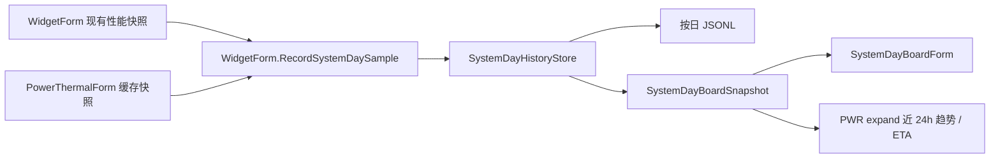

# 系统日记看板架构

适用版本：2.0.0.34

本文说明第七个左缘 `System Day` 看板的数据所有权、持久化格式、时间范围投影和绘制语义。

## 1. 定位

`SystemDayBoardForm` 是与现有左缘看板同尺寸、同交互模型的统一日记面板。它不建立新的硬件采样器，而是把隐藏 `WidgetForm` 已取得的性能快照与 `PowerThermalForm.BuildStripSnapshot()` 的缓存投影记录到同一条时间线上。

看板提供“今天 / 最近 24 小时 / 最近一周”三个范围，同时显示：

- 工作、空闲、睡眠时段和累计时长；
- CPU、GPU、NPU、内存、网络、功耗与温度曲线及各自峰值时间；
- 电量曲线、当前电量、当前功耗，以及充到 80% / 100% 或耗尽的估算时间；
- 当前最高温热区，以及温度峰值对应的热区名称。

全部指标共用同一套坐标系：一条横向时间轴（七条竖向刻度线）和一条 0–100% 纵轴。CPU / GPU / NPU / 内存 / 电量按原值落轴；温度按 20–100°C 归一并在画框右侧给出 °C 副轴；网络按本范围峰值归一，绝对值由图例给出。纵轴不再为任何一条曲线保留独立基线或行内留白，因此任意两条曲线的高低可以直接比较。“今天”和“最近 24 小时”使用时分标签，“最近一周”使用月日标签。

## 2. 数据流



关键边界：

- `WidgetForm.SystemDay.cs` 只复用现有 `PerfSnapshot` 与 cache-only 功耗温度快照，不启动 PDH、ACPI、WMI 或网络读取。
- `SystemDayHistoryStore.GetBoardSnapshot()` 在内存中完成范围裁剪、睡眠区间拼接、峰值聚合、ETA 估算和最多 180 点的绘图降采样。
- `SystemDayBoardForm` 每次只克隆不可变展示快照；绘制路径不读文件、不访问硬件。
- `WidgetForm.BuildMetricTilePowerProjection()` 最多每 5 秒取得一次 `Last24Hours` 投影并随 `MetricTileFeed` 推给 `PWR` 展开详情；它不新增 timer，也不改变按分钟历史记录节奏。
- 挂起与恢复事件由 `WidgetForm.WndProc` 转交给历史所有者。跨范围左边界的睡眠区间会被裁剪后保留。

## 3. 持久化与关联字段

历史按本地日期写入：

`%LOCALAPPDATA%\DesktopCodexAssistant\system-day\system-day-YYYY-MM-DD.jsonl`

每行是一个带 `schema_version: 1` 的 JSON 对象。样本行保存 UTC / 本地时间和时区、工作状态、空闲秒数、CPU / GPU / NPU / 内存、网络上下行、电池百分比与方向、充放电 / 插电状态、瓦数、系统续航、性能模式、最高 / 平均温度、最高温热区，以及完整 `thermal_zones` 数组。挂起、恢复和启动是独立事件行。

`thermal_zones` 的每项同时保留固件原始名称、友好显示名和摄氏温度。这样后续分析可按同一个 `timestamp_utc` 将 CPU、GPU、NPU、内存、网络或功耗峰值与每个热区逐一对应，而不只保留当时最热的一个区域。

文件按天分割并保留最近 8 天；内存上限为 13000 条。具体采样、批量落盘、看板刷新以及挂起时同步刷盘节奏由 `Docs/Component-Refresh-Rules.md` 统一规定。

## 4. 电量方向和 ETA

`SystemDayBatteryDirection` 有 `Rising`、`Falling`、`Flat`、`Unknown` 四态：

- 增长段用红色，明确表示正在充电；
- 下降段用青色，表示正在耗电；
- 持平或未知段使用弱化颜色。

放电时优先采用 Windows 提供的剩余运行秒数；缺失时根据最近三小时的有效电量斜率估算。充电时同样使用近期斜率，保护暂停记录有效时目标为 100%，否则按设备保护上限 80%。`SystemDayHistoryStore.BuildBatteryEta` 在外接电源/充电状态且达到目标时显示上限已到；仅插电而未充电时显示外接电源，不误用旧放电续航。斜率不跨越充电方向或 AC 状态变化，样本不足或斜率不可信时显示未知，不伪造倒计时。历史字段 `battery_care_pause_active` 保存来自 GUARD 的本地暂停记录，不是厂商状态；记录来源见 `Docs/GuardBoard-Architecture.md`。

右侧 `PWR` 展开详情复用同一规则：优先显示当前 Windows 续航，其次显示近三小时电量趋势 ETA；插电未放电时明确显示外接电源。背景只绘制近 24 小时黄色功耗曲线与红升/青降电量曲线，温度仍保留在 System Day 看板和历史数据中，不进入 `PWR` 展示。

## 5. 窗口和设置

`SystemDayBoardForm` 使用 `SystemDayBoardLeftDockEnabled`、`SystemDayBoardLeftDockTabCenterY`、`SystemDayBoardAutoHideSeconds`、`SystemDayBoardTransparencyOverridePercent`、`SystemDayBoardScaleOverridePercent` 与 `SystemDayBoardSmoothingEnabled`。它复用：

- `EdgeDockTabForm` 的第七角色、自动排列、外部点击收起和两级防烧屏；
- `LayeredBitmapSurface`、`UiFontCache`、`DesignTokens` 与显示恢复资源生命周期；
- `OperationForm` 的七看板互斥和全屏隐藏协调；
- 648×400 的现有左看板逻辑尺寸。

顶部不再使用六张摘要卡。摘要折进标题带下方的一行：`记录 / 工作 / 空闲 / 睡眠` 的时长前各带一枚状态色块，这一行同时充当工作/空闲/睡眠的状态图例，看板内不再出现第二份状态说明；其后是电量、功耗与续航估算，行尾右对齐当前最热区与温度。再下一行是曲线图例，形式为 `色样 + 名称 + 当前值 + /峰值`，接管了原先漂浮在每行右端、会叠压曲线的峰值文字。字号层级为 `TitleFontPixels = 13.0`、`StripLabelFontPixels = 8.2`、`StripValueFontPixels = 8.6`、`AxisFontPixels = 7.2`。

摘要行与图例行都按实测文本宽度流式排布：量宽与落笔使用同一个 `CreateInlineFormat()` 排版规则，否则量出来的宽度与实际落笔宽度对不上，定宽文本会被省略号截断。图例整行放不下时先整体去掉 `/峰值` 后缀，仍放不下才截断尾部，绝不叠压。续航估算文本长度不可控，只分配到右侧热区读数之前的剩余宽度并允许省略。

工作状态带并入同一画框底沿（图区下方 `S(4)`、高 `S(9)`），与曲线共用同一条时间轴，不再单占一行、也不再需要独立刻度。电量线额外使用虚线：放电色 `Accent` 与 CPU 同色，同框后仅靠颜色无法区分，虚线是不占用“红升青降”语义的第二个区分维度；虚线必须按同色连续段一次 `DrawLines` 落笔，逐段 `DrawLine` 会在每段起点重置虚线相位，单段宽度小于一个 dash 周期时画出来会是完全实线。GPU 由 `AccentSoft` 改为同属既有 token 的 `AccentGradientEnd`，避免与 CPU 的青在深色底上糊成一条。

底部左侧是绿色范围按钮、平滑开关与红色“关闭”三枚。范围按钮显示当前范围并按“今天 → 24 小时 → 近一周”循环切换，仍可访问全部三种投影；平滑按钮显示“平滑 开 / 平滑 关”，开启时用 `Accent` 描边。这是本看板对其余六个左缘 board “主操作 + 关闭”结构的唯一一处刻意偏离：共享纵轴把七条曲线放进同一个画框后，噪声压制成了这块画面的高频需求，必须就地可切换，放进设置窗口够不着。按钮统一使用实测字体宽度、42 逻辑像素最小宽度和 4 像素间距，状态摘要在关闭按钮后再留 5 像素；顶部不再绘制重复关闭符号。

### 5.1 曲线平滑

`SystemDayBoardSmoothingEnabled` 默认关闭，看板底部的平滑按钮切换它并立即落盘，重启后保持。它复用 `OperationForm.SetBooleanSettingFromGuardBoard` → `WidgetForm.SetBooleanSettingFromOperationPanel` 这条既有的布尔设置通道，并用新增的 `notify:false` 关掉系统通知——视图开关切换频繁，每次弹一条带英文属性名的通知只是噪声。

平滑只改画线，包含两步：`BuildSeriesValues` 先把每条曲线归一到共享纵轴，再在同一采样段内做居中滑动平均，窗口由 `ResolveSmoothingWindow` 按点数给出（不足 9 点不平滑，其余取 `点数/26` 并夹到 3–11 的奇数）；落笔时 `StrokeRun` 用 `DrawCurve` 以 `SmoothingCurveTension = 0.4` 的基数样条连点，采样点之间是弧线而不是折线。张力取 0.4 而非默认的 0.5，是因为默认值会让方波型数据（NPU 在固定占用上的跳变）在台阶处明显过冲。关闭平滑时仍走 `DrawLines`：原始态必须是采样点之间的直连，不能让样条替数据编造中间形状。CPU 的面积填充上沿同步用 `AddCurve`，否则填充边界会和曲线错开。样条在拐点处仍会小幅越过 0% / 100%，因此曲线绘制整体夹在 `plot` 矩形的裁剪区内。电量与温度的线色随数据变化，必须先按“同色连续段”切段、段内一次落笔才画得出弧线——逐段 `DrawLine` 既画不出弧线，也会重置电量虚线的相位。摘要行、图例的当前值与峰值读数始终取原始采样，不经过平滑。两条约束必须保持：一是断档两侧属于不同采样段，不能互相取平均，否则会在缺口上凭空造出一段连续曲线；二是峰值圆点钉在实际画出来的那条线上、标签仍报原始峰值与时刻，否则开启平滑后圆点会浮在曲线上方，看起来像画错了。

## 6. 验证

```powershell
DesktopCodexAssistant.exe --test
DesktopCodexAssistant.exe --test-operation-panel
DesktopCodexAssistant.exe --test-settings-bindings
DesktopCodexAssistant.exe --test-layout
DesktopCodexAssistant.exe --test-display-recovery
DesktopCodexAssistant.exe --render-systemdayboard --out <dir>
DesktopCodexAssistant.exe --render-tilecolumn --out <dir>
```

自检覆盖按日 JSONL、红色增长 / 青色下降、完整热区、跨范围睡眠、峰值与 ETA、统一刻度、共享 0–100% 纵轴（0 贴底、100 贴顶、50 居中，无行内留白）、温度 20–100°C 与网络按峰值的归一换算、CPU 与 GPU 颜色可分、渲染样本峰值落在范围内、平滑窗口边界与奇偶、弧线张力留在温和区间、平滑压低网络尖峰且不增删采样点、平滑不改变摘要与图例读数、底部三枚按钮互不重叠、648×400 绘制以及设置迁移（含 v102→v103 升级不替用户开启平滑）。
