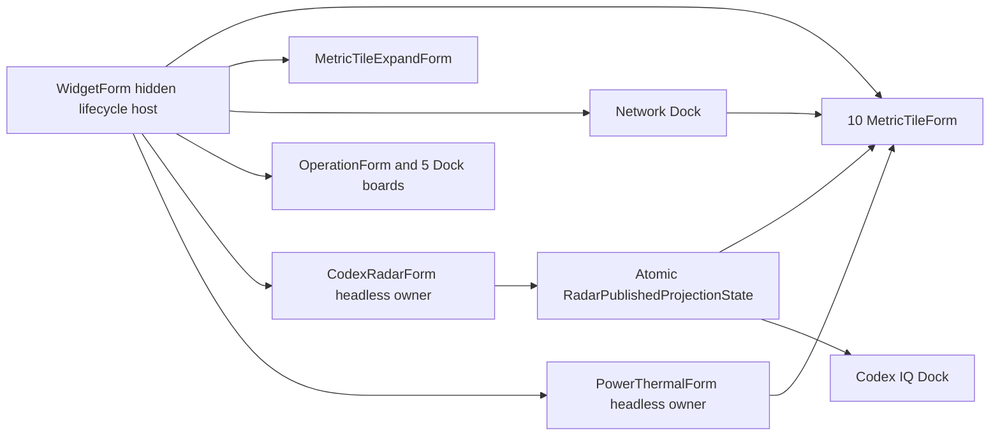

# Post-Convergence Audit Remediation GoalSpec

- 版本：`2.0.0.0`
- 生成模型：Codex
- 生成时间：`2026-07-22T15:04:29.905+09:00`
- Goal：执行界面收敛后审计修复 SPEC，严格再验收并部署 ARM64 正式版本；版本第一段升为 2，不访问 GitHub。
- SPEC：`Docs/Technical/Codex-PostConvergenceAuditRemediation-SPEC-v1.0.6.30-20260722-110209.md`
- SPEC SHA256：`0EE671169FF4175668E438048C09B695A456C1A1A82C2785E360BE9FCA66565C`
- 执行报告：`Docs/Reports/Audits/Codex-PostConvergenceAuditRemediation-Execution-Report-v2.0.0.0-20260722.md`
- 源码基线提交：`78a0722f8902`（本地分支，无 push）

## 1. 目标与范围

本次执行覆盖 SPEC 的 A-E 五个批次：正式构建边界、十 tile 冷启动、前后端重绘契约、Codex Radar 网页契约、凭据与 HTTP 安全、异步 owner 生命周期、原子发布快照、cache-only 投影性能，以及永久 headless 后的旧渲染和系统接口清理。

用户要求最终版本直接进入 `2.0.0.0`，因此五批实现没有分别占用多个 `1.0.6.xx` 版本。每批仍通过窄自测和 ARM64 构建逐步收敛，最终再对同一个 tracked-source 候选执行完整流水线。

明确排除：

- 不构建 x64。
- 不访问、不提交、不推送 GitHub。
- 确定性验收不调用需要认证或可能计费的 API。
- 不自动删除历史 `codex-usage-identity-change-*.json`、旧 Claude Radar 缓存或 DeepSeek 余额历史。

## 2. 基线与备份

执行前源码/文档/正式产物备份：

- `E:/Codexproject/desktopdata/DesktopCodexAssistant-retained-build-backups/source-backups/20260722-113911-pre-post-convergence-v1.0.6.31`
- 备份 manifest SHA256：`9B4ACAD8EFBC6F75E2F282A7ED128E6A4B2882AB700A0CDD168C65D6495F4DE7`
- 执行前正式版本：`1.0.6.31`
- 执行前正式 EXE SHA256：`E4227C430EA6C7E0A5B19469E4F8F7ADC95120F258860D23BF35556FE0E23FCC`

部署前第二份正式备份：

- `E:/Codexproject/desktopdata/DesktopCodexAssistant-retained-build-backups/formal-backups/20260722-145723-pre-post-convergence-v1.0.6.31`
- manifest SHA256：`13CBFF6D5EF1793108ADD7D63F932C11E913377D21444939EA689B5C52FB33E9`
- 包含根/Release EXE、`settings.ini` 和非敏感 Radar/quota 缓存。
- `auth.json`、Claude token 等敏感资源只登记 metadata/hash，不复制。
- 从旧 EXE 还原的 v2 statusline bridge 已单独保存，SHA256 与部署前真实脚本一致。

## 3. 实现映射

### 3.1 批次 A：发布完整性与冷启动

- `Build-Sources.json` 成为正式 C# 源集合的唯一清单。
- `Build-Arm64.ps1` 对清单缺项、重复、越界、清单外源码立即失败；`-RequireTrackedSources` 额外拒绝未被 Git 跟踪的正式源码。
- `WidgetForm.StartChildWindowLifecycle` 形成幂等启动路径。`OnShown` 与冷启动自测复用同一实现，不再用可能被 timer 持续补充的无界 `Application.DoEvents()`。
- 冷启动断言固定为十个 `MetricTileForm` 与一个 `MetricTileExpandForm`，重复应用设置不得重建窗口。
- Claude `used_percent` 与 `utilization` 分别按百分数和比例解释，边界、非法类型和超界值均由 fixture 覆盖。

### 3.2 批次 B：显示与网页数据契约

- Clean IP 评分、原生/住宅标签和错误状态进入 Network Dock 内容签名；相同快照不重复提交，任一可见字段变化触发一次重绘。
- Codex IQ board 签名覆盖点值、顺序、周额度、服务健康和 source/fetch 时间，消除 count 相同但内容变化不刷新的脱钩。
- Codex Radar `current.json` 使用 schema 2 adapter，分别保存上游 `source_updated_at` 与本机 `fetched_at`。
- 首页 HTML 只补结构化结果缺失的速转窗口字段，不再回流 IQ、评分、额度或模型社区链。
- OpenAI/Claude/DeepSeek 服务灯只经 headless Radar 原子发布状态投影到 Codex IQ Dock；Network Dock 不再接收旧 service push。

### 3.3 批次 C：凭据、HTTP 与进程启动安全

- `SecretStore` 使用 `dpapi-v1:` envelope、CurrentUser DPAPI 和同目录原子替换；损坏密文、随机 Base64、跨用户失败、文件锁与替换失败全部保持原字节不变并失败关闭。
- Claude setup-token 使用严格格式 validator，未知文本不得被当作 token 自动迁移。
- `BoundedHttpTextReader` 统一处理所有活动远端文本：正文/解压上限、总 deadline、取消、严格 UTF-8、禁重定向和有界集合解析。
- `CodexRadarUrlPolicy` 只接受登记的精确 HTTPS endpoint；DNS 命中 loopback、私网、链路本地、保留地址、IPv4 映射或 redirect 到内网均拒绝。
- provider 身份变化诊断只记录白名单元数据、正文长度和 SHA256，不再持有或写入原始认证响应。
- `auth.json` 只从已知路径读取不超过 1 MiB 的严格 JSON，仅接受已登记字段路径和单一 token。
- Claude statusline 的 `settings.json` merge、bridge 脚本生成和提交改为 identity 检测、最多两次重合并与同目录原子替换。
- Logger 最终持久化边界统一脱敏 Authorization、Bearer、Cookie、token、api_key、JWT 和 setup-token。
- `CodexExecutablePathPolicy` 拒绝裸命令、相对/UNC/当前目录/TEMP、reparse point、非可信可写位置、非法路径语法、无效签名或非 OpenAI 发布者；验证期间持有拒绝写入/删除共享的文件 lease。嵌入 NUL 的覆盖路径返回 `INVALID_PATH_SYNTAX`，不再让路径 API 异常越过策略。
- GFW TLS 诊断区分“协议握手可达”与证书信任，不把忽略证书错误的 callback 复用于认证请求。

### 3.4 批次 D：生命周期、快照与性能

- Claude quota 使用统一 360 分钟 freshness gate；359:59、360:00、360:01、未来偏差、跨午夜和恢复均有确定性 fixture。
- `OwnerOperationGeneration` 将 Start/Stop/挂起/恢复建立为 generation lease；Stop 后迟到 completion 不写缓存、不记业务事件、不通知、不投递 UI。
- `RadarPublishedProjectionState` 一次替换并在同一锁内 clone，锁内不做 I/O、日志、绘制或 UI dispatch。
- 显示挂起立即关闭 Radar 网络门和 Power 采样门；恢复只 prime 一次。
- `CodexRadarModelCatalog` 由 owner 载入内存，tile/IQ cache-only projection 不访问文件。
- `TimingStats` 增加 P99，并记录 `codex.iq_snapshot_projection`。

### 3.5 批次 E：死代码和依赖收敛

删除的主要代码簇：

- QuickGrid 与旧 DenseGrid/GuardStrip/PowerStrip 主窗呈现。
- Codex Radar EvenRow、旧 render sample、底栏 renderer、hover/scene cache 和旧 quota/community 链。
- Power 三栏 renderer 与旧 Power render sample，保留 headless sampler 和 snapshot。
- Claude 独立窗口、community reader/scheduler/model map、共享 quota ring renderer。
- ConnectionCheck 旧窗口。
- 无调用方 AppBar、Shell shortcut、DWM thumbnail 互操作。
- Network 旧浮窗绘制 helper 和 Radar service push。
- DeepSeek key/余额 monitor，保留无凭据服务健康 monitor。

`QuickGrid`、旧 Radar/Power paint 入口、quota-radar/model-ratings、AppBar/DWM thumbnail 等禁用符号在生产 C# 中命中 0。

## 4. 现行架构

可见层只消费不可变/clone 快照。网络、凭据、缓存、调度和 generation 所有权留在 headless owner/reader；绘制与 UI timer 不直接访问远端或磁盘。

## 5. 验收摘要

最终 ARM64 tracked-source 候选：

- 路径：`_build/post-convergence-final/DesktopCodexAssistant-arm64.exe`
- PE machine：`0xAA64`
- File/Product/Assembly version：`2.0.0.0`
- 长度：`2,138,112` bytes
- SHA256：`07647B84D55A8F5363E091835250EBB6BB28B1023AA9284D3A684275D4B1F460`

最终候选全部退出 0：`--test`、`--test-logger`、`--test-layout`、`--test-settings-bindings`、`--test-display-recovery`、`--test-operation-panel`、设置窗口 50 次、Radar 生命周期 100 次。

渲染产生 35 张 PNG；全部可解码、尺寸有效、有非透明像素且颜色分布非单色。10,000 次 IQ projection：P50 `0.0222 ms`、P95 `0.0269 ms`、P99 `0.0521 ms`、max `5.36 ms`；100 次 cache-only projection 文件访问计数为 0；并发发布跨代组合为 0。

`python Docs/validate_docs.py --root .` 通过，保留 209 条既有索引符号/历史 change_type warning；`git diff --check` 退出 0。

## 6. 部署与运行验证

- 旧正式 PID 49036 收到停止事件后 75 秒仍未退出；watchdog 证明旧 `1.0.6.31` UI 线程长期无心跳且仍写缓存。完成备份并精确核对 PID/路径后强制结束。
- 新正式 PID：55588，路径为项目根 `DesktopCodexAssistant.exe`，持续 `Responding=True`。
- 候选、根入口、Release 的版本、长度和 SHA256 完全一致。
- 启动后 `error.log` 哈希不变，无新增 Fatal；一分钟观察无新 watchdog，句柄 1010→1006、线程保持 34。
- `settings.ini`、Codex `auth.json`、Claude `settings.json` 与基线 SHA256 一致；Claude token 文件仍不存在。
- 程序管理的 statusline bridge 从 v2 原子升级为 v3，当前文件逐字节等于 `2.0.0.0` 内置生成内容。旧 v2 文件已从备份 EXE 精确还原并保存，便于回滚。

## 7. 安全与兼容性

- 测试使用临时目录、fake transport 和 fixture，不读取真实 token 正文，不调用认证/计费接口。
- SSRF 拒绝 fixture 的实际连接次数为 0。
- 生产日志扫描未发现 Logger fixture secret、Bearer、Cookie、JWT 或 setup-token 标记。
- 旧身份诊断 JSON、Claude Radar 历史文件和 DeepSeek 余额历史按 SPEC 保留但不再读写；清理需要用户另行授权。
- 正式发布只构建 ARM64。x64 仍需用户明确要求后单独评估和编译。

## 8. SPEC 偏离与遗留

- 按用户最新要求，版本直接从 `1.0.6.31` 升为 `2.0.0.0`，没有为 A-E 五批分别占用中间版本。
- 没有执行任何 GitHub 操作；仅创建本地 Git 提交。
- 一次压力测试曾因遗留旧候选 PID 49564 持续运行并占用 CPU 而超时；清理该已确认的 `_build` 测试进程后，同一最终候选 50 次设置测试在 102.974 秒内通过。该环境干扰不计为最终候选缺陷。
- 文档 Gate 的 209 条 warning 属于既有历史 vocabulary 与 9 个弱符号定位，未产生解析、重复 ID、缺失路径或 active removed-interface 错误。

## 9. 完成判定

REL、DATA、UI、WEB、SEC、LIFE、PERF、DEAD、DOC 各项均有实现与可重复证据；正式 ARM64 产物已备份、覆盖、重启并观察稳定。SPEC 可标记为 `implemented`，Spec Board 可从 `awaiting_verify` 经最终复验推进到 `done`。
