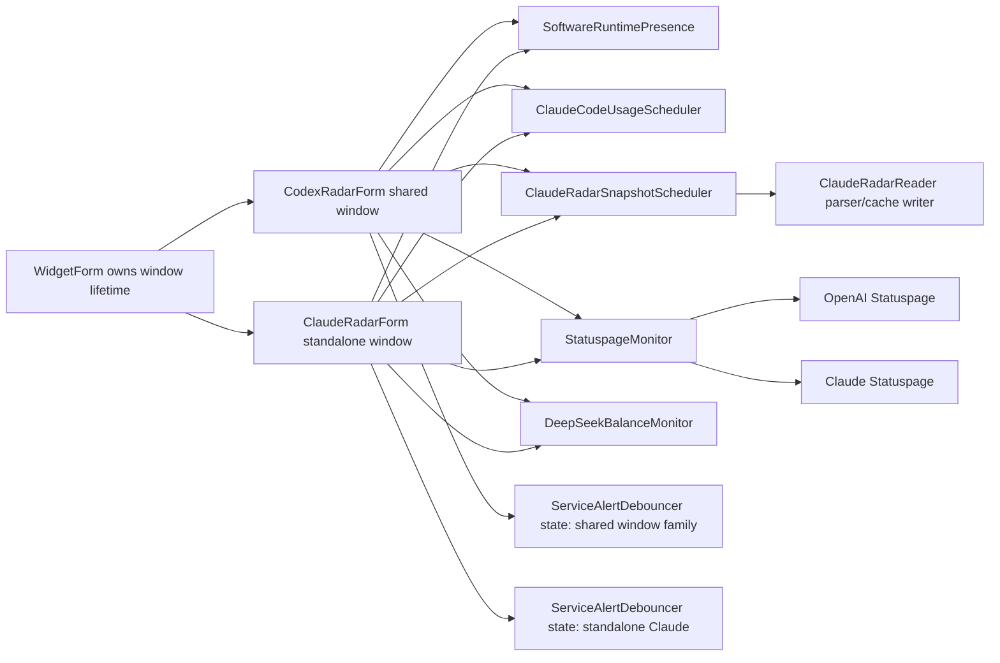

# Radar Backend Reuse SPEC

适用版本：1.0.4.77

状态：draft

生成模型：Codex

生成时间：2026-07-09 10:24:46 +09:00

## 1. 目标

在保留“共享 Codex Radar 窗口”和“独立 Claude Radar 窗口”可以同时显示的前提下，收敛两者后端中已经重复、可复用或缺少统一调度的部分。

目标不是合并两个窗口，也不是让两个窗口共享 UI 生命周期。目标是让相同外部数据源、相同轻量服务探测、相同防抖规则和相同缓存写入路径只由一个进程级后端服务负责，再把 cloned snapshot 分发给各自窗口。

## 2. 当前结论

### 已经正确复用

| 模块 | 当前复用状态 | 保留策略 |
| --- | --- | --- |
| `WidgetForm` 子窗口生命周期 | `CodexRadarForm` 与 `ClaudeRadarForm` 可独立创建、关闭、隐藏和恢复 | 保留，禁止用共享窗口替代独立 Claude 窗口 |
| `SoftwareRuntimePresence` | 已是进程级 Codex/Claude 运行态缓存 | 保留，绘制路径只读 cached snapshot |
| `ClaudeCodeUsageScheduler` | 已是进程级 single-flight，两个窗口可 join 同一 Claude Code usage 请求 | 保留，后续只补更明确的 consumer 日志 |
| `QuotaRingPresentation` | 已统一 Claude 额度环绘制 | 保留，不把 Codex reset-card 文案塞入该 helper |
| `ClaudeRadarReader` parser | 共享窗口 Claude 模式和独立 Claude 窗口复用同一解析器 | 保留 parser，但外层需要 scheduler |
| `RadarFamilyRuntimeState` | 共享窗口内 Codex/Claude family 状态已隔离 | 保留，不让独立 Claude 直接读共享窗口 family state |

### 未复用或存在缺口

| 问题 | 位置 | 风险 | 处理 |
| --- | --- | --- | --- |
| DeepSeek 两套实现 | `Core/CodexRadarForm.cs` 私有实现 + `Core/DeepSeekBalanceMonitor.cs` | 两窗口同时开时可能重复请求、重复写 `deepseek-balance-history.jsonl`，错误映射可能漂移 | 共享窗口 Claude 模式迁移到 `DeepSeekBalanceMonitor` |
| OpenAI Status 两套实现 | `CodexRadarForm.TryReadOpenAiStatus` + `ClaudeRadarForm.TryReadOpenAiStatus` | 两窗口同时请求 `status.openai.com`，状态枚举映射不一致 | 新增进程级 Statuspage monitor |
| ClaudeRadar 公共数据无 single-flight | 两边都直接调用 `ClaudeRadarReader.ReadSnapshot` | 两窗口同模型同设置时重复请求 claudecoderadar.com，并竞争写 `claude-radar-cache.ini` / model-map | 新增 `ClaudeRadarSnapshotScheduler` |
| 服务告警防抖重复 | `ApplyCodexApiServiceAlertDebounce` 与 `ApplyClaudeServiceAlertDebounce` | 防抖语义不完全一致，切换或网络抖动时视觉不一致 | 抽出通用 `ServiceAlertDebouncer`，状态仍按窗口/软件族隔离 |
| 独立 Claude 公开网站刷新缺少网络历史 | `ClaudeRadarForm.ApplyRefreshResult` 只写 `Program.LogInfo` | 排查时只有共享窗口有 `NetworkCheckHistoryLogger` 证据 | 由 scheduler 写 request-level 历史 |
| `claude-radar-cache.ini` 写入保护较弱 | `ClaudeRadarReader.TrySaveCache` | 并发写入或进程中断时可能留下半文件 | 增加 lock 与 temp + replace 原子写法 |

## 3. 设计边界

1. 两个窗口继续独立显示、独立位置、独立透明度、独立 render scene cache。
2. 后端 reader/scheduler 可以共享请求，但返回给窗口的对象必须 clone。
3. paint 路径禁止网络、磁盘、进程枚举和前台窗口检测。
4. Codex 模式不读取 DeepSeek，不显示 `D`，不消费 Claude-only 后端状态。
5. 独立 Claude 窗口不读取 Codex quota、Codex reset-card、Codex provider queue 或 CodexRadar.com 业务数据。
6. 共享窗口 Claude 模式和独立 Claude 窗口可以使用同一 ClaudeRadar.com / OpenAI Status / DeepSeek / Claude Code usage 后端结果。
7. 失败合并必须保留 last-good display snapshot，不能因为后端统一而在切换或刷新失败时显示空态。

## 4. 目标后端结构



## 5. 实施计划

### 5.1 DeepSeek 后端统一

新规则：

- `DeepSeekBalanceMonitor` 成为唯一 DeepSeek API key、请求、解析、history 和 display signature owner。
- `CodexRadarForm` 删除私有 `DeepSeekBalanceSnapshot`、`DeepSeekBalancePoint`、`ReadDeepSeekBalance`、`ApplyDeepSeekBalanceHistory` 等重复实现。
- 共享窗口 Claude 模式通过 `DeepSeekBalanceMonitor.GetSnapshot()` 绘制 `DS` 与 `D`，通过 `DeepSeekBalanceMonitor.RefreshIfNeeded()` 刷新。
- `DeepSeekApiKeyRevision` 调整为调用 `DeepSeekBalanceMonitor.RequestRefresh()`；两个窗口收到回调后各自 `RenderLayeredWindow()`。
- 未配置 key 不作为 API 故障；配置 key 后才显示 `D`。

需要覆盖的关键点：

- 两个 Claude 视图同时开启只启动一个 DeepSeek 请求。
- 两个窗口读取到的是 clone，窗口不能修改 monitor 内部 snapshot。
- `deepseek-balance-history.jsonl` 仍只保存 `timestamp_utc` 和 `balance_cny`，48 小时滚动。

### 5.2 Statuspage 后端统一

新增 `Core/StatuspageMonitor.cs`，建议结构：

- `StatuspageSnapshot`
  - `ServiceKey`
  - `Known`
  - `State`
  - `Indicator`
  - `ErrorCode`
  - `ErrorMessage`
  - `CheckedAtUtc`
  - `RequestRunning`
- `StatuspageMonitor.RequestRefresh(serviceKey)`
- `StatuspageMonitor.RefreshIfNeeded(serviceKey, settings, onChanged)`
- `StatuspageMonitor.GetSnapshot(serviceKey)`

服务 key：

- `openai`: `https://status.openai.com/api/v2/summary.json`
- `claude`: `https://status.claude.com/api/v2/summary.json`

规则：

- 正常 15 分钟，异常/失败 2 分钟。
- 尊重 `AiRequestProtection.ShouldBlock`。
- 进程级 single-flight，同一 serviceKey 任意时刻一个请求。
- 请求日志由 monitor 写一次，带 `joined_consumers`。
- 窗口只做状态转色和 alert candidate 组装。

注意：

- `CodexRadarForm` 现有 `ClaudeStatusUrl` 是 `status.json`，独立 Claude 架构文档记录的是 `summary.json`。统一时应以现有可解析实现为准，先封装行为，再决定是否切到 `summary.json`；切换 URL 必须更新 `INTERFACE_INDEX.jsonl`。

### 5.3 ClaudeRadar 公共数据 scheduler

新增 `Core/ClaudeRadarSnapshotScheduler.cs`，包住 `ClaudeRadarReader.ReadSnapshot`。

请求 key：

```text
selectedModelKey | jsonEnabled | homepageFallbackEnabled | ratingsEnabled | localQuotaFallbackEnabled
```

规则：

- 同 key 请求 single-flight；第二个窗口 join running task。
- 不同 key 允许并行，避免共享窗口和独立窗口选择不同模型时互相阻塞。
- scheduler 输出包含：
  - `ClaudeRadarSnapshot Snapshot`
  - `Success`
  - `Health`
  - `ElapsedMilliseconds`
  - `Trigger`
  - `ConsumerIds`
  - `RequestKey`
- 成功结果由 reader 写 cache/model-map/history 一次。
- 每个窗口 apply 时再 clone，保留自己窗口的 `RequestRunning`、测试模式、last attempt local 与 render cache invalidation。
- 公开网站数据不受本地 Claude/Codex 运行态门控；个人 Claude Code usage 仍由 `ClaudeCodeUsageScheduler` 单独门控。

### 5.4 服务告警防抖统一

新增 `Core/ServiceAlertDebouncer.cs`。

通用数据结构：

- `ServiceAlertCandidate`
  - `Key`
  - `Name`
  - `Reason`
  - `State`
  - `Color`
  - `Checking`
- `ServiceAlertDebounceState`
  - `PendingSignature`
  - `PendingSinceUtc`
  - `ActiveSignature`
  - `ActiveCandidate`

规则：

- `checking` 立即显示并参与闪烁。
- 新错误必须连续存在满 10 秒才替换可见 stable candidate。
- 新错误未稳定前，保留旧 stable candidate。
- 正常恢复即删除该服务 key 的 debounce state。
- 随机测试模式和设置页测试模式旁路防抖。
- 状态容器仍由窗口或 family 持有，不能做成全局共享，否则两个窗口会互相影响。

### 5.5 网络历史与日志统一

目标：

- request-level 日志由 scheduler/monitor 写一次。
- consumer apply 可写普通 `Program.LogInfo`，不重复写 `network-check-history.jsonl`。

建议字段：

- `module`: `claude_radar_backend`、`statuspage_monitor`、`deepseek_balance`
- `action`: `claude_radar_snapshot`、`openai_status`、`claude_status`、`deepseek_balance`
- `trigger`
- `result`
- `success`
- `elapsed_ms`
- `details.joined_consumers`
- `details.request_key_hash`
- `details.health`
- `details.error_code`

禁止记录：

- API key
- token
- 响应正文
- 用户账号标识
- IP/DNS 详情

### 5.6 Cache 写入加固

修改 `ClaudeRadarReader.TrySaveCache`：

- 增加 `CacheLock`。
- 写入 temp 文件。
- 目标存在时 `File.Replace(temp, target, null)`；目标不存在时 `File.Move(temp, target)`。
- 写入前若内容未变，跳过写入。
- 失败时删除 temp 并记录异常。

保留现有 `MapLock`、`HistoryLock` 和 `ClaudeCodeQuotaCacheLock` 语义。

## 6. 非目标

以下不纳入本 spec：

- 不重画任何 UI，不改窗口尺寸、坐标、字体或颜色。
- 不合并共享 Radar 与独立 Claude Radar 的窗口开关。
- 不修改 Codex quota provider、Codex reset-card、Codex session fallback 的业务规则。
- 不改变 Claude Code statusline bridge 默认策略。
- 不引入新的外部 API。
- 不把 DeepSeek/Claude/OpenAI 状态持久化到 settings.ini。

## 7. 预期修改文件

主要源码：

- `Core/DeepSeekBalanceMonitor.cs`
- `Core/StatuspageMonitor.cs`
- `Core/ClaudeRadarSnapshotScheduler.cs`
- `Core/ServiceAlertDebouncer.cs`
- `Core/CodexRadarForm.cs`
- `Core/CodexRadarForm.ClaudeUsage.cs`
- `Core/CodexRadarForm.EvenRow.cs`
- `Core/ClaudeRadarForm.cs`
- `Core/ClaudeRadarReader.cs`

文档与索引：

- `Docs/Component-Refresh-Rules.md`
- `Docs/CodexRadar-Architecture.md`
- `Docs/Codex-ClaudeRadar-Architecture.md`
- `Docs/Fable5-Data-Sources-And-Caching-Technical.md`
- `Docs/Indexes/FEATURE_INDEX.jsonl`
- `Docs/Interfaces/INTERFACE_INDEX.jsonl`
- `Docs/Maintenance/CHANGELOG.jsonl`
- `Docs/Technical/INDEX.jsonl`

## 8. 验收方案

### 8.1 自测入口

必须新增或扩展：

- `DeepSeekBalanceMonitor.RunSelfTest`
  - 无 key
  - 401 / 402 / 429 / NET
  - 两消费者 join 单请求
  - history 48 小时裁剪
  - clone 防突变
- `StatuspageMonitor.RunSelfTest`
  - `none/minor/major/critical` 映射
  - AI 阻断
  - 同 serviceKey single-flight
  - 不同 serviceKey 并行
- `ClaudeRadarSnapshotScheduler.RunSelfTest`
  - 相同 key join
  - 不同 key 不 join
  - 失败保留 last-good
  - 返回 clone
  - joined consumers 记录
- `ServiceAlertDebouncer.RunSelfTest`
  - checking 立即显示
  - 新错误 10 秒后显示
  - 新错误稳定前保留旧错误
  - 恢复正常立即清除
  - bypass 清状态

### 8.2 必跑命令

```powershell
powershell -NoProfile -ExecutionPolicy Bypass -File .\Build-Arm64.ps1 -OutputPath .\_build\DesktopCodexAssistant-arm64-radar-backend-reuse.exe -Platform arm64
.\_build\DesktopCodexAssistant-arm64-radar-backend-reuse.exe --test
.\_build\DesktopCodexAssistant-arm64-radar-backend-reuse.exe --test-layout
.\_build\DesktopCodexAssistant-arm64-radar-backend-reuse.exe --test-settings-bindings
.\_build\DesktopCodexAssistant-arm64-radar-backend-reuse.exe --test-logger
.\_build\DesktopCodexAssistant-arm64-radar-backend-reuse.exe --test-radar-display-lifecycle --iterations 100
.\_build\DesktopCodexAssistant-arm64-radar-backend-reuse.exe --render-codexradar --out .\_build\radar-backend-reuse-codex
.\_build\DesktopCodexAssistant-arm64-radar-backend-reuse.exe --render-clauderadar --out .\_build\radar-backend-reuse-claude
```

### 8.3 两窗口场景验收

| 场景 | 设置 | 预期 |
| --- | --- | --- |
| 只共享窗口 | `CodexRadarEnabled=true`, `ClaudeRadarEnabled=false` | 共享窗口行为不变 |
| 只独立 Claude | `CodexRadarEnabled=false`, `ClaudeRadarEnabled=true` | 独立 Claude 正常显示 `R/O/C/D` 与 `Claude/RC/DS/LLM` |
| 两窗口，共享 CODEX | 两窗口开启，`CodexRadarSoftwareMode=Codex` | 共享窗口不请求 DeepSeek，不显示 `D`；独立 Claude 可请求 DeepSeek |
| 两窗口，共享 CLAUDE | 两窗口开启，`CodexRadarSoftwareMode=Claude` | DeepSeek、OpenAI Status、ClaudeRadar 同 key 数据只请求一次，两个窗口各自刷新 |
| 两窗口，Auto 切换 | 两窗口开启，Auto，Codex/Claude 进程组合切换 | 不出现旧错误跨窗口/跨 family 第一帧闪烁 |
| 不同 Claude 模型 | 共享窗口 Claude 与独立 Claude 选不同模型 | ClaudeRadarSnapshotScheduler 不错误 join，不互相覆盖 selected model |

### 8.4 网络请求与日志验收

需要在 `%LOCALAPPDATA%\DesktopCodexAssistant\network-check-history.jsonl` 中看到：

- 同一轮 OpenAI Status 请求只有一条 `openai_status` request-level 记录。
- 同一轮 DeepSeek 请求只有一条 `deepseek_balance` request-level 记录。
- 同一轮 ClaudeRadar 公共数据请求只有一条 `claude_radar_snapshot` request-level 记录。
- `joined_consumers` 能显示 `codex_radar`、`claude_radar` 或二者同时存在。
- 不含 API key、token、响应正文或账户标识。

### 8.5 性能验收

修改前后对比：

```powershell
.\Release\DesktopCodexAssistant-arm64.exe --diagnose-radar-runtime --diagnose-seconds 120 --diagnose-label both-window
```

验收条件：

- 两窗口同时显示空闲时 CPU 不高于修改前同场景。
- 外部请求数小于或等于当前实现。
- `--test-radar-display-lifecycle --iterations 100` 的 handle/GDI/USER 增量保持 bounded。
- render scene cache 仍最多 6 张，display suspend/resume 后释放。

## 9. 回滚边界

若统一后出现跨窗口串扰：

1. 优先回滚 scheduler/monitor consumer apply 层，不回滚 reader parser。
2. DeepSeek 可临时恢复为独立窗口使用 `DeepSeekBalanceMonitor`、共享窗口继续私有实现，但需要保留文件写入锁避免 history 竞争。
3. OpenAI/Claude Status 可临时恢复 per-window 请求，但必须保留统一状态映射 helper。
4. `ClaudeRadarReader.TrySaveCache` 的原子写入加固不应回滚。

## 10. 完成条件

本 spec 完成时必须满足：

- 两窗口仍可同时显示。
- 共享窗口 CODEX / CLAUDE 模式和独立 Claude 窗口的数据源边界清晰。
- DeepSeek、OpenAI Status、Claude Status、ClaudeRadar 公共数据在相同请求 key 下进程级 single-flight。
- 防抖规则统一但状态隔离。
- network history 能说明每次 shared request 由哪些 consumer 使用。
- 文档、功能索引、接口索引、维护日志和刷新规则同步更新。
