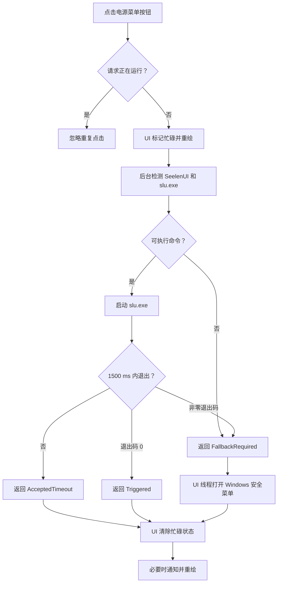
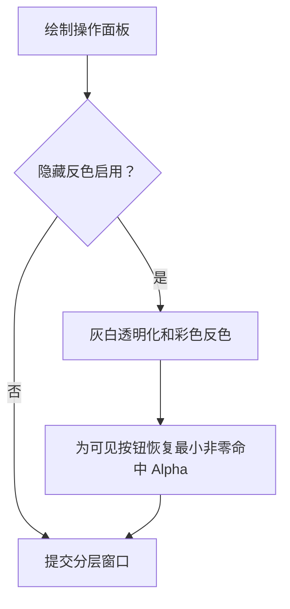

# 左下角操作面板交互与性能优化执行 Spec

## 1. 元数据

| 字段 | 值 |
| --- | --- |
| `spec_id` | `operation-panel-interaction-performance-v1.0.2.64` |
| `spec_version` | `1.0.0` |
| `created_at_utc` | `2026-06-15T18:08:09Z` |
| `created_at_local` | `2026-06-16T03:08:09+09:00` |
| `timezone` | `Asia/Tokyo (+09:00)` |
| `baseline_product_version` | `1.0.2.63` |
| `target_product_version` | `1.0.2.64` |
| `target_architecture` | `ARM64` |
| `primary_owner` | `Core.OperationForm` |
| `coordinator` | `Core.WidgetForm` |
| `status` | `ready_for_goal_execution` |

本文件是后续 Codex Goal 的输入 Spec。创建本文件不修改运行时代码，也不提前升级产品版本。执行 Goal 时应以本文件路径和 SHA-256 哈希作为固定需求基线。

## 2. Goal

在不改变操作面板既有按钮布局、视觉语义和主要功能的前提下：

1. 修复隐藏反色模式下白色图标区域鼠标穿透、只有按钮背景能接收点击的问题。
2. 消除打开 SeelenUI 电源菜单时 UI 线程最多阻塞 1.5 秒的问题。
3. 修复静止悬停后动画定时器不停止的问题。
4. 删除没有有效界面用途的 SeelenUI 2.5 秒进程轮询。
5. 全屏隐藏和窗口不可见时停止操作面板非必要采样与动画。
6. 让操作面板复用项目既有分层窗口表面、字体缓存和布局缓存。
7. 降低 FPS 回退模块的同步采样、重复发现和无变化重绘开销。
8. 建立可重复执行的操作面板交互、异步命令、渲染和性能回归验证。

## 3. 已确认问题

### 3.1 隐藏模式图标区域穿透

当前链路：

1. `OperationForm.RenderLayeredWindow()` 绘制操作面板。
2. 隐藏模式启用时调用 `BurnInProtection.ApplyHiddenModeColorProtection()`。
3. 该处理将白色、灰色和近黑像素的 BGRA 全部改为 `0`。
4. 操作面板图标大多使用白色或灰色，因此图标像素最终为 `Alpha=0`。
5. Windows 分层窗口按逐像素 Alpha 命中；Alpha 为零的区域会把鼠标消息交给后方窗口。
6. 彩色或半透明按钮底板仍有非零 Alpha，所以点击底板有效，点击图标中心可能穿透。

这不是 `OperationForm.HitTest()` 的矩形错误。鼠标消息在到达 WinForms 前已经被 User32 按分层窗口透明度过滤。

### 3.2 SeelenUI 电源菜单阻塞 UI

当前调用链：

`OnMouseUp` -> `ExecuteButton` -> `TryOpenSeelenPowerMenu` -> `Process.WaitForExit(1500)`

整个调用发生在 WinForms UI 线程。`slu.exe` 未在 1.5 秒内退出时，操作面板的按压动画、悬停反馈、重绘和其他窗口消息都会暂停。

### 3.3 静止悬停仍持续唤醒

`NeedsAnimationTimer()` 只要 `hoveredButton` 指向可用按钮就返回 `true`。即使该按钮的 `hoverProgress` 已达到 `1.0`，定时器仍保持运行。

省电模式下间隔为 100 ms，静止悬停会产生约 10 次 UI 消息泵唤醒/秒。虽然稳定后通常不重绘，但与技术文档“动画结束后停止定时器”不一致。

### 3.4 SeelenUI 状态轮询没有有效消费者

`seelenStatusTimer` 每 2.5 秒调用一次 `Process.GetProcessesByName("seelen-ui")`。当前 `seelenUiRunning` 仅用于保存状态和触发一次无实际差异的重绘，没有参与按钮可见性、可用性或图标状态。

电源菜单和重启流程在执行时会再次实时检查 SeelenUI，因此常驻轮询没有必要。当前频率约为 1440 次进程扫描/小时。

### 3.5 分层窗口和字体复用不完整

其他主要浮窗已经持有 `NativeMethods.LayeredBitmapSurface` 和 `UiFontCache`。`OperationForm` 仍通过 `UpdateLayeredWindowFromBitmap()` 在每次提交时创建和销毁兼容 DC 与 HBITMAP，并在部分重复绘制路径创建字体。

这违反当前项目运行时不变量，也增加悬停动画和状态重绘期间的 GDI 分配。

### 3.6 FPS 回退路径存在潜在高开销

FPS 面板启用时：

- UI 定时器每秒采样一次并无条件重绘。
- `ForegroundFpsReader` 可能枚举系统性能计数器类别。
- 前台进程变化或发现周期到期时可能重新扫描候选计数器。
- 初始采样可由 `ApplyRuntimeSettings()` 或显示流程同步触发。

当前 ASUS/MyASUS 配置通常隐藏 FPS 面板，但该路径仍是其他状态下的潜在性能风险。

## 4. 范围

### 4.1 必须修改

- `Core/OperationForm.cs`
- `Core/WidgetForm.cs`
- `Core/ForegroundFpsReader.cs`
- `DesktopCodexAssistant.cs`，仅在增加操作面板自测入口时修改
- `Docs/Performance-And-Window-Runtime.md`
- `Docs/Performance-Optimization-Technical.md`
- `Docs/INTERFACE_INDEX.jsonl`
- `CHANGELOG.jsonl`
- `Core/ProductIdentity.cs`
- `AGENTS.md`

### 4.2 可按实现需要修改

- `Core/BurnInProtection.cs`
- `Core/UiFontCache.cs`
- `Interop/NativeMethods.cs`
- `README.md`

### 4.3 不在范围内

- Dock、Launchpad、顶部栏和 Direct2D 项目。
- 操作面板按钮的重新布局、改名或功能替换。
- SeelenUI 重启/结束进程流程的全面异步化。
- 主窗口和其他监控窗口的隐藏模式交互策略变更。
- 更改 Windows 全局鼠标穿透设置语义。
- 新增注册表写入。
- x64 构建或验证。

## 5. 设计约束

1. 操作面板仍是 `WS_EX_LAYERED | WS_EX_NOACTIVATE | WS_EX_TOOLWINDOW` 窗口。
2. 不使用 `WS_EX_TRANSPARENT` 解决本问题。
3. 不依赖 `WM_NCHITTEST` 覆盖 Alpha 为零像素的系统级命中过滤。
4. 按钮间隙、圆角外部和真正空白区域必须继续允许鼠标穿透。
5. 只有可见按钮的圆角 tile 区域需要保持可命中。
6. 后台任务不得直接访问 WinForms 控件、`Graphics`、`Bitmap` 或窗口句柄。
7. UI 状态更新必须通过 UI 线程完成。
8. 外部命令失败不能导致未处理异常或操作面板永久处于忙碌状态。
9. 不新增高频常驻定时器。
10. 复用 `LayeredBitmapSurface`、`UiFontCache`、`DesignTokens` 和 `BurnInProtection`。
11. 保持现有通知文字和回退语义，除非本 Spec 明确要求调整。

## 6. 实现方案

### 6.1 操作面板交互命中遮罩

#### 6.1.1 渲染顺序

为 `OperationForm` 增加独立、缓存的交互命中遮罩。遮罩描述当前可见按钮的圆角 tile 区域，不描述图标形状。

固定渲染顺序：

1. 绘制正常操作面板位图。
2. 如有需要，执行隐藏模式反色和灰白透明化。
3. 仅对 `OperationForm` 应用交互命中遮罩。
4. 提交分层窗口。

应用遮罩时：

- 遮罩像素属于可见按钮区域且最终渲染像素 `Alpha=0` 时，将其改为 `BGRA=(0,0,0,1)`。
- 已有非零 Alpha 像素保持不变。
- 遮罩外像素保持不变。
- 数据继续满足 `Format32bppPArgb` 的预乘 Alpha 约束。

隐藏模式下 `SourceConstantAlpha` 还会降低整体透明度，`Alpha=1` 的黑色命中像素在视觉上应不可辨识，但逐像素命中不再是全透明。

#### 6.1.2 遮罩缓存

建议增加：

- `Bitmap interactionHitMask`
- `bool interactionHitMaskValid`

遮罩失效条件：

- 操作面板尺寸变化。
- DPI/scale 变化。
- 按钮布局变化。
- 可见按钮集合变化，例如电池按钮与 FPS 面板切换。
- 窗口显示资源重置。

生成遮罩时复用布局缓存和按钮绘制使用的 `RoundedSegment()` 路径。只填充 `IsButtonVisible(button)` 为真的 tile；FPS 信息区域不是按钮，不加入遮罩。

#### 6.1.3 禁止的替代方案

- 不把整个窗口矩形改成 Alpha 非零，否则按钮间隙不再穿透。
- 不给图标单独描边或改色来间接解决命中。
- 不关闭隐藏反色防烧屏。
- 不修改所有窗口的隐藏反色结果。

### 6.2 SeelenUI 电源菜单异步执行

#### 6.2.1 UI 入口与单飞

将同步 `TryOpenSeelenPowerMenu()` 替换为 `BeginOpenSeelenPowerMenu()` 一类的异步入口，并增加：

- `bool seelenPowerMenuRequestRunning`

请求运行期间：

- 电源菜单按钮不可再次执行。
- 使用现有禁用或按压视觉，不新增连续进度动画。
- 快速重复点击不得启动多个 `slu.exe`。

#### 6.2.2 后台结果

使用内部枚举或不可变结果对象表达：

- `Triggered`：`slu.exe` 在超时内以退出码 0 结束。
- `AcceptedTimeout`：1.5 秒内未退出，保留“认为已接受”的现有语义。
- `FallbackRequired`：SeelenUI 未运行、找不到 `slu.exe` 或退出码非零。
- `Failed`：启动、等待或读取退出码时发生异常。

结果至少携带状态、可选退出码、规范化诊断文本和是否需要 Windows 安全菜单回退。

#### 6.2.3 线程边界

后台任务允许执行：

- `IsSeelenUiRunning()`
- `FindSeelenCliPath()`
- `Process.Start()`
- `WaitForExit(1500)`
- 读取退出码
- 结构化日志

UI 线程负责：

- 设置和清除忙碌状态
- 重绘按钮
- 调用 `NativeMethods.OpenWindowsSecurityMenu()`
- 显示 Windows 通知

后台完成后通过 `BeginInvoke` 返回 UI 线程。回调前检查 `!IsDisposed` 和 `IsHandleCreated`。窗体已关闭时丢弃 UI 回调，但仍释放进程对象。

#### 6.2.4 超时和生命周期

- 保留 1500 ms 兼容超时。
- 超时后不得杀死 `slu.exe`。
- `Process` 必须在所有分支释放。
- 异常写入现有日志并映射为回退或通知。

### 6.3 动画定时器按真实过渡状态启停

重写 `NeedsAnimationTimer()`：

1. 当前悬停且按钮可交互时目标值为 `1.0`，其他按钮目标值为 `0.0`。
2. 任意 `hoverProgress[i]` 与目标值差值大于 epsilon 时继续运行。
3. 按压动画仍在 `PressAnimationMs` 内时继续运行。
4. 不因 `hoveredButton` 或 `pressedButton` 字段本身长期保持定时器。
5. 所有进度达到目标且按压动画结束后停止。

`OnMouseMove`、`OnMouseLeave`、`OnMouseDown` 和 `OnMouseUp` 仍通过 `EnsureAnimationTimer()` 启动必要过渡。

### 6.4 删除 SeelenUI 常驻状态轮询

删除：

- `SeelenStatusRefreshIntervalMs`
- `seelenStatusTimer`
- `seelenUiRunning`
- `RefreshSeelenUiStatus()`
- `SetSeelenUiRunning()`

删除刷新按钮对 SeelenUI 状态的无效刷新。

SeelenUI 是否运行只在打开电源菜单、程序联动重启和其他明确依赖该状态的显式操作中实时检测。构造阶段可保留一次仅用于启动诊断日志的局部检测结果，但不得保存为常驻 UI 状态。

### 6.5 防烧屏位移并入主协调定时器

为 `OperationForm` 增加轻量方法：

`ProcessSharedMaintenanceTick()`

该方法只做：

1. 窗口未隐藏、可见且未释放时检查 `BurnInProtection.ShouldRefreshPosition()`。
2. slot 变化时调用 `PositionOperationWindow()`。
3. slot 未变化时不定位、不重绘。

`WidgetForm.OnTimerTick()` 在自身 burn-in 检查附近调用该方法，不新增定时器。

### 6.6 全屏隐藏和恢复

`SetHiddenForFullscreen(true)` 必须停止：

- `animationTimer`
- `foregroundFpsTimer`
- 其他新增的非必要操作面板定时器

异步外部命令允许完成，但隐藏期间不做无意义重绘。

恢复时：

- 恢复窗口和位置。
- 根据 FPS 面板可见性决定是否恢复 FPS 调度。
- 不无条件启动动画定时器。
- 执行一次完整重绘。

### 6.7 复用 LayeredBitmapSurface

`OperationForm` 增加窗口级 `NativeMethods.LayeredBitmapSurface`，提交改用：

`layeredSurface.Update(handle, location, bitmap, sourceAlpha, refreshBitmap)`

要求：

- 内容变化时 `refreshBitmap=true`。
- 仅整体 Alpha 变化且内容未变化时允许 `refreshBitmap=false`。
- 显示挂起、显示恢复或资源重置时调用 `Reset()`。
- 窗口关闭时调用 `Dispose()`。
- 保留失败日志去重和普通 Paint 回退。

建议增加：

- `bool renderBufferValid`
- `bool lastRenderedBurnInColorProtectionActive`
- `bool lastRenderedHitMaskActive`

只有内容、隐藏反色状态或命中遮罩状态变化时重建原生位图。

### 6.8 复用 UiFontCache

`OperationForm` 增加窗口级 `UiFontCache`。

替换重复绘制路径中的 `DesignTokens.CreateUIFont()` 和 `DesignTokens.CreateMonoFont()`。稳定字号从缓存获取；动态拟合字体按最终字号从缓存获取，不在每次绘制中重复创建和释放。

窗口关闭时释放缓存。DPI 或 scale 变化时清空。

### 6.9 缓存按钮布局

缓存 `RectangleF[ButtonCount]`，避免鼠标移动和每次重绘都创建数组。

缓存失效条件：

- 尺寸变化。
- `OperationButtonSize` 变化。
- DPI/scale 变化。
- 列数或布局常量变化。

`HitTest()`、绘制和交互命中遮罩必须使用同一份布局缓存。

### 6.10 FPS 回退模块优化

#### 6.10.1 调度

- FPS 面板不可见或窗口因全屏隐藏时停止定时器。
- 不在 `ApplyRuntimeSettings()` 中同步执行性能计数器发现。
- FPS 采样使用单飞后台任务，前一次未完成时跳过本次。
- 间隔按性能模式设置：
  - 性能：1000 ms
  - 均衡：2000 ms
  - 省电：5000 ms

#### 6.10.2 结果更新

- 后台任务只返回 `int?`。
- UI 线程比较新旧值。
- 数值未变化时不重绘。
- 面板首次出现时先显示 `FPS=-`，后台结果返回后更新。

#### 6.10.3 计数器发现

- 保持现有候选匹配语义。
- 候选发现和读取只允许单线程进入。
- 前台进程变化不立即无条件全量枚举所有性能计数器类别。
- 优先复用最近成功候选；读取失败且满足冷却时间后才重新发现。
- 发现失败继续去重记录，不产生每秒错误日志。
- 不引入常驻后台线程。

## 7. 状态流程

### 7.1 电源菜单



### 7.2 隐藏模式渲染



## 8. 日志要求

只记录状态变化和外部操作摘要，不记录定时器 tick。

建议事件：

- `operation_seelen_power_menu_requested`
- `operation_seelen_power_menu_completed`
- `operation_seelen_power_menu_fallback`
- `operation_seelen_power_menu_failed`
- `operation_render_surface_failed`

每个电源菜单请求使用同一 `correlation_id`，记录结果、耗时、可选退出码、是否回退和规范化异常类型。不得记录命令输出、环境变量、凭据或隐私数据。

## 9. 测试方案

### 9.1 新增操作面板自测

优先增加：

`DesktopCodexAssistant.exe --test-operation-panel`

新增 CLI 参数时同步 `DesktopCodexAssistant.cs`、README 和 `Docs/INTERFACE_INDEX.jsonl`。

#### 9.1.1 命中遮罩像素测试

验证：

1. 按钮内部原 Alpha=0 的图标像素变为 Alpha=1。
2. 按钮内部已有非零 Alpha 不改变。
3. 按钮间隙保持 Alpha=0。
4. 圆角外部保持 Alpha=0。
5. 隐藏按钮区域保持 Alpha=0。
6. FPS 信息区域不被标记为按钮。
7. 正常非隐藏模式不应用遮罩。

#### 9.1.2 动画定时器测试

验证：

1. 悬停进度未达到目标时需要定时器。
2. 悬停进度达到 1.0 后不再需要。
3. 鼠标离开且进度回落时需要。
4. 所有进度为 0 且没有按压动画时停止。
5. 按压动画结束后停止。

#### 9.1.3 异步命令测试

通过可注入命令代理覆盖：

- 退出码 0。
- 非零退出码。
- 超过 1500 ms。
- `Process.Start` 返回 null。
- 启动异常。
- 重复点击。
- 窗体关闭后的迟到回调。

测试不得实际关闭 SeelenUI、弹出 Windows 安全菜单或写注册表。

#### 9.1.4 FPS 调度测试

验证：

- 窗口隐藏时停止。
- 面板不可见时停止。
- 单飞保护有效。
- 数值不变不重绘。
- 三档性能模式间隔正确。

### 9.2 ARM64 自测

临时产物依次运行：

```powershell
.\DesktopCodexAssistant-arm64-test.exe --test-operation-panel
.\DesktopCodexAssistant-arm64-test.exe --test-settings-bindings
.\DesktopCodexAssistant-arm64-test.exe --test-layout
.\DesktopCodexAssistant-arm64-test.exe --test-display-recovery
.\DesktopCodexAssistant-arm64-test.exe --test-logger
.\DesktopCodexAssistant-arm64-test.exe --test
```

### 9.3 手动交互验证

隐藏反色开启且强制隐藏透明度激活时：

1. 点击全部可见按钮的图标中心。
2. 点击各按钮底板边缘。
3. 点击按钮间隙和圆角外部。
4. 图标中心和底板必须触发同一按钮，间隙和外部继续穿透。
5. 禁用按钮不得执行命令，也不得把点击错误传给后方应用。
6. tooltip 和悬停动画保持正常。

SeelenUI 电源菜单：

1. SeelenUI 正常运行且 `slu.exe` 快速成功。
2. `slu.exe` 持续超过 1.5 秒时 UI 仍可悬停、重绘和点击其他按钮。
3. SeelenUI 未运行时回退 Windows 安全菜单。
4. 非零退出时回退。
5. 连续快速点击只产生一个请求。

### 9.4 资源和性能验证

在相同设置和网络状态下采样修改前后：

- 省电模式。
- 一直可见。
- FPS 关闭和开启各一轮。
- 每轮至少 60 秒，三轮取中位数。

记录单核等效 CPU、工作集、Private Bytes、线程、句柄、GDI 和 USER 对象。

硬性要求：

- 静止悬停稳定后 `animationTimer.Enabled == false`。
- 空闲时不再每 2.5 秒扫描 SeelenUI。
- 全屏隐藏时 FPS 和动画定时器停止。
- GDI、USER、句柄和线程不随时间单调增长。
- `error.log` 没有新增未处理异常。

性能目标：

- 整体 CPU 中位数不得较同条件基线明显回退。
- 操作面板空闲 UI 唤醒次数下降。
- FPS 开启时 UI 线程不执行性能计数器全量发现。

整套程序 CPU 受网络和传感器任务影响，不能仅凭一次短采样判定失败；必须结合定时器状态和资源计数。

## 10. 实施顺序

1. 增加操作面板自测支撑，不改变运行行为。
2. 修复 `NeedsAnimationTimer()`。
3. 删除 SeelenUI 2.5 秒轮询，将 burn-in 位移并入主协调 tick。
4. 将电源菜单命令改为后台单飞执行。
5. 增加隐藏模式交互命中遮罩。
6. 接入 `LayeredBitmapSurface`、渲染有效标志和显示恢复生命周期。
7. 接入 `UiFontCache` 和按钮布局缓存。
8. 优化 FPS 后台单飞、性能模式间隔和变化检测。
9. 运行窄范围自测和静态检查。
10. 构建 ARM64 临时产物并运行完整自测。
11. 手动验证隐藏模式命中和 SeelenUI 电源菜单响应性。
12. 更新文档、接口索引、版本和维护记录。
13. 强制结束当前正式程序，构建正式 ARM64 EXE，并自动重启。

## 11. 验收标准

以下条件全部满足才可完成 Goal：

- 隐藏模式下所有可见按钮的图标和底板均可可靠接收点击。
- 按钮间隙和透明外部仍可穿透。
- 操作面板没有新增 `WS_EX_TRANSPARENT`。
- SeelenUI 命令等待期间 UI 无可感知冻结。
- 快速连点不会并发启动多个命令。
- 静止悬停后动画定时器停止。
- 不再存在 SeelenUI 2.5 秒状态轮询。
- 全屏隐藏时停止动画和 FPS 定时器。
- `OperationForm` 使用 `LayeredBitmapSurface` 和 `UiFontCache`。
- 按钮布局由绘制、命中和遮罩共同复用。
- FPS 采样不阻塞 UI，未变化时不重绘。
- ARM64 构建和全部自测通过。
- 正式 EXE、程序集、产品、`AGENTS.md` 和 `CHANGELOG.jsonl` 版本同步为 `1.0.2.64`。
- 正式程序重启后单实例运行并处于 Responding 状态。

## 12. 回滚策略

命中遮罩产生视觉伪影时：

- 只回滚 `OperationForm` 的命中遮罩步骤。
- 保留异步电源菜单和定时器优化。
- 不回滚全局隐藏反色功能。

异步电源菜单出现兼容问题时：

- 保留后台执行结构。
- 可将结果语义调整为“启动成功即认为已接受”，不得恢复 UI 线程等待。

FPS 后台读取不稳定时：

- 停止 FPS 自动定时器并显示最近缓存或 `FPS=-`。
- 不允许恢复 UI 线程同步全量发现。

## 13. 文档与版本交付

实现 Goal 时必须：

1. 将产品版本升级为 `1.0.2.64`。
2. 更新 `Docs/Performance-And-Window-Runtime.md`。
3. 更新 `Docs/Performance-Optimization-Technical.md`。
4. 更新接口索引项：
   - `command.seelen.cli`
   - `service.windows.layered_window`
   - `internal_api.ui_font_cache`
   - `internal_api.burn_in_protection`
   - `internal_api.window_runtime_contract`
   - 如新增自测参数，更新 `command.application.cli`
5. 向 `CHANGELOG.jsonl` 追加完整的 `1.0.2.64` 实现记录。
6. 逐行校验所有 JSONL。
7. 按全局 Goal+Spec 规则生成：
   - `Docs/Technical/GoalSpec-operation-panel-interaction-performance-v1.0.2.64-yyyyMMdd-HHmmss.md`
   - `Docs/Technical/INDEX.jsonl` 对应记录
8. Goal 技术说明中记录本 Spec 路径及 SHA-256。

## 14. Goal 执行提示

建议 Goal objective：

> 按 `Docs/Technical/OperationPanel-Interaction-And-Performance-SPEC-v1.0.2.64-20260616-030809.md` 完成左下角操作面板的隐藏模式命中、SeelenUI 异步调用和空闲性能优化，构建并重启 ARM64 正式程序。

执行时不得省略本 Spec 中的自测、正式构建、自动重启、版本同步和 Goal 技术说明步骤。
